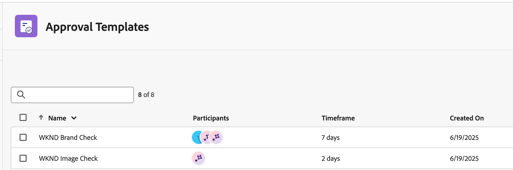

# Workfront AI 검토자 시작

AI 검토자는 프로젝트, 작업 및 문서에 추가할 수 있는 AI 에이전트의 한 유형인 AI 공동 작업자입니다. 설정 영역에서 AI 공동 작업자를 구성하고 사용자와 동일하게 할당할 수 있습니다.

Workfront에서 AI 검토자는 검토 및 승인 프로세스 전반에 걸쳐 콘텐츠 속도를 높이고 브랜드 준수를 개선하는 데 도움이 됩니다. AI 검토자를 승인 템플릿에 추가하거나 개별 검토 및 승인 요청에 포함할 수 있습니다.

## 액세스 요구 사항

Workfront에서 AI 검토자를 설정하려면 시스템 관리자여야 합니다.

모든 사용자는 검토 및 승인 요청에 AI 검토자를 추가할 수 있습니다.

## 요구 사항

* Workfront 인스턴스에는 통합 승인이 활성화되어 있어야 합니다.
* 조직에 GenStudio Foundation이 있어야 합니다.
  * Workfront의 AI 검토자는 GenStudio Foundation에서 에셋 검토 및 승인 워크플로에 사용할 수 있는 기능을 제공합니다. 작업을 완료하기 위해 GenStudio Foundation에 직접 액세스할 필요는 없습니다. AI 검토자를 통해 GenStudio Foundation 기능에 대한 액세스는 Workfront 계약 조건에 해당됩니다.
* Adobe은 파일에 서명된 Adobe Gen AI 계약이 있어야 합니다.
계약 서명에 대한 자세한 내용은 [Adobe Gen AI 계약 서명](/help/quicksilver/workfront-basics/ai-assistant/ai-assistant-overview.md#sign-the-adobe-gen-ai-agreement)을 참조하십시오.
* 샌드박스 환경에서는 AI 검토자를 사용할 수 없습니다.

## 지원되는 파일 유형 {#supported-file-types-ai-reviewer}

>[!CONTEXTUALHELP]
>id="wf_document_approvals_ai_supported_files"
>title="지원되지 않는 파일 유형"
>abstract="이 AI 검토자는 선택한 파일 형식을 지원하지 않습니다. 지원되는 파일 유형을 업로드하거나 AI 검토자를 제거하여 요청을 제출합니다."

AI 검토자는 다음 파일 유형을 검토할 수 있습니다.

* PNG(.png)
* JPEG (.jpeg, .jpg)
* WEBP (.webp)
* 비 애니메이션 GIF(.gif)
* PDF (.pdf)
* PPT(.ppt, .pptx)
* DOC(.doc, .docx)

지원되지 않는 파일 유형을 업로드하는 경우, 승인 워크플로를 만들 때 AI 검토자 옵션을 사용할 수 없습니다.

## 브랜드 지침 설정

Workfront AI 검토자는 콘텐츠를 검토할 때 브랜드 지침을 사용합니다. Workfront 관리자는 Workfront 설정 영역에서 브랜드 지침을 설정할 수 있습니다. GenStudio Foundation에서 만든 브랜드는 Workfront에서도 사용할 수 있습니다.

브랜드 지침을 설정하려면 시스템 관리자가 다음을 수행해야 합니다.

1. [브랜드 권한에 대한 액세스 권한 부여](/help/quicksilver/administration-and-setup/add-users/configure-and-grant-access/grant-access-brands.md)
1. [AI 검토자를 위한 브랜드를 만들고 관리하기](/help/quicksilver/review-and-approve-work/document-reviews-and-approvals/create-a-brand.md).

## AI 검토자 만들기

하나 이상의 브랜드가 설정되면 Workfront 관리자는 설정 영역에서 AI 검토자 생성을 시작할 수 있습니다. 다양한 지침에 초점을 맞춘 여러 AI 검토자를 만들 수 있습니다.

* **이미지**: 이 AI 검토자는 Workfront에서 설정한 이미지 브랜드 지침에 따라 자산을 검토합니다. [!BADGE Beta]{type=Positive tooltip="이 기능은 현재 베타 버전입니다."}
  * 시스템 관리자는 이 기능을 사용하려면 Beta 계약서에 서명해야 합니다.
* **브랜드 음성**: AI 검토자는 Workfront에서 설정한 브랜드 음성 지침에 따라 자산을 검토합니다.

그런 다음 AI 검토자를 승인 템플릿과 개별 검토 및 승인 요청에 할당할 수 있습니다.

자세한 내용은 [AI 공동 작업자 구성](/help/quicksilver/administration-and-setup/set-up-workfront/configure-system-defaults/configure-ai-collaborators.md)을 참조하십시오.

## AI 검토자의 평가 {#what-ai-reviewer-evaluates}

AI 검토자는 지침 유형에 따라 콘텐츠를 다르게 평가합니다(이미지 또는 브랜드 음성).

### 이미지

AI 검토자 평가:

* **컴포지션**: 초점, 배경, 자르기, 크리에이티브 프레임 만들기
* **조명 및 무드**: 빛, 활기, 낙관주의 사용
* **다양성 및 포함**: 사람 표시(인종, 성별, 연령, 능력)

AI 검토자는 다음을 평가하지 않습니다.

* **로고 사용**: 배치, 지우기, 크기 조정, 올바른 로고 버전
* **색상 팔레트**: 브랜드 색상 준수, 승인되지 않은 색상 회피
* **타이포그래피**: 글꼴 모음, 두께, 간격, 정렬
* **일러스트레이션 스타일**: 브랜드의 일러스트레이션 접근 방식과의 일관성
* **접근성**: 대비 준수, 가독성

### 브랜드 음성

AI 검토자 평가:

* **목소리 톤**: 대화, 명확하고, 사람, 브랜드 성격에 맞게 조정
* **전문 용어/형식**: 유행어, 엘리트주의 또는 과도한 형식 사용 금지
* **메시지**: 격려, 정직, 책임 있는 위치(예: AI 주제)

AI 검토자는 다음을 평가하지 않습니다.

* **법률/규정 준수**: 상표 사용, 면책조항, 현지화 규칙

AI 검토자의 평가에 맞는 브랜드 지침을 작성하는 방법에 대한 지침은 [AI 검토자를 위한 브랜드 만들기 및 관리](/help/quicksilver/review-and-approve-work/document-reviews-and-approvals/create-a-brand.md)를 참조하십시오.

## 검토 및 승인 요청에 AI 검토자 추가

사용자는 기존 승인 템플릿이나 개별 검토 및 승인 요청에 AI 검토자를 추가할 수 있습니다.

### 승인 템플릿

조직에서 검토 및 승인 요청에 동일한 인력을 추가하는 경우가 많은 경우 Standard 라이선스 사용자는 Workfront 설정 영역에서 승인 템플릿을 만들 수 있습니다.

사용자는 템플릿을 사용하여 요청을 만들 때 승인 템플릿에 AI 검토자를 추가하여 브랜드 준수 여부를 자동으로 확인할 수 있습니다.

승인 템플릿이 생성되면 프로젝트, 작업 또는 문제의 문서 영역에 있는 자산에 적용할 수 있습니다.

자세한 내용은 [문서에 대한 승인 워크플로 템플릿 만들기](/help/quicksilver/review-and-approve-work/document-reviews-and-approvals/manage-document-approvals/create-approval-template.md)를 참조하십시오.

AI 검토자를 표시하는 

### 개별 검토 및 승인 요청

사용자가 개별 검토 및 승인 요청을 만들 때 다른 참여자와 함께 AI 검토자를 추가하거나 AI 검토자만 사용하여 단일 요청을 만들어 브랜드 준수 여부를 확인할 수 있습니다.

자세한 내용은 [문서 승인 워크플로 만들기](/help/quicksilver/review-and-approve-work/document-reviews-and-approvals/manage-document-approvals/create-a-document-approval.md)를 참조하십시오.

## AI 검토자 점수 및 피드백 보기

AI 검토자의 검토 및 승인 요청이 제출된 후 몇 초 후에 문서 요약 패널에서 AI 검토자의 점수 및 피드백을 사용할 수 있습니다(다른 참가자가 아직 검토하고 결정을 내리는 경우에도).

승인 소유자는 에셋에 대한 검토가 완료되었음을 알리는 이메일도 받게 됩니다. 이메일에서 **검토로 이동**&#x200B;을 클릭하고 Workfront에서 점수와 피드백을 확인합니다.

AI 검토자는 검토 및 승인 워크플로에서 의사 결정자가 되도록 설계되지 않았습니다. 지정된 브랜드 요구 사항에 맞게 에셋을 조정하기 위한 점수 및 권장 사항만 제공합니다.

자산이 브랜드 가이드라인을 충족하지 않는 경우 크리에이티브는 새 버전을 업로드할 수 있고 승인 소유자는 AI 검토자와 두 번째 검토 및 승인 요청을 만들 수 있습니다.

점수 및 피드백 보기에 대한 자세한 내용은 [AI 검토자 점수 및 피드백 보기](/help/quicksilver/review-and-approve-work/document-reviews-and-approvals/view-ai-reviewer-feedback.md)를 참조하십시오.

