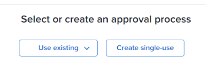

# 신규 또는 기존 승인 프로세스를 작업물과 연결

이 문서에서는 승인 프로세스를 작업 항목과 연결하는 방법을 설명합니다. 승인을 증명 또는 문서와 연관시키는 방법에 대한 자세한 내용은 다음 문서를 참조하십시오.

* [자동화된 워크플로우를 사용하여 고급 증명 만들기](../../review-and-approve-work/proofing/creating-proofs-within-workfront/create-automated-proof-workflow.md)
* [문서 승인 요청](../../review-and-approve-work/manage-approvals/request-document-approvals.md)

Adobe Workfront의 작업 항목과 글로벌 또는 단일 사용 승인 프로세스를 연결할 수 있습니다. 다음 시나리오가 있습니다.

* 기존 전역 승인 프로세스를 프로젝트, 작업, 문제, 템플리트 또는 템플리트 태스크와 연관시킵니다. 일부 전역 승인 프로세스는 시스템의 모든 그룹에서 사용할 수 있습니다. 그룹 수준 글로벌 승인 프로세스는 특정 그룹에만 사용할 수 있습니다.
* 단일 사용 승인 프로세스를 만들고 기존 프로젝트, 작업, 문제, 템플릿 또는 템플릿 작업에 연결합니다.

>[!NOTE]
>
>이 문서에서는 &quot;전역 승인 프로세스&quot;라는 용어를 사용하여 &quot;단일 사용 승인 프로세스&quot;와 구분합니다. 글로벌 승인 프로세스는 반복적으로 사용할 수 있습니다.
>
>그룹 수준 글로벌 승인 프로세스라는 용어는 특정 그룹에만 연관된 상태 및 품목에 대해 반복적으로 사용할 수 있는 승인 프로세스를 의미합니다.

승인 프로세스에 대한 일반적인 정보는 [승인 프로세스 개요](../../review-and-approve-work/manage-approvals/approval-process-in-workfront.md).

글로벌 승인 프로세스 만들기에 대한 내용은 [작업 항목에 대한 승인 프로세스 생성](../../administration-and-setup/customize-workfront/configure-approval-milestone-processes/create-approval-processes.md).

## 액세스 요구 사항

이 문서의 절차를 수행하려면 다음 액세스 권한이 있어야 합니다.

<table style="table-layout:auto"> 
 <col> 
 <col> 
 <tbody> 
  <tr> 
   <td role="rowheader">Adobe Workfront 플랜*</td> 
   <td> 
모든 
 </td> 
  </tr> 
  <tr> 
   <td role="rowheader">Adobe Workfront 라이선스*</td> 
   <td> 
작업 이상
 </td> 
  </tr> 
  <tr> 
   <td role="rowheader">액세스 수준*</td> 
   <td> 
프로젝트, 작업, 문제 또는 템플릿에 대한 액세스 이상의 편집
 
참고: 여전히 액세스 권한이 없는 경우 Workfront 관리자에게 액세스 수준에서 추가 제한 사항을 설정하는지 문의하십시오. Workfront 관리자가 액세스 수준을 변경하는 방법에 대한 자세한 내용은 <a href="../../administration-and-setup/add-users/configure-and-grant-access/create-modify-access-levels.md" class="MCXref xref">사용자 정의 액세스 수준 만들기 또는 수정</a>.
 </td> 
  </tr> 
  <tr> 
   <td role="rowheader">개체 권한</td> 
   <td> 
프로젝트, 작업, 문제 또는 템플릿에 대한 권한 관리
 
추가 액세스 요청에 대한 자세한 내용은 <a href="../../workfront-basics/grant-and-request-access-to-objects/request-access.md" class="MCXref xref">개체에 대한 액세스 요청 </a>.
 </td> 
  </tr> 
 </tbody> 
</table>

&#42;어떤 계획, 라이선스 유형 또는 액세스 권한을 보유하고 있는지 알아보려면 Workfront 관리자에게 문의하십시오.

## 승인 프로세스를 작업 항목과 연관시키는 데 대한 고려 사항

아래에 설명된 고려 사항 외에 Workfront의 승인 프로세스에 대한 일반적인 고려 사항을 재방문하는 것이 좋습니다. 자세한 내용은 [승인 프로세스 개요](../../review-and-approve-work/manage-approvals/approval-process-in-workfront.md).

<!--
  <li data-mc-conditions="QuicksilverOrClassic.Draft mode">Approvals can only be associated with the status of a project, task, or issue in Workfront.</li>
  -->

<!--
  <li data-mc-conditions="QuicksilverOrClassic.Draft mode"> 
Each approval process corresponds with a status option in the Workfront system. When you change the status of a work item, an attached approval for that status requires the status change to be confirmed before the new status can be assigned to the item.
 
(NOTE: the two drafted bullets have been moved to the approval-process-in-workfront article)
 </li>
  -->

* 승인 프로세스를 연관시키려면 먼저 프로젝트, 작업, 문제, 템플릿 또는 템플릿 작업을 생성해야 합니다.
* 통과 및 현재 품목이 있는 상태에 대한 품목에 승인 프로세스를 첨부하면 승인 프로세스가 트리거되지 않고 승인자에게 통지가 발송되지 않습니다.

   **예:** 작업이 완료 상태이고 완료 상태와 연관된 승인 프로세스를 첨부하면 승인이 트리거되지 않습니다.

* 항목의 첫 번째 상태에 승인 프로세스를 첨부할 때(작업 및 프로젝트에 대한 템플릿을 사용하거나, 문제에 대한 큐 설정 설정을 사용하거나, 새 작업에 대한 프로젝트의 작업 설정 정의를 통해) 제출된 승인이 호출되면 승인 프로세스가 무시됩니다. 이 경우 승인자는 알림을 받지 않습니다.

   승인 회수에 대한 자세한 내용은 [승인 보기](../../review-and-approve-work/manage-approvals/view-approvals.md).

   >[!TIP]
   >
   >작업 또는 문제에 대한 첫 번째 상태는 새로 만들기 입니다. 프로젝트의 첫 번째 상태는 시스템의 프로젝트 환경 설정에서 Workfront 관리자가 선택한 상태입니다. 자세한 내용은 [시스템 전체 프로젝트 환경 설정 구성](../../administration-and-setup/set-up-workfront/configure-system-defaults/set-project-preferences.md).

* 객체에 대한 승인 프로세스 연관은 객체의 업데이트 영역에 기록되지 않습니다.
* 승인 프로세스를 상위 작업과 연결할 수 없습니다.
* 승인자로서 사용자, 팀 또는 역할을 추가하면 해당 승인과 연관된 객체에 대한 권한이 자동으로 부여되지 않습니다. 이들은 승인 단계가 트리거되면 개체에 대한 권한을 받습니다. 그렇지 않으면 승인 결정을 내리기 전에 객체를 공유해야 합니다.

다음 섹션에서는 승인 프로세스를 프로젝트, 작업 또는 문제에 연관시키는 다양한 방법에 대해 설명합니다.

## 글로벌 승인 프로세스를 작업 항목과 연결 {#associate-a-global-approval-process-with-a-work-item}

글로벌 승인 프로세스를 작업 항목(프로젝트, 작업, 문제, 템플릿, 템플릿 작업)과 연관시킬 수 있습니다.

글로벌 승인 프로세스는 작업 항목과 연관된 그룹 또는 시스템의 모든 그룹에 사용할 수 있어야 합니다.

>[!NOTE]
템플릿에 프로젝트 승인 프로세스를 첨부하고 작업 승인 프로세스를 템플릿 작업에 첨부할 수 있습니다. 이 작업을 수행한 후 누군가 템플릿을 사용하여 프로젝트를 만들면 승인 프로세스는 각각 프로젝트 또는 태스크 승인 프로세스가 됩니다. 템플릿 또는 템플릿 작업에 첨부된 단일 사용 승인 프로세스는 프로젝트 및 작업에 대해 단일 사용 승인 프로세스로 유지됩니다.

Workfront 관리자가 시스템의 모든 그룹에 대한 전역 승인 프로세스를 구성하는 방법 및 그룹 관리자가 그룹에 대한 승인을 만드는 방법에 대한 자세한 내용은 [작업 항목에 대한 승인 프로세스 생성](../../administration-and-setup/customize-workfront/configure-approval-milestone-processes/create-approval-processes.md).

>[!NOTE]
특정 요구 사항에 맞게 글로벌 승인 프로세스를 수정할 수도 있습니다. 자세한 내용은 섹션을 참조하십시오 [특정 객체에 사용할 글로벌 승인 프로세스를 수정합니다](#modify-a-global-approval-process-for-use-on-a-specific-object) 참조하십시오.

기존 전역 승인 프로세스를 프로젝트, 작업, 문제, 템플리트 또는 템플리트 태스크와 연결하려면

1. 승인 프로세스를 연관시킬 작업 항목으로 이동합니다.
1. 클릭 **승인** 왼쪽 패널에 표시됩니다.

   을(를) 클릭하여 **자세히 표시**&#x200B;를 클릭한 다음 **승인**.

   

1. 

   선택한 승인 프로세스가 표시됩니다.

1. 를 확장합니다. **기존 사용** 드롭다운 메뉴를 선택하고 기존 승인 프로세스를 선택합니다.

   

   선택한 승인 프로세스가 표시됩니다.

   

1. **저장**&#x200B;을 클릭합니다.
1. (선택 사항) 품목에 첨부된 기존 승인을 수정하려면 승인 프로세스 편집을 누릅니다. 이렇게 하면 글로벌 승인 프로세스가 단일 사용 승인 프로세스로 변경됩니다. 자세한 내용은 섹션을 참조하십시오 [특정 객체에 사용할 글로벌 승인 프로세스를 수정합니다](#modify-a-global-approval-process-for-use-on-a-specific-object) 참조하십시오.

## 특정 객체에 사용할 글로벌 승인 프로세스를 수정합니다 {#modify-a-global-approval-process-for-use-on-a-specific-object}

에 설명된 대로 Workfront 관리자 또는 그룹 관리자는 사용할 글로벌 승인 프로세스를 만듭니다 [작업 항목에 대한 승인 프로세스 생성](../../administration-and-setup/customize-workfront/configure-approval-milestone-processes/create-approval-processes.md).

품목에 첨부된 글로벌 승인 프로세스를 수정하는 것은 단일 사용 승인 프로세스를 수정하는 것과 동일합니다.

프로젝트, 작업 또는 문제와 관련된 특정 요구 사항에 맞게 전역 승인 프로세스를 수정할 수 있습니다.

>[!IMPORTANT]
전역 승인 프로세스를 수정할 때 단일 사용 승인 프로세스가 되므로 이를 수정한 객체에서만 사용할 수 있습니다. 글로벌 승인 프로세스는 변경되지 않은 상태로 유지됩니다.
글로벌 승인 프로세스를 수정할 때 다음 제한 사항을 고려하십시오.
* 승인 프로세스는 승인 프로세스를 연관시키는 프로젝트, 태스크 또는 문제에 대해서만 수정됩니다.
* 관리자가 원래 전역 승인 프로세스에 수행한 이후의 모든 변경 사항은 사용자가 수정한 글로벌 승인 프로세스에 반영되지 않습니다.
>

품목에 이미 첨부된 승인 프로세스를 수정하려면

1. 프로젝트, 작업 또는 문제에 전역 승인 프로세스를 추가합니다.

   자세한 내용은 섹션을 참조하십시오 [글로벌 승인 프로세스를 작업 항목과 연결](#associate-a-global-approval-process-with-a-work-item) 참조하십시오.

   >[!IMPORTANT]
   를 클릭해야 합니다 **저장** 승인을 추가할 때.

1. 글로벌 승인 프로세스를 추가한 후 **편집**&#x200B;아이콘  승인 페이지의 오른쪽 위 모서리에서 을(를) 참조하십시오. 이 작업을 수행하면 글로벌 또는 그룹 수준 승인 프로세스가 단일 사용 승인 프로세스로 변경됩니다.
1. 기존 승인 프로세스를 변경합니다. 자세한 내용은 섹션을 참조하십시오 [단일 사용 승인 프로세스를 프로젝트, 작업, 문제, 템플릿 또는 템플릿 작업과 연결](#associate-a-single-use-approval-process-with-a-project-task-issue-template-or-template-task) 참조하십시오.
1. 클릭 **저장**&#x200B;를 클릭한 다음 **저장** 글로벌 승인 프로세스를 이 개체에서만 사용할 수 있는 단일 사용 승인 프로세스로 변환하려는 경우를 다시 확인합니다.

## 단일 사용 승인 프로세스를 프로젝트, 작업, 문제, 템플릿 또는 템플릿 작업과 연결 {#associate-a-single-use-approval-process-with-a-project-task-issue-template-or-template-task}

특정 프로젝트, 작업 또는 문제에서만 사용할 단일 사용 승인 프로세스를 만들 수 있습니다.

템플릿 또는 템플릿 작업에 단일 사용 승인 프로세스를 연결하여 템플릿에서 생성된 프로젝트 및 작업에 사용할 수도 있습니다.

>[!NOTE]
단일 사용 승인 프로세스를 프로젝트, 작업, 문제, 템플리트 또는 템플리트 태스크에 대한 시스템 레벨 또는 그룹 레벨 상태와 연관시킬 수 있습니다. Workfront 상태에 대한 자세한 내용은 [상태 만들기 또는 편집](../../administration-and-setup/customize-workfront/creating-custom-status-and-priority-labels/create-or-edit-a-status.md).

이러한 방식으로 승인 프로세스를 만들면 필요에 맞게 사용자 지정 승인 프로세스를 만들 수 있습니다. 하지만 나중에 승인 프로세스를 다른 작업 항목과 연결할 수는 없습니다.

또는 특정 품목에 대한 글로벌 승인 프로세스를 수정할 수 있으며 단일 사용 승인 프로세스이기도 합니다. 자세한 내용은 섹션을 참조하십시오 [특정 객체에 사용할 글로벌 승인 프로세스를 수정합니다](#modify-a-global-approval-process-for-use-on-a-specific-object) 참조하십시오.

단일 사용 승인 프로세스를 생성하려면

1. 승인 프로세스를 연결하려는 프로젝트, 작업, 문제, 템플릿 또는 템플릿 작업으로 이동합니다.
1. 클릭 **승인** 왼쪽 패널에 표시됩니다.

   을(를) 클릭하여 **자세히 표시** > **승인**.

   

1. 클릭 **단일 사용 만들기**.

   

1. 문서의 &quot;작업 항목에 대한 시스템 수준 또는 그룹 수준 글로벌 승인 프로세스 만들기&quot; 섹션의 6단계로 시작하는 단계를 완료합니다 [작업 항목에 대한 승인 프로세스 생성](../../administration-and-setup/customize-workfront/configure-approval-milestone-processes/create-approval-processes.md).

   <!--
   
(NOTE: overtime, ensure step 6 is still accurate here)&nbsp;

   -->

   >[!TIP]
   단일 사용 승인 프로세스를 첨부하면 &quot;`<Custom>`템플릿 및 템플릿 작업의 편집 상자 내의 승인 프로세스 필드에서 &quot;. 템플릿 또는 템플릿 작업 편집에 대한 자세한 내용은 다음 문서를 참조하십시오.
   * [프로젝트 템플릿 편집](../../manage-work/projects/create-and-manage-templates/edit-templates.md)
   * [템플릿 작업 편집](../../manage-work/projects/create-and-manage-templates/edit-template-task.md)

   <!--
   >
(NOTE: this will need to be removed when they bring the new Edit Template/ Template Task boxes to NWE) 
   >
   -->

## 작업 항목에서 승인 프로세스 제거 또는 삭제

전역 또는 그룹 수준의 승인 프로세스를 제거하거나, 이전에 연관된 프로젝트, 작업 또는 문제에 대해 단일 사용 승인 프로세스를 삭제할 수 있습니다.

다음 시나리오가 있습니다. 

* 전역 또는 그룹 수준 승인 프로세스를 제거해도 승인이 삭제되지 않습니다. 그 승인은 차후에 사용할 수 있다.
* 단일 사용자 승인 프로세스를 삭제하면 Workfront에서 삭제되며 복구할 수 없습니다.

작업 항목에서 승인 프로세스를 제거하거나 삭제하려면

1. 이전에 추가한 승인 프로세스를 제거하려는 프로젝트, 작업, 문제, 템플릿 또는 템플릿 작업으로 이동합니다.
1. 클릭 **승인** 왼쪽 패널에 표시됩니다.

   을(를) 클릭하여 **자세히 표시** > **승인**.

   

1. 항목과 연관된 승인 유형에 따라 승인 섹션의 오른쪽 위 모서리에 있는 다음 아이콘 중 하나를 클릭합니다.

   * **제거**&#x200B;아이콘  글로벌 또는 그룹 수준 승인을 위한 것입니다.
   * **삭제**&#x200B;아이콘  단일 사용 승인을 위한 것입니다.

1. 클릭 **제거** 또는 **삭제** 확인합니다.

   승인 프로세스는 작업 항목에서 제거됩니다.

## 승인 프로세스를 작업 항목과 자동 연결

다음 워크플로우를 사용하여 승인 프로세스를 작업 항목과 자동으로 연결할 수 있습니다.

* 프로젝트 및 작업의 경우 템플릿을 사용하여 승인 프로세스를 연관시킬 수 있습니다. 템플릿 승인 탭 또는 템플릿 작업 승인 탭에 기존 승인 프로세스를 첨부할 수 있습니다. 기존 승인을 작업 항목과 연관시키는 방법에 대한 자세한 내용은 [글로벌 승인 프로세스를 작업 항목과 연결](#associate-a-global-approval-process-with-a-work-item) 참조하십시오.
* 기존 프로젝트에 대한 새 작업의 경우 프로젝트 편집 상자의 작업 설정 영역에서 전역 승인 프로세스 또는 그룹 수준 글로벌 승인 프로세스를 연관시킬 수 있습니다. 자세한 내용은 문서의 &quot;작업 설정&quot; 섹션을 참조하십시오 [프로젝트 편집](../../manage-work/projects/manage-projects/edit-projects.md).
* 문제의 경우 기존 승인 프로세스를 요청 대기열에 연관시켜 프로젝트에 추가된 모든 신규 문제와 승인을 연관시킬 수 있습니다. 요청 큐 구성에 대한 자세한 내용은 [요청 큐 만들기](../../manage-work/requests/create-and-manage-request-queues/create-request-queue.md).
