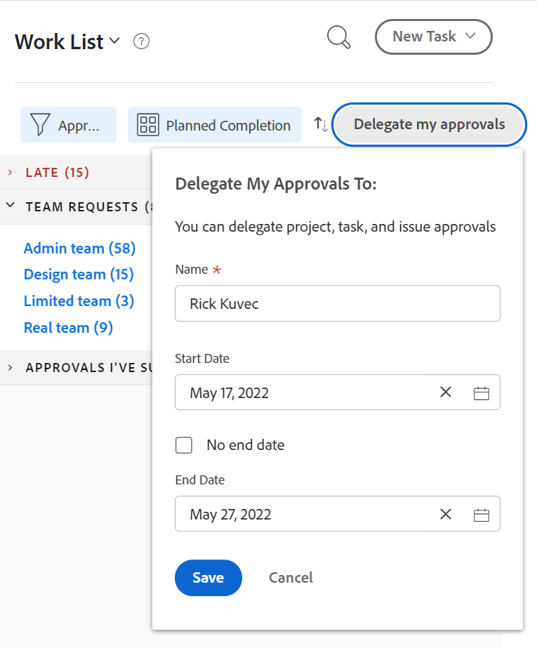

# 승인 요청 위임

부재 중에 할당된 작업을 일시적으로 위임할 수 있습니다. 작업 및 문제 지정을 위임하거나 승인 요청을 위임할 수 있습니다. 이 문서에서는 승인 요청을 위임하는 방법에 대해 설명합니다. 작업 위임 및 문제 지정에 대한 자세한 내용은 [작업 및 문제 위임 관리](../../manage-work/delegate-work/how-to-delegate-work.md).

>[!NOTE]
>
>승인을 위임하기 위해 예약한 날짜와 일치하지 않도록 하려면 사용자 프로필의 시간대가 예약의 시간대와 일치하는지 확인하는 것이 좋습니다. 자세한 내용은 다음 문서를 참조하십시오.
>
>* [예약 만들기](../../administration-and-setup/set-up-workfront/configure-timesheets-schedules/create-schedules.md)
>* [사용자 프로필 편집](../../administration-and-setup/add-users/create-and-manage-users/edit-a-users-profile.md)
>

## 액세스 요구 사항

이 문서의 절차를 수행하려면 다음 액세스 권한이 있어야 합니다.

<table style="table-layout:auto"> 
 <col> 
 </col> 
 <col> 
 </col> 
 <tbody> 
  <tr> 
   <td role="rowheader">
Adobe Workfront 플랜*
</td> 
   <td> 
모든
 </td> 
  </tr> 
  <tr> 
   <td role="rowheader">
Adobe Workfront 라이선스*
</td> 
   <td> 
검토 이상
 </td> 
  </tr> 
 </tbody> 
</table>

&#42;보유하고 있는 플랜 또는 라이선스 유형을 확인하려면 Workfront 관리자에게 문의하십시오.

## 위임된 승인에 대한 사용자 액세스 이해

지정된 승인 기간 동안 승인 요청을 위임하는 사용자는 다음과 같은 권한을 갖습니다.

* 결정을 내리지 않은 기존 승인 요청을 승인하거나 거부할 수 있습니다
* 지정된 기간 동안 수신되는 새 승인 요청을 승인 및 거부할 수 있습니다
* 승인 대기 중인 객체에 대한 보기 액세스 권한이 부여됨

   >[!NOTE]
   >
   > Adobe Workfront 관리자는 사용자가 특정 개체 유형에 액세스하지 못하도록 제한할 수 있습니다. 사용자에게 객체 유형에 대한 액세스 권한이 없고 해당 유형에 대한 승인을 사용자에게 위임하면 객체에 대한 보기 액세스 권한이 사용자에게 없습니다. 그러나 사용자는 여전히 **홈** 에 설명된 대로 페이지를 페이지 페이지 페이지 페이지 페이지 페이지 페이지 페이지에 삽입됩니다. [작업 승인](../../review-and-approve-work/manage-approvals/approving-work.md).\
   예를 들어, 사용자 A는 그룹 A에 속합니다. Workfront 관리자는 이 그룹의 사용자가 Workfront 내의 작업을 볼 수 없도록 그룹 A의 액세스 권한을 제한했습니다. 작업 승인 요청이 사용자 A에게 위임되면 사용자 A는 승인이 연관된 작업을 볼 수 없습니다. 하지만 사용자 A는 홈 페이지에서 승인 요청을 승인하거나 거부할 수 있습니다.

   Workfront 관리자가 설정 내의 개체 유형에 대한 액세스를 제한하는 방법에 대한 자세한 내용은  [사용자 정의 액세스 수준 만들기 또는 수정](../../administration-and-setup/add-users/configure-and-grant-access/create-modify-access-levels.md). 

승인 위임이 중지되거나 취소되면, 사용자는 승인자로 지정됩니다.

* 더 이상 승인이 필요한 항목에 대한 작업을 승인할 액세스 권한이 없습니다.
* 작업 항목에 대한 보기 액세스 권한이 계속 있음\
   승인 위임을 통해 객체에 대한 보기 액세스 권한을 부여받은 사용자는 승인 위임이 중지되거나 소환된 후에도 보기 액세스 권한을 유지합니다. 승인을 위임하는 동안 사용자가 액세스할 수 있는 객체에 대한 보기 액세스를 제거하려면 해당 객체로 이동하여 객체에서 직접 액세스 권한을 제거해야 합니다.

## 홈 영역에서 승인 요청 위임

* [다른 사용자에게 승인 위임](#delegate-your-approvals-to-another-user)
* [승인 위임 업데이트 또는 중지](#update-or-stop-an-approval-delegation)
* [위임된 승인 보기](#view-delegated-approvals)

### 다른 사용자에게 승인 위임 {#delegate-your-approvals-to-another-user}

사용자에게 승인이 할당된 방법(사용자에게 직접 할당되었는지, 멤버로 속해 있거나 작업 역할에 할당되었는지 여부에 상관없이 다음 유형의 승인을 위임할 수 있습니다.

* 프로젝트 승인
* 작업 승인
* 문제 승인

작업표 및 문서 승인을 위임할 수 없습니다. 

승인을 위임할 때 다음 사항을 고려하십시오.

* 승인을 위임하면 모든 승인이 위임됩니다. 개별 승인 요청을 위임할 수 없습니다.
* 승인을 한 사용자에게만 위임할 수 있습니다. 여러 사용자에게 동시에 승인을 위임할 수 없습니다.\
   모든 프로젝트, 작업 및 문제에 대한 모든 승인이 지정된 사용자에게 위임됩니다.
* 최대 5명의 사용자가 동시에 동일한 사용자에게 승인을 위임할 수 있습니다. 즉, 단일 사용자를 동시에 5명 이상의 사용자에 대한 임시 승인자로 지정할 수 없습니다.
* 승인과 관련된 활동이 업데이트 탭에 표시됩니다. 시스템 업데이트 표시가 활성화되어 있어야 합니다. 승인을 위임하는 사용자와 승인을 위임하는 사용자는 모두 승인 활동에 대한 이메일 알림을 받습니다.

다른 사용자에게 승인을 위임하려면

1. 을(를) 클릭합니다. **홈** 아이콘  Adobe Workfront의 왼쪽 위 모서리에서

   >[!NOTE]
   Workfront 관리자는 사용자 환경에서 홈 아이콘을 다음과 같이 변경할 수 있습니다.
   * 조직을 보여주기 위해 사용자 지정된 이미지로 바꿉니다. 이 경우 이 문서에 표시된 아이콘의 모양이 다릅니다.
   * 연결된 페이지를 다른 페이지로 바꿉니다. 이 경우 **기본 메뉴**  페이지의 오른쪽 위 모서리에서 을(를) 클릭하고 **홈**.

   또는

   을(를) 클릭합니다. **기본 메뉴** 아이콘 > **이름** > **해제 시간** 왼쪽 패널에 표시됩니다.

1. (선택 사항 및 조건부) 홈 영역에서 **필터** 드롭다운 메뉴를 클릭한 다음 **승인**.

1. (조건부) 클릭 **내 승인 위임**

   또는

   시스템 또는 그룹 관리자가 작업 및 문제 위임을 사용하도록 설정한 경우 **위임**&#x200B;를 클릭한 다음 **승인 위임**.

   

1. 내 승인 위임 섹션에서 다음 정보를 지정합니다.

   * **이름**: 승인을 위임할 사용자의 이름을 입력한 다음 드롭다운 메뉴에 표시되면 이름을 클릭합니다.
   * **시작 날짜**: 승인을 전달할 날짜를 선택합니다. 선택한 날짜에 오전 12시에 전달이 시작됩니다.\
      시작 일자는 현재 일자 또는 미래 일자여야 합니다.
   * **종료 날짜**: 다음 중 하나를 수행합니다.

      * 승인 전달을 중단할 날짜를 선택합니다. 전달은 선택한 날짜에 오후 11:59분에 종료됩니다.
      * 선택 **종료 날짜 없음** Workfront에서 승인을 무기한 위임하도록 구성하려면 다음을 수행하십시오.

1. **저장**&#x200B;을 클릭합니다.

### 승인 위임 업데이트 또는 중지 {#update-or-stop-an-approval-delegation}

1. 을(를) 클릭합니다. **홈** 아이콘  Adobe Workfront의 왼쪽 위 모서리에서

   >[!NOTE]
   Workfront 관리자는 사용자 환경에서 홈 아이콘을 다음과 같이 변경할 수 있습니다.
   * 조직을 보여주기 위해 사용자 지정된 이미지로 바꿉니다. 이 경우 이 문서에 표시된 아이콘의 모양이 다릅니다.
   * 연결된 페이지를 다른 페이지로 바꿉니다. 이 경우 **기본 메뉴**  페이지의 오른쪽 위 모서리에서 을(를) 클릭하고 **홈**.

1. 을(를) 클릭합니다. **필터** 드롭다운 메뉴를 클릭한 다음 **승인**.

1. (조건부) 클릭 **위임 편집**

   또는

   시스템 또는 그룹 관리자가 작업을 사용하도록 설정하고 문제 위임을 사용하도록 설정한 경우 **위임 편집**&#x200B;를 클릭한 다음 **승인 위임**.

1. (조건부) 다음 중 하나를 수행합니다.

   * 기존 승인 위임을 갱신하려면 표시되는 정보를 변경한 다음 **저장**.

   * 기존 위임을 정지하려면 다음을 수행합니다. 클릭 **위임 중지**&#x200B;를 클릭한 다음 **위임 중지** 확인합니다.

      

### 위임된 승인 보기 {#view-delegated-approvals}

작업 목록에서 다음 유형의 승인 위임만 조회할 수 있습니다.

* 프로젝트 승인
* 작업 승인
* 문제 승인

위임된 승인을 보려면

1. 을(를) 클릭합니다. **홈** 아이콘  Adobe Workfront의 왼쪽 위 모서리에서

   >[!NOTE]
   Workfront 관리자는 사용자 환경에서 홈 아이콘을 다음과 같이 변경할 수 있습니다.
   * 조직을 보여주기 위해 사용자 지정된 이미지로 바꿉니다. 이 경우 이 문서에 표시된 아이콘의 모양이 다릅니다.
   * 연결된 페이지를 다른 페이지로 바꿉니다. 이 경우 **기본 메뉴**  페이지의 오른쪽 위 모서리에서 을(를) 클릭하고 **홈**.

1. 을(를) 클릭합니다. **필터** 드롭다운 메뉴를 클릭한 다음 **승인**.\
   자신에게 할당된 승인 및 자신에게 위임된 승인을 포함하여 기본적으로 모든 승인이 목록에 표시됩니다.

   
