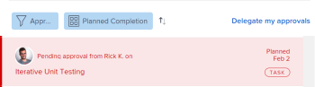

# 제출된 승인 회수

승인을 위해 제출된 다음 객체를 회수할 수 있습니다.

* 프로젝트
* 작업
* 문제
* 타임시트
* 문서
* 액세스 권한 요청

## 액세스 요구 사항

이 문서의 절차를 수행하려면 다음 액세스 권한이 있어야 합니다.

<table style="table-layout:auto"> 
 <col> 
 <col> 
 <tbody> 
  <tr> 
   <td role="rowheader">Adobe Workfront 플랜*</td> 
   <td> 
모든
 </td> 
  </tr> 
  <tr> 
   <td role="rowheader">Adobe Workfront 라이선스*</td> 
   <td> 
요청 이상
 </td> 
  </tr> 
  <tr> 
   <td role="rowheader">액세스 수준 구성*</td> 
   <td> 
프로젝트, 작업, 문제, 작업표, 문서에 대한 액세스 또는 액세스 권한 보기
 
참고: 여전히 액세스 권한이 없는 경우 Workfront 관리자에게 액세스 수준에서 추가 제한 사항을 설정하는지 문의하십시오. Workfront 관리자가 액세스 수준을 수정하는 방법에 대한 자세한 내용은 <a href="../../administration-and-setup/add-users/configure-and-grant-access/create-modify-access-levels.md" class="MCXref xref">사용자 정의 액세스 수준 만들기 또는 수정</a>.
 </td> 
  </tr> 
  <tr> 
   <td role="rowheader">개체 권한</td> 
   <td> 
승인과 연관된 객체에 대한 보기 또는 더 높은 액세스 
 
추가 액세스 요청에 대한 자세한 내용은 <a href="../../workfront-basics/grant-and-request-access-to-objects/request-access.md" class="MCXref xref">개체에 대한 액세스 요청 </a>.
 </td> 
  </tr> 
 </tbody> 
</table>

&#42;어떤 계획, 라이선스 유형 또는 액세스 권한을 보유하고 있는지 알아보려면 Workfront 관리자에게 문의하십시오.

## 프로젝트

프로젝트 승인을 소환하면, 프로젝트는 승인 프로세스가 시작되기 전에 있었던 상태로 돌아갑니다.

프로젝트의 시작 상태와 연관된 승인을 불러오면 승인 프로세스가 무시되고 프로젝트는 시작 상태로 유지됩니다.

>[!NOTE]
>
>템플릿을 사용하여 프로젝트 또는 작업의 첫 번째 상태를 승인 프로세스와 연관시킬 수 있습니다. 템플릿에 승인 추가에 대한 자세한 내용은  [프로젝트 템플릿 편집](../../manage-work/projects/create-and-manage-templates/edit-templates.md).

제출한 프로젝트 승인을 회수하려면

1. 을(를) 클릭합니다. **홈** 아이콘  Adobe Workfront의 왼쪽 위 모서리에서

   >[!NOTE]
   Workfront 관리자는 사용자 환경에서 홈 아이콘을 다음과 같이 변경할 수 있습니다.
   * 조직을 보여주기 위해 사용자 지정된 이미지로 바꿉니다. 이 경우 이 문서에 표시된 아이콘의 모양이 다릅니다.
   * 연결된 페이지를 다른 페이지로 바꿉니다. 이 경우 **기본 메뉴**  페이지의 오른쪽 위 모서리에서 을(를) 클릭하고 **홈**.

1. 에서 **작업 목록** 영역에서 **승인 제출** 그룹화.

1. 클릭 **프로젝트** 작업 목록의 승인.

   그러면 작업 목록 오른쪽에 프로젝트가 열립니다.

   

1. 클릭 **회수** 오른쪽 패널의 오른쪽 위 모서리에 있습니다.

## 작업

작업 승인을 회수하면 승인 프로세스가 시작되기 전에 작업이 있던 상태로 돌아갑니다.

작업의 시작 상태와 연관된 승인을 불러오면 승인 프로세스가 무시되고 작업은 시작 상태로 유지됩니다.

>[!NOTE]
템플릿을 사용하여 프로젝트 또는 작업의 첫 번째 상태를 승인 프로세스와 연관시킬 수 있습니다. 템플릿에 승인 추가에 대한 자세한 내용은 [프로젝트 템플릿 편집](../../manage-work/projects/create-and-manage-templates/edit-templates.md).

제출한 태스크 승인을 회수하려면

1. 을(를) 클릭합니다. **홈** 아이콘  Adobe Workfront의 왼쪽 위 모서리에서

   >[!NOTE]
   Workfront 관리자는 사용자 환경에서 홈 아이콘을 다음과 같이 변경할 수 있습니다.
   * 조직을 보여주기 위해 사용자 지정된 이미지로 바꿉니다. 이 경우 이 문서에 표시된 아이콘의 모양이 다릅니다.
   * 연결된 페이지를 다른 페이지로 바꿉니다. 이 경우 **기본 메뉴**  페이지의 오른쪽 위 모서리에서 을(를) 클릭하고 **홈**.

1. 에서 **작업 목록** 영역에서 **승인 제출** 그룹화.

1. 클릭 **작업** 작업 목록의 승인.

   작업이 작업 목록 오른쪽에 열립니다.

   

1. 클릭 **회수** 오른쪽 패널의 오른쪽 위 모서리에 있습니다.

## 문제

문제 승인을 소환하면 승인 프로세스가 시작되기 전에 문제가 이전 상태로 돌아갑니다.

문제의 시작 상태와 관련된 승인을 소환하면 승인 프로세스가 무시되고 문제가 시작 상태로 유지됩니다.

>[!NOTE]
템플릿을 사용하여 문제의 첫 번째 상태를 승인 프로세스와 연결할 수 있습니다. 요청 큐 만들기에 대한 자세한 내용은 [요청 큐 만들기](../../manage-work/requests/create-and-manage-request-queues/create-request-queue.md).

1. 을(를) 클릭합니다. **홈** 아이콘  Adobe Workfront의 왼쪽 위 모서리에서

   >[!NOTE]
   Workfront 관리자는 사용자 환경에서 홈 아이콘을 다음과 같이 변경할 수 있습니다.
   * 조직을 보여주기 위해 사용자 지정된 이미지로 바꿉니다. 이 경우 이 문서에 표시된 아이콘의 모양이 다릅니다.
   * 연결된 페이지를 다른 페이지로 바꿉니다. 이 경우 **기본 메뉴**  페이지의 오른쪽 위 모서리에서 을(를) 클릭하고 **홈**.

1. 에서 **작업 목록** 영역에서 **승인 제출** 그룹화.

1. 클릭 **문제** 작업 목록의 승인.

   그러면 작업 목록 오른쪽에 문제가 열립니다.

   

1. 클릭 **회수** 오른쪽 패널의 오른쪽 위 모서리에 있습니다.

## 타임시트

작업표 승인을 회수하면 승인을 위해 제출되기 전의 상태로 작업표가 반환됩니다.

1. 을(를) 클릭합니다. **홈** 아이콘  Adobe Workfront의 왼쪽 위 모서리에서

   >[!NOTE]
   Workfront 관리자는 사용자 환경에서 홈 아이콘을 다음과 같이 변경할 수 있습니다.
   * 조직을 보여주기 위해 사용자 지정된 이미지로 바꿉니다. 이 경우 이 문서에 표시된 아이콘의 모양이 다릅니다.
   * 연결된 페이지를 다른 페이지로 바꿉니다. 이 경우 **기본 메뉴**  페이지의 오른쪽 위 모서리에서 을(를) 클릭하고 **홈**.

1. 에서 **작업 목록** 영역에서 **승인 제출** 그룹화.

1. 클릭 **작업표** 작업 목록의 승인.

   작업표가 작업 목록 오른쪽에 열립니다.

   

1. 클릭 **회수** 오른쪽 패널의 오른쪽 위 모서리에 있습니다.

## 문서

문서 승인을 회수하려면 승인에서 한 명 또는 모든 사용자를 수동으로 제거해야 합니다.

1. 을(를) 클릭합니다. **홈** 아이콘  Adobe Workfront의 왼쪽 위 모서리에서

   >[!NOTE]
   Workfront 관리자는 사용자 환경에서 홈 아이콘을 다음과 같이 변경할 수 있습니다.
   * 조직을 보여주기 위해 사용자 지정된 이미지로 바꿉니다. 이 경우 이 문서에 표시된 아이콘의 모양이 다릅니다.
   * 연결된 페이지를 다른 페이지로 바꿉니다. 이 경우 **기본 메뉴**  페이지의 오른쪽 위 모서리에서 을(를) 클릭하고 **홈**.

1. 에서 **작업 목록** 영역에서 **승인 제출** 그룹화.

1. 클릭 **문서** 작업 목록의 승인.

   문서가 작업 목록 오른쪽에 열립니다.

   

1. 클릭 **승인 관리** 오른쪽 패널의 오른쪽 위 모서리에 있습니다. 승인 관리 상자가 열립니다.
1. 을(를) 클릭합니다. **제거** 승인 관리 상자 내에 사용자 이름이 있는 아이콘 인라인. 모든 사용자를 제거하여 문서 승인을 완전히 회수합니다.

   

## 액세스 권한 요청

1. 을(를) 클릭합니다. **홈** 아이콘  Adobe Workfront의 왼쪽 위 모서리에서

   >[!NOTE]
   Workfront 관리자는 사용자 환경에서 홈 아이콘을 다음과 같이 변경할 수 있습니다.
   * 조직을 보여주기 위해 사용자 지정된 이미지로 바꿉니다. 이 경우 이 문서에 표시된 아이콘의 모양이 다릅니다.
   * 연결된 페이지를 다른 페이지로 바꿉니다. 이 경우 **기본 메뉴**  페이지의 오른쪽 위 모서리에서 을(를) 클릭하고 **홈**.

1. 에서 **작업 목록** 영역에서 **승인 제출** 그룹화.

1. 클릭 **액세스 요청** 작업 목록의 승인.

   그러면 작업 목록 오른쪽에 있는 액세스 요청이 열립니다.

   

1. 클릭 **회수** 오른쪽 패널의 오른쪽 위 모서리에 있습니다.
