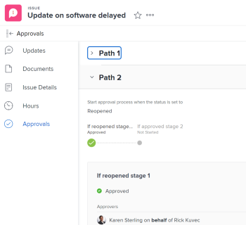

# 승인 보기

승인 프로세스는 프로젝트, 작업 및 문제에 대한 다단계 승인을 만들 수 있는 유연성을 제공합니다. Adobe Workfront 관리자는 승인 프로세스를 정의하여 시스템 전체에서 일관성을 제공합니다.

승인 프로세스 생성에 대한 자세한 내용은 [작업 항목에 대한 승인 프로세스 생성](../../administration-and-setup/customize-workfront/configure-approval-milestone-processes/create-approval-processes.md).

Workfront에서 승인과 작업 연결에 대한 자세한 내용은 [신규 또는 기존 승인 프로세스를 작업물과 연결](../../review-and-approve-work/manage-approvals/associate-approval-with-work.md).

## 액세스 요구 사항

이 문서의 절차를 수행하려면 다음 액세스 권한이 있어야 합니다.

<table style="table-layout:auto"> 
 <col> 
 <col> 
 <tbody> 
  <tr> 
   <td role="rowheader">Adobe Workfront 플랜*</td> 
   <td> 
모든
 </td> 
  </tr> 
  <tr> 
   <td role="rowheader">Adobe Workfront 라이선스*</td> 
   <td> 
검토 이상
 </td> 
  </tr> 
  <tr> 
   <td role="rowheader">액세스 수준 구성*</td> 
   <td> 
승인과 연관된 객체에 대한 보기 이상의 액세스
 
참고: 여전히 액세스 권한이 없는 경우 Workfront 관리자에게 액세스 수준에서 추가 제한 사항을 설정하는지 문의하십시오. Workfront 관리자가 액세스 수준을 수정하는 방법에 대한 자세한 내용은 <a href="../../administration-and-setup/add-users/configure-and-grant-access/create-modify-access-levels.md" class="MCXref xref">사용자 정의 액세스 수준 만들기 또는 수정</a>.
 </td> 
  </tr> 
  <tr> 
   <td role="rowheader">개체 권한</td> 
   <td> 
승인과 연관된 객체에 대한 권한 보기 또는 그 이상의 권한
 
추가 액세스 요청에 대한 자세한 내용은 <a href="../../workfront-basics/grant-and-request-access-to-objects/request-access.md" class="MCXref xref">개체에 대한 액세스 요청 </a>.
 </td> 
  </tr> 
 </tbody> 
</table>

&#42;어떤 계획, 라이선스 유형 또는 액세스 권한을 보유하고 있는지 알아보려면 Workfront 관리자에게 문의하십시오.

## Adobe Workfront에서 승인 찾기

Workfront의 여러 영역에서 승인을 보거나 관리할 수 있습니다. 다양한 영역에서 승인을 관리하는 방법에 대한 자세한 내용은 [작업 승인](../../review-and-approve-work/manage-approvals/approving-work.md).

다음 영역에서 승인을 보거나 관리할 수 있습니다.

* 홈 영역에서

   * 모든 프로젝트, 작업, 문제, 작업표, 문서 및 승인 대기 액세스를 모두 또는 승인을 표시하도록 선택하면 홈 영역에 표시됩니다.
   * 자신이 제출한 승인이 작업 목록의 승인 I&#39;ve Submitted 섹션에 홈 영역에도 표시됩니다. 자세한 내용은 [홈 영역에서 승인을 위해 제출하는 작업 검토](#review-work-you-submit-for-approval-in-the-home-area) 섹션에 자세히 설명되어 있습니다.
   * 연결된 프로젝트, 작업 또는 문제가 해결됨, 보류 중, 닫힘 또는 취소됨으로 표시되면 홈 영역에서 승인이 제거됩니다.

   홈 사용에 대한 자세한 내용은 [홈 시작](../../workfront-basics/using-home/using-the-home-area/get-started-with-home.md).

* 프로젝트, 작업, 문제, 문서 또는 증명 머리글에서
* 프로젝트, 작업 또는 문제의 승인 섹션에서
* 보고서에서

   >[!NOTE]
   >
   >보고서에서 승인을 결정할 수 없습니다.

   승인 정보가 포함된 프로젝트, 작업, 문제 또는 문서 승인 보고서를 만들 수 있습니다.

   보고서 만들기에 대한 내용은 [사용자 지정 보고서 만들기](../../reports-and-dashboards/reports/creating-and-managing-reports/create-custom-report.md).

## 홈 영역에서 승인을 위해 제출하는 작업 검토 {#review-work-you-submit-for-approval-in-the-home-area}

1. 을(를) 클릭합니다. **홈** 아이콘  Adobe Workfront의 왼쪽 위 모서리에서

   >[!NOTE]
   >
   >Workfront 관리자는 사용자 환경에서 홈 아이콘을 다음과 같이 변경할 수 있습니다.
   >
   >* 조직을 보여주기 위해 사용자 지정된 이미지로 바꿉니다. 이 경우 이 문서에 표시된 아이콘의 모양이 다릅니다.
   >* 연결된 페이지를 다른 페이지로 바꿉니다. 이 경우 **기본 메뉴**  페이지의 오른쪽 위 모서리에서 을(를) 클릭하고 **홈**.

1. 선택 **작업 목록**&#x200B;를 클릭한 다음 **필터** 드롭다운 메뉴를 선택하고 **승인**.
1. 를 확장합니다. **승인 제출** 섹션을 찾아 제출한 승인을 찾습니다.

   

## 객체의 승인 상태 보기

객체의 다음 섹션에서 객체의 승인 상태를 볼 수 있습니다.

<table style="table-layout:auto"> 
 <col> 
 <col> 
 <tbody> 
  <tr> 
   <td role="rowheader">업데이트 </td> 
   <td> 
모든 승인 상태가 발생하면 표시됩니다. 승인 상태는 다음에 표시되는 다른 상태와 함께 표시됩니다 <strong>업데이트</strong> 섹션을 참조하십시오.
 </td> 
  </tr> 
  <tr> 
   <td role="rowheader">승인</td> 
   <td> 
승인 프로세스의 각 단계 및 승인자의 승인 여부 등 승인 프로세스에 대한 자세한 정보를 표시합니다.
 </td> 
  </tr> 
 </tbody> 
</table>

* [갱신 영역을 사용하여 승인 상태를 봅니다](#use-the-updates-area-to-view-an-approval-status)
* [승인 영역을 사용하여 승인 상태를 봅니다](#use-the-approvals-area-to-view-an-approval-status)

### 갱신 영역을 사용하여 승인 상태를 봅니다 {#use-the-updates-area-to-view-an-approval-status}

프로젝트, 작업 또는 문제에 대한 승인이 시작되면 **업데이트** 승인 상태를 나타내는 객체의 탭입니다. 새 상태는 객체가 승인 프로세스를 통해 전환될 때마다 표시됩니다. 여기에는 다음 이벤트가 포함됩니다.

* 개체에서 승인 프로세스가 시작됩니다. 상태가 변경되면 승인 프로세스가 시작됩니다.
* 개체가 거부됨
* 개체가 승인됨 

>[!TIP]
>
>작업에 승인이 적용되면 작업이 상주하는 프로젝트의 업데이트 탭에 승인 업데이트가 표시되지 않고 작업의 업데이트 탭에 승인 업데이트가 표시됩니다.

### 승인 영역을 사용하여 승인 상태를 봅니다 {#use-the-approvals-area-to-view-an-approval-status}

현재 작업 중인 작업이나 문제가 승인 프로세스에서 어디에 있는지 확인할 수 있습니다. 다음 정보를 확인할 수 있습니다.

* 승인 프로세스의 단계
* 이미 승인하신 승인자
* 아직 승인하지 않은 승인자

작업 또는 문제가 승인 프로세스에 있는 현재 상태를 보려면 다음과 같이 하십시오.

1. 승인이 연관된 프로젝트, 작업 또는 문제로 이동합니다.
1. 왼쪽 패널에서 **승인**. 먼저 을(를) 클릭해야 할 수 있습니다 **자세히 표시**.

   승인 탭에는 모든 과거 승인 경로 및 단계에 대한 전체 정보가 표시됩니다. 승인을 결정한 사람 또는 팀, Job 역할 또는 사용자에 대해 승인이 설정되어 있는지 여부를 정확하게 확인할 수 있습니다.

   

   승인 프로세스 생성에 대한 자세한 내용은 [작업 항목에 대한 승인 프로세스 생성](../../administration-and-setup/customize-workfront/configure-approval-milestone-processes/create-approval-processes.md).
