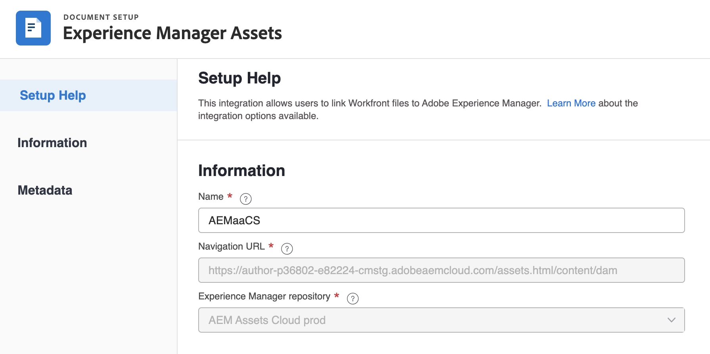

# Frame.io 통합과 함께 Adobe Experience Manager 사용

[!DNL Experience Manager Assets]을(를) &#x200B; 사용하여 검토 및 승인 주기를 거친 디지털 에셋을 관리하고 저장할 수 있습니다&#x200B;. 이 통합을 통해 Adobe Experience Manager, Frame.io 및 Workfront의 기능을 활용하여 컨텐츠 관리 및 공동 작업 프로세스를 간소화할 수 있습니다.

## Experience Manager Assets 통합 구성

[!DNL Experience Manager Assets]의 콘텐츠와 작업을 연결할 수 있습니다&#x200B;.

* 자산 및 메타데이터를 [!DNL Adobe Workfront]에서 [!DNL Experience Manager Assets]&#x200B;(으)로 &#x200B; 푸시
* 버전 관리 사용 사례 촉진
* 자산에 대한 메타데이터 추적
* [!DNL Workfront]과(와) [!DNL Experience Manager Assets] 간 프로젝트 메타데이터 동기화

>[!NOTE]
>
>조직 ID를 통해 여러 [!DNL Experience Manager Assets] 저장소를 하나의 [!UICONTROL Workfront] 환경에 연결하거나 여러 [!DNL Workfront] 환경을 하나의 [!DNL Experience Manager Assets] 저장소에 연결할 수도 있습니다. 설정하려는 각 통합에 대해 이 문서의 구성 지침을 따르십시오.

## 액세스 요구 사항

+++ 이 문서의 기능에 대한 액세스 요구 사항을 보려면 확장하십시오.

<table>
  <tr>
   <td>Adobe Workfront 패키지
   </td>
   <td> 
Prime 또는 Ultimate

    
워크플로 얼티밋

   </td>
  </tr>
    <tr>
   <td>Adobe Workfront 라이선스
   </td>
   <td>
  
통합을 구성하려면 다음을 수행합니다.

   
표준

   
플랜

문서를 Experience Manager Assets으로 보내려면 다음을 수행하십시오.

   
기여자 이상

   
요청 이상

   </td>
  </tr>
  </tr>
    <tr>
   <td>Adobe Experience Manager 라이선스
   </td>
   <td>표준
   </td>
  </tr>
  <tr>
   <td>추가 제품
   </td>
   <td>[!DNL Experience Manager Assets as a Cloud Service]이(가) 있어야 하며 제품에 사용자로 추가되어야 합니다.
   </td>
  </tr>
   <tr>
   <td>액세스 수준 구성
   </td>
   <td>[!DNL Workfront] 관리자여야 합니다.
   </td>
  </tr>
</table>

이 표의 정보에 대한 자세한 내용은 [Workfront 설명서의 액세스 요구 사항](/help/quicksilver/administration-and-setup/add-users/access-levels-and-object-permissions/access-level-requirements-in-documentation.md)을 참조하십시오.

+++

## 전제 조건

시작하기 전에,

* [!DNL Workfront]에서 조직 ID와 연결된 [!DNL Adobe Experience Manager Assets] 및 [!DNL Adobe Admin Console]이(가) 있어야 합니다. 자세한 내용은 [플랫폼 기반 관리 차이점([!DNL Adobe Workfront]/[!DNL Adobe Business Platform])](/help/quicksilver/administration-and-setup/get-started-wf-administration/actions-in-admin-console.md)을 참조하세요.
* Workfront 인스턴스가 Adobe 엔터프라이즈 스토리지를 사용하고 있어야 합니다.

## 통합 정보 설정

{{step-1-to-setup}}

1. 왼쪽 패널에서 **[!UICONTROL 문서]**&#x200B;를 선택한 다음 **[!UICONTROL [!DNL Experience Manager]통합]**&#x200B;을 선택합니다.
1. **[!UICONTROL [!DNL Experience Manager] 통합 추가]**&#x200B;를 선택합니다.
1. Workfront 및 Experience Manager Assets에서 이 통합과 상호 작용할 때 사용자가 볼 이름을 **[!UICONTROL 이름]** 필드에 입력하십시오.
1. **[!UICONTROL 탐색 URL]** 필드에서 탐색 URL이 자동으로 채워집니다. 이 읽기 전용 URL은 빠른 액세스를 위해 [!DNL Experience Manager]기본 메뉴[!UICONTROL 에서 조직의 &#x200B;] 인스턴스에 연결하는 데 사용됩니다.
1. **[!UICONTROL [!DNL Experience Manager]Assets 저장소]** 드롭다운 메뉴에서 저장소를 선택합니다. 사용자 프로필이 할당된 조직 ID와 연결된 [!DNL Experience Manager] 저장소가 자동으로 채워집니다.
   

1. **[!UICONTROL 저장]**&#x200B;을 클릭하거나 이 문서의 [메타데이터 설정(선택 사항)](#set-up-metadata-optional) 섹션으로 이동하십시오.

   >[!IMPORTANT]
   >
   >통합의 복잡성으로 인해 초기 구성을 저장한 후에는 저장소를 변경할 수 없습니다.

## 메타데이터 설정(선택 사항)

[!DNL Workfront] 개체 데이터를 [!DNL Experience Manager] Assets의 에셋 미디어 필드에 매핑할 수 있습니다.

>[!NOTE]
>
>메타데이터는 [!DNL Workfront]에서 [!DNL Experience Manager] 방향으로만 매핑할 수 있습니다. [!DNL Workfront]에서 [!DNL Experience Manager]에 연결된 문서의 메타데이터를 [!DNL Workfront]&#x200B;(으)로 전송할 수 없습니다.

### 메타데이터 필드 구성

메타데이터 필드 매핑을 시작하기 전에 Workfront 및 Experience Manager Assets 모두에서 메타데이터 필드를 구성해야 합니다.

메타데이터 필드를 구성하려면:

1. [!DNL Experience Manager Assets]Adobe과(와) [&#x200B; [!DNL Workfront]  간의 에셋 메타데이터 매핑 구성 [!DNL Experience Manager Assets]에 설명된 대로 &#x200B;](https://experienceleague.adobe.com/en/docs/experience-manager-cloud-service/content/assets/integrations/configure-asset-metadata-mapping)에서 메타데이터 스키마를 구성합니다.

1. Workfront에서 사용자 정의 양식 필드를 구성합니다. [!DNL Workfront]에 사용할 수 있는 기본 제공 사용자 지정 필드가 많습니다. 그러나 [사용자 정의 양식 만들기](/help/quicksilver/administration-and-setup/customize-workfront/create-manage-custom-forms/form-designer/design-a-form/design-a-form.md)에 설명된 대로 사용자 정의 필드를 만들 수도 있습니다.

+++ **지원되는 Workfront 및 Experience Manager Assets 필드에 대한 자세한 내용을 보려면 확장** 

**Experience Manager Assets 태그**

Workfront 지원 필드를 Experience Manager Assets의 태그에 매핑할 수 있습니다. 이렇게 하려면 Experience Manager Assets의 태그 값이 Workfront과 일치하는지 확인해야 합니다.

* 태그와 Workfront 필드 값은 맞춤법 및 형식에서 정확히 일치해야 합니다.
* experience Manager assets 태그에 매핑된 Workfront 필드 값은 Experience Manager Assets의 태그가 대문자로 표시되더라도 모두 소문자여야 합니다.
* Workfront 필드 값에는 공백이 없어야 합니다.
* Workfront의 필드 값에는 Experience Manager Assets 태그의 폴더 구조도 포함되어야 합니다.
* 여러 한 줄 텍스트 필드를 태그에 매핑하려면 메타데이터 매핑의 Workfront 쪽에 쉼표로 구분된 태그 값 목록을 입력하고 Experience Manager Assets 쪽에 `xcm:keywords`을(를) 입력하십시오. 각 필드 값은 별도의 태그에 매핑됩니다. 계산된 필드를 사용하여 여러 Workfront 필드를 쉼표로 구분된 단일 텍스트 필드로 결합할 수 있습니다.
* 해당 필드에 사용 가능한 값의 쉼표로 구분된 목록을 입력하여 드롭다운, 라디오 버튼 또는 확인란 필드의 값을 매핑할 수 있습니다.

>[!INFO]
>
>**예**: 여기에서 폴더 구조에 표시된 태그를 일치시키려면 Workfront의 필드 값은 `landscapes:trees/spruce`이(가) 됩니다. Workfront 필드 값에서 소문자를 확인합니다.
>
>태그 트리에서 태그가 맨 왼쪽 항목이 되도록 하려면 뒤에 콜론이 와야 합니다. 이 예제에서 landscape 태그에 매핑하려면 Workfront의 필드 값은 `landscapes:`입니다.
>
>

Experience Manager Assets에서 태그를 만들면 메타데이터 섹션의 태그 드롭다운 아래에 태그가 표시됩니다. 필드를 태그에 연결하려면 메타데이터 매핑 영역의 Experience Manager Assets 필드 드롭다운에서 `xcm:keywords`을(를) 선택합니다.

태그를 만들고 관리하는 방법을 포함하여 Experience Manager Assets의 태그에 대한 자세한 내용은 [태그 관리](https://experienceleague.adobe.com/en/docs/experience-manager-64/administering/contentmanagement/tags)를 참조하십시오.

**Experience Manager Assets 사용자 지정 메타데이터 스키마 필드**

기본 제공 및 사용자 지정 Workfront 필드를 모두 Experience Manager Assets의 사용자 지정 메타데이터 스키마 필드에 매핑할 수 있습니다.

Experience Manager Assets에서 만든 사용자 지정 메타데이터 필드는 메타데이터 설정 영역의 자체 섹션에 구성됩니다.

<!-- 
link to documentation about creating schema - waiting on response from Anuj about best article to link to
-->

**Workfront 필드**

기본 제공 필드와 사용자 지정 Workfront 필드를 모두 Experience Manager Assets에 매핑할 수 있습니다. 다음 필드 값은 Workfront과 Experience Manager Assets 간에 대소문자와 맞춤법 모두에서 일치해야 합니다.

* 드롭다운 필드
* 다중 선택 필드

>[!TIP]
>
> 필드 값이 정확히 일치하는지 확인하려면
>
> * 설정 > Workfront의 사용자 지정 Forms 또는 오브젝트의 필드
> * Assets > Experience Manager Assets의 메타데이터 스키마

+++

### 에셋의 메타데이터 매핑

에셋이 [!DNL Workfront]에서 처음으로 전달될 때 메타데이터가 매핑됩니다. 기본 제공 필드 또는 사용자 지정 필드가 있는 문서는 에셋을 [!DNL Experience Manager Assets]&#x200B;(으)로 처음 보낼 때 지정된 필드에 자동으로 매핑됩니다.

에셋의 메타데이터를 매핑하려면 다음을 수행합니다.

<!--
1. Select **[!UICONTROL Assets]** above the metadata table.
-->
1. **[!UICONTROL [!DNL Workfront]필드]** 열에서 기본 제공 또는 사용자 지정 Workfront 필드를 선택합니다.

   >[!NOTE]
   >
   >단일 [!DNL Workfront] 필드를 여러 [!UICONTROL Experience Manager Assets] 필드에 매핑할 수 있습니다. 여러 [!DNL Workfront] 필드를 하나의 [!DNL Experience Manager Assets] 필드에 매핑할 수 없습니다.
   ><!--To map a Workfront field to an Experience Manager Assets tag, see -->

1. [!DNL Experience Manager Assets] 필드에서 미리 채워진 범주를 검색하거나 검색 필드에 두 개 이상의 문자를 입력하여 추가 범주에 액세스합니다.
1. 필요에 따라 2단계와 3단계를 반복합니다.
   
1. [!UICONTROL **저장**]&#x200B;을 클릭하거나 이 문서의 [개체 메타데이터 동기화](#object-metadata-sync) 섹션으로 이동하십시오.

### 오브젝트 메타데이터 동기화

[!DNL Experience Manager] 포트폴리오, 프로그램, 프로젝트, 작업, 문제 및 문서 필드에 매핑되는 [!DNL Workfront] 필드는 [!DNL Workfront]에서 필드가 변경될 때 자동으로 업데이트됩니다.

이 옵션이 활성화되면 Adobe Experience Manager로 푸시된 에셋은 Workfront의 문서 세부 정보 페이지에서 문서의 Adobe Experience Manager 메타데이터에 대한 실시간 보기를 표시합니다.

1. **[!UICONTROL 개체 메타데이터 동기화]** 필드를 사용하도록 설정한 다음 **저장**&#x200B;을 클릭합니다.

>[!IMPORTANT]
>
>업데이트할 때 메타데이터를 동기화하려면 개체에 있는 자산에 대해 [!DNL Experience Manager]에서 쓰기 액세스 권한이 있어야 합니다.

## Experience Manager Assets 또는 Assets Essentials로 문서 보내기

Workfront에서 Experience Manager Assets 또는 Assets Essentials로 문서를 전송할 수 있습니다. Workfront에서 Assets Essentials로 업로드되고 전송된 문서는 여전히 전체 문서 스토리지에 대해 계산됩니다.

이 통합을 통해 Experience Manager으로 전송된 Assets의 크기 제한은 **5oTB**&#x200B;입니다.

<!--In the Preview environment, Assets sent to Experience Manager through this integration have a size limit of **30 GB**.-->

메타데이터 필드는 에셋을 Workfront에서 Experience Manager Assets 또는 Assets Essentials로 전송할 때 먼저 매핑됩니다. 상위 개체에 대해 매핑하도록 구성된 메타데이터도 전송됩니다. 메타데이터 매핑 구성에 대한 자세한 내용은 [Experience Manager Assets as a Cloud Service 통합 구성](/help/quicksilver/administration-and-setup/configure-integrations/configure-aacs-integration.md) 또는 [Experience Manager Assets Essentials 통합 구성](/help/quicksilver/documents/adobe-workfront-for-experience-manager-assets-essentials/setup-asset-essentials.md)을 참조하십시오.

>[!INFO]
>
>**예** 프로젝트에 첨부된 에셋을 처음 보낼 때 메타데이터는 Experience Manager Assets 또는 Assets Essentials와 함께 포트폴리오 및 프로그램과 같은 상위 개체의 매핑된 메타데이터에도 매핑됩니다.

### Workfront에서 문서 보내기

사용자가 Workfront에서 Experience Manager Assets 또는 Assets Essentials로 문서를 전송하면 매핑된 메타데이터가 문서를 따라 전송됩니다. 문서가 전송된 후 Workfront에서 문서 메타데이터에 수행된 변경 사항은 Assets 또는 Assets Essentials에 반영되지 않습니다. Workfront의 매핑된 필드가 변경된 경우 업데이트된 메타데이터가 포함된 새 버전의 문서를 Assets 또는 Assets Essentials로 보내야 합니다.

문서를 전송하려면:

1. Workfront의 **문서** 영역으로 이동하여 보낼 문서를 선택하십시오.
1. **보내기**&#x200B;를 클릭한 다음 관리자가 설정한 Experience Manager 통합을 선택합니다.

   >[!NOTE]
   >
   >Workfront 관리자는 이 통합에 사용할 이름을 선택할 수 있으므로 Assets 또는 Assets Essentials에 대해 구체적으로 언급하지 않을 수 있습니다.

   

1. 에셋을 이동할 위치를 선택한 다음 **폴더 선택**&#x200B;을 클릭합니다.
1. 원하는 대상을 찾으면 **저장**&#x200B;을 클릭하세요.

### 새 버전 보내기

이전에 Workfront에 업로드한 문서에 새 버전을 추가할 수 있습니다. 자세한 내용은 [새 문서 버전 업로드](/help/quicksilver/documents/managing-documents/upload-new-document-version.md)를 참조하십시오. 최신 버전이 업로드되면 Assets Essentials로 전송할 수 있습니다. Workfront의 매핑된 필드가 변경된 경우 새 버전은 전송 시 Assets Essentials의 메타데이터를 업데이트합니다.

>[!IMPORTANT]
>
>새 버전을 Workfront에 업로드하기 전에 파일 이름을 바꾸는 것이 좋습니다. 이전 버전과 정확히 동일한 파일 이름의 새 버전을 업로드하는 경우 Workfront에서 가장 최근 버전만 다운로드할 수 있습니다. 파일 이름과 관계없이 Experience Manager Assets 또는 Assets Essentials에서 모든 버전을 다운로드할 수 있습니다. <!--Is this still a thing with ESM?-->

최신 버전을 보내려면

1. Workfront의 **문서** 영역으로 이동하여 문서를 찾습니다.
1. **전송 대상**&#x200B;을 선택한 다음 관리자가 설정한 Experience Manager 통합을 선택하십시오.

   >[!NOTE]
   >
   >Workfront 관리자는 이 통합에 사용할 이름을 선택할 수 있으므로 Assets 또는 Assets Essentials에 대해 특별히 언급하지 않을 수 있습니다.

   

1. **저장**&#x200B;을 클릭합니다. 새 버전이 이전 버전과 동일한 위치에 저장됩니다.
