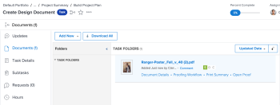

# 자동화된 워크플로를 사용하여 고급 증명 만들기

<!-- Audited: 2/2024 -->

프로세스가 복잡하거나 검토용 콘텐츠를 정기적으로 동일한 사람에게 보내는 경우 자동화된 워크플로를 사용하면 검토 프로세스를 보다 쉽게 관리할 수 있습니다. 증명이 단계 간에 이동하고 Adobe Workfront이 검토할 차례가 되면 각 사용자에게 알립니다. 자동화된 워크플로에 대한 자세한 내용은 [자동화된 워크플로 개요](../../../review-and-approve-work/proofing/proofing-overview/automated-workflow.md)를 참조하십시오.

## 액세스 요구 사항

+++ 을 확장하여 이 문서의 기능에 대한 액세스 요구 사항을 봅니다.

<table style="table-layout:auto"> 
 <col> 
 <col> 
 <tbody> 
  <tr> 
   <td role="rowheader">Adobe Workfront 패키지</td> 
   <td> 
임의
 </td> 
  </tr> 
  <tr> 
   <td role="rowheader">Adobe Workfront 라이선스</td> 
   <td> 표준

   
작업 또는 계획
 </td> 
  </tr> 
  <tr> 
   <td role="rowheader">교정쇄 권한 프로필 </td> 
   <td>관리자 이상</td> 
  </tr> 
  <tr> 
   <td role="rowheader">액세스 수준 구성</td> 
   <td> 
문서에 대한 액세스 편집
</td> 
  </tr> 
 </tbody> 
</table>

이 표의 정보에 대한 자세한 내용은 [Workfront 설명서의 액세스 요구 사항](/help/quicksilver/administration-and-setup/add-users/access-levels-and-object-permissions/access-level-requirements-in-documentation.md)을 참조하십시오.

+++

## 자동화된 워크플로를 사용하여 고급 증명 만들기

1. 증명을 원하는 프로젝트, 작업 또는 문제로 이동한 다음 **문서** 탭을 클릭합니다.
1. **새로 추가** > 증명을 클릭하고 콘텐츠를 업로드한 다음 아래 나열된 섹션을 통해 작업합니다.

   또는

   기존 문서를 마우스로 가리킨 다음 **증명 만들기** > **고급 증명**&#x200B;을 클릭하고 아래 나열된 섹션을 통해 작업합니다.

## 증명 단계 구성

1. 워크플로우 유형 섹션에서 **자동화**&#x200B;를 선택합니다.
1. (선택 사항) Workfront 관리자가 만들고 사용자와 공유한 자동화된 워크플로 템플릿을 사용하려면 **템플릿 추가**&#x200B;를 클릭하고 나타나는 상자에서 템플릿을 선택한 다음 **템플릿 추가**&#x200B;를 클릭합니다.

   >[!NOTE]
   >
   >자동화된 워크플로우 템플릿을 사용할 때는 다음 사항을 고려하십시오.
   >   
   >* 자동화된 워크플로 템플릿의 설정은 증명에 대한 자동화된 워크플로로 수행할 수 있는 작업을 결정합니다. 예를 들어, 템플릿에서 단계 추가 버튼이 비활성화되어 있는 경우 증명에 대한 자동화된 워크플로 설정으로 작업할 때 이 버튼이 표시되지 않습니다.
   >* 어떤 사람이 자동화된 워크플로 템플릿의 단계에 추가되었지만 증명에서 검토자로 이미 존재하는 경우 템플릿을 적용하면 검토자가 단계에서 제거됩니다. 스테이지에 다른 검토자를 추가하지 않으면 하나를 추가하라는 메시지가 표시됩니다.
   >* 자동화된 워크플로 템플릿을 수정하는 기능은 의 설명과 같이 Workfront 관리자가 구성한 템플릿 설정에 따라 다릅니다. 템플릿 수정 기능이 비활성화된 경우 템플릿 소유자만 수정할 수 있습니다.

1. 자동화된 워크플로의 첫 번째 단계를 구성합니다.

   1. (선택 사항) 첫 번째 단계의 이름을 만들려면 **단계 1**&#x200B;을 클릭한 다음 이름을 입력합니다.
   1. 단계에 대한 **수신자** 섹션에서 검토자를 단계에 추가합니다.

      >[!NOTE]
      >
      >단계에 검토자를 추가할 때는 다음 사항을 고려하십시오.
      >   
      >* 이메일 주소를 사용하여 단계에 외부 사용자를 추가할 수 있습니다.
      >* 단계에 사용자를 추가한 후 증명에서 해당 사용자에 대한 설정을 구성할 수 있습니다.
      >* 사용자를 직접 다른 단계로 끌어 놓거나 사용자를 **단계** 다이어그램의 단계로 끌어 놓을 수 있습니다. 여러 사용자를 선택하려면 Shift+Ctrl(Windows) 또는 Shift+Command(Mac)를 누릅니다.
      >* 증명에 한 번만 검토자를 추가할 수 있습니다. 즉, 증명의 두 단계 이상에 동일한 사용자를 추가할 수 없습니다.
      >* 비공개 단계에 추가되지 않은 검토자는 해당 단계에서 수행한 증명 또는 주석에서 해당 단계를 볼 수 없습니다.
      >* 기본적으로 단계에 사용자를 추가하면 해당 사용자는 증명을 만든 시점부터 증명을 볼 수 있는 액세스 권한이 부여됩니다. Workfront 관리자는 워크플로가 사용자가 추가된 단계에 들어갈 때까지 사용자가 증명에 액세스하지 못하도록 제한할 수 있습니다.

   1. **단계 설정**&#x200B;을 클릭합니다.
   1. **단계 활성화** 옵션을 클릭하여 단계를 활성화할 방법을 나타냅니다.

      첫 번째 단계에서는 **증명 생성 시**, **특정 날짜 및 시간 시** 또는 **수동으로**&#x200B;만 선택할 수 있습니다.

   1. (조건부) 이전 단계에서 **특정 날짜 및 시간에**&#x200B;을(를) 선택한 경우 표시되는 **활성화 날짜** 상자에서 단계를 활성화할 날짜 및 시간을 선택합니다.

   1. 아래 옵션을 사용하여 단계를 추가로 구성하십시오.

      <table style="table-layout:auto">
       <col>
       <col>
       <tbody>
        <tr>
         <td role="rowheader">스테이지 기한 설정</td>
         <td>
단계의 기한을 설정하려면 <strong>기한 옵션</strong> 드롭다운 목록에서 옵션을 클릭하십시오. <strong>기한</strong>에서 다음 중 하나를 실행하십시오.

          <ul>
           <li><strong>특정 날짜 설정</strong>을 선택한 경우: 원하는 기한 날짜 및 시간을 선택하십시오.</li>
           <li><strong>단계 활성화 날짜부터 계산</strong>을 선택한 경우: 단계 활성화 날짜에 추가할 영업일 수를 선택하여 기한을 결정하십시오.</li>
          </ul></td>
        </tr>
        <tr>
         <td role="rowheader">스테이지 잠금</td>
         <td>스테이지를 잠글 수 있는 시기를 지정합니다. </td>
        </tr>
        <tr>
         <td role="rowheader">기본 결정 권한을 다음으로 전송</td>
         <td>
단계의 기본 의사 결정자를 선택합니다(승인자 이상의 증명 역할을 가진 사용자를 단계에 하나 이상 추가한 후에만 사용 가능). 기본 의사 결정자를 선택하면 이 단계에서 <strong>필요한 하나의 의사 결정만</strong> 옵션이 비활성화됩니다.
</td>
        </tr>
        <tr>
         <td role="rowheader">이 단계에 대해 하나의 결정만 필요</td>
         <td>의사 결정자 중 한 명이 결정을 내리면 전체 검토 프로세스를 종료합니다.
<strong>기본 의사 결정자</strong>드롭다운 메뉴에서 사용자를 지정한 경우에는 이 옵션을 사용할 수 없습니다.
</td>
        </tr>
        <tr>
         <td role="rowheader">이 단계를 비공개로 설정</td>
         <td>수퍼바이저, Workfront 관리자 및 Workfront Proof 관리자만 이 단계에서 주석 및 의사 결정을 볼 수 있습니다.</td>
        </tr>
       </tbody>
      </table>

1. 다른 단계를 추가하고 구성하려면:

   1. **새 단계**&#x200B;를 클릭합니다.
   1. (선택 사항) 첫 번째 단계의 이름을 만들려면 **단계 2**(또는 **단계 3**, **단계 4** 등)을 클릭한 다음 이름을 입력합니다.

   1. **단계 활성화**&#x200B;를 클릭한 다음 단계를 자동으로 활성화할지 수동으로 활성화할지 여부를 지정하는 옵션을 선택하십시오.

      **증명 생성 시**, **특정 날짜 및 시간에** 또는 **수동으로** 옵션 외에 이전 단계에서 발생한 내용에 따라 다른 옵션을 선택할 수 있습니다.

      

   1. 이전 단계에서 발생한 사항에 따라 달라지는 단계 활성화 옵션을 선택한 경우 표시되는 옵션을 사용하여 활성화 설정을 구성합니다.

      예를 들어 **이전 단계 상태가 변경되면**&#x200B;를 선택한 경우 **이전 단계**&#x200B;를 선택한 다음 **상태가 다음으로 변경됨** 상자에서 상태를 선택합니다.

1. 필요에 따라 이전 단계를 반복하여 단계를 더 추가합니다.

   자동화된 워크플로에 단계를 추가하면 화면에 해당 단계를 나타내는 다이어그램 양식이 표시됩니다.

   

1. 아래의 [증명에 대한 전자 메일 설정 구성](#configure-email-settings-for-the-proof)을 사용하여 계속합니다.

## 증명에 대한 이메일 설정 구성 {#configure-email-settings-for-the-proof}

1. **전자 메일 알림** 섹션에서 이 문서의 앞부분에서 [자동화된 워크플로로 고급 증명 만들기](#workflow)에서 선택한 사용자에게 전자 메일 알림과 사용자 지정 메시지를 보낼지 여부를 선택합니다.

   <table>
      <tbody>
      <tr>
      <td>이 증명에 대해 수신자에게 알림</td>
      <td>사용자에게 이메일 알림을 전송하려면 이 옵션을 선택합니다. <strong>워크플로</strong> 섹션에서 <strong>기본 공유</strong>를 선택하면 증명을 만들 때 전자 메일 알림이 전송됩니다. <strong>워크플로</strong> 섹션에서 <strong>자동화된 워크플로</strong>를 선택하면 증명이 사용자와 연결된 자동화된 워크플로의 단계에 들어갈 때 전자 메일 알림이 전송됩니다.</td>
      </tr>
      <tr>
      <td>사용자 정의 메시지 추가</td>
      <td>알림에 사용자 지정 메시지를 포함하려면 이 옵션을 선택합니다. 제목과 메시지 본문을 지정할 수 있습니다. 메시지 본문에는 굵게, 글머리 기호 및 하이퍼링크와 같은 서식 있는 텍스트 서식이 포함될 수 있습니다.</td>
      </tr>
      </tbody>
      </table>

1. 아래의 [증명 설정 구성](#configure-proof-settings)을 계속합니다.

## 증명 설정 구성 {#configure-proof-settings}

1. **증명 설정** 섹션에서 다음 옵션 중 하나를 선택합니다.

   <table style="table-layout:auto"> 
    <col> 
    <col> 
    <tbody> 
     <tr> 
      <td role="rowheader">로그인 필요 - 증명은 다른 사용자와만 공유할 수 있음</td> 
      <td>이 옵션이 비활성화되면(기본값) URL을 가진 모든 사용자가 증명을 볼 수 있습니다.  이 옵션을 선택한 경우:
       <ul>
        <li>Workfront Proof 사용자만 증명을 볼 수 있습니다.</li>
        <li>사용자가 증명에 추가되지 않은 경우 증명에 로그인할 수 없습니다.</li>
        <li>구독을 활성화할 수 없습니다.</li>
       </ul></td> 
     </tr> 
     <tr> 
      <td role="rowheader">이 증명에는 단 하나의 결정만 필요합니다.</td> 
      <td>이 선택지를 선택하면, 의사 결정자 중 한 명이 결정을 한 후 심사가 완료된다. 이 옵션은 기본적으로 사용하지 않도록 설정되어 있습니다.</td> 
     </tr> 
     <tr> 
      <td role="rowheader">결정 시 전자 서명 필요</td> 
      <td>사용자는 증명을 결정할 때 사용자 이름과 암호를 지정해야 합니다.</td> 
     </tr> 
     <tr> 
      <td role="rowheader">필요한 모든 결정을 내릴 때 증명 잠금</td> 
      <td>이 설정을 사용하면 모든 결정이 내려진 후 증명 상태가 잠깁니다. 최종 승인자가 결정을 내리면 상태는 자동으로 잠금 해제에서 잠금으로 변경됩니다. 이 옵션은 기본적으로 사용하지 않도록 설정되어 있습니다.</td> 
     </tr> 
     <tr> 
      <td role="rowheader">원본 파일 다운로드</td> 
      <td>이 옵션을 선택하면 검토자는 증명을 만든 원본 파일을 다운로드할 수 있습니다. 이 옵션을 선택 취소하면 더 이상 다운로드 아이콘이 표시되지 않습니다. 이 옵션은 기본적으로 사용됩니다.</td> 
     </tr> 
     <tr> 
      <td role="rowheader">공개 URL 또는 포함 코드를 통해 증명 공유</td> 
      <td>이 옵션을 선택하면 공용 URL 또는 포함 코드를 통해 증명을 공유할 수 있습니다.</td> 
     </tr> 
     <tr> 
      <td role="rowheader">공개 URL 또는 포함 코드를 통해 증명 구독</td> 
      <td>이 옵션을 선택하면 증명에 명시적으로 추가되지 않은 사람도 증명에 가입할 수 있습니다. 증명을 구독하는 사용자에게는 다음 설정에서 정의한 역할 및 이메일이 부여됩니다.
       <ul>
        <li><strong>구독자 역할:</strong> 증명을 구독하는 모든 검토자에게 할당된 기본 증명 역할입니다.</li>
        <li><strong>구독자에 대한 전자 메일 경고 설정:</strong> 증명을 구독하는 모든 검토자에게 할당되는 기본 전자 메일 경고입니다.</li>
       </ul>

        <ul>
         <li><strong>전자 메일 링크를 통한 증명 액세스 필요:</strong> 구독자가 증명에 대한 링크가 포함된 전자 메일을 받는지 여부를 구성합니다. <strong>전자 메일 없음</strong>(증명에 액세스하는 데 전자 메일 링크가 필요하지 않음), <strong>증명 알림 전자 메일 전용</strong>(구독자가 확인 없이 전자 메일을 통해 증명에 대한 링크를 받음) 또는 <strong>확인 및 증명 알림 전자 메일</strong>(구독자가 전자 메일을 통해 증명에 대한 링크를 받고 증명에 액세스하려면 링크를 클릭해야 함)을 선택할 수 있습니다. 이 옵션의 목적은 해당 사용자가 액세스 권한이 있는 올바른 전자 메일 주소를 입력했는지 확인하는 것입니다.</li>
        </ul>
<strong>참고:</strong> 증명에 자동화된 워크플로가 첨부된 경우 모든 구독은 증명 소유자에게 확인 이메일을 생성하므로 사용자를 추가해야 하는 단계를 결정할 수 있습니다. 

</td> 
     </tr> 
    </tbody> 
   </table>

1. **증명 만들기**&#x200B;를 클릭합니다.

   Workfront에서 선택한 문서 또는 웹 사이트에 대한 증명 생성을 시작합니다. 파일 크기와 유형에 따라 문서 업로드의 지연 시간이 다를 수 있습니다. 파일이 크면 생성하는 데 시간이 오래 걸리므로 기다려 주십시오. 페이지에서 멀리 탐색할 수 있으며 Workfront에서 파일을 계속 생성합니다. 최대 파일 업로드 크기는 4GB입니다.

1. 증명이 생성되면 **증명 열기**&#x200B;를 클릭하여 증명 뷰어를 시작합니다.

   

   계정에 증명이 활성화되어 있지 않은 사용자는 여전히 문서를 보고 증명 [에 댓글을 달 수 있습니다.](../../../timesheets/config-timesheet-prefs/config-time-logged-hrs-days.md)
