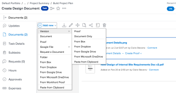

# 증명 새 버전 만들기

여러 버전이나 작업 개정에서 피드백을 관리하는 것은 큰 어려움이 될 수 있습니다. Workfront을 사용하면 여러 버전의 증명을 만들고 비교할 수 있으므로 이 프로세스를 간소화할 수 있습니다.

증명의 새 버전을 만들 때 다음 정보를 고려하십시오.

* 한 버전을 볼 수 있는 권한을 사용자에게 부여할 수 있지만 다른 버전은 볼 수 없습니다. 반대로 사용자와 최신 버전을 공유하는 경우 이전 버전으로 돌아가서 해당 이전 버전에 대한 액세스 권한을 명시적으로 부여하지 않으면 해당 사용자가 이전 버전을 볼 수 없습니다.
* 증명의 새 버전을 만들려면 증명의 편집 권한이 있어야 합니다.

   자세한 내용은 [Workfront 증명의 증명 역할 관리](../../../workfront-proof/wp-work-proofsfiles/share-proofs-and-files/manage-proof-roles.md) 및 [Workfront 증명의 증명 권한 프로필](../../../workfront-proof/wp-acct-admin/account-settings/proof-perm-profiles-in-wp.md) 증명에 대한 편집 권한이 있는 사용자에 대한 자세한 정보를 제공합니다.

   증명 버전 공유에 대한 자세한 내용은  [Workfront 증명의 증명 공유](../../../workfront-proof/wp-work-proofsfiles/share-proofs-and-files/share-proof.md).

>[!IMPORTANT]
>
>Adobe Workfront 내에 증명을 만들 경우, 해당 증명을 위해 만든 모든 새 버전도 Workfront 내에 만들어야 합니다. Workfront 증명 내에서 증명을 만든 경우에는 증명의 새 버전을 Workfront 내에 만들 수 없습니다.

## 액세스 요구 사항

이 문서의 절차를 수행하려면 다음 액세스 권한이 있어야 합니다.

<table style="table-layout:auto"> 
 <col> 
 <col> 
 <tbody> 
  <tr> 
   <td role="rowheader">Adobe Workfront 플랜*</td> 
   <td> 
현재 계획: Pro 이상
 
또는
 
기존 계획: Select 또는 Premium
 
다양한 계획에 따른 언어 교정에 대한 자세한 내용은 <a href="/help/quicksilver/administration-and-setup/manage-workfront/configure-proofing/access-to-proofing-functionality.md" class="MCXref xref">Workfront에서 언어 교정 기능에 액세스</a>.
 </td> 
  </tr> 
  <tr> 
   <td role="rowheader">Adobe Workfront 라이선스*</td> 
   <td> 
현재 계획: 작업 또는 계획
 
기존 계획: 모두(사용자가 교정을 사용하도록 설정되어 있어야 함)
 </td> 
  </tr> 
  <tr> 
   <td role="rowheader">증명 권한 프로필 </td> 
   <td>관리자 이상</td> 
  </tr> 
  <tr> 
   <td role="rowheader">액세스 수준 구성*</td> 
   <td> 
문서 액세스 편집
 
추가 액세스 요청에 대한 자세한 내용은 <a href="../../../workfront-basics/grant-and-request-access-to-objects/request-access.md" class="MCXref xref">개체에 대한 액세스 요청 </a>.
 </td> 
  </tr> 
 </tbody> 
</table>

&#42;보유하고 있는 계획, 역할 또는 증명 권한 프로필을 알아보려면 Workfront 또는 Workfront 증명 관리자에게 문의하십시오.

## Workfront에서 새로운 버전의 증명 만들기

Workfront에서 새 증명 버전을 업로드하는 방법에는 여러 가지가 있습니다. 기본 증명 설정은 선택한 방법에 따라 이전 버전에서 이월되거나 이월되지 않을 수 있습니다.

* **문서를 업로드할 때 증명을 자동으로 생성합니다**: 기본 증명 설정은 전달되지 않습니다. 사용자 프로필에서 이 설정을 활성화한 경우 새 버전을 끌어다 놓을 때 기본 증명 설정이 유지되지 않습니다.
* **증명 만들기 > 단순**: 기본 증명 설정은 전달되지 않습니다. 새 증명 버전을 만들 때 단순 을 선택하는 경우, 기본 증명 설정은 이전 버전에서 넘겨지지 않습니다.
* **새로 추가 > 버전 > 증명**: 기본 증명 설정은 이전 버전에서 전달됩니다.
* **증명 만들기 > 고급**: 기본 증명 설정은 이전 버전에서 전달됩니다.

   <table>
  <tbody>
  <tr>
  <td>문서 업로드 시 자동으로 증명 생성</td>
  <td>기본 증명 설정은 전달되지 않습니다. 사용자 프로필에서 이 설정을 활성화한 경우 새 버전을 끌어다 놓을 때 기본 증명 설정이 유지되지 않습니다.</td>
  </tr>
  <tr>
  <td>증명 만들기 &gt; 단순</td>
  <td>기본 증명 설정은 전달되지 않습니다. 새 증명 버전을 만들 때 단순 을 선택하는 경우, 기본 증명 설정은 이전 버전에서 넘겨지지 않습니다.</td>
  </tr>
  <tr>
  <td>새로 추가 &gt; 버전 &gt; 증명</td>
  <td>기본 증명 설정은 이전 버전에서 전달됩니다.</td>
  </tr>
  <tr>
  <td>증명 만들기 &gt; 고급</td>
  <td>기본 증명 설정은 이전 버전에서 전달됩니다.</td>
  </tr>
  </tbody>
  </table>

증명의 새 버전을 만들려면 다음을 수행하십시오.

1. 증명을 포함하는 문서 목록을 엽니다.
1. 컴퓨터의 파일 시스템에서 새 파일을 증명 위에 끌어다 놓습니다.

   또는

   증명을 나열하는 행을 선택하고 **새로 추가** > **버전**&#x200B;를 클릭한 다음 를 클릭하여 증명의 새 버전을 추가합니다.

   

## 교정 뷰어에서 새 버전의 증명 만들기(Workfront 증명만 해당)

독립형 Workfront 증명을 사용하는 경우 단일 파일 또는 웹 캡처를 포함하는 새로운 버전의 증명을 만들 수 있습니다. 

>[!NOTE]
>
>계정이 엔터프라이즈 플랜에 있고 여러 파일 또는 웹 캡처를 업로드하면 자동으로 단일 새 버전으로 결합됩니다. 자세한 내용은 [여러 페이지로 구성된 증명 만들기](../../../review-and-approve-work/proofing/creating-proofs-within-workfront/create-multi-page-proof.md) 추가 정보.

Workfront 증명의 새 버전을 만들려면:

1. 증명을 엽니다.
1. 을(를) 클릭합니다. **버전** 왼쪽 위 모서리에 있는 드롭다운 메뉴를 클릭한 다음 **+ 새 버전** 이 표시되는 상자에 나타납니다.

   설정 **의 새로운 증명 버전** 표시되는 페이지에는 역할 및 전자 메일 알림 설정을 포함하여 이전 버전의 모든 검토자가 표시됩니다. 기존 검토자의 역할과 알림을 쉽게 편집하거나 이 페이지의 새 버전에서 기존 검토자를 제거할 수 있습니다.

1. 아래 **파일 추가**&#x200B;를 눌러 컴퓨터에서 끌어다 놓거나 를 클릭하여 파일을 새 버전의 증명의 파일로 업로드합니다 **찾아보기** 원하는 파일을 선택합니다. 을(를) 입력할 수 있습니다 **증명 이름** 버전에 대해 또는 끝에 버전 번호가 추가된 동일한 파일 이름을 사용하려면 이 상자를 비워 둡니다.

   또는

   URL을 입력하여 웹 페이지를 증명의 새 버전으로 캡처합니다.

   >[!NOTE]
   >
   >드래그 앤 드롭은 HTML5를 완전히 지원하는 브라우저에서만 사용할 수 있습니다. Internet Explorer 7 - 9 및 Safari는 제외됩니다.

1. 아래 **워크플로우**&#x200B;를 설정하는 경우 다음 중 하나를 변경하여 이 버전의 증명에 대한 검토자를 지정합니다.

   이전 버전의 검토자는 추가한 검토자로 바뀝니다.

   * 변경 **소유자** 사용자 계정의 다른 사용자에게 버전을 전송하는 중입니다.\
      소유자 권한에 대한 자세한 내용은 [Workfront 증명의 증명 권한 프로필](../../../workfront-proof/wp-acct-admin/account-settings/proof-perm-profiles-in-wp.md).

   * 사용 **받는 사람 상자를 추가하려면 연락처 이름 또는 전자 메일 주소를 입력하십시오.**&#x200B;를 눌러 버전에 검토자를 추가합니다. 을(를) 지정할 수 있습니다 **증명 역할** 그리고 **이메일 경고** 각 수신자에 대한 유형입니다.

      증명에 그룹 추가에 대한 자세한 내용은  [증명에 그룹 추가](../../../workfront-proof/wp-mnguserscontacts/groups/add-groups.md). 역할에 대한 자세한 내용은 [Workfront 증명의 증명 역할 관리](../../../workfront-proof/wp-work-proofsfiles/share-proofs-and-files/manage-proof-roles.md).

      >[!NOTE]
      >
      >증명의 작성자나 소유자가 [증명의 이메일](../../../workfront-proof/wp-emailsntfctns/proof-notifications-and-reminders/proof-made-email.md) 기본적으로 비활성화되어 있음(개인 설정에서) 새 증명 페이지에서 사람에게 이메일로 알림 상자를 선택하더라도 증명 또는 새 증명 이메일을 받지 않습니다. 이메일 알림에 대한 자세한 내용은 [Workfront 증명의 이메일 알림 설정 구성](../../../workfront-proof/wp-emailsntfctns/email-alerts/config-email-notification-settings-wp.md). 참조 - [증명의 이메일](../../../workfront-proof/wp-emailsntfctns/proof-notifications-and-reminders/proof-made-email.md) 및 [새로운 증명 이메일](../../../workfront-proof/wp-emailsntfctns/proof-notifications-and-reminders/new-proof-email.md).

   * 버전에 대한 증명 기한을 설정합니다.
   * 검토자의 이름을 마우스로 가리키면 이전 버전에서 수행한 결정을 볼 수 있습니다.

1. 아래 **이메일 알림**&#x200B;를 채울 때는 다음 중 하나를 수행합니다.

   * 검토자에게 새 버전을 알릴 것인지 여부를 지정합니다.\
      선택 사항이 증명 세부 사항 페이지의 활동 섹션에 기록됩니다. 자세한 내용은 [Workfront 증명의 증명 세부 정보 관리](../../../workfront-proof/wp-work-proofsfiles/manage-your-work/manage-proof-details.md).

   * 사용자 지정 제목 및 메시지를 추가합니다.

1. 에서 **조직** 섹션에서 다음 중 하나를 수행합니다. 

   * 증명에 하나 이상의 태그를 적용합니다. 자세한 내용은 [Workfront 증명의 태그 만들기 및 관리](../../../workfront-proof/wp-work-proofsfiles/organize-your-work/create-and-manage-tags.md).\
      태그도 이전 버전의 증명에서 상속됩니다. 새 버전에 새 태그를 추가하는 경우 이전 버전에도 태그가 지정됩니다.

   * 폴더에 버전을 추가합니다. 자세한 내용은 [Workfront 증명의 폴더 관리](../../../workfront-proof/wp-work-proofsfiles/organize-your-work/manage-folders.md) 추가 정보. 폴더는 증명의 이전 버전에서 복사됩니다. 다른 폴더를 선택하면 전체 증명(모든 버전)이 이동됩니다.

   * 청구 관리자 및 관리자는 설정 탭의 전체 계정에서 폴더 필드를 필수로 만들 수 있습니다. 자세한 내용은 를 참조하십시오.

1. 증명 설정에서 아래의 변경 작업을 수행합니다.

   * 증명 로그인 필요
   * 증명의 전자 서명 필요(엔터프라이즈 플랜만 해당)
   * 모든 결정을 내릴 때 증명 잠금
   * 원본 파일의 다운로드 허용 또는 차단
   * 공개 공유 설정을 포함한 증명의 공개 공유
   * 증명 구독\
      이 섹션에서 선택한 항목은 증명 세부 정보 페이지에 표시됩니다(일부 필드를 편집할 수 있음). 자세한 내용은 [Workfront 증명의 증명 세부 정보 관리](../../../workfront-proof/wp-work-proofsfiles/manage-your-work/manage-proof-details.md).

<!--
<h2 data-mc-conditions="QuicksilverOrClassic.Draft mode">Create a new version of a proof from the proofing viewer</h2>
-->

<!--

To create a new version from the proofing viewer

-->

<!--
<ol data-mc-conditions="QuicksilverOrClassic.Draft mode">
<li value="1">Open the proof.</li>
<li value="2"> 
Click the <strong>Version</strong> drop-down menu in the upper-left corner, then click <strong>+ New version</strong> in the box that appears.
 
On the <strong>New proof version of</strong> page that appears, you can see all the reviewers from the previous version, including their roles and email notification settings. You can easily edit the roles and notifications of existing reviewers or remove existing reviewers from the new version on this page.
 </li>
<li value="3"> 
Under <strong>Add files</strong>, upload a file as a new version of the proof by dragging and dropping from your computer or by clicking <strong>browse</strong> and selecting the file you want. You can type a&nbsp;<strong>Proof name</strong>&nbsp;for the version or leave this box blank to&nbsp;use the same filename with a version number added on the end.
 
Or 
 
Capture a web page as a new version of the proof by typing a URL
 <note type="note">
Drag and drop is available only with browsers that fully support HTML5. This excludes Internet Explorer 7 through 9 and Safari.
 
</note> </li>
<li value="4"> 
Under <strong>Workflow</strong>, make any of the following changes to specify the reviewers for this version of the proof.
 
Reviewers from the previous version are replaced by the reviewers you add.

<ul>
<li>Change the <strong>Owner</strong> of the version to another user in your account. For information about owner permissions, see <a href="../../../workfront-proof/wp-acct-admin/account-settings/proof-perm-profiles-in-wp.md" class="MCXref xref">Proof Permissions Profiles in Workfront Proof</a>.</li>
<li> 
Using the <strong>Type contact name or email address to add a recipient box</strong>, add reviewers to the version. You can specify a <strong>Proof role</strong> and an <strong>Email alerts</strong> type for each recipient.
 
For information about adding groups to the proof, see&nbsp;<a href="../../../workfront-proof/wp-mnguserscontacts/groups/add-groups.md" class="MCXref xref">Add Groups to a Proof</a>.&nbsp;For information about roles, see <a href="../../../workfront-proof/wp-work-proofsfiles/share-proofs-and-files/manage-proof-roles.md" class="MCXref xref">Manage Proof Roles in Workfront Proof</a>.
 <note type="note">
If the creator or owner of&nbsp;&nbsp;the proof has
<a href="../../../workfront-proof/wp-emailsntfctns/proof-notifications-and-reminders/proof-made-email.md" class="MCXref xref">The Proof Made email</a> disabled by default (in their personal settings), they won't receive any Proof made or New proof emails even if the Notify people by email box is checked on the New proof page. For information about email notifications, see
<a href="../../../workfront-proof/wp-emailsntfctns/email-alerts/config-email-notification-settings-wp.md" class="MCXref xref">Configure email notification settings in Workfront Proof</a>.&nbsp;See also
<a href="../../../workfront-proof/wp-emailsntfctns/proof-notifications-and-reminders/proof-made-email.md" class="MCXref xref">The Proof Made email</a> and
<a href="../../../workfront-proof/wp-emailsntfctns/proof-notifications-and-reminders/new-proof-email.md" class="MCXref xref">New proof email</a>.
 
</note> </li>
<li>Set a proof deadline for the version.</li>
<li>Hover over a reviewer's name to see any decisions he or she made on a previous version.</li>
</ul> </li>
<li value="5">Under <strong>Email notification</strong>, do any of the following:
<ul>
<li>Specify whether you want to notify the reviewers of the new version. Your selection will be logged in the Proof activity section on the Proof details page.</li>
<li>Add a custom subject and message.</li>
</ul></li>
<li value="6">Under Proof settings, make any of the changes below:
<ul>
<li>Require login on the proof</li>
<li>Require electronic signatures on the proof (Enterprise plan only)</li>
<li>Lock the proof when all decisions are made</li>
<li>Allow or block download of original file</li>
<li>Public sharing of the proof,&nbsp;including public sharing settings</li>
<li>Subscription to the proof The selections made in this section will be shown in the Proof details page.</li>
</ul></li>
</ol>
-->

## 새 버전 메시지 정보

이전 버전의 증명에 사용자 지정 제목/메시지가 포함된 경우 기본적으로 새 버전 페이지에 표시됩니다. 다음을 수행할 수 있습니다.

* 제목 및 메시지를 편집합니다.
* 검토자가 새로운 버전을 가지고 있음을 알리는 전자 메일이 검토자에게 전송되지 않음을 의미하며 전자 메일로 사람 알림 상자의 선택을 취소합니다.

   >[!NOTE]
    개인 설정에 저장된 기본 사용자 지정 제목/메시지의 영향을 받지 않습니다.

개인 설정에 기본 제목과 메시지가 저장된 경우, 이 내용은 기본적으로 새 버전 페이지에 표시되는 메시지에 영향을 줍니다.

* 표준 이메일(예: 사용자 지정 제목/메시지 없음)을 사용하여 이전 버전의 증명에 대해 검토자에게 이메일로 알리도록 선택한 경우, 기본 사용자 지정 제목/메시지(개인 설정)가 새 버전 페이지에 표시됩니다. 그런 다음 사용자 지정 제목 및 메시지를 편집하거나 전자 메일로 사람 알림 상자를 선택 취소할 수 있습니다(검토자가 새로운 버전을 가지고 있음을 알리는 전자 메일이 검토자에게 전송되지 않음).
* 이전 버전의 증명(예: 표준 또는 사용자 지정 이메일 없음)에 대해 검토자에게 이메일로 알리지 않도록 선택한 경우, 기본적으로 새 버전 페이지에는 메시지가 포함되지 않습니다. 검토자에게 새 버전을 알리려면 메시지 보내기 링크를 클릭하여 기본 사용자 지정 제목/메시지를 표시합니다(개인 설정에 따라). 그런 다음 필요한 경우 사용자 지정 제목 및 메시지를 편집할 수 있습니다.

개인 설정에 기본 제목 및 메시지가 저장되지 않은 경우 새 버전 페이지에 다음 내용이 표시됩니다.

* 표준 전자 메일을 사용하여 이전 버전의 증명에 대해 검토자에게 전자 메일로 알리도록 선택한 경우(예: 사용자 지정 제목/메시지 없음) 새 버전 페이지에서 기본적으로 [전자 메일로 사람 알림] 옵션이 선택됩니다. 사용자 지정 메시지를 추가하려면 링크를 클릭합니다.
* 이전 버전의 증명(예: 표준 또는 사용자 지정 이메일 없음)에 대해 검토자에게 이메일로 알리지 않도록 선택한 경우, 기본적으로 새 버전 페이지에는 메시지가 포함되지 않습니다. 검토자에게 새 버전을 알리려면 메시지 보내기 링크를 클릭합니다. 그런 다음 사용자 지정 메시지 추가 링크를 클릭하여 사용자 지정 제목 및 메시지를 추가할 수 있습니다.
