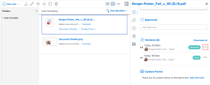

# 증명 버전 다운로드

단일 버전 또는 모든 버전의 증명을 다운로드할 수 있습니다.

## 액세스 요구 사항

이 문서의 절차를 수행하려면 다음 액세스 권한이 있어야 합니다.

<table style="table-layout:auto"> 
 <col> 
 <col> 
 <tbody> 
  <tr> 
   <td role="rowheader">Adobe Workfront 플랜*</td> 
   <td> 
현재 계획: Pro 이상
 
또는
 
기존 계획: Select 또는 Premium
 
다양한 계획에 따른 언어 교정에 대한 자세한 내용은 <a href="/help/quicksilver/administration-and-setup/manage-workfront/configure-proofing/access-to-proofing-functionality.md" class="MCXref xref">Workfront에서 언어 교정 기능에 액세스</a>.
 </td> 
  </tr> 
  <tr> 
   <td role="rowheader">Adobe Workfront 라이선스*</td> 
   <td> 
현재 계획: 작업 또는 계획
 
기존 계획: 모두(사용자가 교정을 사용하도록 설정되어 있어야 함)
 </td> 
  </tr> 
  <tr> 
   <td role="rowheader">증명 권한 프로필 </td> 
   <td>관리자 이상</td> 
  </tr> 
  <tr> 
   <td role="rowheader">액세스 수준 구성*</td> 
   <td> 
문서 액세스 편집
 
추가 액세스 요청에 대한 자세한 내용은 <a href="../../../../workfront-basics/grant-and-request-access-to-objects/request-access.md" class="MCXref xref">개체에 대한 액세스 요청 </a>.
 </td> 
  </tr> 
 </tbody> 
</table>

&#42;보유하고 있는 계획, 역할 또는 증명 권한 프로필을 알아보려면 Workfront 또는 Workfront 증명 관리자에게 문의하십시오.

## 하나의 증명 버전 다운로드

1. 문서 목록에서 증명을 클릭합니다.
1. 요약에서 **버전**&#x200B;를 클릭하고 자세히 메뉴를 클릭합니다.  버전 오른쪽의 을 클릭한 다음 **다운로드** 표시되는 드롭다운 목록에서 을 클릭합니다.

   

## 모든 버전의 증명 다운로드

1. 문서 목록에서 증명을 클릭합니다.
1. 클릭 **문서 세부 정보**&#x200B;를 선택하고 을 선택합니다. **모든 버전** 왼쪽 패널에 표시됩니다.

1. 클릭 **모두 다운로드** 를 클릭합니다.
