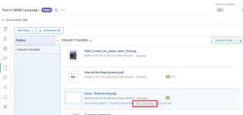

# Adobe Workfront 내에서 증명 요약 인쇄

증명 요약을 인쇄하거나, PDF으로 저장하거나, Adobe Reader에 최적화된 XLS 파일 또는 PDF 파일로 내보낼 수 있습니다.

## 액세스 요구 사항

이 문서의 절차를 수행하려면 다음 액세스 권한이 있어야 합니다.

<table style="table-layout:auto"> 
 <col> 
 <col> 
 <tbody> 
  <tr> 
   <td role="rowheader">Adobe Workfront 플랜*</td> 
   <td> 
현재 계획: Pro 이상
 
또는
 
기존 계획: Select 또는 Premium
 
다양한 계획에 따른 언어 교정에 대한 자세한 내용은 <a href="/help/quicksilver/administration-and-setup/manage-workfront/configure-proofing/access-to-proofing-functionality.md" class="MCXref xref">Workfront에서 언어 교정 기능에 액세스</a>.
 </td> 
  </tr> 
  <tr> 
   <td role="rowheader">Adobe Workfront 라이선스*</td> 
   <td> 
현재 계획: 작업 또는 계획
 
기존 계획: 모두(사용자가 교정을 사용하도록 설정되어 있어야 함)
 </td> 
  </tr> 
  <tr> 
   <td role="rowheader">증명 권한 프로필 </td> 
   <td>관리자 이상</td> 
  </tr> 
  <tr> 
   <td role="rowheader">액세스 수준 구성*</td> 
   <td> 
문서 액세스 편집
 
참고: 여전히 액세스 권한이 없는 경우 Workfront 관리자에게 액세스 수준에서 추가 제한 사항을 설정하는지 문의하십시오. Workfront 관리자가 액세스 수준을 수정하는 방법에 대한 자세한 내용은 <a href="../../../administration-and-setup/add-users/configure-and-grant-access/create-modify-access-levels.md" class="MCXref xref">사용자 정의 액세스 수준 만들기 또는 수정</a>.
 </td> 
  </tr> 
 </tbody> 
</table>

&#42;보유하고 있는 계획, 역할 또는 증명 권한 프로필을 알아보려면 Workfront 또는 Workfront 증명 관리자에게 문의하십시오.

## 증명 요약을 인쇄하거나 PDF 파일로 저장

문서 목록에서 직접 증명 요약을 인쇄할 수 있습니다.

>[!NOTE]
>
>문서 목록에서 여러 증명 요약을 동시에 인쇄할 수 없습니다.

1. 증명을 포함하는 문서 목록에서 문서가 포함된 행을 마우스로 가리킨 다음 **인쇄 요약**.

   

   또는

   교정 뷰어에서 증명을 보는 동안 **인쇄**&#x200B;아이콘  왼쪽 도구 모음에서 를 클릭합니다. (왼쪽 도구 모음이 표시되지 않으면 메뉴 아이콘을 클릭합니다  교정 뷰어 왼쪽 위 모서리에서)

1. 다음 옵션 중 하나를 사용하십시오.

   <table style="table-layout:auto"> 
    <col> 
    <col> 
    <tbody> 
     <tr> 
      <td role="rowheader">표시</td> 
      <td> 
인쇄할 내용 지정:
 
       <ul> 
        <li>다음 <strong>현재 버전</strong> 또는 <strong>모든 버전</strong> 증거</li> 
        <li>전용 <strong>주석이 있는 페이지</strong> 또는 <strong>모든 페이지</strong></li> 
        <li>전용 <strong>페이지 축소판</strong> (각 페이지의 작은 렌더링) 또는 <strong>전체 페이지</strong> (전체 증명 렌더링) </li> 
        
참고: 인쇄된 출력에서 마크업에 핀 번호를 보려면 페이지 축소판이 아니라 전체 페이지를 선택해야 합니다. 
 
       </ul> </td> 
     </tr> 
     <tr> 
      <td role="rowheader">설명 정렬 기준</td> 
      <td> 
(위의 [페이지 축소판]을 선택한 경우에만 사용 가능) 증명의 설명을 인쇄할 순서를 지정합니다.
 
       <ul> 
        <li><strong>Oldest</strong>: 첫 번째 주석에서 마지막 주석까지</li> 
        <li><strong>최신 항목</strong>: 첫 번째 주석부터</li> 
        <li><strong>페이지</strong>: 페이지별, 첫 번째 페이지에서 마지막 페이지까지 또는 마지막 페이지에서 첫 페이지까지</li> 
        <li><strong>작성자</strong>: 추가한 사용자의 이름으로, A-Z 또는 Z-A에서 가져옵니다</li> 
       </ul> 
이러한 옵션은 XLS 또는 PDF 파일로 내보내는 출력에는 영향을 주지 않습니다.
 </td> 
     </tr> 
     <tr> 
      <td role="rowheader">설명 필터링 기준</td> 
      <td> 
이러한 옵션을 조합하여 인쇄하거나 XLS 또는 PDF 파일로 내보내는 출력에 특정 주석만 포함할 수 있습니다.
 
       <ul> 
        <li>선택한 작성자(기본값)</li> 
        <li>선택한 작업</li> 
        <li><strong>확인되지 않음</strong> 상태</li> 
       </ul> </td> 
     </tr> 
     <tr> 
      <td role="rowheader">워크플로</td> 
      <td> 
(증명에 자동화된 워크플로우가 있는 경우에만 사용 가능) <strong>다이어그램 표시</strong> 각 단계에서 수행된 증명과 결정을 보여주는 단계를 표시하는 인쇄 출력에 다이어그램을 포함시킵니다. 표시되는 다이어그램에서 색상은 스테이지에서 수행된 결정을 나타냅니다.
 
<strong>녹색</strong>: 승인됨
 
<strong>파란색</strong>: 결정 보류 중
 
<strong>빨간색</strong>: 필요한 결정 변경
 
<strong>회색</strong>: 아직 시작되지 않음
 
<strong>노란색</strong>: 변경 사항이 있는 승인됨
 </td> 
     </tr> 
    </tbody> 
   </table>

1. 클릭 **인쇄**.
1. 표시되는 창의 오른쪽 패널에서 요약을 인쇄하려면 **대상** 메뉴를 클릭한 다음 **자세히 보기**. 나타나는 목록에서 사용할 프린터를 클릭한 다음 **인쇄**.

   또는

   요약을 PDF 파일로 저장하려면 **대상** 메뉴 아래의 **다른 이름으로 저장 PDF**&#x200B;를 클릭한 다음 **저장**.

## 증명 요약을 XLS 또는 PDF으로 내보냅니다.

정적 콘텐츠의 증명 요약을 XLS 파일 또는 PDF 파일로 내보낼 수 있습니다. 증명 내보내기에는 증명의 콘텐츠만 포함됩니다.

1. 증명을 포함하는 문서 목록에서 문서가 포함된 행을 마우스로 가리킨 다음 **인쇄 요약**.

   

1. 페이지의 오른쪽 위 모서리 근처에 있는 XLS 아이콘 또는 PDF 아이콘을 클릭합니다.

   

내보낸 파일이 준비되면 파일을 다운로드할 수 있는 이메일을 받게 됩니다.

요약을 PDF 파일로 내보내면 증명의 주석이 PDF 판독기에 표시됩니다. 주석에 연결된 마크업이 여러 개 있는 경우 주석이 주석 목록에 여러 번 나타납니다(각 마크업에 대해 한 번).
