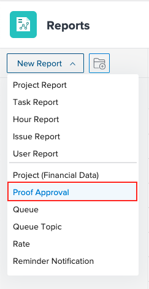

# 증명 승인 보고서 사용

증명 승인 보고서를 사용하여 환경에서 증명에 대한 정보를 볼 수 있습니다.

## 액세스 요구 사항

다음 항목이 있어야 합니다.

<table style="table-layout:auto"> 
 <col> 
 <col> 
 <tbody> 
  <tr> 
   <td role="rowheader"> 
Workfront 플랜*
 </td> 
   <td>모든</td> 
  </tr> 
  <tr> 
   <td role="rowheader"> 
Adobe Workfront 라이선스 개요*
 </td> 
   <td> 
플랜
 </td> 
  </tr> 
  <tr data-mc-conditions=""> 
   <td role="rowheader"><strong>액세스 수준*</strong> </td> 
   <td> 
액세스 권한 편집:
 
    <ul> 
     <li> 
보고서, 대시보드 및 달력 만들기
 </li> 
     <li> 
필터, 보기 및 그룹화 만들기
 </li> 
    </ul> 
참고: 여전히 액세스 권한이 없는 경우 Workfront 관리자에게 액세스 수준에서 추가 제한 사항을 설정하는지 문의하십시오. Workfront 관리자가 액세스 수준을 변경하는 방법에 대한 자세한 내용은 <a href="../../../administration-and-setup/add-users/configure-and-grant-access/create-modify-access-levels.md" class="MCXref xref">사용자 정의 액세스 수준 만들기 또는 수정</a>.
 </td> 
  </tr> 
 </tbody> 
</table>

&#42;어떤 계획, 라이선스 유형 또는 액세스 권한을 보유하고 있는지 알아보려면 Workfront 관리자에게 문의하십시오.

## 증명 승인 보고서 사용

1. 을(를) 클릭합니다. **기본 메뉴** 아이콘  Adobe Workfront의 오른쪽 위 모서리에서 을(를) 클릭하고 **보고서**.
1. 클릭 **새 보고서**&#x200B;을(를) 선택하고 스크롤하여 선택합니다. **증명 승인**.

   

1. (선택 사항) 필드를 더 추가합니다.
1. 클릭 **저장 + 닫기**.

## 추가 필드

증명 승인 보고서에 다음 필드를 추가할 수 있습니다.

* **결정 날짜**: 승인자가 증명에 대해 결정을 내리는 날짜를 표시합니다. 증명의 인쇄 요약에서 이 날짜를 찾을 수도 있습니다.
* **승인자 단계**: 현재 단계 정보를 표시합니다.
* **워크플로우 템플릿**: 증명에 첨부된 모든 워크플로우 템플릿을 표시합니다. 첨부된 템플릿이 없으면 열이 비어 있습니다.
* **결정 대기**: 다음 내용이 true일 때 최신 버전에서 의사 결정이 충족되지 않았음을 알리는 true를 표시합니다.

   * 증명을 보관하지 않았습니다.
   * 승인자가 있는 단계가 활성 상태입니다
   * 증명을 승인 보류 중입니다.

* **증명 최종 기한**: 증명의 기한을 표시합니다. 이 필드를 채우려면 모든 단계에는 기한이 지정되어 있어야 합니다. 필드는 가장 최근에 활성화된 단계의 마감일을 표시합니다.

 
