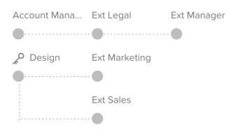
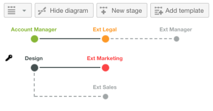

# 자동화된 워크플로우 개요

<!-- Audited: 01/2024 -->

자동화된 워크플로를 사용하면 일련의 순차적 또는 병렬 검토 단계를 만들고, 이러한 단계 간의 종속성을 설정하고, 특정 사용자에 대한 가시성을 제한할 수 있습니다. 검토 프로세스에 상호 종속적인 단계가 있는 경우 자동 워크플로우는 해당 단계를 통해 증명을 자동으로 이동하여 그 과정에서 관련 검토자와 승인자에게 알립니다. 자동화된 워크플로우 설정에 대한 자세한 내용은 다음을 참조하십시오. [자동화된 워크플로를 사용하여 고급 증명 만들기](../../../review-and-approve-work/proofing/creating-proofs-within-workfront/create-automated-proof-workflow.md).

**예:**  자동화된 워크플로는 다음과 같은 복잡한 증명 검토 프로세스를 관리하는 데 도움이 됩니다.

* 다른 그룹 또는 검토자가 특정 순서로 콘텐츠를 검토해야 하는 경우
* 콘텐츠를 검토할 때 사용자의 활동 사이에 종속성이 있는 경우
* 동일한 사용자 그룹이 콘텐츠를 정기적으로 검토하는 경우
* 검토자가 컨텐츠를 보는 기간을 제어하려는 경우
* 일부 검토 활동을 비공개로 유지하려는 경우

## 단계

각 자동 워크플로 단계에 대해 단계 기한, 단계 잠금, 단계의 의사 결정자로 설정된 검토자, 특정 사용자만 단계의 검토자 주석을 볼 수 있는 개인 정보 설정 등의 설정을 구성할 수 있습니다.

단계는 수동으로, 증명 생성 시, 기한 도달 시, 특정 날짜 및 시간에 활성화하거나 상위 단계에서 결정된 경우에 활성화할 수 있습니다.

다음 단계가 시작되거나 스테이지에서 모든 결정이 이루어질 때 뿐만 아니라 스테이지를 수동으로 잠글 수 있습니다. 스테이지를 잠글 수도 없습니다.

단계에 대한 주요 의사 결정자를 지정할 수 있습니다. 이 사람의 결정은 무대를 위한 다른 모든 결정을 불필요하게 만든다.

마찬가지로 단계에 대해 하나의 결정만 요구하도록 선택할 수 있습니다. 이 작업을 수행하면 수신자 중 한 명이 단계에 대한 결정을 내린 후 단계에 대한 검토 프로세스가 완료됨으로 표시됩니다.

검토 프로세스가 시작될 때 모든 검토자에게 콘텐츠 검토 초대를 통지하거나 단계가 활성화될 때만 각 검토자에게 통지하도록 할 수 있습니다.

## 비공개 단계

기본적으로 모든 단계에서 검토자가 남긴 댓글은 콘텐츠를 검토하고 검토 프로세스에 대한 이메일 알림 및 댓글 요약을 받는 모든 사용자에게 표시됩니다.

특정 검토자 그룹이 다른 검토자의 주석을 보지 못하도록 하려면 비공개 단계를 만들 수 있습니다.

비공개 단계는 해당 단계에 추가된 검토자에게만 표시됩니다. 또한 조직의 Adobe Workfront 계정에서 만든 모든 항목에 대한 증명 편집 권한 또는 편집 권한이 있는 사용자(감독자 이상 또는 다른 사람의 정보 편집이 활성화된 사용자 정의 프로필이 있는 사용자)에게도 표시됩니다.

비공개 단계 참가자가 추가한 댓글은 보기 권한이 없는 사람이 요청한 이메일 알림 및 증명 댓글 요약에 포함되지 않습니다.

## 워크플로 다이어그램

워크플로 다이어그램은 증명의 검토 프로세스를 시각적으로 표현한 것입니다. 증명 정보를 만들거나 볼 때 단계 순서 및 단계 간의 종속성이 표시됩니다. 모든 비공개 스테이지는 키 기호와 함께 표시됩니다.

라이브 증명에서 단계 종속성은 비활성 단계의 경우 파선 회색 선으로 표시되고 활성 단계의 경우 단색 검정선으로 표시됩니다. 단계가 지정된 기한 내에 승인 프로세스가 완료되면 녹색으로 표시됩니다. 기한에 근접한 단계는 주황색으로 표시되고 기한을 지난 단계는 빨간색으로 표시됩니다.

## 자동화된 워크플로 템플릿

조직에서 여러 증명에 대해 동일한 검토 프로세스를 사용하는 경우 Workfront 관리자가 자동화된 워크플로 템플릿을 만들어 증명을 훨씬 쉽게 만들 수 있습니다. 증명을 구성하는 동안 자동 워크플로 템플릿을 선택하여 해당 템플릿의 단계 및 검토자를 증명에 추가할 수 있습니다. 증명을 만들기 전후에 필요에 따라 증명에 적용된 템플릿을 수정할 수 있습니다.

Workfront 관리자는 회사의 필요에 따라 템플릿을 무제한으로 만들 수 있습니다.

템플릿 만들기, 사용 및 관리에 대한 자세한 내용은 Workfront 관리자에게 문의하십시오.
