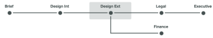

# 자동화된 워크플로우 단계 개요

증명 단계는 서로 다른 사용자가 증명을 검토하는 시간 세그먼트입니다. 증명이 한 단계에서 다음 단계로 이동함에 따라 Adobe Workfront은 검토자에게 작업을 수행할 시간이 되면 알려 달라고 알립니다.

단계는 다음 두 가지 상황에서 발생합니다.

* [자동화된 워크플로로 증명 만들기](#create-a-proof-with-an-automated-workflow)
* [증명에서 다른 검토자에 대한 기한 할당](#assign-deadlines-for-different-reviewers-on-a-proof)

## 자동화된 워크플로로 증명 만들기 {#create-a-proof-with-an-automated-workflow}

증명에 자동화된 워크플로를 추가하면 수행하려는 검토 작업의 단계를 설정합니다.

자동 워크플로를 사용하여 증명에 대한 단계를 설정하는 경우:

* 단계를 연속으로 또는 동시에 실행하도록 구성할 수 있습니다.
* 이전 단계가 완료된 후에만 일부 단계가 활성화되도록 구성할 수 있습니다.
* 일부 단계를 비공개로 만들 수 있습니다. 이 기능은 예를 들어, 클라이언트와 공유되기 전에 증명을 검토하고 결과 주석을 클라이언트가 볼 수 없도록 하는 기관에 유용합니다.

자동화된 워크플로를 사용하여 증명 단계를 만드는 방법에 대한 지침은 [자동화된 워크플로를 사용하여 고급 증명 만들기](../../../review-and-approve-work/proofing/creating-proofs-within-workfront/create-automated-proof-workflow.md)를 참조하십시오.

>[!NOTE]
>
>사용자가 단계에 포함되어 있지 않지만 문서에 액세스할 수 있고 증명을 열 경우 *Workfront* 단계가 만들어집니다.
>
>증명을 연 사용자에게는 문서 증명을 여는 수신자가 아닌 사용자용 설정 > 검토 및 승인 > 역할에 지정된 역할이 할당됩니다.

## 증명에서 다른 검토자에 대한 기한 할당 {#assign-deadlines-for-different-reviewers-on-a-proof}

증명에서 검토자에게 서로 다른 증명 기한을 할당하면 각 기한에 대한 단계가 만들어지고 해당 단계의 각 기한에 대해 검토자가 그룹화됩니다. 

**예:** 예를 들어 검토자가 4명인 증명을 만드는 경우:

* Olivia와 Tony 검토자의 경우 지금부터 며칠 후 14:00에 마감일을 지정합니다.
* Aaron과 Amy의 경우 며칠 후 17:00으로 기한을 지정하십시오.
* 마감일은 지정하지 않습니다.

시스템은 다음 세 개의 검토자 &quot;그룹&quot; 각각에 대한 단계를 생성합니다.

다른 검토자와 증명을 공유하고 기한을 지정하지 않으면 Workfront이 기한이 없는 3단계에 사용자를 추가합니다. 
