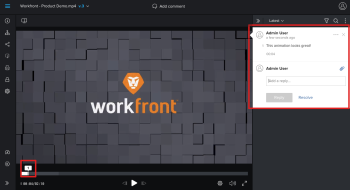

# 증명 댓글 보기 및 회신

다른 검토자가 작성한 증명 주석을 보고 회신할 수 있습니다.

## 액세스 요구 사항

+++ 을 확장하여 이 문서의 기능에 대한 액세스 요구 사항을 봅니다.

이 문서의 단계를 수행하려면 다음 액세스 권한이 있어야 합니다.

<table style="table-layout:auto"> 
 <col> 
 <col> 
 <tbody> 
  <tr> 
   <td role="rowheader">Adobe Workfront 플랜*</td> 
   <td> 
현재 플랜: Pro 이상
 
또는
 
기존 플랜: Select 또는 Premium
 
다른 플랜의 증명 액세스에 대한 자세한 내용은 <a href="/help/quicksilver/administration-and-setup/manage-workfront/configure-proofing/access-to-proofing-functionality.md" class="MCXref xref">Workfront의 증명 기능에 액세스</a>를 참조하십시오.
 </td> 
  </tr> 
  <tr> 
   <td role="rowheader">Adobe Workfront 라이센스*</td> 
   <td> 
현재 계획: 작업 또는 계획
 
기존 계획: 모두(사용자에 대해 증명이 활성화되어 있어야 함)
 </td> 
  </tr> 
  <tr> 
   <td role="rowheader">교정쇄 권한 프로필 </td> 
   <td>관리자 이상</td> 
  </tr> 
  <tr> 
   <td role="rowheader">액세스 수준 구성*</td> 
   <td> 
문서에 대한 액세스 편집
 
추가 액세스 요청에 대한 자세한 내용은 <a href="../../../../workfront-basics/grant-and-request-access-to-objects/request-access.md" class="MCXref xref">개체 </a>에 대한 액세스 요청 을 참조하십시오.
 </td> 
  </tr> 
 </tbody> 
</table>

&#42;보유 중인 플랜, 역할 또는 증명 권한 프로필을 확인하려면 Workfront 또는 Workfront Proof 관리자에게 문의하십시오.

+++

## 증명 뷰어에서 주석 보기

각 주석에는 다음 정보가 표시됩니다.

* 댓글을 작성한 사용자의 이름
* 주석이 작성된 페이지 번호(페이지가 두 개 이상 포함된 정적 증명)
* 댓글이 작성된 푸티지의 프레임 번호 또는 범위(비디오 증명)

  보고 있는 주석이 비디오 푸티지 범위에 적용된 경우 [재생] 단추를 클릭하여 범위를 검토할 수 있습니다.

* 댓글에 포함된 텍스트
* 댓글에 업로드된 모든 첨부 파일

증명 뷰어에서 주석을 보려면 다음 작업을 수행하십시오.

1. 문서가 포함된 프로젝트, 작업 또는 문제로 이동한 다음 **문서**&#x200B;을(를) 선택합니다.
1. 필요한 증명을 찾은 다음 **증명 열기**&#x200B;를 클릭합니다.

1. (조건부) 댓글 영역이 열려 있지 않으면 오른쪽 상단의 **댓글 보기**&#x200B;를 클릭합니다.
1. 댓글을 클릭하면 증명의 댓글 표시를 볼 수 있습니다.
1.  또는
1.  비디오 증명에서 타임라인에서 댓글이 작성된 지점을 마우스로 가리킨 다음 표시되는 번호 매기기 풍선을 클릭합니다.
1. 

1. (선택 사항) 주석 목록의 크기를 조정하려면 가로 크기 조정을 위해 마우스 포인터가 변경될 때까지 주석 영역의 왼쪽 가장자리(현재 열려 있는 주석이 아님)를 마우스로 가리킨 다음 원하는 방향으로 가장자리를 끕니다.
1. 

## 업데이트 탭에서 증명 주석 보기

Workfront에서는 증명 뷰어를 시작하지 않고도 증명 주석을 볼 수 있습니다.

1. 문서가 포함된 프로젝트, 작업 또는 문제로 이동한 다음 **문서**&#x200B;을(를) 선택합니다.
1. 문서가 포함된 행을 클릭한 다음 페이지 오른쪽의 **요약** 아이콘 을(를) 클릭합니다.\
   문서 요약의 업데이트 섹션에 설명이 표시됩니다.

## 모든 주석을 읽은 상태로 표시

증명의 검토자는 모든 댓글을 읽음으로 빠르게 표시할 수 있습니다.

1. 문서가 포함된 프로젝트, 작업 또는 문제로 이동한 다음 **문서**&#x200B;을(를) 선택합니다.
1. 필요한 증명을 찾은 다음 **증명 열기**&#x200B;를 클릭합니다.

1. (조건부) 댓글 영역이 열려 있지 않으면 오른쪽 상단의 **댓글 보기**&#x200B;를 클릭합니다.

1. 댓글 목록 위에서 **자세히** 아이콘을 클릭한 다음 **모두 읽음으로 표시**&#x200B;를 클릭합니다.

1. 

## 증명 뷰어의 증명 댓글에 회신

1. 문서가 포함된 프로젝트, 작업 또는 문제로 이동한 다음 **문서**&#x200B;을(를) 선택합니다.
1. 필요한 증명을 찾은 다음 **증명 열기**&#x200B;를 클릭합니다.

1. (조건부) 댓글 영역이 열려 있지 않으면 오른쪽 상단의 **댓글 보기**&#x200B;를 클릭합니다.
1. 댓글을 클릭하면 증명의 댓글 표시를 볼 수 있습니다.

   >[!TIP]
   >
   >화면 오른쪽 가장자리에 있는 **이전 댓글** 및 **다음 댓글** 단추를 사용하여 댓글을 앞뒤로 이동할 수 있습니다.

1. **답글 추가** 상자에 답글을 입력하세요.
1. (선택 사항) 다른 검토자에게 회신에 대해 알리려면 댓글 상자에 @을 입력한 다음 사용자 이름 또는 이메일 주소를 입력합니다. 자세한 내용은 [증명을 공유할 사용자에 태그 지정](../../../../review-and-approve-work/proofing/reviewing-proofs-within-workfront/comment-on-a-proof/tag-users-to-share-proof.md)을 참조하십시오.
1. (선택 사항) 댓글에 파일을 추가하려면 다음 중 하나를 수행합니다.

   * 종이 클립 아이콘을 클릭한 다음 업로드할 파일을 찾아 선택합니다.
   * 컴퓨터의 위치에서 파일을 드래그하여 주석 영역에 놓습니다.

1. **회신**&#x200B;을 클릭합니다.
