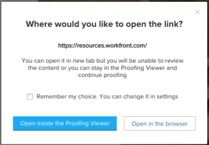

# 증명 뷰어 설정 구성

웹 증명 뷰어와 데스크탑 증명 뷰어 모두에 대해 다음 설정을 구성할 수 있습니다.

* 증명에 주석 마크업 및 핀이 표시되는지 여부.
* 마크업 도구가 증명 뷰어 위쪽에 표시되는지 또는 드롭다운 메뉴에 표시되는지 여부.
* 열었던 증명에서 검토자로 받은 이메일 알림입니다.

  <!--
  <li data-mc-conditions="QuicksilverOrClassic.Draft mode">Whether the Desktop Proofing Viewer is the default viewer for all types of proofs (static and video, as well as interactive).</li>
  -->

<!--

For comparative information about the Web Proofing Viewer and the Desktop Proofing Viewer, see <a href="../../../review-and-approve-work/proofing/proofing-overview/understand-differences-between-web-viewer.md" class="MCXref xref">Differences between the Web Proofing Viewer and the Desktop Proofing Viewer overview</a>.

-->

Desktop Proofing Viewer에 대해 다음 설정을 구성할 수 있습니다.

* 웹 사이트 컨텐츠 내의 링크를 뷰어에서 여는 방법입니다.

  <!--
  <li data-mc-conditions="QuicksilverOrClassic.Draft mode">Whether the background color of the Desktop Proofing Viewer is the default near-black color or white.</li>
  -->

* 새 브라우저 탭 또는 창에서 열도록 설정된 링크를 클릭하면 어떻게 됩니까?
* 팝업과 같은 콘텐츠(브라우저 캐시 데이터에 의해 차단될 수 있음)를 뷰어에 표시할 수 있도록 하려면 보고 있는 증명과 함께 저장할 수 있는 캐시 데이터를 지웁니다.

## 액세스 요구 사항

+++ 을 확장하여 이 문서의 기능에 대한 액세스 요구 사항을 봅니다.

이 문서의 단계를 수행하려면 다음 액세스 권한이 있어야 합니다.

<table style="table-layout:auto"> 
 <col> 
 <col> 
 <tbody> 
  <tr> 
   <td role="rowheader">Adobe Workfront 플랜*</td> 
   <td> 
현재 플랜: Pro 이상
 
또는
 
기존 플랜: Select 또는 Premium
 
다른 플랜의 증명 액세스에 대한 자세한 내용은 <a href="/help/quicksilver/administration-and-setup/manage-workfront/configure-proofing/access-to-proofing-functionality.md" class="MCXref xref">Workfront의 증명 기능에 액세스</a>를 참조하십시오.
 </td> 
  </tr> 
  <tr> 
   <td role="rowheader">Adobe Workfront 라이센스*</td> 
   <td> 
현재 계획: 작업 또는 계획
 
기존 계획: 모두(사용자에 대해 증명이 활성화되어 있어야 함)
 </td> 
  </tr> 
  <tr> 
   <td role="rowheader">교정쇄 권한 프로필 </td> 
   <td>관리자 이상</td> 
  </tr> 
  <tr> 
   <td role="rowheader">액세스 수준 구성*</td> 
   <td> 
문서에 대한 액세스 편집
 
추가 액세스 요청에 대한 자세한 내용은 <a href="../../../workfront-basics/grant-and-request-access-to-objects/request-access.md" class="MCXref xref">개체 </a>에 대한 액세스 요청 을 참조하십시오.
 </td> 
  </tr> 
 </tbody> 
</table>

&#42;보유 중인 플랜, 역할 또는 증명 권한 프로필을 확인하려면 Workfront 또는 Workfront Proof 관리자에게 문의하십시오.

+++

## 증명 뷰어 설정 구성

증명 뷰어 설정을 구성하려면:

1. 다음 방법 중 하나로 웹 증명 뷰어 또는 데스크탑 증명 뷰어를 엽니다.

   * Adobe Workfront 내에서 증명을 사용하는 경우 보려는 증명이 포함된 문서 목록으로 이동한 후 문서 위로 마우스를 가져간 다음 **증명 열기**&#x200B;를 클릭합니다.
   * Workfront Proof을 사용하는 경우 대시보드 또는 보기 목록에서 증명에 대한 **증명으로 이동** 아이콘을 클릭합니다.

1. 왼쪽 도구 모음이 표시되지 않으면 [웹 증명 뷰어]의 왼쪽 위 모서리에 있는 **메뉴** 아이콘을 클릭하십시오.

   

1. 왼쪽 도구 모음에서 **설정** 아이콘 을 클릭합니다.

1. 표시되는 다음 **설정**&#x200B;을 구성하십시오.

   사용 가능한 설정은 열려 있는 증명 유형에 따라 달라질 수 있습니다.

   * **마크업 표시**(항상 웹 증명 뷰어와 데스크톱 증명 뷰어에서 사용 가능): 검토자가 마크업 도구를 사용할 때 증명에 추가하는 주석 표시입니다. 비활성화해도 주석 목록에서 주석을 클릭해도 볼 수 있습니다.

     이 설정은 사용자가 여는 모든 증명에 영향을 줍니다.

   * **고정 항목 표시**(항상 웹 증명 뷰어와 데스크톱 증명 뷰어에서 사용 가능): 검토자가 마크업 도구를 사용할 때 증명에 추가하는 번호가 매겨진 고정입니다. 검토자가 주석을 추가하는 위치와 순서를 나타냅니다. 비활성화해도 주석 목록에서 주석을 클릭해도 볼 수 있습니다.

     이 설정은 사용자가 여는 모든 증명에 영향을 줍니다.

   * **확장된 태그 도구를 사용**(항상 웹 증명 뷰어와 데스크톱 증명 뷰어에서 사용 가능): 기본적으로 태그 도구 옵션이 증명 뷰어 위에 표시됩니다. 클릭하면 열리는 세로 메뉴에 표시되도록 구성할 수 있습니다.

     이 설정은 사용자가 여는 모든 증명에 적용됩니다.

   * **전자 메일 알림 보내기**(항상 웹 증명 뷰어와 데스크톱 증명 뷰어에서 사용 가능): 아래 옵션 중 하나를 클릭하십시오. 이 설정은 사용자가 연 증명에만 영향을 줍니다. 자세한 내용은 [증명 댓글과 의사 결정에 대한 알림 개요](../../../review-and-approve-work/proofing/proofing-overview/notifications-proof-comments-decisions.md)를 참조하세요.

     <table style="table-layout:auto"> 
      <col> 
      <col> 
      <tbody> 
       <tr> 
        <td role="rowheader">모든 활동</td> 
        <td>Workfront은 새 댓글, 회신 또는 결정과 같은 증명에 대한 활동이 있을 때마다 검토자에게 이메일을 보냅니다. 
활동을 볼 수 있으므로 증명 프로세스를 관리하는 사용자에게 적합한 옵션입니다. 

사용자는 자신의 활동에 대한 이메일 알림을 받지 않습니다.
</td> 
       </tr> 
       <tr> 
        <td role="rowheader">내 댓글에 대한 답글</td> 
        <td>누군가 자신의 의견에 명시적으로 답글을 달 경우에만 검토자에게 이메일이 전송됩니다(자신의 의견에 대한 자신의 답글은 제외). 즉, 증명에 있는 사람이 새 댓글을 달면 검토자에게 알림이 전송되지 않습니다.
이 설정은 증명의 클라이언트가 증명의 다른 댓글에 대한 알림을 받지 않고 자신의 댓글에 대한 답글에만 알림을 받도록 하는 데 권장됩니다.

이 이메일 경고 설정을 사용하는 검토자는 다른 새 댓글에 대해 알림을 받지 못하지만 증명 뷰어에서 증명에 대한 모든 댓글을 볼 수 있습니다.

댓글에 대한 자세한 내용은 <a href="../../../review-and-approve-work/proofing/reviewing-proofs-within-workfront/comment-on-a-proof/view-proof-comments.md" class="MCXref xref">증명 댓글 보기 및 회신</a>을 참조하세요.
</td> 
       </tr> 
       <tr> 
        <td role="rowheader">결정</td> 
        <td>Workfront은 누군가 결정을 내릴 때만 검토자에게 이메일을 보냅니다.
이 기능은 승인 프로세스를 관리하는 사람(예: 프로젝트 관리자)에게 유용할 수 있으며, 증명 진행 상황을 모니터링하고 어떤 사용자가 결정을 내렸는지 확인해야 합니다.

결정을 제출할 때 이메일 확인 옵션을 선택하지 않으면 자신의 결정에 대한 알림이 전송되지 않습니다.
</td> 
       </tr> 
       <tr> 
        <td role="rowheader">최종 결정</td> 
        <td>Workfront은 증명의 마지막 승인자가 결정을 내리면 이메일을 보냅니다.
이 경고는 설계자가 사용하는 경우가 많으며, 일반적으로 실제 검토 토론에 참여하지 않아도 됩니다. 최종 결정이 내려지면 디자이너는 알림을 받은 다음 필요한 변경 작업을 수행할 수 있습니다.

이 경고는 검토 프로세스가 완료되어야 알림을 받아야 하는 부서 리더에게도 유용할 수 있습니다.
</td> 
       </tr> 
       <tr> 
        <td role="rowheader">시간별 요약</td> 
        <td>Workfront은 매 시간마다 해당 시간에 발생한 모든 댓글, 답글 및 의사 결정에 대한 요약이 포함된 이메일을 검토자에게 보냅니다.
지난 1시간 내에 자신의 활동 이외의 활동이 발생한 경우에만 이메일이 전송됩니다. 

이 경고는 프로젝트의 개요를 볼 수 있는 좋은 방법입니다.

이 요약의 사용 사례는 프로젝트 개요가 필요하지만 증명에 대한 모든 활동을 즉시 알릴 필요가 없는 선임 검토자입니다.
</td> 
       </tr> 
       <tr> 
        <td role="rowheader">일일 요약</td> 
        <td>Workfront은 자신 이외의 활동이 있는 날에만 나열된 모든 댓글, 답글 및 결정을 포함하는 하나의 이메일을 보냅니다.
이 경고는 하루 종일 여러 업데이트가 쏟아지지 않고 프로젝트 요약을 볼 수 있는 좋은 방법입니다.

이 요약의 사용 사례는 프로젝트의 전체 진행 상황을 모니터링하려는 부서 리더입니다.

자세한 내용은 <a href="../../../review-and-approve-work/proofing/reviewing-proofs-within-workfront/manage-notifications-for-proof-comments.md" class="MCXref xref">증명 댓글 및 결정에 대한 알림 관리</a>를 참조하십시오.
</td> 
       </tr> 
       <tr data-mc-conditions=""> 
        <td role="rowheader">이메일 없음</td> 
        <td>Workfront은 이메일 경고를 전송하지 않습니다. 참조용으로만 증명에 추가되고 변경 내용에 대한 알림을 받을 필요가 없는 사용자에게 유용합니다.
시스템 기본값은 일별 요약(설정되지 않은 것으로도 표시됨)입니다. 사용자 또는 검토자가 다른 변경 내용을 적용하지 않으면 모든 증명에 이 설정이 적용됩니다.
</td> 
       </tr> 
      </tbody> 
     </table>

     <!--   
     <li data-mc-conditions="QuicksilverOrClassic.Draft mode"> 
<strong>Use desktop app as default</strong>: By default, static and video proofs open in the Web Proofing Viewer in your web browser, and interactive proofs open in the Desktop Proofing Viewer app. This setting lets you configure the Desktop Proofing Viewer as the default viewer for all types of proofs (static and video, as well as interactive). For more information about this setting, see in the article . For comparative information about the two viewers, see <a href="../../../review-and-approve-work/proofing/proofing-overview/understand-differences-between-web-viewer.md" class="MCXref xref">Differences between the Web Proofing Viewer and the Desktop Proofing Viewer overview</a>.
 </li>   
     -->

   * **증명에서 하이퍼링크를 클릭할 때**(Desktop Proof Viewer에서만 사용 가능): 새 브라우저 탭이나 창에서 열도록 설정된 링크를 클릭할 때 Desktop Proof Viewer에서 수행되는 작업을 지정하는 옵션을 선택합니다.

     이 설정은 사용자가 여는 모든 대화형 증명에 적용됩니다.

     <table style="table-layout:auto"> 
      <col> 
      <col> 
      <tbody> 
       <tr> 
        <td role="rowheader">증명 뷰어 내에서 열기</td> 
        <td>링크는 항상 Desktop Proofing Viewer 내에서 열리므로 연결된 콘텐츠를 증명할 수 있습니다. </td> 
       </tr> 
       <tr> 
        <td role="rowheader">브라우저에서 열기</td> 
        <td>링크는 항상 증명 뷰어가 아닌 브라우저 내에서 열립니다. 연결된 콘텐츠를 증명할 수 없습니다.</td> 
       </tr> 
       <tr> 
        <td role="rowheader">항상 묻기</td> 
        <td> 
Desktop Proofing Viewer 또는 브라우저에서 링크를 열 것인지 여부를 묻는 메시지가 표시됩니다. Desktop Proofing Viewer 내에서 링크를 열면 연결된 콘텐츠를 증명 할 수 있습니다. 브라우저에서 링크를 열면 링크된 콘텐츠를 확인할 수 없습니다.
 
  
 
이 설정은 사용자가 연 증명에만 영향을 줍니다.
 </td> 
       </tr> 
      </tbody> 
     </table>

     <!--   
     <li data-mc-conditions="QuicksilverOrClassic.Draft mode"><strong>Background color</strong> (available when you open interactive content in the Desktop Proofing Viewer or Web Proofing Viewer): Change the background color of the Desktop Proofing Viewer from the default near-black color to white. This can make it easier to see interactive content that has a transparent background instead of a white background.</li>   
     -->

   * **캐시 지우기**: 보고 있는 대화형 증명과 함께 저장될 수 있는 브라우저 캐시 데이터를 지웁니다. 이렇게 하면 팝업(브라우저 캐시 데이터로 차단할 수 있음)과 같은 콘텐츠가 Desktop Proofing Viewer에 표시됩니다.

     지워진 데이터에는 HTTP 캐시(예: 다음 페이지 새로 고침 후 재사용할 이미지)와 웹 스토리지 데이터 캐시(예: 쿠키 및 사용자를 식별하는 데이터)가 포함됩니다.

     이 설정은 사용자가 연 증명에만 영향을 줍니다.
