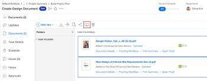

# 증명 비교

증명 뷰어를 사용하여 두 개의 서로 다른 증명 또는 동일한 증명의 두 버전을 비교할 수 있습니다.

## 액세스 요구 사항

+++ 을 확장하여 이 문서의 기능에 대한 액세스 요구 사항을 봅니다.

이 문서의 단계를 수행하려면 다음 액세스 권한이 있어야 합니다.

<table style="table-layout:auto"> 
 <col> 
 <col> 
 <tbody> 
  <tr> 
   <td role="rowheader">Adobe Workfront 플랜*</td> 
   <td> 
현재 플랜: Pro 이상
 
또는
 
기존 플랜: Select 또는 Premium
 
다른 플랜의 증명 액세스에 대한 자세한 내용은 <a href="/help/quicksilver/administration-and-setup/manage-workfront/configure-proofing/access-to-proofing-functionality.md" class="MCXref xref">Workfront의 증명 기능에 액세스</a>를 참조하십시오.
 </td> 
  </tr> 
  <tr> 
   <td role="rowheader">Adobe Workfront 라이센스*</td> 
   <td> 
현재 계획: 검토
 
레거시 플랜: 검토
 </td> 
  </tr> 
  <tr> 
   <td role="rowheader">교정쇄 권한 프로필 </td> 
   <td>관리자 이상</td> 
  </tr> 
  <tr> 
   <td role="rowheader">액세스 수준 구성*</td> 
   <td> 
문서에 대한 액세스 편집
 
추가 액세스 요청에 대한 자세한 내용은 <a href="../../../../workfront-basics/grant-and-request-access-to-objects/request-access.md" class="MCXref xref">개체 </a>에 대한 액세스 요청 을 참조하십시오.
 </td> 
  </tr> 
 </tbody> 
</table>

&#42;보유 중인 플랜, 역할 또는 증명 권한 프로필을 확인하려면 Workfront 또는 Workfront Proof 관리자에게 문의하십시오.

+++

## 서로 다른 두 증명 비교

프로젝트, 작업, 문제, 포트폴리오의 문서 탭이나 기본 문서 영역 내처럼 단일 문서 목록 내에서 두 증명을 비교할 수 있습니다.

1. 비교할 두 개의 증명 문서가 포함된 문서 목록으로 이동합니다.
1. 비교할 첫 번째 문서를 선택한 다음 Command 키(Mac) 또는 Ctrl 키(Windows)를 누른 채 비교할 두 번째 문서를 선택합니다.

   >[!NOTE]
   >
   >비교를 위해 선택하는 각 문서에 대해 이미 증명을 생성해야 합니다.

1. **증명 비교**&#x200B;를 클릭합니다.

   <!--
   
If this button is not visible, ensure that two proofed documents are selected.

   -->

   

   두 증명이 모두 증명 뷰어에 나란히 표시됩니다. 각 문서를 비교하면서 검토할 수 있습니다.

   각 증명 위에 별도의 이동 경로를 사용하여 증명과 연관된 작업 항목을 보고 이동할 수 있습니다.

   

   두 증명을 비교하는 데 사용할 수 있는 도구에 대한 자세한 내용은  [증명 뷰어에서 증명 비교](../../../../workfront-proof/wp-work-proofsfiles/review-proofs-wpv/compare-proofs.md)에서 [비교 도구를 사용](../../../../workfront-proof/wp-work-proofsfiles/review-proofs-wpv/compare-proofs.md#using-compare-tools)합니다.

## 동일한 증명의 두 버전 비교

동일한 증명의 두 버전을 비교하는 방법에 대한 자세한 내용은 [증명 뷰어에서 증명 비교](../../../../workfront-proof/wp-work-proofsfiles/review-proofs-wpv/compare-proofs.md)의 [증명 버전 비교](../../../../workfront-proof/wp-work-proofsfiles/review-proofs-wpv/compare-proofs.md#comparing-proof-versions)를 참조하십시오.
