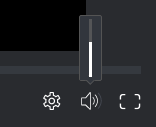

# 비디오 증명에서 재생 제어

## 액세스 요구 사항

이 문서의 단계를 수행하려면 다음 액세스 권한이 있어야 합니다.

<table style="table-layout:auto"> 
 <col> 
 <col> 
 <tbody> 
  <tr> 
   <td role="rowheader">Adobe Workfront 플랜*</td> 
   <td> 
현재 플랜: Pro 이상
 
또는
 
기존 플랜: Select 또는 Premium
 
다른 플랜의 증명 액세스에 대한 자세한 내용은 <a href="/help/quicksilver/administration-and-setup/manage-workfront/configure-proofing/access-to-proofing-functionality.md" class="MCXref xref">Workfront의 증명 기능에 액세스</a>.
 </td> 
  </tr> 
  <tr> 
   <td role="rowheader">Adobe Workfront 라이센스*</td> 
   <td> 
현재 계획: 작업 또는 계획
 
기존 계획: 모두(사용자에 대해 증명이 활성화되어 있어야 함)
 </td> 
  </tr> 
  <tr> 
   <td role="rowheader">증명 권한 프로필 </td> 
   <td>관리자 이상</td> 
  </tr> 
  <tr> 
   <td role="rowheader">액세스 수준 구성*</td> 
   <td> 
문서에 대한 액세스 편집
 
추가 액세스 요청에 대한 자세한 내용은 <a href="../../../../workfront-basics/grant-and-request-access-to-objects/request-access.md" class="MCXref xref">오브젝트에 대한 액세스 요청 </a>.
 </td> 
  </tr> 
 </tbody> 
</table>

&#42;보유 중인 플랜, 역할 또는 증명 권한 프로필을 알아보려면 Workfront 또는 Workfront Proof 관리자에게 문의하십시오.

## 비디오 재생 속도 조정

비디오 증명의 재생 속도를 조정할 수 있습니다. 비디오를 1/4 속도 또는 2배 속도로 보도록 선택할 수 있습니다.

1. 문서가 포함된 프로젝트, 작업 또는 문제로 이동한 다음 선택 **문서**.
1. 필요한 증명을 찾은 다음 를 클릭합니다. **증명 열기**.

1. 증명 뷰어의 오른쪽 아래 모서리에서 **설정** 아이콘.

   

1. 현재 속도를 클릭한 다음 새 재생 속도를 선택합니다.
1. 다음을 클릭합니다. **재생** 비디오의 단추를 클릭하여 새 속도를 테스트합니다.

## 프레임별 비디오 보기

비디오 증명을 보다 자세히 살펴보려면 비디오 프레임별로 비디오를 수동으로 검토할 수 있습니다.

1. 문서가 포함된 프로젝트, 작업 또는 문제로 이동한 다음 선택 **문서**.
1. 필요한 증명을 찾은 다음 를 클릭합니다. **증명 열기**.

1. 증명 뷰어 하단에서 **앞으로** 및 **뒤로** 화살표를 사용하여 프레임별로 비디오를 검토합니다.

   

## 재생 볼륨 변경

비디오 재생에서 볼륨을 제어할 수 있습니다.

1. 문서가 포함된 프로젝트, 작업 또는 문제로 이동한 다음 선택 **문서**.
1. 필요한 증명을 찾은 다음 를 클릭합니다. **증명 열기**.

1. 증명 뷰어의 오른쪽 아래 모서리에서 **볼륨** 아이콘을 클릭한 다음 슬라이더를 드래그하여 새 볼륨을 선택합니다.

   

   또는

   다음을 클릭합니다. **볼륨** 볼륨 음소거 및 음소거 해제 아이콘
