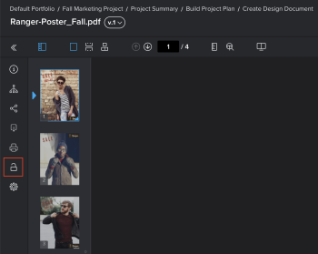

# 증명 잠금 또는 잠금 해제

검토 프로세스에서 언제든지 증명을 수동으로 잠그고 잠금 해제할 수 있습니다.

## 액세스 요구 사항

이 문서의 절차를 수행하려면 다음 액세스 권한이 있어야 합니다.

<table style="table-layout:auto"> 
 <col> 
 <col> 
 <tbody> 
  <tr> 
   <td role="rowheader">Adobe Workfront 플랜*</td> 
   <td> 
현재 계획: Pro 이상
 
또는
 
기존 계획: Premium
 
다양한 계획에 따른 언어 교정에 대한 자세한 내용은 <a href="/help/quicksilver/administration-and-setup/manage-workfront/configure-proofing/access-to-proofing-functionality.md" class="MCXref xref">Workfront에서 언어 교정 기능에 액세스</a>.
 </td> 
  </tr> 
  <tr> 
   <td role="rowheader">Adobe Workfront 라이선스*</td> 
   <td> 
현재 계획: 작업 또는 계획
 
기존 계획: 모두(사용자가 교정을 사용하도록 설정되어 있어야 함)
 </td> 
  </tr> 
  <tr> 
   <td role="rowheader">증명 역할</td> 
   <td>소유자, 작성자, 중재자</td> 
  </tr> 
  <tr> 
   <td role="rowheader">증명 권한 프로필 </td> 
   <td>감독자 또는 관리자</td> 
  </tr> 
 </tbody> 
</table>

&#42;보유하고 있는 계획, 역할 또는 증명 권한 프로필을 알아보려면 Workfront 또는 Workfront 증명 관리자에게 문의하십시오.

## 증명 잠금

증명을 수동으로 잠그면 검토자가 댓글을 달 수 없도록 하거나 허용할 수 있습니다. 이는 증명 스테이지를 잠그는 것과는 다릅니다.

증명을 잠그려면

1. 열려는 증명을 포함하는 문서 목록으로 이동합니다.
1. 문서 위로 마우스를 가져간 다음 **공개 증명** 링크가 표시됩니다.

   또는

   이전 버전의 문서에 대한 증명을 열려면 자세히 아이콘을 클릭합니다  요약에 있는 해당 버전의 경우 **공개 증명**.

   요약에 대한 자세한 내용은 [문서 개요 요약](../../../../documents/managing-documents/summary-for-documents.md).

1. 왼쪽 패널에서 **잠금** 아이콘 .

   

## 증명 잠금 해제

증명 잠금을 해제하는 것은 검토자가 이전 버전의 증명에 주석을 추가해야 할 때 유용합니다. 이전 버전은 증명 소유자가 수동으로 잠금을 해제할 때까지 항상 잠깁니다. 검토자가 이전 버전에 주석을 추가했으면 다시 잠글 수 있습니다. 이전 버전의 증명 보기에 대한 자세한 내용은 [Web Proofing Viewer에서 이전 증명 버전 보기](../../../../workfront-proof/wp-work-proofsfiles/review-proofs-wpv/view-previous-proof-versions.md).

증명을 잠금 해제하려면 다음을 수행하십시오.

1. 문서 위로 마우스를 가져간 다음 **공개 증명** 링크가 표시됩니다.

   또는

   이전 버전의 문서에 대한 증명을 열려면 자세히 아이콘을 클릭합니다  요약에 있는 해당 버전의 경우 **공개 증명**.

   요약에 대한 자세한 내용은 [문서 개요 요약](../../../../documents/managing-documents/summary-for-documents.md).

1. 왼쪽 패널에서 **잠금 해제** 아이콘 를 클릭한 다음 **예, 잠금 해제**.

   
