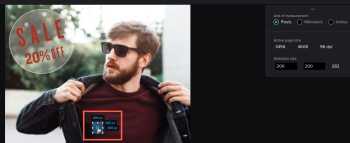

# 증명 내 영역 측정

증명 내에서 영역을 측정할 수 있습니다.

## 액세스 요구 사항

+++ 을 확장하여 이 문서의 기능에 대한 액세스 요구 사항을 봅니다.

이 문서의 단계를 수행하려면 다음 액세스 권한이 있어야 합니다.

<table style="table-layout:auto"> 
 <col> 
 <col> 
 <tbody> 
  <tr> 
   <td role="rowheader">Adobe Workfront 플랜*</td> 
   <td> 
현재 플랜: Pro 이상
 
또는
 
기존 플랜: Select 또는 Premium
 
다른 플랜의 증명 액세스에 대한 자세한 내용은 <a href="/help/quicksilver/administration-and-setup/manage-workfront/configure-proofing/access-to-proofing-functionality.md" class="MCXref xref">Workfront의 증명 기능에 액세스</a>를 참조하십시오.
 </td> 
  </tr> 
  <tr> 
   <td role="rowheader">Adobe Workfront 라이센스*</td> 
   <td> 
현재 계획: 작업 또는 계획
 
기존 계획: 모두(사용자에 대해 증명이 활성화되어 있어야 함)
 </td> 
  </tr> 
  <tr> 
   <td role="rowheader">교정쇄 권한 프로필 </td> 
   <td>관리자 이상</td> 
  </tr> 
  <tr> 
   <td role="rowheader">액세스 수준 구성*</td> 
   <td> 
문서에 대한 액세스 편집
 
추가 액세스 요청에 대한 자세한 내용은 <a href="../../../../workfront-basics/grant-and-request-access-to-objects/request-access.md" class="MCXref xref">개체 </a>에 대한 액세스 요청 을 참조하십시오.
 </td> 
  </tr> 
 </tbody> 
</table>

&#42;보유 중인 플랜, 역할 또는 증명 권한 프로필을 확인하려면 Workfront 또는 Workfront Proof 관리자에게 문의하십시오.

+++

## 증명 내 영역 측정

1. 문서가 포함된 프로젝트, 작업 또는 문제로 이동한 다음 **문서**&#x200B;을(를) 선택합니다.
1. 필요한 증명을 찾은 다음 **증명 열기**&#x200B;를 클릭합니다.

1. 증명 뷰어 상단에 있는 **영역 측정** 아이콘을 클릭합니다.

   

1. (선택 사항) **측정 마크업 색상**&#x200B;을 클릭하여 색상 옵션을 확장한 다음, 색상 및 증명에서 쉽게 볼 수 있는 **불투명도**&#x200B;를 클릭합니다.\
   

   기본 측정 도구 색상은 빨간색입니다.

   증명 뷰어는 브라우저 캐시를 지울 때까지 사용자가 여는 모든 증명에 대한 색상 및 불투명도 선택 사항을 기억합니다.

1. (선택 사항) 다른 **측정 단위를 선택하십시오.**

   >[!NOTE]
   >
   >측정 단위 옵션은 PDF에서 생성된 증명에만 사용할 수 있습니다.

1. 측정 창을 측정해야 하는 증명의 영역으로 드래그합니다.

   

1. 측정 창의 모서리나 가장자리를 드래그하여 크기를 조정합니다.
1. (선택 사항) 측정 영역의 크기를 정확히 조정하려면 **선택 크기** 값을 입력하십시오.
1. (선택 사항) 영역 내에서 특정 백분율을 측정해야 하는 경우 백분율 계산 상자를 선택합니다. 조정할 수 있는 새 상자가 나타납니다\
   

1. 완료되면 증명 뷰어 상단에 있는 **영역 측정** 아이콘을 클릭하여 도구를 닫습니다.

   