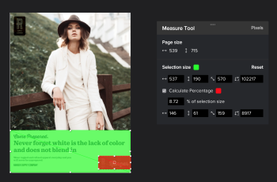

# 증명 내의 영역 측정

증명 내의 영역을 측정할 수 있습니다.

## 액세스 요구 사항

이 문서의 절차를 수행하려면 다음 액세스 권한이 있어야 합니다.

<table style="table-layout:auto"> 
 <col> 
 <col> 
 <tbody> 
  <tr> 
   <td role="rowheader">Adobe Workfront 플랜*</td> 
   <td> 
현재 계획: Pro 이상
 
또는
 
기존 계획: Select 또는 Premium
 
다양한 계획에 따른 언어 교정에 대한 자세한 내용은 <a href="/help/quicksilver/administration-and-setup/manage-workfront/configure-proofing/access-to-proofing-functionality.md" class="MCXref xref">Workfront에서 언어 교정 기능에 액세스</a>.
 </td> 
  </tr> 
  <tr> 
   <td role="rowheader">Adobe Workfront 라이선스*</td> 
   <td> 
현재 계획: 작업 또는 계획
 
기존 계획: 모두(사용자가 교정을 사용하도록 설정되어 있어야 함)
 </td> 
  </tr> 
  <tr> 
   <td role="rowheader">증명 권한 프로필 </td> 
   <td>관리자 이상</td> 
  </tr> 
  <tr> 
   <td role="rowheader">액세스 수준 구성*</td> 
   <td> 
문서 액세스 편집
 
추가 액세스 요청에 대한 자세한 내용은 <a href="../../../../workfront-basics/grant-and-request-access-to-objects/request-access.md" class="MCXref xref">개체에 대한 액세스 요청 </a>.
 </td> 
  </tr> 
 </tbody> 
</table>

&#42;보유하고 있는 계획, 역할 또는 증명 권한 프로필을 알아보려면 Workfront 또는 Workfront 증명 관리자에게 문의하십시오.

## 증명 내의 영역 측정

1. 문서가 포함된 프로젝트, 작업 또는 문제로 이동한 다음 **문서**.
1. 필요한 증명을 찾은 다음 **공개 증명**.

1. 을(를) 클릭합니다. **영역 측정** 교정 뷰어 상단의 아이콘을 클릭합니다.

   

1. (선택 사항) **측정 마크업 색상** 색상 옵션을 확장하려면 **불투명도** 그것은 당신의 증명으로 보기 쉽습니다.\
   

   기본 측정 도구 색상은 빨간색입니다.

   교정 뷰어는 브라우저 캐시를 지울 때까지 여는 모든 증명에서 색상 및 불투명도 선택 사항을 기억합니다.

1. (선택 사항) 다른 **측정 단위.**

   >[!NOTE]
   >
   >측정 단위 선택 사항은 PDF에서 만든 증명에만 사용할 수 있습니다.

1. 측정 창을 측정할 증명 영역으로 드래그합니다.

   

1. 측정 창의 모서리나 모서리를 드래그하여 크기를 조정합니다.
1. (선택 사항) 측정 영역을 정확한 크기로 설정해야 하는 경우 을 입력합니다 **선택 크기** 값.
1. (선택 사항) 영역 내에서 특정 퍼센트를 측정해야 하는 경우 백분율 계산 상자를 선택합니다. 조정할 수 있는 새 상자가 나타납니다\
   
