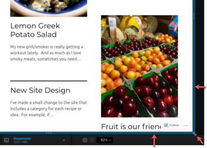

# 증명 뷰어에서 대화형 증명 해상도 변경

다양한 장치에서 대화형 증명이 어떻게 보이는지 미리 볼 수 있으므로 다양한 해상도에 따라 콘텐츠가 어떻게 표시되고 응답하는지 확인할 수 있습니다.

## 액세스 요구 사항

이 문서의 단계를 수행하려면 다음 액세스 권한이 있어야 합니다.

<table style="table-layout:auto"> 
 <col> 
 <col> 
 <tbody> 
  <tr> 
   <td role="rowheader">Adobe Workfront 플랜*</td> 
   <td> 
현재 플랜: Pro 이상
 
또는
 
기존 플랜: Select 또는 Premium
 
다른 플랜의 증명 액세스에 대한 자세한 내용은 <a href="/help/quicksilver/administration-and-setup/manage-workfront/configure-proofing/access-to-proofing-functionality.md" class="MCXref xref">Workfront의 증명 기능에 액세스</a>를 참조하십시오.
 </td> 
  </tr> 
  <tr> 
   <td role="rowheader">Adobe Workfront 라이센스*</td> 
   <td> 
현재 계획: 작업 또는 계획
 
기존 계획: 모두(사용자에 대해 증명이 활성화되어 있어야 함)
 </td> 
  </tr> 
  <tr> 
   <td role="rowheader">교정쇄 권한 프로필 </td> 
   <td>관리자 이상</td> 
  </tr> 
  <tr> 
   <td role="rowheader">액세스 수준 구성*</td> 
   <td> 
문서에 대한 액세스 편집
 
추가 액세스 요청에 대한 자세한 내용은 <a href="../../../../workfront-basics/grant-and-request-access-to-objects/request-access.md" class="MCXref xref">개체 </a>에 대한 액세스 요청 을 참조하십시오.
 </td> 
  </tr> 
 </tbody> 
</table>

&#42;보유 중인 플랜, 역할 또는 증명 권한 프로필을 확인하려면 Workfront 또는 Workfront Proof 관리자에게 문의하십시오.

## 데스크탑 증명 뷰어와 웹 증명 뷰어의 장치 및 해상도 보기

Adobe Workfront 관리자는 사용자가 Desktop Proofing Viewer에서 대화형 콘텐츠를 검토하거나 ZIP 파일의 번들 콘텐츠로 웹 증명 뷰어에서 검토하도록 시스템을 구성했습니다.

* Desktop Proofing Viewer에서 다양한 해상도와 다양한 디바이스에서 콘텐츠가 표시되고 응답하는 방식을 볼 수 있습니다. 검토자가 특정 장치를 지정하면 해당 장치의 사용자 인터페이스 사양과 함께 해당 장치의 콘텐츠대로 표시됩니다. 예를 들어 스마트 폰의 한 브랜드에 있는 빨간색 단추는 다른 브랜드에서 파란색일 수 있습니다.

* 웹 증명 뷰어에서는 다양한 장치의 해상도에 나타나는 대화형 콘텐츠를 볼 수 있습니다. 그러나 웹 증명 뷰어는 단추 색상과 같은 이러한 장치의 인터페이스 사양을 사용하여 콘텐츠를 에뮬레이션하지 않습니다.

  >[!NOTE]
  >
  >[조직에 대한 증명 설정 구성](/help/quicksilver/administration-and-setup/manage-workfront/configure-proofing/configure-proofing-organization.md) 문서의 [증명에 대한 사용자 지정 장치 구성](/help/quicksilver/administration-and-setup/manage-workfront/configure-proofing/configure-proofing-organization.md#configure-custom-devices-for-proofs)에 설명된 대로 Workfront 관리자가 조직의 사용자를 위한 사용자 지정 장치를 구성할 수 있습니다.

## 사전 설정된 장치 또는 해상도 설정으로 증명 보기

1. 열려는 증명이 포함된 문서 목록으로 이동합니다.
1. 문서를 마우스로 가리킨 다음 **증명 열기**&#x200B;를 클릭합니다.
1. 증명 뷰어의 가운데 맨 아래에서 **응답형**&#x200B;을 클릭합니다.

   

1. Desktop Proofing Viewer에 나타나는 장치 및 해상도 목록에서 원하는 장치를 클릭합니다.

   또는

   웹 증명 뷰어에서 나타나는 해상도 목록에서 원하는 해상도를 클릭합니다.

   이 두 뷰어의 차이점에 대한 정보가 필요하면 [웹 증명 뷰어와 데스크톱 증명 뷰어의 차이점](../../../../review-and-approve-work/proofing/proofing-overview/understand-differences-between-web-viewer.md)을 참조하십시오.

   대화형 증명은 사용자가 선택한 해상도로 렌더링됩니다.

## 사용자 정의 해상도 설정으로 증명 보기

1. 열려는 증명이 포함된 문서 목록으로 이동합니다.
1. 문서를 마우스로 가리킨 다음 **증명 열기**&#x200B;를 클릭합니다.
1. 증명 뷰어의 가운데 맨 아래에서 **응답형**&#x200B;을 클릭합니다.
1. 사용자 지정 **응답형** 해상도를 입력하십시오.

   

   또는

   대화형 콘텐츠 위로 마우스를 가져간 다음 오른쪽 아래 모서리의 파란색 테두리, 오른쪽 또는 아래쪽 가장자리를 원하는 해상도로 드래그합니다.

   

   사용자 지정 해상도는 다음 위치에 표시됩니다.

   * 뷰어의 아래쪽 가운데에 있는 **해상도** 패널에서\
     

   * 모든 댓글에서 검토자는 증명에 를 추가합니다. 각 주석에는 검토자가 주석을 만들 때 선택한 화면 해상도가 포함됩니다.
