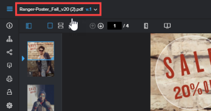

# 증명 뷰어에서 이전 증명 버전 보기

이전 버전의 증명이 있는 경우 해당 증명을 볼 수 있습니다. 이전 버전은 기본적으로 잠겨 있습니다. 잠긴 버전에서는 설명을 추가하거나 결정을 변경할 수 없습니다.

>[!NOTE]
>
>이 문서에 설명된 정보는 웹 증명 뷰어에서만 사용할 수 있으며 비디오 또는 정적 증명을 검토할 때만 사용할 수 있습니다.

## 액세스 요구 사항

+++ 을 확장하여 이 문서의 기능에 대한 액세스 요구 사항을 봅니다.

<table style="table-layout:auto"> 
 <col> 
 <col> 
 <tbody> 
  <tr> 
   <td role="rowheader">Adobe Workfront 패키지</td> 
   <td> 
임의
 </td> 
  </tr> 
  <tr> 
   <td role="rowheader">Adobe Workfront 라이선스</td> 
   <td> 
임의
 </td> 
  </tr> 
  <tr> 
   <td role="rowheader">증명 역할 </td> 
   <td>검토자, 검토자 및 승인자, 작성자, 중재자</td> 
  </tr> 
  <tr> 
   <td role="rowheader">교정쇄 권한 프로필 </td> 
   <td>관리자 이상</td> 
  </tr> 
  <tr> 
   <td role="rowheader">액세스 수준 구성</td> 
   <td> 
문서에 대한 액세스 편집
 </td> 
  </tr> 
 </tbody> 
</table>

자세한 내용은 [Workfront 설명서의 액세스 요구 사항](/help/quicksilver/administration-and-setup/add-users/access-levels-and-object-permissions/access-level-requirements-in-documentation.md)을 참조하십시오.

+++

## 증명 뷰어에서 이전 증명 버전 보기

1. 문서가 포함된 프로젝트, 작업 또는 문제로 이동한 다음 **문서**&#x200B;을(를) 선택합니다.
1. 필요한 증명을 찾은 다음 **증명 열기**&#x200B;를 클릭합니다.

1. 증명 뷰어의 왼쪽 상단 모서리에서 증명 이름을 클릭합니다.

   

1. 표시되는 목록에서 보려는 버전을 클릭합니다.
1. (선택 사항) 사용자가 댓글을 추가하거나 결정을 변경할 수 있도록 하려는 경우 버전을 잠금 해제하려면 왼쪽 패널의 **잠금 해제** 아이콘을 클릭한 다음 **예, 잠금 해제**&#x200B;를 클릭합니다. 자세한 내용은 [증명 잠금 또는 잠금 해제](../../../../review-and-approve-work/proofing/reviewing-proofs-within-workfront/review-a-proof/lock-or-unlock-proof.md)를 참조하십시오.
