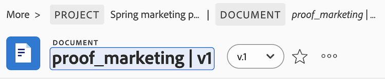

# 업로드 후 문서 이름이 변경되었으며 잘못된 문자가 포함되어 있습니다.

## 문제

특정 문서는 증명으로 변환할 수 없습니다.

## 원인

Workfront에 업로드된 파일은 파일 이름에 특정 문자를 포함할 수 없습니다. 파일에 파일 이름에 다음 문자가 포함되어 있으면 파일을 업로드할 때 해당 문자가 파일 이름에서 제거됩니다. `! # % * \ | ' " / ? < > { } [ ]`.

최초 업로드 후 잘못된 문자를 포함하도록 문서 이름이 업데이트되면 증명 생성이 실패합니다.

## 솔루션

문서 이름에서 잘못된 문자를 제거합니다.

1. 문서를 선택하고 **문서 세부 정보**.
1. 문서 이름을 클릭하고 잘못된 문자를 제거한 다음 Enter 키를 누릅니다.

   잘못된 문자: `! # % * \ | ' " / ? < > { } [ ]`

   

1. 페이지를 새로 고치고 증명을 생성합니다.