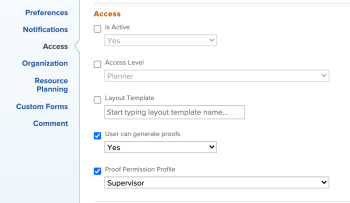

# 증명 권한 프로필 필드를 일괄적으로 편집

## 액세스 요구 사항

+++ 을 확장하여 이 문서의 기능에 대한 액세스 요구 사항을 봅니다.

이 문서의 단계를 수행하려면 다음 액세스 권한이 있어야 합니다.

<table style="table-layout:auto"> 
 <col> 
 <col> 
 <tbody> 
  <tr> 
   <td role="rowheader">Adobe Workfront 플랜*</td> 
   <td> 
현재 플랜: Pro 이상
 
또는
 
기존 플랜: Select 또는 Premium
 
다른 플랜의 증명 액세스에 대한 자세한 내용은 <a href="/help/quicksilver/administration-and-setup/manage-workfront/configure-proofing/access-to-proofing-functionality.md" class="MCXref xref">Workfront의 증명 기능에 액세스</a>를 참조하십시오.
 </td> 
  </tr> 
  <tr> 
   <td role="rowheader">Adobe Workfront 라이센스*</td> 
   <td> 
Workfront 관리자여야 합니다. Workfront 관리자에 대한 자세한 내용은 <a href="../../../administration-and-setup/add-users/configure-and-grant-access/grant-a-user-full-administrative-access.md" class="MCXref xref">사용자에게 전체 관리 액세스 권한 부여</a>를 참조하십시오.
 </td> 
  </tr> 
  <tr> 
   <td role="rowheader">교정쇄 권한 프로필 </td> 
   <td>관리자</td> 
  </tr> 
  <tr> 
   <td role="rowheader">액세스 수준 구성*</td> 
   <td> 
문서에 대한 액세스 편집
 
추가 액세스 요청에 대한 자세한 내용은 <a href="../../../workfront-basics/grant-and-request-access-to-objects/request-access.md" class="MCXref xref">개체 </a>에 대한 액세스 요청 을 참조하십시오.
 </td> 
  </tr> 
 </tbody> 
</table>

&#42;보유 중인 플랜, 역할 또는 증명 권한 프로필을 확인하려면 Workfront 또는 Workfront Proof 관리자에게 문의하십시오.

+++

## 증명 권한 프로필 필드를 일괄적으로 편집

{{step-1-to-users}}

1. **액세스 수준**&#x200B;별로 사용자를 정렬하십시오. **증명 권한 프로필** 필드가 표시되도록 하려면 액세스 수준별로 일괄 편집하는 것이 좋습니다.

1. 동일한 액세스 수준 내에서 선택할 사용자 옆의 확인란을 클릭합니다. 증명 권한 프로필 필드는 작업자 액세스 수준 이상에만 사용할 수 있습니다.
1. 목록 맨 위에서 **편집**&#x200B;을 클릭합니다.
1. **액세스** 섹션에서 **증명 권한 프로필** 드롭다운 메뉴를 찾아 선택합니다.

   >[!NOTE]
   >
   >Workfront 플랜에 따라 **증명 권한 프로필** 메뉴를 표시하려면 **사용자가 증명을 생성할 수 있음** 확인란을 활성화해야 할 수 있습니다.

   

1. **변경 내용 저장**&#x200B;을 클릭합니다.
