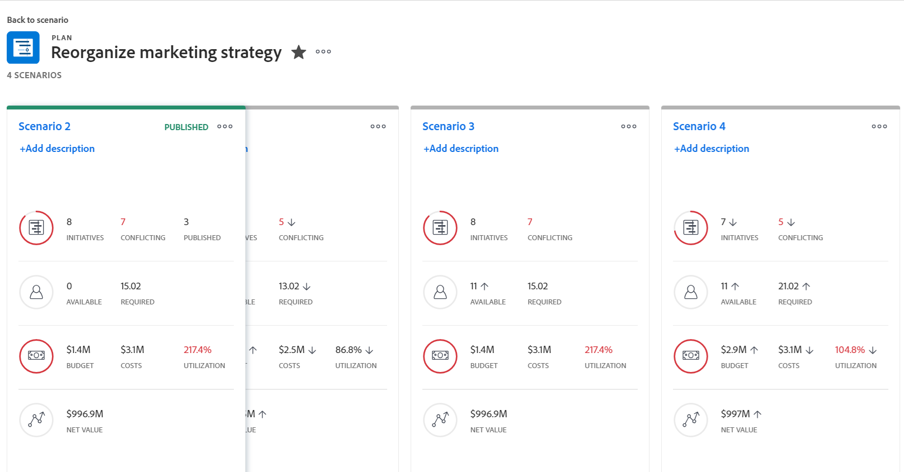

# [!DNL Scenario Planner]에서 계획 시나리오 만들기 및 비교

<!--Audited: 07/2024-->

기업의 장기적 전략을 구상 할 때, 처음부터 가지고 있지 않거나 생각지도 못한 정보가 많다. 이해 당사자가 받아들일 수 있는 최종 전략에 도달하려면 시간과 실험이 필요하다. 플랜에 대한 여러 시나리오를 만들기 위해 &quot;가정&quot; 분석을 수행하면 잠재적 상황을 정확하게 예측 및 평가하고 궁극적으로 최상의 계획을 개발하는 데 도움이 될 수 있습니다.

## 액세스 요구 사항

+++ 을 확장하여 이 문서의 기능에 대한 액세스 요구 사항을 봅니다. 

<table style="table-layout:auto"> 
 <col> 
 <col> 
 <tbody> 
  <tr> 
   <td> 
[!DNL Adobe Workfront] 패키지
 </td> 
   <td> 
   
Workfront Ultimate

<b>메모</b>

다른 Workfront 패키지가 있는 경우 Workfront 담당자에게 문의하십시오.

   </td> 
  </tr> 
  <tr> 
   <td> 
[!DNL Adobe Workfront] 라이센스
 </td> 
   <td> 
[!UICONTROL Light] 이상
 
   
[!UICONTROL Review] 이상
 </td> 
  </tr> 
    <tr> 
   <td>액세스 수준 구성</td> 
   <td> 
다음에 대한 [!UICONTROL 편집] 액세스 권한: [!DNL Scenario Planner]
 </td> 
  </tr> 
  <tr> 
   <td> 
개체 권한 
 </td> 
   <td> 
플랜에 대한 [!UICONTROL 관리] 권한
 </td> 
  </tr> 
 </tbody> 
</table>

시나리오 플래너에 액세스하는 방법에 대한 자세한 내용은 [을(를) 사용하는 데 필요한 액세스 [!DNL Scenario Planner]](../scenario-planner/access-needed-to-use-sp.md)를 참조하십시오.

Workfront 액세스 요구 사항에 대한 자세한 내용은 [Workfront 설명서에 대한 액세스 요구 사항](/help/quicksilver/administration-and-setup/add-users/access-levels-and-object-permissions/access-level-requirements-in-documentation.md)을 참조하십시오.

+++

<!--Old:

<table style="table-layout:auto"> 
 <col> 
 <col> 
 <tbody> 
  <tr> 
   <td> 
[!DNL Adobe Workfront] plan*
 </td> 
   <td> <ul></li>
   <li>
New: Ultimate 
</li>
   
The Scenario Planner is not available for the new Workfront Select or Workfront Prime plans. 

   <li>
Current: [!UICONTROL Business] or higher
</ul>
   </td> 
  </tr> 
  <tr> 
   <td> 
[!DNL Adobe Workfront] license*
 </td> 
   <td> 
New: Light or higher
 
   
Current: [!UICONTROL Review] or higher
 </td> 
  </tr> 
  <tr> 
   <td>Product* </td> 
   <td> <ul><li>
For the new Workfront plans:

 Adobe Workfront</li>

   <li>
For the current Workfront plans: 

   
Adobe Workfront
 
Adobe Workfront Scenario Planner
</li></ul>
   
   
For more information, see <a href="../scenario-planner/access-needed-to-use-sp.md" class="MCXref xref">Access needed to use the [!DNL Scenario Planner]</a>. 
 </td> 
  </tr> 
  <tr data-mc-conditions=""> 
   <td>Access level </td> 
   <td> 
[!UICONTROL Edit] access to the [!DNL Scenario Planner]
 </td> 
  </tr> 
  <tr data-mc-conditions=""> 
   <td> 
Object permissions 
 </td> 
   <td> 
[!UICONTROL Manage] permissions to a plan
 
For information on requesting additional access to a plan, see <a href="../scenario-planner/request-access-to-plan.md" class="MCXref xref">Request access to a plan in the [!DNL Scenario Planner]</a>.
 </td> 
  </tr> 
 </tbody> 
</table>-->

## 시나리오 만들기

시나리오는 계획의 사본입니다. 필요한 만큼 시나리오를 만들 수 있습니다. 그러나 시나리오 수를 쉽게 비교할 수 있도록 시나리오 수를 최소로 유지하는 것이 좋습니다.

{{step1-to-scenario-planner}}

1. 계획을 생성하거나 기존 계획의 이름을 누릅니다.

   계획 만들기에 대한 자세한 내용은 [계획 만들기 및 편집 [!DNL Scenario Planner]](../scenario-planner/create-and-edit-plans.md)을 참조하세요.

   처음 만든 계획은 자동으로 &quot;[!UICONTROL 초기 시나리오]&quot;(으)로 저장됩니다.

1. 기존 시나리오 옆에 있는 아래쪽 화살표를 클릭한 다음 **[!UICONTROL 복사]** 아이콘을 클릭합니다.

   

   이렇게 하면 복사된 시나리오와 동일한 정보로 새 시나리오가 생성됩니다. 플랜의 두 번째 시나리오인 경우 자동으로 &quot;[!UICONTROL 시나리오 2]&quot;, 세 번째 시나리오인 경우 자동으로 &quot;[!UICONTROL 시나리오 3]&quot;으로 지정됩니다. 시나리오 이름은 변경할 수 없습니다. 만들 수 있는 부수는 제한이 없습니다.

   <!--
   <MadCap:conditionalText data-mc-conditions="QuicksilverOrClassic.Draft mode">
   (NOTE:this might change)
   </MadCap:conditionalText>
   -->

1. 다음 방법 중 하나로 새 시나리오를 업데이트합니다.

   * 이니셔티브 생성, 업데이트 또는 삭제

     >[!TIP]
     >
     >시나리오에서 이니셔티브를 삭제하면 모든 시나리오가 아닌 선택한 시나리오에서만 제거됩니다.

     이니셔티브 만들기에 대한 자세한 내용은 [이니셔티브 만들기 및 편집 [!DNL Scenario Planner]](../scenario-planner/create-and-edit-initiatives.md)을 참조하십시오.

   * 이니셔티브의 우선 순위 업데이트
   * 직원 또는 예산 정보 조정
   * 시나리오에서 이니셔티브 충돌 검토 및 조정

     충돌 해결에 대한 자세한 내용은 [Resolve initiative conflicts in the [!DNL Scenario Planner]](../scenario-planner/resolve-conflicts-in-sp.md)을(를) 참조하십시오.

1. 변경 내용을 저장하려면 **[!UICONTROL 계획 저장]**&#x200B;을 클릭하세요.

## 시나리오 비교

시나리오를 만든 후 비교하여 조직에 가장 적합한 시나리오를 찾을 수 있습니다.

1. 시나리오를 비교하려는 계획으로 이동합니다.
1. **[!UICONTROL 시나리오 비교]**&#x200B;를 클릭합니다. 시나리오 비교 페이지가 표시됩니다.

   플랜에 대한 모든 기존 시나리오가 나란히 카드 형식으로 표시됩니다. 초기 시나리오는 항상 먼저 나열되며 정적입니다.

   

1. (선택 사항) 모든 시나리오 카드를 보려면 오른쪽으로 스크롤합니다.

   시나리오 카드에 다음 정보가 표시됩니다.

   <table style="table-layout:auto"> 
    <col> 
    <col> 
    <tbody> 
     <tr> 
      <td>시나리오 이름</td> 
      <td> 
Workfront에서 자동으로 생성된 이름으로, 편집할 수 없습니다. 예: "[!UICONTROL Initial scenario]", "[!UICONTROL Scenario 2]" 등. 
 </td> 
     </tr> 
     <tr> 
      <td>시나리오 설명</td> 
      <td>시나리오에 대한 세부 사항을 설명할 수 있는 수동 입력. </td> 
     </tr> 
     <tr> 
      <td>사용 가능한 작업 역할</td> 
      <td>플랜 기간 동안 플랜 예산에서 사용할 수 있는 작업 역할의 수입니다. </td> 
     </tr> 
     <tr> 
      <td>필수 작업 역할</td> 
      <td>이니셔티브에 따라 필요한 작업 역할의 수입니다. </td> 
     </tr> 
     <tr> 
      <td>예산</td> 
      <td>이 시나리오에서 계획에 정의된 총 예산. 플랜에 대한 예산 정보는 <a href="../scenario-planner/plans-overview.md" class="MCXref xref">의 [!DNL Scenario Planner]</a>플랜 개요를 참조하십시오. </td> 
     </tr> 
     <tr> 
      <td>비용</td> 
      <td>시나리오에서 이니셔티브와 연계된 비용. 비용에 대한 자세한 내용은 <a href="../scenario-planner/initiatives-overview.md" class="MCXref xref">에서 [!DNL Scenario Planner]</a>이니셔티브 개요를 참조하십시오. </td> 
     </tr> 
     <tr> 
      <td>활용성</td> 
      <td>이 시나리오에서 플랜에 대한 [!UICONTROL 예산 활용률] 백분율입니다. [!UICONTROL Budget Utilization] 비율에 대한 자세한 내용은 <a href="../scenario-planner/plans-overview.md" class="MCXref xref">의 [!DNL Scenario Planner]</a>계획 개요를 참조하십시오. </td> 
     </tr> 
     <tr> 
      <td>순 가치</td> 
      <td>이 시나리오에서 플랜의 [!UICONTROL 순 값]. 플랜의 [!UICONTROL Net Value]에 대한 자세한 내용은 <a href="../scenario-planner/plans-overview.md" class="MCXref xref">에서 [!DNL Scenario Planner]</a>플랜 개요를 참조하십시오. </td> 
     </tr> 
     <tr> 
      <td>이니셔티브</td> 
      <td>이 시나리오의 플랜에 대한 이니셔티브 수입니다.</td> 
     </tr> 
     <tr> 
      <td>충돌</td> 
      <td>이 시나리오에 대한 플랜에서 충돌 유형을 표시하는 이니셔티브 수입니다. 이니셔티브 충돌에 대한 자세한 내용은 <a href="../scenario-planner/resolve-conflicts-in-sp.md" class="MCXref xref">에서 [!DNL Scenario Planner]</a>이니셔티브 충돌 해결을 참조하십시오. </td> 
     </tr> 
    </tbody> 
   </table>

   >[!NOTE]
   >
   >초기 시나리오와 추가 시나리오 간에 정보가 다른 경우, 초기 시나리오와 비교하여 해당 값의 증가 또는 감소를 나타내도록 변경된 값 옆에 위쪽 또는 아래쪽 화살표가 표시됩니다.
   >
   >
   >시나리오 카드의 
   >
   >예를 들어 예산, 작업 역할 수, 이니셔티브 수가 한 시나리오에서 다른 시나리오로 변경될 수 있습니다.

1. 시나리오에 액세스하고 변경하려면 시나리오의 이름을 클릭합니다.

   자세한 내용은 이 문서의 [시나리오 만들기](#create-scenarios) 섹션을 참조하십시오.

1. 시나리오에 대한 설명을 추가하려면 **[!UICONTROL 설명 추가]**&#x200B;를 클릭하십시오.

   또는

   설명 필드를 클릭하여 업데이트한 다음 화면의 아무 곳이나 클릭하여 변경 사항을 저장합니다.

1. (선택 사항) 시나리오를 **[!UICONTROL 복사]** 또는 하려면 **[!UICONTROL 자세히]** 메뉴 **[!UICONTROL 추가 아이콘]**&#x200B;을 클릭합니다.

   

   시나리오를 복사하면 카드 페이지에 자동으로 표시되며 다음 패턴에 따라 이름이 바뀝니다. &quot;[!UICONTROL 시나리오] `<next number in order>`&quot;

1. (조건부) **[!UICONTROL 삭제]**&#x200B;를 클릭한 경우 **[!UICONTROL 예, 삭제]**&#x200B;를 클릭하여 확인합니다.

   삭제된 시나리오는 복구할 수 없습니다.

   시나리오 삭제에 대한 자세한 내용은 [Delete plans in the [!DNL Scenario Planner]](../scenario-planner/delete-plans.md)을(를) 참조하십시오.

1. 시나리오 및 플랜을 저장하려면 **[!UICONTROL 플랜 저장]**&#x200B;을 클릭하세요.
