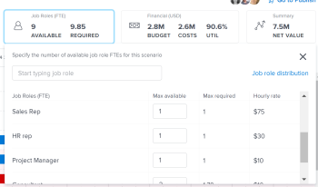

# 에서 계획 생성 및 편집 [!DNL Scenario Planner]

다음을 사용의 일부로 계획을 생성할 수 있습니다. [!DNL Workfront Scenario Planner]를 사용하십시오. 플랜에 대한 자세한 내용은 [의 플랜 개요 [!DNL Scenario Planner]](../scenario-planner/plans-overview.md).

<!--

(NOTE: talk about:

- Show people conflicts >> this impacts the conflicts calculation for initiatives>> link to the conflicts article

- explain what hovering over the green upward-pointing arrow does, with screen shot)

-->

## 액세스 요구 사항

다음 항목이 있어야 합니다.

<table style="table-layout:auto"> 
 <col> 
 <col> 
 <tbody> 
  <tr> 
   <td> 
[!DNL Adobe Workfront] 플랜*
 </td> 
   <td>[!UICONTROL Business] 이상</td> 
  </tr> 
  <tr> 
   <td> 
[!DNL Adobe Workfront] 라이센스*
 </td> 
   <td> 
[!UICONTROL Review] 이상
 </td> 
  </tr> 
  <tr> 
   <td>제품</td> 
   <td> 
다음에 대한 추가 라이선스를 구입해야 합니다. [!DNL Adobe Workfront Scenario Planner] 이 문서에 설명된 기능에 액세스합니다.
 
[!UICONTROL Workfront Scenario Planner] 가져오기에 대한 자세한 내용은 다음을 참조하십시오. <a href="../scenario-planner/access-needed-to-use-sp.md" class="MCXref xref">[!UICONTROL 시나리오 플래너]를 사용하는 데 필요한 액세스 권한</a>. 
 </td> 
  </tr> 
  <tr data-mc-conditions=""> 
   <td>액세스 수준 구성* </td> 
   <td> 
다음에 대한 [!UICONTROL 편집] 액세스 이상: [!DNL Scenario Planner]
 
참고: 여전히 액세스 권한이 없는 경우 Workfront 관리자에게 액세스 수준에서 추가 제한을 설정하는지 문의하십시오. 자세한 내용: [!DNL Workfront] 관리자가 액세스 수준을 변경할 수 있습니다. 다음을 참조하십시오. <a href="../administration-and-setup/add-users/configure-and-grant-access/create-modify-access-levels.md" class="MCXref xref">사용자 정의 액세스 수준 만들기 또는 수정</a>.
 </td> 
  </tr> 
  <tr data-mc-conditions=""> 
   <td> 
개체 권한 
 </td> 
   <td> 
[!DNL Manage] 플랜에 대한 권한
 
계획에 대한 추가 액세스 요청에 대한 자세한 내용은 다음을 참조하십시오. <a href="../scenario-planner/request-access-to-plan.md" class="MCXref xref">플랜에 대한 액세스 권한 요청 [!DNL Scenario Planner]</a>.
 </td> 
  </tr> 
 </tbody> 
</table>

&#42;보유 중인 플랜, 라이선스 유형 또는 액세스 권한을 알아보려면 [!DNL Workfront] 관리자.

## 계획 생성 또는 편집

처음부터 계획을 작성하거나 사용자와 공유된 기존 계획을 편집할 수 있습니다.

>[!NOTE]
>
>계획을 생성한 후에는 계획 생성자 및 소유자로 간주됩니다. 사용자가 비활성화되면 플랜에는 소유자가 없으며 이전에 링크와 공유하지 않는 한 누구에게도 표시되지 않습니다.

이 문서에서는 처음부터 계획을 작성하거나 기존 계획을 편집하는 방법에 대해 설명합니다.

계획에 사용할 수 있는 정보를 포함하여 계획에 대한 모든 고려 사항은 다음을 참조하십시오. [의 플랜 개요 [!DNL Scenario Planner]](../scenario-planner/plans-overview.md).

계획 삭제에 대한 자세한 내용은 [에서 플랜 삭제 [!DNL Scenario Planner]](../scenario-planner/delete-plans.md).

계획을 생성하거나 편집하려면

1. 다음을 클릭합니다. **[!UICONTROL 메인 메뉴]** 아이콘 을 클릭한 다음 을 클릭합니다 [!UICONTROL 시나리오].

   생성한 기존 계획 목록이 [!DNL Workfront Scenario Planner].

1. (선택 사항) **[!UICONTROL 필터]** 아이콘 계획 목록의 오른쪽 상단 모서리에서 다음을 선택합니다.

   | 필터 | 설명 |
   |---|---|
   | [!UICONTROL 모두] | 사용자가 만들었거나 사용자와 공유된 모든 계획을 표시합니다. |
   | [!UICONTROL 내 플랜] | 생성한 계획을 표시합니다. |
   | [!UICONTROL 나와 공유됨] | 사용자와 공유된 계획을 표시합니다. |

   

1. (선택 사항) **[!UICONTROL 검색]** 아이콘  키워드를 입력하고 목록에서 계획을 빠르게 찾습니다.

1. 기존 계획의 이름을 클릭하여 편집하고 7단계로 진행합니다.

   <!--
   
(NOTE: is the step still accurate) 

   -->

   또는

   클릭 **[!UICONTROL 새 플랜]** 왼쪽 상단 모서리에서 계획을 생성하고 5단계를 계속 진행합니다.

   <!--
   
(NOTE: is the step still accurate)

   -->

   

   다음 [!UICONTROL 새 플랜] 상자가 표시됩니다.

   

1. (조건부) 신규 계획을 생성할 때 다음 정보를 지정합니다.

   <table style="table-layout:auto"> 
    <col> 
    <col> 
    <tbody> 
     <tr> 
      <td role="rowheader">[!UICONTROL 이름]</td> 
      <td>플랜의 이름을 입력합니다. 필수 필드입니다.</td> 
     </tr> 
     <tr> 
      <td role="rowheader" colspan="2"> 
중요 사항: 계획을 생성 및 저장한 후에는 다음 선택 사항을 수정할 수 없습니다. 
 </td> 
     </tr> 
     <tr data-mc-conditions=""> 
      <td role="rowheader">FTE([!UICONTROL Full Time Equivalent]) 또는 [!UICONTROL Hours] </td> 
      <td> 
다음 옵션 중 하나를 선택하여 이 계획에 대한 작업 역할 정보를 추정하는 방법을 나타냅니다. 
 
       <ul> 
      <li> 
<strong>FTE</strong>. 기본값입니다.  
 
      
<b>중요 사항</b>
  
      
의 모든 계산에 대해 [!DNL Scenario Planner], [!DNL Workfront] 는 다음 값을 사용합니다. 1 FTE = 8 시간. 
 </li> 
      <li> 
<strong>[!UICONTROL 시간]</strong> 
 </li> 
       </ul> 
<b>중요 사항</b>

   여기서 선택하는 옵션은 계획, 계획의 시나리오 및 이니셔티브에 대한 작업 역할 정보가 표시되는 방법을 결정합니다
 </td>
   </tr> 
     <tr> 
      <td role="rowheader">[!UICONTROL 시작 날짜]</td> 
      <td> 
계획을 시작할 월과 연도를 선택합니다. 이 필드에서는 월만 선택할 수 있습니다. [!DNL Workfront] 플랜의 시작 일자가 선택한 월의 첫 날이고 종료 일자가 해당 기간의 월 끝 마지막 날이라고 가정합니다. 
 </td> 
     </tr> 
     <tr> 
      <td role="rowheader">[!UICONTROL 기간]</td> 
      <td> 
드롭다운 메뉴에서 다음 기간 중에서 선택합니다.
 
       <ul> 
        <li>1년. 기본 기간입니다. </li> 
        <li>3년</li> 
        <li> 
5년
 </li> 
       </ul> </td> 
     </tr> 
    </tbody> 
   </table>

<!--for table above - how FTE is calcualted: NOTE: snippet below: this is per Ani; it does NOT look at the system FTE.) 
-->

1. (조건부) 클릭 **[!UICONTROL 다음]**.

   계획의 타임라인이 다음으로 표시됩니다. **[!UICONTROL 초기 시나리오]**.

   추가 시나리오 만들기에 대한 내용은 다음을 참조하십시오. [에서 계획 시나리오 만들기 및 비교 [!DNL Scenario Planner]](../scenario-planner/create-and-compare-scenarios-for-a-plan.md).

1. (선택 사항) 타임라인 드롭다운 메뉴에서 다음 표의 옵션 중 하나를 선택하여 계획의 타임라인 보기 방법을 변경합니다.

   

   | 드롭다운 메뉴 옵션 | 설명 |
   |---|---|
   | [!UICONTROL 월] | 월별 시간표를 표시합니다. 1년 계획의 기본값이자 유일한 옵션입니다. |
   | [!UICONTROL 분기] | 분기별로 타임라인을 표시합니다. 이 옵션은 다음 경우에만 사용할 수 있습니다. [!UICONTROL 기간] 3년 또는 5년. 3년 계획의 기본 옵션입니다. |
   | [!UICONTROL 년] | 연도별로 타임라인을 표시합니다. 이 옵션은 다음 경우에만 사용할 수 있습니다. [!UICONTROL 기간] 5년입니다. 5년 계획의 기본 옵션입니다. |

1. (선택 사항) 왼쪽에서 오른쪽으로 스크롤하여 계획의 전체 기간을 봅니다.
1. (선택 사항) **[!UICONTROL 오늘]** 현재 날짜로 돌아갈 표시기 줄.

   

1. 다음을 클릭합니다. **[!UICONTROL 작업 역할]** 계획의 헤더에 계획을 실행하는 데 사용할 수 있는 작업 역할을 추가하는 상자.

   세부 정보 [!UICONTROL 작업 역할] 상자 표시.

   >[!TIP]
   >
   >역할 할당 단위(FTE 또는 시간) [!DNL Workfront] 이 플랜에 대한 사용은 상자의 제목에 괄호로 표시됩니다.

   

1. 다음을 클릭합니다. **[!UICONTROL 작업 역할 입력]** 필드를 작성하고 목록에서 역할을 선택하거나 활성 작업 역할의 이름을 입력하십시오.

   이 필드를 누르면 시스템의 모든 활성 작업 역할이 나열됩니다.

   작업 역할 열에 작업 역할이 추가됩니다.

1. 작업 역할에 대해 다음 정보를 업데이트하거나 검토합니다.

   <table style="table-layout:auto"> 
    <col> 
    <col> 
    <tbody> 
     <tr> 
      <td role="rowheader"> 
[!UICONTROL Max available] (FTE의 경우) 
 
또는 
 
[!UICONTROL 총 사용 가능] (시간) 
 </td> 
      <td> 
플랜에 시간을 사용할지 FTE를 사용할지 여부에 따라 을(를) 입력합니다. 작업 역할 FTE 수 또는 시간 다음 필드에서 플랜에 대한 작업을 실행할 수 있습니다. 
 
       <ul> 
        <li> 
<strong>[!UICONTROL Total available]</strong> (시간): 시나리오 기간 동안 모든 달의 총 시간 수를 나타냅니다. 기본적으로, [!DNL Workfront] 시나리오 기간 동안 사용 가능한 총 수를 모든 달에 균등하게 나눕니다. 
 
Example: </b>"><b>예: </b>Designer에 1200시간을 입력하면 계획 [!UICONTROL Duration]이 1년인 경우 계획 기간 동안 매월 100시간 동안 Designer를 사용할 수 있습니다. 
 </li> 
        <li> 
<b>[!UICONTROL Max available]</b> (FTE의 경우): 플랜 기간 동안 매월 작업 역할을 사용할 수 있는 FTE 수를 나타냅니다. 기본적으로, <strong>Workfront</strong> 시나리오 기간 내 각 월에 [!UICONTROL Max available] 번호를 할당합니다.
 
Example: </b>"><b>예: </b>컨설턴트에 대해 1개의 FTE를 입력하는 경우, 이는 컨설턴트가 플랜 기간 동안 매월 1개의 FTE에 사용할 수 있음을 의미합니다. 
 
1FTE보다 작은 숫자를 입력할 수 있습니다. 
 
Example: </b>"><b>예: </b>0.5 컨설턴트 작업 역할은 컨설턴트가 이 플랜에 대한 작업에 FTE의 절반(일반적으로 4시간, 8시간이 FTE 1개인 경우)을 할애한다는 의미입니다. 시나리오 플래너의 모든 계산에 대해 Workfront은 다음 값을 사용합니다. 1 FTE = 8 시간. 
 </li> 
       </ul> </td> 
     </tr> 
     <tr> 
      <td role="rowheader"> 
[!UICONTROL 최대 필요] (FTE의 경우)
 
또는 
 
[!UICONTROL 총 필요] (시간) 
 </td> 
      <td> 
플랜에 시간을 사용할지 FTE를 사용할지 여부에 따라 을(를) 검토하십시오. 작업 역할 FTE 수 또는 시간 시나리오에서 이니셔티브를 완료하는 데 필요합니다. 다음 필드를 검토하십시오.
 
       <ul> 
        <li> 
<strong>[!UICONTROL 총 필수]</strong> (시간): 제도 기간 동안 모든 달에 필요한 총 시간.
 </li> 
        <li> 
<strong>[!UICONTROL 최대 필요]</strong> (FTE의 경우): 플랜 기간 동안 특정 월에 필요한 최대 FTE 수. 
 </li> 
       </ul> 
팁: 최대 FTE 수 또는 총 시간 수 이니셔티브 추가를 시작하면 표시되는 해당 작업 역할에 필수입니다. 계획에 이니셔티브 추가에 대한 자세한 내용은 다음을 참조하십시오. <a href="../scenario-planner/create-and-edit-initiatives.md" class="MCXref xref">에서 이니셔티브 만들기 및 편집 [!DNL Scenario Planner]</a>.
 </td> 
     </tr> <!--
      <tr data-mc-conditions="QuicksilverOrClassic.Draft mode"> 
       <td role="rowheader">[!UICONTROL Avg utilization]</td> 
       <td> 
(NOTE: this field was removed in 21.2 - May 2021) 
 
[!DNL Workfront] calculates the average utilization for each job role using the job role FTEs associated with initiatives (required) and the job role FTEs associated with the plan (available). 
 
 [!DNL Workfront] calculates the job role utilization percentage for a plan using the following formula: 
 
<code>Job role utilization percentage = Sum [(Required job roles for each month of the plan *100)/ (Available job roles for each month of the plan)] / Number of months in the Duration of the plan</code> 
 
        
Example: </b>"> <b>Example: </b> 
         
For example, if you have a plan with a duration of 12 months and an initiative with the duration of 2 months, where you use 1 Designer for your initiative (required job role) and there are 2 Designers available on the plan (available), the Utilization percentage for the Designer job role is calculated as follows:
 
         
<code>Designer utilization percentage = [(1/2 + 1/2) * 100] / 12 = 100 / 12 = 8.3%</code> 
 
        
 
As you add job roles to the plan and indicate the Available amount for each one, the [!UICONTROL Utilization] value for each role also updates and [!DNL Workfront] calculates a utilization percentage for the plan. For information about how [!DNL Workfront] calculates the Job Role Utilization for a plan, see <a href="../scenario-planner/plans-overview.md" class="MCXref xref">Plans overview in the [!DNL Scenario Planner]</a>. 
 
Tip: The Utilization percentage is rounded and has one decimal. 
 </td> 
      </tr>
     --> 
     <tr> 
      <td role="rowheader">[!UICONTROL 시간당 요금]</td> 
      <td> 
작업 역할에 대한 [!UICONTROL 비용 시간] 비율입니다. 시간별 요금은 시스템 통화로 표시됩니다. 시스템의 환율 설정에 대한 자세한 내용은 <a href="../administration-and-setup/manage-workfront/exchange-rates/set-up-exchange-rates.md" class="MCXref xref">환율 설정</a>.
 </td> 
     </tr> 
    </tbody> 
   </table>

1. (선택 사항) 역할 정보를 업데이트한 후 작업 역할의 이름 위로 마우스를 이동하거나 탭을 클릭한 다음 **[!UICONTROL 휴지통 아이콘]**  계획에서 제거할 수 있습니다.
1. 클릭 **[!UICONTROL 작업 역할 분배]**.

   작업 역할 분배 패널이 시나리오 기간 내의 모든 달에 대해 표시됩니다.

   

1. 계획에 추가할 작업 역할의 이름을 입력합니다. **[!UICONTROL 작업 역할 필드를 입력하십시오.]**&#x200B;를 클릭한 다음 목록에 나타나면 Enter 를 클릭합니다. 이렇게 하면 작업 역할이 [!UICONTROL 작업 역할] 열.
1. 시나리오의 각 달에 대한 다음 정보를 업데이트하거나 검토합니다.

   <table style="table-layout:auto"> 
    <col> 
    <col> 
    <tbody> 
     <tr> 
      <td role="rowheader">[!UICONTROL 작업 역할] (FTE 또는 시간)</td> 
      <td>시나리오에 사용할 수 있는 작업 역할과 시나리오의 이니셔티브에 필요한 작업 역할이 모두 작업 역할 분배 패널에 표시됩니다. 작업 역할 예상이 FTE에 있는지 또는 열 헤더에 시간이 있는지 여부가 표시됩니다. </td> 
     </tr> 
     <tr> 
      <td role="rowheader"> 
[!UICONTROL 사용 가능] (최대 &lt;number of="" ftes=""&gt;) 
 
       
 
        
또는
 
        
[!UICONTROL 사용 가능] (합계 &lt;number of="" hours=""&gt;) 
 
       
 </td> 
      <td> 
플랜에 시간 또는 FTE를 사용하도록 선택했는지 여부에 따라 검토 또는 업데이트하십시오 월별 작업 역할 FTE 수 또는 시간 다음 필드의 시나리오에 사용할 수 있습니다.
 
       <ul> 
        <li> 
<strong>[!UICONTROL 사용 가능] (최대 &lt;number of="" ftes=""&gt;)</strong>: 괄호 안의 숫자는 시나리오의 월 중 하나에 사용할 수 있는 최대 역할 수를 표시합니다. 시나리오의 각 달에 대한 FTE 수를 검토하거나 업데이트합니다. 월별 할당을 변경하면 괄호 안에 있는 FTE 수가 업데이트될 수 있습니다. 
 </li> 
        <li> 
<strong>[!UICONTROL 사용 가능] (합계 &lt;number of="" hours=""&gt;)</strong>: 괄호 안의 숫자는 시나리오의 모든 달에 사용할 수 있는 총 시간 수를 표시합니다. 시나리오의 각 달에 대한 시간 수를 검토하거나 업데이트합니다. 월별 할당을 변경하면 괄호 안의 시간 수가 업데이트됩니다. 
 </li> 
       </ul> 
월별 작업 역할 할당을 수동으로 업데이트하는 것은 시나리오에서 이니셔티브 간 작업 역할 충돌을 해결하는 또 다른 방법입니다. 
 
팁:   
여러 달에 대한 월별 역할 가용성을 업데이트하려면 특정 월의 [!UICONTROL 사용 가능] 필드에 시간 또는 FTE 수를 입력한 다음 필드의 모서리를 인접한 개월 위로 드래그하여 각 달에 대해 동일한 값을 복사합니다. 모든 월을 업데이트하려면 드롭하십시오. 
 
  
 
 </td> 
     </tr> 
     <tr> 
      <td role="rowheader"> 
[!UICONTROL 필수] (최대 &lt;number&gt;)
 
       
 
        
또는
 
        
[!UICONTROL Required] (total &lt;number&gt;)
 
       
 </td> 
      <td> 
플랜에 시간을 사용할지 FTE를 사용할지 여부에 따라 을(를) 검토하십시오. 다음 필드의 시나리오에 필요한 월별 작업 역할 FTE 수 또는 시간입니다. 
 
       <ul> 
        <li> 
<strong>[!UICONTROL 필수] (최대 &lt;number of="" ftes=""&gt;)</strong>: 괄호 안의 숫자는 시나리오의 월 중 하나에 필요한 최대 역할 수를 표시합니다. 
 </li> 
        <li> 
<strong>[!UICONTROL Required] (total &lt;number of="" hours=""&gt;)</strong>: 괄호 안의 숫자는 시나리오의 모든 달에 필요한 총 시간을 표시합니다. 
 </li> 
       </ul> 
팁: 필요한 FTE 수는 수정할 수 없습니다 또는 시간 작업 역할의 경우. 이니셔티브 및 해당 작업 역할 요구 사항 추가를 시작하면 이 숫자가 시나리오에 대해 채워집니다. 
 </td> 
     </tr> 
     <tr> 
      <td role="rowheader">[!UICONTROL Difference]</td> 
      <td> 
       
 
        
시나리오에 필요한 작업 역할과 사용 가능한 작업 역할의 월별 차이입니다. [!DNL Workfront] 다음 공식을 사용하여 각 달의 각 작업 역할에 대한 차이를 계산합니다.
 
        
<code>Monthly role difference = Monthly required roles - Monthly available roles</code> (FTE 또는 시간 단위) 
 
        
팁: 차이가 음수를 표시할 경우 시나리오에는 계획을 사용할 수 있는 것보다 더 많은 작업 역할이 필요합니다. 리소스가 초과 할당되었습니다. 
 
       
 </td> 
     </tr> 
     <tr> 
      <td role="rowheader">[!UICONTROL 사용률] %</td> 
      <td> 
       
 
        
사용률은 시나리오의 이니셔티브에서 사용 가능한 작업 역할 중 실제로 사용되는(또는 필요한) 작업 역할의 수를 표시합니다. 
 
        
[!DNL Workfront] 다음 공식을 사용하여 월별 작업 역할당 가동률을 계산합니다. 
 
        
<code>Monthly role utilization % = Monthly required roles / Monthly available roles * 100</code> 
 
        
활용률 비율은 리소스 할당에 따라 다음 색상으로 표시될 수 있습니다.
 
        <ul> 
         <li> 
<b>녹색</b>: 사용 가능한 작업 역할과 필요한 작업 역할 수가 일치합니다. 자원이 완전히 할당되고 활용률은 100%입니다. 
 </li> 
         <li> 
<b>빨강</b>: 플랜에서 사용할 수 있는 것보다 더 많은 필수 작업 역할이 있습니다. 자원이 과다 할당되고 활용 비율이 100%보다 높다.
 </li> 
         <li> 
<b>파랑</b>: 필요한 것보다 많은 사용 가능한 작업 역할이 있습니다. 자원이 과소 할당되고 활용 비율은 100%보다 낮다. 
 </li> 
        </ul> 
       
 
  
 </td> 
     </tr> 
    </tbody> 
   </table>

1. 클릭 **[!UICONTROL 적용]** 월별 작업 역할 분배를 저장하려면

   또는

   클릭 **[!UICONTROL 취소]** 작업 역할 분배 목록을 닫고 시나리오로 돌아갑니다.

1. 다음을 클릭합니다. **[!UICONTROL 재무]** 계획의 헤더에 있는 상자를 눌러 이 계획에 대한 예산을 추가합니다.

   세부 정보 [!UICONTROL 재무] 상자 표시.

   >[!TIP]
   >
   >통화 [!DNL Workfront] 이 플랜에 대한 사용은 상자의 제목에 괄호로 표시됩니다.

1. 다음을 지정합니다. **[!UICONTROL 연간 예산]**.

   >[!NOTE]
   >
   >계획이 여러 연도에 걸쳐 있는 경우 각 연도의 예산 금액을 지정해야 합니다.

1. Enter 키를 눌러 연간 예산을 저장한 다음 [!UICONTROL 탭] 다음 연도로 이동합니다.

   연간 예산은 선택한 연도의 각 달에 대해 자동으로 균등하게 분배됩니다.

1. 클릭 **[!UICONTROL 고급]** 월별 예산 분배를 확인합니다. 연간 및 월별 예산은 항상 반올림된 숫자입니다. 소수 a로 인하여 1년 내의 모든 월에 예산 금액을 균등하게 분배할 수 없는 경우 **[!UICONTROL 남음]** 연간 예산 분배 아래에 표시기가 표시됩니다.

   

1. 초과 금액을 제거하기 위해 월별 예산을 수동으로 조정합니다.

   모든 월별 예산 금액의 합계가 연간 예산보다 큰 경우 **[!UICONTROL 초과]** 경고 표시기는 연간 예산 분배 아래에 표시됩니다. 월별 예산 금액이 계획에 대해 사용 가능한 예산과 같거나 낮을 때까지 수동으로 조정합니다.

   

1. 비활성화 **[!UICONTROL 인력 비용 포함]** 작업 역할과 연관된 비용을 계획의 전체 비용 계산에서 제외하도록 설정. 고정 비용은 항상 계획의 전체 비용에 포함됩니다. 이 설정은 기본적으로 활성화되어 있으며 플랜의 모든 시나리오에 영향을 줍니다.
1. 외부 아무 곳이나 클릭 [!UICONTROL 재무] 상자를 닫으십시오. 입력한 정보가 자동으로 저장됩니다.

   이제 플랜에 대한 이니셔티브를 생성하고 시나리오를 추가할 수 있습니다.

1. (권장) 클릭 **[!UICONTROL 새 이니셔티브]** 새 이니셔티브를 추가합니다.

   <!--
   
(NOTE: Should this include information on how to create scenarios - see also information about scenarios in Manage Plans?)

   -->

   이니셔티브 추가에 대한 자세한 내용은 문서 를 참조하십시오 [에서 이니셔티브 만들기 및 편집 [!DNL Scenario Planner]](../scenario-planner/create-and-edit-initiatives.md).

1. (선택 사항) 기존 시나리오의 복사본을 만들어 동일한 계획의 새 시나리오를 만듭니다. 여러 시나리오를 만들고 작업하는 방법에 대한 자세한 내용은 [에서 계획 시나리오 만들기 및 비교 [!DNL Scenario Planner]](../scenario-planner/create-and-compare-scenarios-for-a-plan.md).
1. 클릭 **[!UICONTROL 플랜 저장]**.

   플랜이 생성되거나 업데이트됩니다.

1. (선택 사항) **[!UICONTROL 즐겨찾기 아이콘]**  즐겨찾기 목록에 플랜을 추가하려면 플랜 이름 오른쪽에 있어야 합니다.

1. (선택 사항) 플랜의 URL을 복사하여 검토하거나 업데이트해야 할 다른 사용자에게 보냅니다. 최소한 하나라도 있어야 합니다. [!UICONTROL 보기] 액세스 수준에 액세스하여 계획을 볼 수 있습니다. 다음을 수행해야 합니다. [!UICONTROL 편집] 액세스 권한을 부여합니다. 예산, 비용 및 직무 역할률 정보와 같은 계획에 대한 재무 정보를 검토해야 하는 경우 액세스 권한도 보유해야 합니다. [!UICONTROL 재무 데이터] 액세스 수준에 포함됩니다. 에 필요한 액세스에 대한 정보 [!DNL Scenario Planner], 참조 [를 사용하기 위해 필요한 액세스 권한 [!DNL Scenario Planner]](../scenario-planner/access-needed-to-use-sp.md).
