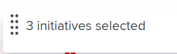

# [!DNL Scenario Planner]에서 이니셔티브 우선 순위 업데이트

이니셔티브는 계획에 나열된 순서대로 계획에서 작업 역할과 예산 리소스를 받기 때문에 이니셔티브의 우선 순위가 중요합니다.

사용자가 생성한 계획이나 다른 사용자가 사용자와 공유한 계획에서 이니셔티브의 우선 순위를 지정할 수 있습니다.

계획 만들기에 대한 자세한 내용은 [계획 만들기 및 편집 [!DNL Scenario Planner]](../scenario-planner/create-and-edit-plans.md)을 참조하세요.

이니셔티브 만들기에 대한 자세한 내용은 [이니셔티브 만들기 및 편집 [!DNL Scenario Planner]](../scenario-planner/create-and-edit-initiatives.md)을 참조하십시오.

## 액세스 요구 사항

+++ 을 확장하여 이 문서의 기능에 대한 액세스 요구 사항을 봅니다. 

<table style="table-layout:auto"> 
 <col> 
 <col> 
 <tbody> 
  <tr> 
   <td> 
[!DNL Adobe Workfront] 패키지
 </td> 
   <td> 
   
Workfront Ultimate

<b>메모</b>

다른 Workfront 패키지가 있는 경우 Workfront 담당자에게 문의하십시오.

   </td> 
  </tr> 
  <tr> 
   <td> 
[!DNL Adobe Workfront] 라이센스
 </td> 
   <td> 
[!UICONTROL Light] 이상
 
   
[!UICONTROL Review] 이상
 </td> 
  </tr> 
    <tr> 
   <td>액세스 수준 구성</td> 
   <td> 
다음에 대한 [!UICONTROL 편집] 액세스 권한: [!DNL Scenario Planner]
 </td> 
  </tr> 
  <tr> 
   <td> 
개체 권한 
 </td> 
   <td> 
플랜에 대한 [!UICONTROL 관리] 권한
 </td> 
  </tr> 
 </tbody> 
</table>

시나리오 플래너에 액세스하는 방법에 대한 자세한 내용은 [을(를) 사용하는 데 필요한 액세스 [!DNL Scenario Planner]](../scenario-planner/access-needed-to-use-sp.md)를 참조하십시오.

Workfront 액세스 요구 사항에 대한 자세한 내용은 [Workfront 설명서에 대한 액세스 요구 사항](/help/quicksilver/administration-and-setup/add-users/access-levels-and-object-permissions/access-level-requirements-in-documentation.md)을 참조하십시오.

+++

<!--<table style="table-layout:auto"> 
 <col> 
 <col> 
 <tbody> 
  <tr> 
   <td> 
[!DNL Adobe Workfront] plan*
 </td> 
   <td> <ul></li>
   <li>
New: Ultimate 
</li>
   
The Scenario Planner is not available for the new Workfront Select or Workfront Prime plans. 

   <li>
Current: [!UICONTROL Business] or higher
</ul>
   </td> 
  </tr> 
  <tr> 
   <td> 
[!DNL Adobe Workfront] license*
 </td> 
   <td> 
New: Light or higher
 
   
Current: [!UICONTROL Review] or higher
 </td> 
  </tr> 
  <tr> 
   <td>Product* </td> 
   <td> <ul><li>
For the new Workfront plans:

 Adobe Workfront</li>

   <li>
For the current Workfront plans: 

   
Adobe Workfront
 
Adobe Workfront Scenario Planner
</li></ul>
   
   
For more information, see <a href="../scenario-planner/access-needed-to-use-sp.md" class="MCXref xref">Access needed to use the [!DNL Scenario Planner]</a>. 
 </td> 
  </tr> 
  <tr data-mc-conditions=""> 
   <td>Access level </td> 
   <td> 
[!UICONTROL Edit] access to the [!DNL Scenario Planner]
 </td> 
  </tr> 
  <tr data-mc-conditions=""> 
   <td> 
Object permissions 
 </td> 
   <td> 
[!UICONTROL Manage] permissions to a plan
 
For information on requesting additional access to a plan, see <a href="../scenario-planner/request-access-to-plan.md" class="MCXref xref">Request access to a plan in the [!DNL Scenario Planner]</a>.
 </td> 
  </tr> 
 </tbody> 
</table>-->

## 이니셔티브 우선 순위 업데이트

이니셔티브의 우선 순위를 변경하면 플랜에 대한 목록 순서를 수정합니다.

계획의 맨 위에 더 긴급한 이니셔티브를 배치하고 계획의 맨 아래에 더 유연한 이니셔티브를 배치하는 것이 좋습니다(언제든지 리소스를 사용할 수 있는 경우에만 수행할 수 있음).

>[!NOTE]
>
>[!DNL Workfront]은(는) 이니셔티브가 계획에 나열된 순서대로 이니셔티브에 계획 리소스를 할당합니다.
>
>예를 들어, 플랜에 사용 가능한 엔지니어가 3명이고, 이니셔티브 1과 이니셔티브 2가 각각 2명의 엔지니어가 완료되어야 하며, 두 엔지니어가 모두 동일한 시간대에 예약되어 있는 경우, Workfront은 엔지니어 2명을 이니셔티브 1과 연결하고 나머지 사용 가능한 엔지니어 1명을 이니셔티브 2와 연결합니다. 이 경우 이니셔티브 2에 엔지니어 한 명이 누락되었기 때문에 충돌이 발생했습니다. 때때로 이니셔티브의 우선 순위를 변경하는 것이 계획에서 충돌을 피할 수 있는 유일한 방법입니다.

이니셔티브 우선순위를 갱신하려면

{{step1-to-scenario-planner}}

계획 목록이 표시됩니다.

1. 계획명을 눌러 계획을 연 다음 우선순위를 지정할 이니셔티브를 찾습니다.
1. 하나 이상의 이니셔티브 이름 왼쪽에 있는 상자를 클릭하고 다음 중 하나를 수행합니다.

   * 선택한 이니셔티브 이름 중 하나의 왼쪽에 있는 핸들을 클릭한 다음 목록에서 위 또는 아래로 드래그하여 이니셔티브의 우선 순위를 변경합니다.

     Workfront에 선택한 이니셔티브 수가 표시됩니다.

     

   * 플랜 하단의 **[!UICONTROL 우선 순위 지정]** 상자를 클릭한 후 다음 옵션 중에서 선택하십시오.

      * **[!UICONTROL 상위]**: 선택한 이니셔티브를 이니셔티브 목록의 맨 위로 이동합니다. 선택한 이니셔티브가 플랜에 먼저 나열됩니다.
      * **[!UICONTROL 아래쪽]**: 선택한 이니셔티브를 이니셔티브 목록의 맨 아래로 이동합니다. 선택한 이니셔티브가 플랜의 마지막 목록에 나열됩니다.
      * **[!UICONTROL 숫자를 선택하세요]**: 선택한 이니셔티브를 여기에 표시된 이니셔티브 뒤로 이동합니다.

        

     [!DNL Workfront]은(는) 선택한 이니셔티브를 지정한 위치에 즉시 배치하고 모든 이니셔티브의 수를 그에 따라 업데이트합니다.

1. 변경 내용을 저장하려면 **[!UICONTROL 계획 저장]**&#x200B;을 클릭하세요.
