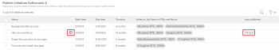
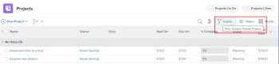
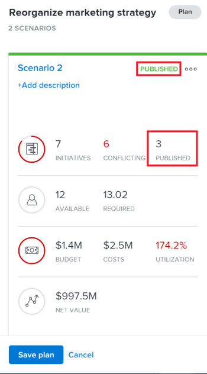

# [!DNL Scenario Planner]에서 이니셔티브를 게시하여 프로젝트 업데이트 또는 만들기

[!DNL Adobe Workfront Scenario Planner]에서 시나리오를 게시하면 다음과 같은 작업이 수행됩니다.

* 시나리오의 이니셔티브에서 프로젝트를 만들고 서로 연결합니다.
* 시나리오의 이니셔티브에 이미 연결된 프로젝트를 연결된 이니셔티브의 정보로 업데이트합니다. 계획을 가져올 때 프로젝트를 이니셔티브에 연결할 수도 있습니다. 자세한 내용은 [계획으로 프로젝트 가져오기 [!DNL Scenario Planner]](../scenario-planner/import-projects-to-plans.md)를 참조하십시오.

## 액세스 요구 사항

다음 항목이 있어야 합니다.

<table style="table-layout:auto"> 
 <col> 
 <col> 
 <tbody> 
  <tr> 
   <td> 
[!DNL Adobe Workfront] 플랜*
 </td> 
   <td>[!UICONTROL Business] 이상</td> 
  </tr> 
  <tr> 
   <td> 
[!DNL Adobe Workfront] 라이센스*
 </td> 
   <td> 
[!UICONTROL Review] 이상
 </td> 
  </tr> 
  <tr> 
   <td>제품 </td> 
   <td> 
이 문서에 설명된 기능에 액세스하려면 [!DNL Adobe Workfront Scenario Planner]에 대한 추가 라이선스를 구입해야 합니다.
 
[!DNL Workfront Scenario Planner]을(를) 얻는 방법에 대한 자세한 내용은 [!DNL Scenario Planner]</a>을(를) 사용하는 데 필요한 <a href="../scenario-planner/access-needed-to-use-sp.md" class="MCXref xref">액세스를 참조하십시오. 
 </td> 
  </tr> 
  <tr data-mc-conditions=""> 
   <td> 

 
액세스 수준*
 </td> 
   <td> 
    <ul> 
    <li>[!DNL Scenario Planner] 및 프로젝트에 대한 [!UICONTROL 편집] 액세스 권한</li></ul>

<b>메모</b>

아직 액세스 권한이 없는 경우 [!DNL Workfront] 관리자에게 액세스 수준에 추가 제한을 설정했는지 문의하십시오. [!DNL Workfront] 관리자가 액세스 수준을 변경하는 방법에 대한 자세한 내용은 <a href="../administration-and-setup/add-users/configure-and-grant-access/create-modify-access-levels.md" class="MCXref xref">사용자 지정 액세스 수준 만들기 또는 수정</a>을 참조하십시오.
 </td>
</tr> 
  <tr data-mc-conditions=""> 
   <td> 
개체 권한
 </td> 
   <td> 
    <ul> 
     <li>플랜에 대한 [!UICONTROL 관리] 권한 </li> 
     <li>게시된 프로젝트에 대한 [!UICONTROL 관리] 권한</li> 
    </ul> 
프로젝트에 대한 추가 액세스 요청에 대한 자세한 내용은 <a href="../workfront-basics/grant-and-request-access-to-objects/request-access.md" class="MCXref xref">개체 </a>에 대한 액세스 요청 을 참조하십시오.
 
플랜에 대한 추가 액세스 요청에 대한 자세한 내용은 <a href="../scenario-planner/request-access-to-plan.md" class="MCXref xref">플랜에 대한 액세스 요청 [!DNL Scenario Planner]</a>을(를) 참조하십시오.
 </td> 
  </tr> 
 </tbody> 
</table>

&#42;플랜, 라이선스 유형 또는 액세스 권한을 확인하려면 [!DNL Workfront] 관리자에게 문의하세요.

[!DNL Workfront Scenario Planner]에 대한 액세스에 대한 자세한 내용은 [을(를) 사용하는 데 필요한 액세스 [!DNL Scenario Planner]](../scenario-planner/access-needed-to-use-sp.md)을(를) 참조하십시오.

## 전제 조건

시작하기 전에:

* 계획에서 이니셔티브를 게시하려면 먼저 계획을 만들고 저장해야 합니다.
* 사용자가 템플릿을 사용하지 않고 프로젝트를 만들 수 있도록 허용 설정은 설정의 프로젝트 환경 설정 영역에서 활성화해야 합니다. 자세한 내용은 [시스템 전체 프로젝트 환경 설정 구성](/help/quicksilver/administration-and-setup/set-up-workfront/configure-system-defaults/set-project-preferences.md)을 참조하십시오.

## 프로젝트에 이니셔티브 게시 관련 고려 사항

* 플랜에서 하나의 시나리오만 게시할 수 있습니다.
* 하나의 이니셔티브는 하나의 프로젝트에만 연결할 수 있습니다.
* 이니셔티브가 서로 다른 계획에 속하는 경우 하나의 프로젝트가 두 개 이상의 이니셔티브에 연결될 수 있습니다.

  >[!TIP]
  >
  >프로젝트가 여러 계획에 있고 모든 계획의 정보를 프로젝트에 게시하면 최신 게시가 프로젝트의 기존 [!DNL Scenario Planner] 정보를 덮어씁니다.

* 프로젝트를 플랜으로 가져와서 플랜에 이니셔티브가 생성된 경우 이니셔티브를 게시하면 연결된 프로젝트도 이니셔티브 정보로 업데이트됩니다.

  >[!TIP]
  >
  >동일한 프로젝트를 여러 플랜으로 가져올 수 있습니다. 게시하면 여러 이니셔티브에 연결된 프로젝트의 이니셔티브 정보를 덮어쓸 수 있습니다.

  프로젝트를 가져와서 이니셔티브를 만드는 방법에 대한 자세한 내용은 [프로젝트를  [!DNL Scenario Planner]](../scenario-planner/import-projects-to-plans.md)의 플랜에 가져오기 를 참조하십시오.

* 프로젝트에 대한 변경 사항이 연결된 이니셔티브로 전송되지 않습니다.

## 이니셔티브 게시

>[!IMPORTANT]
>
>충돌 해결을 포함하여 계획에 대한 이니셔티브를 변경하는 경우 프로젝트에 새 정보를 표시하려면 이니셔티브를 다시 게시해야 합니다. 이 정보는 해당 이니셔티브를 게시하는 경우에만 이니셔티브에 연결된 프로젝트에 표시됩니다. 이니셔티브 간 충돌 해결에 대한 자세한 내용은 [이니셔티브 충돌 해결 [!DNL Scenario Planner]](../scenario-planner/resolve-conflicts-in-sp.md)을 참조하십시오.

1. Workfront 오른쪽 상단의 **[!UICONTROL 기본 메뉴]** 아이콘 을(를) 클릭한 다음 **[!UICONTROL 시나리오]**&#x200B;를 클릭합니다
1. (선택 사항 및 조건부) 기존 플랜에서 게시하려면 플랜의 오른쪽 상단에 있는 **[!UICONTROL 필터]** 아이콘 을(를) 클릭하고 다음 옵션 중 하나를 선택하십시오.

   <table style="table-layout:auto"> 
    <col> 
    <col> 
    <tbody> 
     <tr> 
      <td role="rowheader">[!UICONTROL All]</td> 
      <td>사용자가 소유하거나 사용자와 공유하는 모든 플랜을 표시합니다. 이것이 기본값입니다. </td> 
     </tr> 
     <tr> 
      <td role="rowheader">[!UICONTROL 내 플랜]</td> 
      <td>생성한 계획을 표시합니다.</td> 
     </tr> 
     <tr> 
      <td role="rowheader">[!UICONTROL 나와 공유]</td> 
      <td> 
작성하지 않았지만 사용자와 공유된 계획을 표시합니다.
 
중요: 계획을 게시하려면 공유된 계획에 대한 [!UICONTROL 관리] 권한이 있어야 합니다. 
 </td> 
     </tr> 
    </tbody> 
   </table>

   

1. (선택 사항) **[!UICONTROL 검색]** 아이콘 을(를) 클릭하고 플랜 이름을 입력하여 목록에서 빠르게 찾을 수 있습니다.
1. (조건부) 신규 계획에서 게재하려면 계획을 생성합니다.

   계획 만들기에 대한 자세한 내용은 [다음에서 계획 만들기 및 편집 [!DNL Scenario Planner]](../scenario-planner/create-and-edit-plans.md) 을 참조하십시오.

1. (선택사항) 기존 계획명을 누르고 계획에 대한 새 시나리오를 생성합니다.

   플랜에 대한 시나리오를 만드는 방법에 대한 자세한 내용은 [계획 시나리오 만들기 및 비교 [!DNL Scenario Planner]](../scenario-planner/create-and-compare-scenarios-for-a-plan.md)를 참조하십시오.

1. (선택사항) 기존 또는 신규 계획의 이니셔티브를 갱신하거나 신규 계획을 생성합니다.

   이니셔티브 만들기에 대한 자세한 내용은 [이니셔티브 만들기 및 편집 [!DNL Scenario Planner]](../scenario-planner/create-and-edit-initiatives.md)을 참조하십시오.

1. **[!UICONTROL 플랜 저장]**&#x200B;을 클릭합니다.
1. **[!UICONTROL 초기 시나리오]** 드롭다운 메뉴에서 게시할 시나리오를 선택한 다음 오른쪽 상단의 **[!UICONTROL Publish으로 이동]** 을 클릭합니다.

   또는

   **[!UICONTROL 시나리오 비교]**&#x200B;를 클릭하고 게시할 시나리오 카드 위로 마우스를 가져간 다음 **[!UICONTROL Publish으로 이동]** 을 클릭합니다.

   시나리오의 모든 이니셔티브 목록을 표시하는 [!UICONTROL Publish 이니셔티브] 페이지가 표시됩니다. 이니셔티브가 이전에 게시된 경우 프로젝트 아이콘 이(가) 이름 뒤에 표시되고 **[!UICONTROL 마지막으로 게시됨]** 날짜가 목록에 채워집니다.

   >[!TIP]
   >
   >프로젝트를 가져와서 만든 이니셔티브의 이름 오른쪽에 프로젝트 아이콘 도 표시됩니다

   

1. (선택 사항 및 조건부) 기존 플랜에서 게시하려면 플랜의 오른쪽 상단에 있는 **[!UICONTROL 필터]** 아이콘 을(를) 클릭하고 다음 옵션 중 하나를 선택하십시오.

   <table style="table-layout:auto"> 
    <col> 
    <col> 
    <tbody> 
     <tr> 
      <td role="rowheader">[!UICONTROL All]</td> 
      <td>선택한 시나리오의 모든 이니셔티브를 표시합니다. </td> 
     </tr> 
     <tr> 
      <td role="rowheader">[!UICONTROL Published]</td> 
      <td>사용자 또는 다른 사용자가 이전에 게시한 이니셔티브를 표시합니다. </td> 
     </tr> 
     <tr> 
      <td role="rowheader">[!UICONTROL Unpublished]</td> 
      <td> 
게시되지 않은 이니셔티브를 표시합니다. 
 </td> 
     </tr> 
    </tbody> 
   </table>

   

1. (선택 사항) **[!UICONTROL 검색]** 아이콘 을(를) 클릭하고 이니셔티브 이름을 입력하여 목록에서 빠르게 찾을 수 있습니다.
1. 하나 이상의 이니셔티브를 선택하여 게시하고 해당 이니셔티브에서 프로젝트를 만들거나 업데이트한 다음 **[!UICONTROL Publish 이니셔티브]**&#x200B;를 클릭하십시오.

   이렇게 하면 선택한 각 이니셔티브에서 새 프로젝트가 생성되거나 게시된 이니셔티브가 이미 프로젝트에 연결된 경우 기존 연결된 프로젝트가 업데이트됩니다.

   >[!TIP]
   >
   >새 프로젝트의 이름이 게시된 이니셔티브와 동일합니다.

1. (조건부) 다음 중 하나를 수행합니다.

   * 이니셔티브 하나를 게시한 경우 **[!UICONTROL 관련 프로젝트 보기]**&#x200B;를 클릭하여 이니셔티브에서 만들거나 업데이트한 프로젝트를 엽니다.
   * 두 개 이상의 이니셔티브를 게시한 경우 **[!UICONTROL 관련 프로젝트 보기]**&#x200B;를 클릭하여 이니셔티브에서 게시된 프로젝트 목록을 엽니다. [!DNL Workfront]은(는) 기본적으로 [!DNL Scenario Planner] 프로젝트 필터를 프로젝트 목록에 적용합니다. 가장 최근에 게시된 프로젝트가 목록 맨 위에 표시됩니다.

     

1. 프로젝트에 대한 이니셔티브 정보를 보려면 다음 영역으로 이동하십시오.

   * **[!UICONTROL 업데이트] 섹션**: 프로젝트가 이니셔티브에서 만들어졌거나 업데이트되었음을 나타내는 업데이트가 게시됩니다. 업데이트에는 프로젝트를 만들거나 업데이트한 이니셔티브의 이름과 이니셔티브가 포함된 플랜의 연결된 이름이 포함됩니다. 업데이트에서 플랜 이름을 클릭하여 [!DNL Scenario Planner]에서 플랜을 열 수 있습니다.

     

   * **[!UICONTROL 프로젝트 세부 정보] 섹션**&#x200B;의 [!UICONTROL 개요] 영역: 이 영역에 연결된 이니셔티브의 정보를 포함하는 새 [!DNL Scenario Planner] 섹션이 만들어집니다.

     

     다음 이니셔티브 정보가 [!UICONTROL 프로젝트 세부 정보] 섹션의 [!DNL Scenario Planner] 영역에 게시되었습니다.

     <table style="table-layout:auto"> 
      <col> 
      <col> 
      <tbody> 
       <tr> 
        <td role="rowheader">[!UICONTROL Initiative Duration] </td> 
        <td>프로젝트가 이니셔티브에 연결되어 있는 경우 해당 이니셔티브의 기간입니다. 이 필드는 편집할 수 없습니다. </td> 
       </tr> 
       <tr> 
        <td role="rowheader">[!UICONTROL 마지막 게시 날짜] </td> 
        <td>해당 이니셔티브에서 프로젝트를 마지막으로 게시한 날짜입니다. </td> 
       </tr> 
       <tr> 
        <td role="rowheader">[!UICONTROL 이니셔티브 시작 날짜] </td> 
        <td>프로젝트가 이니셔티브에 연결된 이니셔티브 시작 월의 첫째 날입니다. </td> 
       </tr> 
       <tr> 
        <td role="rowheader">[!UICONTROL 이니셔티브 종료 날짜] </td> 
        <td>프로젝트가 이니셔티브에 연결된 이니셔티브 종료 달의 마지막 날입니다.  </td> 
       </tr> 
       <tr> 
        <td role="rowheader">FTE 및 시간의 [!UICONTROL 이니셔티브 작업 역할] </td> 
        <td> 
이니셔티브에 연결된 작업 역할 및 시간 할당에 대한 정보입니다. 여기에는 다음이 포함됩니다.
 
         <ul> 
          <li>작업 역할 이름</li> 
          <li>FTE 수</li> 
          <li> 
모든 FTE의 시간 수
 
시간이나 FTE를 사용하여 계획 또는 이니셔티브에 필요한 작업 역할의 양을 예상할 수 있습니다.
 
자세한 내용은 <a href="../scenario-planner/create-and-edit-plans.md" class="MCXref xref">시나리오 플래너에서 계획 만들기 및 편집</a>을 참조하십시오. 
 </li> 
         </ul> 
      
<b>팁</b>

     이니셔티브에서 매월 작업 역할 수가 다른 경우 이 필드에 이니셔티브에 필요한 최대 역할 수가 표시됩니다. 예를 들어, 1월에 컨설턴트 1명이 필요하고 2월에 컨설턴트 2명이 필요한 경우 열에 2FTE와 모든 달에 대한 2FTE의 해당 시간이 표시됩니다.
 </td>
     </tr> 
      </tbody> 
     </table>

     >[!NOTE]
     >
     >프로젝트에 대한 [!UICONTROL 보기] 액세스 권한이 있는 모든 사용자는 [!UICONTROL 개요] 영역에서 [!DNL Scenario Planner] 섹션을 볼 수 있습니다. 레이아웃 템플릿을 사용하여 [!UICONTROL 세부 정보] 섹션에 이 영역을 표시할지 여부를 제어할 수 있습니다. 사용자에게 연결된 레이아웃 템플릿이 없는 경우 기본적으로 이 영역이 표시됩니다.
     >
     >   
     >   
     >   * 레이아웃 템플릿을 사용하여 [!UICONTROL 세부 정보] 섹션에서 영역을 추가하거나 제거하는 방법에 대한 자세한 내용은 [레이아웃 템플릿을 사용하여 [!UICONTROL 세부 정보] 보기 사용자 지정](../administration-and-setup/customize-workfront/use-layout-templates/customize-details-view-layout-template.md)을 참조하십시오.
     >   * [!UICONTROL 프로젝트 세부 정보]의 [!UICONTROL 개요] 영역에서 정보를 보는 방법에 대한 자세한 내용은 프로젝트 [!UICONTROL 개요] 영역](../manage-work/projects/manage-projects/understand-project-overview-area.md)에서 [[!UICONTROL 관리] 정보를 참조하십시오.
     >   
     >

   * **[!UICONTROL 업무 균형자] 또는 프로젝트의 작업 목록에 있는 [!UICONTROL 역할 할당] 패널**: 프로젝트의 역할 할당 외에 이 영역에 이니셔티브의 역할 할당에 대한 정보가 표시됩니다.

     자세한 내용은 [프로젝트 및 이니셔티브 간 리소스 할당 조정 개요](../scenario-planner/overview-reconcile-allocations-between-projects-initiatives.md)를 참조하십시오.

     

     프로젝트의 날짜 또는 리소스에 대한 변경 사항은 해당 이니셔티브나 이니셔티브 정보가 포함된 프로젝트 영역에 영향을 주지 않습니다.

   * **프로젝트의 [!UICONTROL 비즈니스 사례]에 있는 [!UICONTROL 리소스 예산 편성] 영역**: [!DNL Scenario Planner] 정보를 사용하여 프로젝트 리소스를 관리하는 새로운 옵션이 프로젝트의 [!UICONTROL 비즈니스 사례]에 있는 [!UICONTROL 리소스 예산 편성] 영역에 추가되었습니다.

     자세한 내용은  [!DNL Scenario Planner]](../manage-work/projects/define-a-business-case/budget-resources-in-business-case-use-scenario-planner.md)을(를) 사용하여 [!UICONTROL 비즈니스 사례]의 [예산 리소스를 참조하십시오.

     

1. (선택 사항) 시나리오를 게시한 후 [!DNL Scenario Planner]에서 다음 정보를 검토하십시오.

   * 게시된 시나리오는 이니셔티브를 게시한 후 첫 번째 시나리오가 됩니다.
   * 시나리오를 한 번 이상 게시한 후에는 다른 시나리오에서 게시할 수 없습니다.
   * 시나리오에서 하나 이상의 이니셔티브가 게시된 후 다른 모든 시나리오에서 [!UICONTROL Publish으로 이동] 옵션이 제거됩니다.
   * 플랜에서 게시된 이니셔티브의 프로젝트 아이콘 옆에 녹색 표시기가 표시됩니다.

     

   * 시나리오 상단과 시나리오 카드에 녹색 &quot;게시됨&quot; 표시기가 표시되고, 게시된 필드는 게시된 시나리오의 이니셔티브 수를 나타내는 시나리오 카드에 채워집니다.

     

     >[!TIP]
     >
     >시나리오의 이니셔티브에서 게시된 모든 프로젝트가 삭제되면 시나리오가 게시되었다는 표시가 제거됩니다. 자세한 내용은 [프로젝트 삭제](../manage-work/projects/manage-projects/delete-projects.md)를 참조하십시오.

1. (선택 사항) 이니셔티브에 대한 정보를 업데이트하고 위에 설명된 프로세스를 반복하여 이니셔티브를 다시 게시하고 연결된 프로젝트에 대한 이니셔티브 정보를 업데이트합니다.

   이니셔티브 편집에 대한 자세한 내용은 [이니셔티브 만들기 및 편집 [!DNL Scenario Planner]](../scenario-planner/create-and-edit-initiatives.md)을 참조하십시오.

