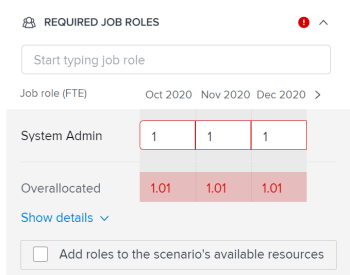
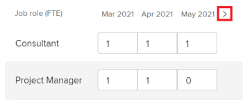

# [!DNL Scenario Planner]에서 이니셔티브 충돌 해결

이니셔티브가 서로 충돌하면 동일한 리소스를 놓고 경쟁합니다. 시나리오에 사용할 수 있는 리소스만으로는 시나리오의 모든 이니셔티브에 필요한 모든 리소스를 커버할 수 없습니다.

이 문제는 다음 경우에 발생할 수 있습니다.

* 이니셔티브에 필요한 작업 역할의 수가 플랜에 예산 책정된 역할의 수보다 큽니다.
* 이니셔티브의 비용이 플랜에 사용할 수 있는 예산 금액보다 큽니다.

## 액세스 요구 사항

+++ 을 확장하여 이 문서의 기능에 대한 액세스 요구 사항을 봅니다. 

<table style="table-layout:auto"> 
 <col> 
 <col> 
 <tbody> 
  <tr> 
   <td> 
[!DNL Adobe Workfront] 패키지
 </td> 
   <td> 
   
Workfront Ultimate

<b>메모</b>

다른 Workfront 패키지가 있는 경우 Workfront 담당자에게 문의하십시오.

   </td> 
  </tr> 
  <tr> 
   <td> 
[!DNL Adobe Workfront] 라이센스
 </td> 
   <td> 
[!UICONTROL Light] 이상
 
   
[!UICONTROL Review] 이상
 </td> 
  </tr> 
    <tr> 
   <td>액세스 수준 구성</td> 
   <td> 
다음에 대한 [!UICONTROL 편집] 액세스 권한: [!DNL Scenario Planner]
 </td> 
  </tr> 
  <tr> 
   <td> 
개체 권한 
 </td> 
   <td> 
플랜에 대한 [!UICONTROL 관리] 권한
 </td> 
  </tr> 
 </tbody> 
</table>

시나리오 플래너에 액세스하는 방법에 대한 자세한 내용은 [을(를) 사용하는 데 필요한 액세스 [!DNL Scenario Planner]](../scenario-planner/access-needed-to-use-sp.md)를 참조하십시오.

Workfront 액세스 요구 사항에 대한 자세한 내용은 [Workfront 설명서에 대한 액세스 요구 사항](/help/quicksilver/administration-and-setup/add-users/access-levels-and-object-permissions/access-level-requirements-in-documentation.md)을 참조하십시오.

+++

<!--Old:

<table style="table-layout:auto"> 
 <col> 
 <col> 
 <tbody> 
  <tr> 
   <td> 
[!DNL Adobe Workfront] plan*
 </td> 
   <td> <ul></li>
   <li>
New: Ultimate 
</li>
   
The Scenario Planner is not available for the new Workfront Select or Workfront Prime plans. 

   <li>
Current: [!UICONTROL Business] or higher
</ul>
   </td> 
  </tr> 
  <tr> 
   <td> 
[!DNL Adobe Workfront] license*
 </td> 
   <td> 
New: Light or higher
 
   
Current: [!UICONTROL Review] or higher
 </td> 
  </tr> 
  <tr> 
   <td>Product* </td> 
   <td> <ul><li>
For the new Workfront plans:

 Adobe Workfront</li>

   <li>
For the current Workfront plans: 

   
Adobe Workfront
 
Adobe Workfront Scenario Planner
</li></ul>
   
   
For more information, see <a href="../scenario-planner/access-needed-to-use-sp.md" class="MCXref xref">Access needed to use the [!DNL Scenario Planner]</a>. 
 </td> 
  </tr> 
  <tr data-mc-conditions=""> 
   <td>Access level </td> 
   <td> 
[!UICONTROL Edit] access to the [!DNL Scenario Planner]
 </td> 
  </tr> 
  <tr data-mc-conditions=""> 
   <td> 
Object permissions 
 </td> 
   <td> 
[!UICONTROL Manage] permissions to a plan
 
For information on requesting additional access to a plan, see <a href="../scenario-planner/request-access-to-plan.md" class="MCXref xref">Request access to a plan in the [!DNL Scenario Planner]</a>.
 </td> 
  </tr> 
 </tbody> 
</table>-->

## 충돌 해결 개요

* 갈등은 또한 작업 역할의 초과 할당 또는 시나리오의 예산으로 이해된다.
* [!DNL Workfront]에서 충돌을 감지하면 이니셔티브 기간 동안 충돌하는 월에 해당하는 막대가 빨간색으로 표시됩니다. 이 문제는 다음 경우에 발생할 수 있습니다.

   * 이전 모든 이니셔티브에서 플랜에 대해 예산이 책정된 자원을 사용한 후 이니셔티브에 대해 매월 필요한 작업 역할의 수가 플랜에 대해 예산이 책정된 역할의 수보다 큽니다.
   * 이전 모든 이니셔티브가 해당 플랜의 예산을 사용하여 비용을 충당한 후 이니셔티브의 월별 비용은 플랜에 사용할 수 있는 예산보다 큽니다.

>[!TIP]
>
>기본적으로 [!DNL Scenario Planner]은(는) 사용자가 0개의 작업 역할과 $0에 대해 예산을 책정했거나, 별도로 지정하지 않은 경우 시나리오에 대해 시스템 통화로 $0에 해당하는 예산을 책정했다고 가정합니다. 작업 역할 수는 작업 역할에 대해 예산이 책정된 FTE(FTE) 수 또는 시간을 나타냅니다.
>
>시나리오 플래너의 모든 계산에 대해 Workfront은 다음 값을 사용합니다. 1 FTE = 8 시간.
>
>플랜 및 예산에 사용할 수 있는 역할을 업데이트하는 방법에 대한 자세한 내용은 [다음에서 계획 만들기 및 편집 [!DNL Scenario Planner]](../scenario-planner/create-and-edit-plans.md)을 참조하세요.

* 다음 중 하나를 수행하여 충돌을 해결할 수 있습니다.

   * 시나리오의 이니셔티브에서 누락된 필수 리소스를 자동으로 추가합니다. 이 문서에서는 이 옵션을 사용하여 충돌을 해결하는 방법에 대해 설명합니다.
   * 계획을 편집하여 시나리오에 대한 작업 역할 및 예산 리소스 조정 자세한 내용은 [계획 만들기 및 편집 [!DNL Scenario Planner]](../scenario-planner/create-and-edit-plans.md)을 참조하세요.

## 이니셔티브 간 충돌 해결

1. 충돌을 해결할 플랜으로 이동합니다.

   계획 만들기에 대한 자세한 내용은 [계획 만들기 및 편집 [!DNL Scenario Planner]](../scenario-planner/create-and-edit-plans.md)을 참조하세요.

   이니셔티브 만들기에 대한 자세한 내용은 [이니셔티브 만들기 및 편집 [!DNL Scenario Planner]](../scenario-planner/create-and-edit-initiatives.md)을 참조하십시오.

1. (선택 사항) **[!DNL Initial scenario]** 드롭다운 메뉴에서 검토할 시나리오를 선택합니다.

   >[!TIP]
   >
   >계획에는 여러 가지 시나리오가 있을 수 있습니다. 계획의 충돌을 볼 때 [!DNL Workfront]은(는) 선택한 시나리오에서 현재 사용할 수 있는 리소스와 해당 시나리오의 이니셔티브에 필요한 리소스를 참조합니다. 시나리오에 대한 자세한 내용은 [에서  [!DNL Scenario Planner]](../scenario-planner/create-and-compare-scenarios-for-a-plan.md)계획 시나리오 만들기 및 비교를 참조하십시오.

1. **[!UICONTROL 충돌 표시]**&#x200B;가 활성화되어 있는지 확인하십시오. 기본적으로 활성화되어 있습니다.

   

   충돌하는 첫 번째 이니셔티브는 충돌이 발생한 월을 빨간색으로 표시하고 이니셔티브 이름 옆에 경고 아이콘이 표시됩니다.

   첫 번째 충돌하는 이니셔티브로 시작하는 모든 이니셔티브의 배경은 계획 차트에 빨간색으로 표시됩니다.

   이니셔티브에 충돌이 표시되면 하나 이상의 특정 역할에 대한 작업 역할 수, 발생한 비용 또는 둘 다가 특정 월에 대한 플랜에 정의된 작업 역할 수 또는 예산을 초과함을 의미합니다.

   

1. 존재할 수 있는 충돌에 대해 자세히 이해하려면 다음 중 하나를 수행하십시오.

   * 작업 역할 또는 예산 충돌 여부를 이해하려면 이니셔티브 이름 옆에 있는 경고 아이콘 위로 마우스를 가져갑니다.

     

     이니셔티브에 대해 작업 역할을 초과 할당했는지 또는 비용을 초과 할당했는지에 따라 마우스로 경고 아이콘을 가리키면 다음 옵션 중 하나가 표시될 수 있습니다.

      * 작업 역할 충돌 세부 정보 보기
      * 예산 충돌 세부 정보 보기
      * 작업 역할 및 예산 세부 정보 표시

   * 월별 계획을 볼 때 계획의 타임라인에서 한 달을 마우스로 가리키면 해당 달에 필요한 리소스와 해당 달에 대한 충돌이 인력 또는 비용 관련 충돌인지 확인할 수 있습니다.

     

     계획 레벨에서 다음 월별 정보를 검토합니다.

      * 해당 월에 계획된 모든 이니셔티브에 대한 해당 월의 가용, 필수 및 초과 할당 작업 역할 수
      * 해당 월에 계획된 모든 이니셔티브에 대한 해당 월의 가용, 필수 및 초과 할당 비용

        >[!TIP]
        >
        >[!UICONTROL 사용 가능] 비용은 해당 달의 시나리오 예산입니다.

   * 한 달 동안 이니셔티브의 빨간색 막대 위로 마우스를 가져가면 해당 달에 발생한 충돌에 대한 추가 정보 상자가 표시됩니다.

     

     이니셔티브 수준의 추가 정보 상자에서 다음 필드를 검토하십시오.

     <table style="table-layout:auto"> 
      <col> 
      <col> 
      <tbody> 
       <tr> 
        <td role="rowheader">충돌이 발생하는 월</td> 
        <td>추가 정보 상자의 제목에 표시됩니다.</td> 
       </tr> 
       <tr> 
        <td role="rowheader">이니셔티브 이름</td> 
        <td>추가 정보 상자의 제목에 표시됩니다.</td> 
       </tr> 
       <tr> 
        <td role="rowheader">[!UICONTROL 작업 역할]</td> 
        <td> 
선택한 월에 초과 할당된 이 이니셔티브와 연결된 작업 역할입니다. 다음 열에는 선택한 달에 필요하고 해당 달에 사용할 수 있는 작업 역할의 수와 충돌하는 각 작업 역할에 대한 정보가 표시됩니다.
 
         <ul> 
          <li> 
<strong>[!UICONTROL 사용 가능]</strong>: 선택한 달의 시나리오에서 사용 가능한 각 작업 역할의 수입니다.
 </li> 
          <li> 
<strong>[!UICONTROL 필수]</strong>: 선택한 월의 이니셔티브에 필요한 각 작업 역할의 수입니다.
 </li> 
          <li> 
<strong>[!UICONTROL 초과 할당됨]:</strong> 이니셔티브에 필요한 숫자와 시나리오에서 사용 가능한 숫자의 차이입니다. 
 </li> 
         </ul> 
팁: 경우에 따라 [!UICONTROL 사용 가능] 역할 수가 [!UICONTROL 필수] 역할 수와 일치하거나 더 많지만 [!DNL Scenario Planner]에 초과 할당이 표시됩니다. 즉, 동일한 달의 플랜에서 사용 가능한 작업 역할을 이미 사용한 상위 이니셔티브가 있습니다. 
 </td> 
       </tr> 
       <tr> 
        <td role="rowheader">비용</td> 
        <td> 
선택한 월의 이니셔티브 비용. 다음 열에는 필요한 비용 및 선택한 월의 가용 예산에 대한 정보가 표시됩니다.
 
         <ul> 
          <li> 
<strong>[!UICONTROL 사용 가능]</strong>: 선택한 달의 플랜에서 사용할 수 있는 예산입니다.
 </li> 
          <li> 
<strong>[!UICONTROL 필수]</strong>: 선택한 달의 이 이니셔티브와 관련된 비용입니다.
 </li> 
          <li> 
<strong>[!UICONTROL 초과 할당됨]:</strong> 이니셔티브 비용과 플랜에서 사용할 수 있는 예산의 차이입니다. 
 </li> 
         </ul> 
팁: 경우에 따라 [!UICONTROL 사용 가능] 비용이 선택한 월의 이니셔티브의 [!UICONTROL 필수] 비용보다 높거나 일치하지만 [!DNL Scenario Planner]에 여전히 비용이 과도하게 할당되어 있습니다. 이는 이미 같은 달 플랜에 사용 가능한 예산을 사용하는 상위 이니셔티브가 있음을 의미합니다. 
 </td> 
       </tr> 
      </tbody> 
     </table>

1. 다음 중 하나를 수행하여 [이니셔티브 세부 정보] 패널을 열고 충돌이 발생하는 위치에 대한 자세한 정보를 확인하고 해결합니다.

   * 이니셔티브 이름 옆에 있는 경고 아이콘을 클릭합니다.
   * 이니셔티브의 막대를 클릭합니다.
   * 이니셔티브 이름 오른쪽에 있는 **[!UICONTROL 자세히]** 아이콘 을 클릭한 다음 **[!UICONTROL 편집]**&#x200B;을 클릭합니다.

     이니셔티브 세부 사항 패널이 오른쪽에 표시됩니다.

     이니셔티브에 사용할 수 있는 인원이나 예산이 충분하지 않은 경우 다음 섹션 옆에 빨간색 경고 아이콘이 표시됩니다.

   * [!UICONTROL 필요한 작업 역할]
   * [!UICONTROL 비용]

1. (조건부) 작업 역할 충돌이 있는 이니셔티브의 경우 **[!UICONTROL 필수 작업 역할]** 섹션으로 이동하여 이니셔티브에 필요한 모든 작업 역할을 확인하십시오. 초과 할당할 수 있는 작업 역할을 식별합니다. 이니셔티브의 각 달에 대한 각 작업 역할에 필요한 FTE 수 또는 시간을 검토하십시오. 초과 할당이 있는 달의 FTE 또는 시간 번호가 있는 상자가 빨간색 아웃라인으로 표시됩니다.

   

1. (선택 사항) 이니셔티브 타임라인에서 월 옆에 있는 오른쪽 화살표를 클릭하여 작업 역할 충돌이 표시되는 추가 월을 확인합니다.

   

1. (선택 사항) 충돌을 표시하는 작업 역할의 **[!UICONTROL 세부 정보 표시]**&#x200B;를 클릭하여 충돌이 나타나는 위치를 확인하고 계획의 차트 영역에서 충돌하는 월을 강조 표시합니다. 각 작업 역할에 대한 추가 정보가 표시됩니다.

   각 작업 역할에 대해 다음 필드가 표시됩니다.

   <table style="table-layout:auto"> 
    <col> 
    <col> 
    <tbody> 
     <tr> 
      <td role="rowheader">[!UICONTROL 사용 가능]</td> 
      <td> 
월별 플랜에서 사용할 수 있는 작업 역할의 수입니다. 
 </td> 
     </tr> 
     <tr> 
      <td role="rowheader">[!UICONTROL Previous allocated]</td> 
      <td>특정 달 동안 계획의 예산에서 상위 이니셔티브로 이미 할당된 작업 역할의 수입니다. </td> 
     </tr> 
     <tr> 
      <td role="rowheader">[!UICONTROL 초과 할당됨]</td> 
      <td> 
이니셔티브에 필요한 작업 역할의 수와 상위 이니셔티브 후 계획에서 사용할 수 있는 수의 차이도 일부 역할을 사용했습니다. Workfront은 다음 공식을 사용하여 [!UICONTROL Overallocated] 작업 역할의 수를 계산합니다.
 
<code>Overallocated roles = (Roles Previously Allocated to higher initiatives + Required roles for current initiative) - Monthly available roles from the plan</code> 
 </td> 
     </tr> 
    </tbody> 
   </table>

   >[!TIP]
   >
   >계획의 차트에서 작업 역할이 할당된 달에는 필요한 각 이니셔티브에 필요한 역할의 이름과 수가 표시됩니다. 작업 역할의 이름을 보려면 [!UICONTROL 월] 보기를 선택해야 합니다.

   

1. 작업 역할 충돌을 해결하려면 다음 중 하나를 수행합니다.

   * 이니셔티브의 각 달에 대한 작업 역할 수를 더 낮은 숫자로 수동으로 조정합니다.
   * 작업 역할의 이름 위로 마우스를 가져간 후 **[!UICONTROL 삭제] 아이콘** 을 클릭하여 이니셔티브에서 작업 역할을 제거합니다.
   * **[!UICONTROL 시나리오의 사용 가능한 리소스에 역할 추가]**&#x200B;를 선택한 다음 **[!UICONTROL 적용]**&#x200B;을 클릭합니다.

     이렇게 하면 누락된 작업 역할 FTE 수 또는 시간이 시나리오의 [!UICONTROL 사용 가능] 필드에 추가됩니다.

     >[!NOTE]
     >
     >충돌을 해결하기 위해 추가하는 역할은 플랜의 모든 시나리오가 아닌 선택한 시나리오에 대해 [!UICONTROL 사용 가능한] 작업 역할을 수정합니다.

     플랜의 타임라인에서 해당 월의 위쪽 방향 녹색 화살표 가 표시되어 해당 달에 더 많은 리소스가 플랜에 추가되었음을 나타냅니다. 이 표시기를 보려면 [!UICONTROL 월] 보기를 선택해야 합니다.

   * (조건부) 상세내역 패널을 닫고 가능한 경우 먼저 계획에서 예산 자원을 받을 수 있도록 이니셔티브에 더 높은 우선순위를 지정합니다. 이니셔티브 우선 순위 업데이트에 대한 자세한 내용은 [시나리오 플래너에서 이니셔티브 우선 순위 업데이트](../scenario-planner/prioritize-initiatives.md)를 참조하십시오.

1. (선택 사항) **[!UICONTROL 세부 정보 숨기기]**&#x200B;를 클릭하여 추가 세부 정보 상자를 닫은 다음 **[!UICONTROL 적용]**&#x200B;을 클릭하여 작업 역할에 대한 변경 사항을 저장합니다.

1. (조건부) 비용 충돌이 있는 이니셔티브의 경우 이니셔티브 세부 정보 패널의 **[!UICONTROL 비용]** 섹션으로 이동하여 이니셔티브 기간 동안 매달 비용을 검토하십시오. 선택한 이니셔티브의 비용을 충당하기에 플랜 예산에 충분한 자금이 없을 수 있는 월을 식별합니다. 사용 가능한 예산이 충분하지 않은 상자가 빨간색 아웃라인에 표시됩니다.
1. (선택 사항) 이니셔티브 타임라인에서 월 옆에 있는 오른쪽 화살표를 클릭하면 비용을 충당하기에 예산이 부족한 추가 월을 볼 수 있습니다.

   

1. (선택 사항) 비용 정보 아래의 **[!UICONTROL 세부 정보 표시]**&#x200B;를 클릭하여 충돌이 나타나는 위치를 확인하고 계획 차트에서 충돌하는 월을 강조 표시합니다. 각 비용 유형에 대해 다음과 같은 추가 필드가 표시됩니다.

   <table style="table-layout:auto"> 
    <col> 
    <col> 
    <tbody> 
     <tr> 
      <td role="rowheader">[!UICONTROL 사용 가능]</td> 
      <td> 
매월 플랜 예산에서 사용할 수 있는 비용. 
 </td> 
     </tr> 
     <tr> 
      <td role="rowheader">[!UICONTROL Previous allocated]</td> 
      <td>계획 예산에서 상위 이니셔티브로 이미 할당된 금액. </td> 
     </tr> 
     <tr> 
      <td role="rowheader">[!UICONTROL 초과 할당됨]</td> 
      <td> 
상위 이니셔티브 이후 이니셔티브에 필요한 비용과 계획 예산에서 사용 가능한 금액의 월별 차이도 사용 가능한 예산의 일부를 사용하였다. [!DNL Workfront]은(는) 다음 공식을 사용하여 초과 할당된 비용의 수를 계산합니다.
 
<code>Overallocated costs = (Costs Previously Allocated to higher initiatives + Required costs for the current initiative) - Monthly available budget from the plan</code> 
 
[!DNL Workfront] 다음 공식을 사용하여 각 달의 현재 이니셔티브에 대한 필수 비용을 계산합니다.
 
<code>Required initiative costs = Initiative Fixed Costs + Initiative People Costs</code> 
 </td> 
     </tr> 
    </tbody> 
   </table>

   >[!TIP]
   >
   >플랜의 차트에 비용이 부족한 월이 이니셔티브에 필요한 이름과 역할 수를 표시합니다. 비용 금액을 보려면 월 보기를 선택해야 합니다.

   

   >[!NOTE]
   >
   >플랜을 만들 때 플랜의 [!UICONTROL 예산] 상자에 대해 [!UICONTROL 인력 비용 포함] 설정을 사용하지 않도록 설정한 경우 시나리오에 관계없이 이니셔티브에 대해 [!UICONTROL 인력 비용] 줄이 표시되지 않습니다. 이 경우 Workfront은 비용 충돌을 결정하기 위해 사람 비용을 계산에 넣지 않습니다. 플랜 만들기에 대한 자세한 내용은 [다음에서 플랜 만들기 및 편집 [!DNL Scenario Planner]](../scenario-planner/create-and-edit-plans.md)을 참조하세요.

1. 다음 중 하나를 수행하여 비용 충돌을 해결합니다.

   * 이니셔티브의 각 달에 대한 [!UICONTROL 고정 비용]의 수를 더 낮은 숫자로 수동으로 조정하십시오.
   * **[!UICONTROL 필수 작업 역할]** 섹션에서 가능한 경우 인력 비용 예산을 사용하여 해당 월의 작업 역할 수를 수동으로 조정하십시오. 이렇게 하면 인력 비용이 줄어듭니다.

     >[!TIP]
     >
     >인력 비용은 수동으로 조정할 수 없습니다.

   * **[!UICONTROL 시나리오 예산에 금액 추가]**&#x200B;를 선택한 다음 **[!UICONTROL 적용]**&#x200B;을 클릭합니다.

     이렇게 하면 시나리오 예산이 누락된 달에 대한 시나리오 예산에 부족한 금액이 추가되어 전체 시나리오 예산도 업데이트됩니다.

     >[!NOTE]
     >
     >비용 충돌을 해결하기 위해 추가하는 금액은 선택한 시나리오에 대한 예산을 수정하며 계획의 모든 시나리오에 대한 예산을 수정하지 않습니다.

   * (조건부) 상세내역 패널을 닫고 가능한 경우 먼저 계획에서 예산 자원을 받을 수 있도록 이니셔티브에 더 높은 우선순위를 지정합니다. 이니셔티브 우선 순위 업데이트에 대한 자세한 내용은 [이니셔티브 우선 순위 업데이트 [!DNL Scenario Planner]](../scenario-planner/prioritize-initiatives.md)를 참조하십시오.

1. [비용] 섹션을 변경하면 **[!UICONTROL 적용]**&#x200B;을 클릭합니다.
1. 변경 내용을 저장하려면 **[!UICONTROL 계획 저장]**&#x200B;을 클릭하세요.

