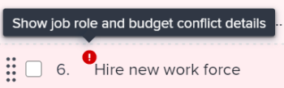
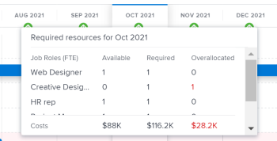

# 에서 이니셔티브 충돌 해결 [!DNL Scenario Planner]

이니셔티브가 서로 충돌할 때 그들은 같은 자원을 얻기 위해 경쟁하고 있다. 시나리오에 사용할 수 있는 리소스는 시나리오의 모든 이니셔티브에 필요한 모든 리소스를 제공하기에 충분하지 않습니다.

이 문제는 다음 중 한 경우에 발생할 수 있습니다.

* 이니셔티브에 필요한 Job 역할 수가 계획에 대해 책정된 역할 수보다 큽니다.
* 그 계획의 비용은 그 계획에 사용할 수 있는 예산 금액보다 크다.

## 액세스 요구 사항

다음 항목이 있어야 합니다.

<table style="table-layout:auto"> 
 <col> 
 <col> 
 <tbody> 
  <tr> 
   <td> 
[!DNL Adobe Workfront]<b> 플랜*</b> 
 </td> 
   <td>[!UICONTROL Business] 이상</td> 
  </tr> 
  <tr> 
   <td> 
[!DNL Adobe Workfront]<b> 라이센스*</b> 
 </td> 
   <td> 
[!UICONTROL Review] 이상
 </td> 
  </tr> 
  <tr> 
   <td><b>제품</b> </td> 
   <td> 
에 대한 추가 라이센스를 구입해야 합니다. [!DNL Adobe Workfront Scenario Planner] 을 눌러 이 문서에 설명된 기능에 액세스합니다.
 
를 가져오는 방법에 대한 자세한 내용은 [!DNL Workfront Scenario Planner]를 참조하십시오. <a href="../scenario-planner/access-needed-to-use-sp.md" class="MCXref xref">을 사용하는 데 필요한 액세스 [!DNL Scenario Planner]</a>. 
 </td> 
  </tr> 
  <tr data-mc-conditions=""> 
   <td><strong>액세스 수준 구성*</strong> </td> 
   <td> 
[!UICONTROL Edit] 이상 [!DNL Scenario Planner]
 
참고: 여전히 액세스할 수 없는 경우 [!DNL Workfront] 관리자가 액세스 수준에서 추가 제한을 설정한 경우 자세한 내용은 [!DNL Workfront] 관리자는 액세스 수준을 변경할 수 있습니다. <a href="../administration-and-setup/add-users/configure-and-grant-access/create-modify-access-levels.md" class="MCXref xref">사용자 정의 액세스 수준 만들기 또는 수정</a>.
 </td> 
  </tr> 
  <tr data-mc-conditions=""> 
   <td> 
<strong>개체 권한</strong> 
 </td> 
   <td> 
계획에 대한 [!UICONTROL Manage] 권한
 
계획에 대한 추가 액세스 요청에 대한 내용은 <a href="../scenario-planner/request-access-to-plan.md" class="MCXref xref">에서 계획에 대한 액세스 요청 [!DNL Scenario Planner]</a>.
 </td> 
  </tr> 
 </tbody> 
</table>

&#42;어떤 계획, 라이선스 유형 또는 액세스 권한을 보유하고 있는지 알아보려면 Workfront 관리자에게 문의하십시오.

## 충돌 해결 개요

* 또한 충돌이 작업 역할의 초과 할당 또는 시나리오 예산으로도 이해됩니다.
* When [!DNL Workfront] 충돌을 감지하면 이니셔티브의 기간 동안 충돌하는 달에 해당하는 막대가 빨간색으로 표시됩니다. 이 문제는 다음 중 한 경우에 발생할 수 있습니다.

   * 이니셔티브에 매월 필요한 Job 역할 수는 이전 모든 이니셔티브가 계획에 대해 책정된 자원을 사용한 후 계획에 대해 책정된 역할 수보다 큽니다.
   * 이전 계획들이 그들의 비용을 충당하기 위해 계획의 예산을 사용한 후, 계획의 월별 비용 보다 더 많다.

>[!TIP]
>
>기본적으로 [!DNL Scenario Planner] 별도로 지정하지 않는 한, 작업 역할 0과 시나리오에 대한 시스템 통화로 $0 또는 $0에 해당하는 $0에 대한 예산을 책정했다고 가정합니다. Job 역할 수는 Job 역할에 대해 책정된 FTE(Full Time Equivalent) 또는 시간 수를 나타냅니다.
>
>시나리오 플래너의 모든 계산에 대해 Workfront은 다음 값을 사용합니다. 1 FTE = 8시간
>
>계획 및 예산에 대해 사용 가능한 역할 갱신에 대한 자세한 내용은 [에서 계획 생성 및 편집 [!DNL Scenario Planner]](../scenario-planner/create-and-edit-plans.md).

* 다음 중 하나를 수행하여 충돌을 해결할 수 있습니다.

   * 시나리오의 이니셔티브에서 누락된 필수 리소스를 자동으로 추가합니다. 이 문서에서는 이 옵션을 사용하여 충돌을 해결하는 방법을 설명합니다.
   * 계획을 편집하여 시나리오에 대한 작업 역할 및 예산 자원을 조정합니다. 자세한 내용은 [에서 계획 생성 및 편집 [!DNL Scenario Planner]](../scenario-planner/create-and-edit-plans.md).

## 이니셔티브 간 충돌 해결

1. 충돌을 해결할 계획으로 이동합니다.

   계획 생성에 대한 자세한 내용은 [에서 계획 생성 및 편집 [!DNL Scenario Planner]](../scenario-planner/create-and-edit-plans.md).

   이니셔티브 만들기에 대한 내용은 [에서 이니셔티브 만들기 및 편집 [!DNL Scenario Planner]](../scenario-planner/create-and-edit-initiatives.md).

1. (선택 사항) **[!DNL Initial scenario]** 드롭다운 메뉴에서 검토할 시나리오를 선택합니다.

   >[!TIP]
   >
   >계획은 몇 가지 시나리오가 있을 수 있습니다. 계획의 갈등을 볼 때 [!DNL Workfront] 은(는) 선택한 시나리오에서 현재 사용할 수 있는 리소스와 해당 시나리오의 이니셔티브에 필요한 리소스를 참조합니다. 시나리오에 대한 자세한 내용은 [에서 계획 시나리오를 만들고 비교합니다. [!DNL Scenario Planner]](../scenario-planner/create-and-compare-scenarios-for-a-plan.md).

1. 확인 **[!UICONTROL 충돌 표시]** 이 활성화되어 있습니다. 기본적으로 활성화되어 있습니다.

   

   첫 번째 충돌하는 이니셔티브는 충돌이 발생한 월을 빨간색으로 표시하고 이니셔티브 이름 옆에 경고 아이콘이 표시됩니다.

   첫 번째 충돌 항목으로 시작하는 모든 이니셔티브의 배경은 계획 차트에 빨간색으로 표시됩니다.

   이니셔티브에 충돌이 표시될 경우, 적어도 하나의 특정 역할, 발생한 비용 또는 둘 다에 대한 Job 역할 수가 특정 월에 대해 정의된 Job 역할 수 또는 예산을 초과함을 의미합니다.

   

1. 존재할 수 있는 충돌에 대해 더 잘 이해하려면 다음 중 하나를 수행합니다.

   * 이니셔티브 이름 옆에 있는 경고 아이콘을 마우스로 가리키면 작업 역할이 있는지 아니면 예산 충돌이 있는지 알 수 있습니다.

      

      Job 역할을 초과 할당했는지 또는 이니셔티브에 대해 과대 비용을 할당했는지 여부에 따라 경고 아이콘 위로 마우스를 가져가면 다음 옵션 중 하나가 표시될 수 있습니다.

      * 작업 역할 충돌 세부 정보 보기
      * 예산 충돌 세부 정보 보기
      * 작업 역할 및 예산 세부 정보 표시
   * 월별 계획을 볼 때 계획의 타임라인에서 한 달을 마우스로 가리키면 해당 월에 필요한 리소스와 해당 월의 충돌이 사람인지 비용 관련인지 확인할 수 있습니다.

      

      계획 레벨에서 다음 월별 정보를 검토합니다.

      * 해당 월에 대해 계획된 모든 이니셔티브에 대한 해당 월의 사용 가능, 필수 및 초과 할당된 작업 역할 수
      * 해당 월에 대해 계획된 모든 이니셔티브에 대해 해당 월의 가용, 필수 및 초과 할당 비용

         >[!TIP]
         >
         >다음 [!UICONTROL 사용 가능] 비용은 그 달의 시나리오 예산이다.
   * 한 달 동안 이니셔티브 상의 빨간색 막대를 마우스로 가리키면 해당 월에 발생한 충돌에 대한 추가 정보 상자가 표시됩니다.

      

      이니셔티브 수준의 추가 정보 상자에서 다음 필드를 검토합니다.

      <table style="table-layout:auto"> 
      <col> 
      <col> 
      <tbody> 
       <tr> 
        <td role="rowheader">충돌이 발생하는 월</td> 
        <td>추가 정보 상자의 제목에 표시됩니다.</td> 
       </tr> 
       <tr> 
        <td role="rowheader">이니셔티브 이름</td> 
        <td>추가 정보 상자의 제목에 표시됩니다.</td> 
       </tr> 
       <tr> 
        <td role="rowheader">[!UICONTROL 작업 역할]</td> 
        <td> 
이 이니셔티브와 연관된 작업 역할로서 선택한 월에 대해 초과 할당됩니다. 다음 열에는 선택한 월에 필요한 각 작업 역할에 대한 정보가 표시되며, 해당 월에 사용할 수 있는 작업 역할 수와 충돌합니다.
 
         <ul> 
          <li> 
<strong>[!UICONTROL 사용 가능]</strong>: 선택한 월에 대해 시나리오에서 사용할 수 있는 각 작업 역할의 수입니다.
 </li> 
          <li> 
<strong>[!UICONTROL 필수]</strong>: 선택한 달의 이니셔티브에 필요한 각 작업 역할의 수입니다.
 </li> 
          <li> 
<strong>[!UICONTROL Overlocated]:</strong> 이니셔티브에 필요한 수와 시나리오에서 사용할 수 있는 수 간의 차이입니다. 
 </li> 
         </ul> 
팁: [!UICONTROL Available] 역할 수가 [!UICONTROL Required] 역할 수보다 크거나 같은 경우가 있지만, [!DNL Scenario Planner] 여전히 초과 할당을 표시합니다. 즉, 같은 달 동안 계획에서 사용할 수 있는 Job 역할을 이미 사용한 상위 순위 이니셔티브가 있음을 의미합니다. 
 </td> 
       </tr> 
       <tr> 
        <td role="rowheader">비용</td> 
        <td> 
선택한 달의 이니셔티브 비용. 다음 열에는 필요한 비용과 선택한 월의 사용 가능한 예산에 대한 정보가 표시됩니다.
 
         <ul> 
          <li> 
<strong>[!UICONTROL 사용 가능]</strong>: 선택한 월의 계획에서 사용할 수 있는 예산입니다.
 </li> 
          <li> 
<strong>[!UICONTROL 필수]</strong>: 선택한 달의 이 이니셔티브와 연관된 비용입니다.
 </li> 
          <li> 
<strong>[!UICONTROL Overlocated]:</strong> 계획안 비용 및 계획에서 구할 수 있는 예산 사이의 차이. 
 </li> 
         </ul> 
팁: 경우에 따라 [!UICONTROL Available] 비용이 선택한 달 및 [!DNL Scenario Planner] 여전히 비용의 초과 할당을 표시합니다. 이는 같은 달 계획에서 이미 사용 가능한 예산을 사용하는 더 높은 순위 이니셔티브가 있다는 것을 의미합니다. 
 </td> 
       </tr> 
      </tbody> 
     </table>

1. 다음 중 하나를 수행하여 이니셔티브 세부 정보 패널을 열고 충돌이 발생하는 위치에 대한 자세한 정보를 확인하고 이를 해결합니다.

   * 이니셔티브 이름 옆에 있는 경고 아이콘을 클릭합니다.
   * 이니셔티브 막대를 클릭합니다.
   * 을(를) 클릭합니다. **[!UICONTROL 자세히]** 아이콘  이니셔티브 이름의 오른쪽에 있는 를 클릭한 다음 **[!UICONTROL 편집]**.

      오른쪽에 이니셔티브 세부 정보 패널이 표시됩니다.

      이니셔티브에 사용할 충분한 인력 또는 예산이 없는 경우 다음 섹션 옆에 빨간색 경고 아이콘이 표시됩니다.

   * [!UICONTROL 필수 작업 역할]
   * [!UICONTROL 비용]

1. (조건부) Job 역할 충돌이 있는 이니셔티브의 경우 **[!UICONTROL 필수 작업 역할]** 이니셔티브에 필요한 모든 작업 역할을 보는 섹션을 참조하십시오. 어떤 작업 역할이 초과 할당될 수 있는지 확인합니다. 이니셔티브 매월 각 Job 역할에 필요한 FTE 또는 시간 수를 검토합니다. 초과 할당이 있는 월의 FTE 또는 시간 번호가 있는 상자가 빨간색 아웃라인에 표시됩니다.

   

1. (선택 사항) 이니셔티브 타임라인에서 개월 옆에 있는 오른쪽 화살표 를 클릭하여 표시되는 추가 월을 확인합니다.

   

1. (선택 사항) **[!UICONTROL 세부 사항 표시]** 충돌을 표시하는 작업 역할 아래에서 충돌이 나타나는 위치를 확인하고 계획의 차트 영역에서 충돌하는 월을 강조 표시합니다. 각 작업 역할에 대한 추가 정보가 표시됩니다.

   각 작업 역할에 대해 다음 필드가 표시됩니다.

   <table style="table-layout:auto"> 
    <col> 
    <col> 
    <tbody> 
     <tr> 
      <td role="rowheader">[!UICONTROL 사용 가능]</td> 
      <td> 
월별 계획에서 사용할 수 있는 작업 역할 수입니다. 
 </td> 
     </tr> 
     <tr> 
      <td role="rowheader">[!UICONTROL 이전에 할당됨]</td> 
      <td>계획의 예산에서 특정 달의 상위 순위 이니셔티브에 이미 할당된 Job 역할 수입니다. </td> 
     </tr> 
     <tr> 
      <td role="rowheader">[!UICONTROL Overlocated]</td> 
      <td> 
이니셔티브에서 필요한 Job 역할 수와 상위 순위 이니셔티브 후 계획에서 사용할 수 있는 수 간의 차이도 일부 역할을 사용했습니다. Workfront은 다음 공식을 사용하여 [!UICONTROL Overlocated] 작업 역할의 수를 계산합니다.
 
<code>Overallocated roles = (Roles Previously Allocated to higher initiatives + Required roles for current initiative) - Monthly available roles from the plan</code> 
 </td> 
     </tr> 
    </tbody> 
   </table>

   >[!TIP]
   >
   >계획의 차트에 작업 역할이 할당된 달이 필요한 각 이니셔티브에 필요한 이름과 역할 수가 표시됩니다. 을(를) 선택해야 합니다 [!UICONTROL 월] 보기 - 작업 롤의 이름을 확인합니다.

   

1. 작업 역할 충돌을 해결하려면 다음 중 하나를 수행합니다.

   * 이니셔티브의 각 달에 대한 작업 역할 수를 더 적은 수로 수동으로 조정합니다.
   * 작업 롤의 이름을 마우스로 가리킨 다음 **[!UICONTROL delete] 아이콘**  이니셔티브에서 작업 역할을 제거합니다.
   * 선택 **[!UICONTROL 시나리오의 사용 가능한 리소스에 역할 추가]**&#x200B;를 클릭한 다음 **[!UICONTROL 적용]**.

      Job 역할 FTE 또는 시간(시)이 없는 경우 시나리오의 [!UICONTROL 사용 가능] 필드.

      >[!NOTE]
      >
      >충돌을 해결하기 위해 추가하는 역할은 [!UICONTROL 사용 가능] 선택한 시나리오에 대한 작업 역할이며 계획의 모든 시나리오에 대한 작업은 아닙니다.

      위쪽 방향 녹색 화살표  해당 월의 계획에 더 많은 리소스가 추가되었음을 나타내기 위해 계획 타임라인에 해당 월에 대해 표시됩니다. 을(를) 선택해야 합니다 [!UICONTROL 월] 이 표시기를 보려면 를 참조하십시오.

   * (조건부) 세부 정보 패널을 닫고 가능한 경우 먼저 계획에서 예산 리소스를 받도록 이니셔티브를 우선순위로 지정합니다. 이니셔티브 우선 순위 업데이트에 대한 자세한 내용은 [시나리오 플래너에서 이니셔티브 우선순위 업데이트](../scenario-planner/prioritize-initiatives.md).

1. (선택 사항) **[!UICONTROL 세부 사항 숨기기]** 추가 세부 정보 상자를 닫으려면 **[!UICONTROL 적용]** 작업 역할에 대한 변경 사항을 저장하려면 다음을 수행합니다.

1. (조건부) 비용 충돌이 있는 이니셔티브의 경우 **[!UICONTROL 비용]** 이니셔티브 세부 정보 패널의 섹션을 통해 이니셔티브 기간 중 매달 비용을 검토할 수 있습니다. 선택한 이니셔티브에 대한 비용을 충당하기 위해 계획 예산에 충분한 자금이 없을 수 있는 달을 식별합니다. 사용 가능한 예산이 충분하지 않은 상자가 빨간색 윤곽선으로 표시됩니다.
1. (선택 사항) 예산을 충당하기에 부족한 추가 월을 보려면 이니셔티브 타임라인에서 개월 옆에 있는 오른쪽 화살표를 클릭합니다.

   

1. (선택 사항) **[!UICONTROL 세부 사항 표시]** 비용 정보 아래에서 충돌이 나타나는 위치를 확인하고 계획의 차트에서 충돌하는 월을 강조 표시합니다. 각 원가 유형에 대해 다음 추가 필드가 표시됩니다.

   <table style="table-layout:auto"> 
    <col> 
    <col> 
    <tbody> 
     <tr> 
      <td role="rowheader">[!UICONTROL 사용 가능]</td> 
      <td> 
매달 계획의 예산에서 사용할 수 있는 비용입니다. 
 </td> 
     </tr> 
     <tr> 
      <td role="rowheader">[!UICONTROL 이전에 할당됨]</td> 
      <td>그 계획의 예산에서 더 높은 순위 이니셔티브에 이미 할당된 금액. </td> 
     </tr> 
     <tr> 
      <td role="rowheader">[!UICONTROL Overlocated]</td> 
      <td> 
초기 계획에 필요한 비용과 상위 순위 이니셔티브 후에 계획의 예산에서 사용할 수 있는 금액의 월별 차이 또한 가용 예산의 일부를 사용했습니다. [!DNL Workfront] 다음 공식을 사용하여 초과 배부 원가 수를 계산합니다.
 
<code>Overallocated costs = (Costs Previously Allocated to higher initiatives + Required costs for the current initiative) - Monthly available budget from the plan</code> 
 
[!DNL Workfront] 다음 공식을 사용하여 현재 이니셔티브의 월별 필수 비용을 계산합니다.
 
<code>Required initiative costs = Initiative Fixed Costs + Initiative People Costs</code> 
 </td> 
     </tr> 
    </tbody> 
   </table>

   >[!TIP]
   >
   >계획의 차트에는 비용이 부족한 달이 이니셔티브 작업에 필요한 이름과 역할 수를 표시합니다. 비용 금액을 보려면 월 뷰를 선택해야 합니다.

   

   >[!NOTE]
   >
   >비활성화한 경우 [!UICONTROL 사용자 비용 포함] 계획 설정 [!UICONTROL 예산] 계획을 만들면 [!UICONTROL 사용자 비용] 시나리오에서 이니셔티브에 대한 라인이 표시되지 않습니다. 이 경우 Workfront은 비용 충돌을 결정하기 위해 사람 비용을 계산하지 않습니다. 계획 생성에 대한 자세한 내용은 [에서 계획 생성 및 편집 [!DNL Scenario Planner]](../scenario-planner/create-and-edit-plans.md).

1. 비용 충돌을 해결하려면 다음 중 하나를 수행합니다.

   * 수동으로 숫자 조정 [!UICONTROL 고정 비용] 이니셔티브의 매월 더 낮은 수치를 나타냅니다.
   * 에서 **[!UICONTROL 필수 작업 역할]** 섹션에서, 가능하면 인력 비용 예산으로 월의 작업 역할 수를 수동으로 조정합니다. 이로 인해 인력 비용이 줄어듭니다.

      >[!TIP]
      >
      >인력 비용은 수동으로 조정할 수 없습니다.

   * 선택 **[!UICONTROL 시나리오 예산에 금액 추가]**&#x200B;를 클릭한 다음 **[!UICONTROL 적용]**.

      이렇게 하면 누락된 월의 시나리오 예산에 불충분한 금액이 추가되어 전체 시나리오 예산도 업데이트됩니다.

      >[!NOTE]
      >
      >비용 충돌을 해결하기 위해 추가하는 금액은 계획의 모든 시나리오가 아니라 선택한 시나리오에 대한 예산을 수정합니다.

   * (조건부) 세부 정보 패널을 닫고 가능한 경우 먼저 계획에서 예산 리소스를 받도록 이니셔티브를 우선순위로 지정합니다. 이니셔티브 우선 순위 업데이트에 대한 자세한 내용은 [에서 이니셔티브 우선 순위 업데이트 [!DNL Scenario Planner]](../scenario-planner/prioritize-initiatives.md).

1. 클릭 **[!UICONTROL 적용]** 비용 섹션을 변경할 때
1. 클릭 **[!UICONTROL 계획 저장]** 변경 사항을 저장하려면 을 클릭합니다.

