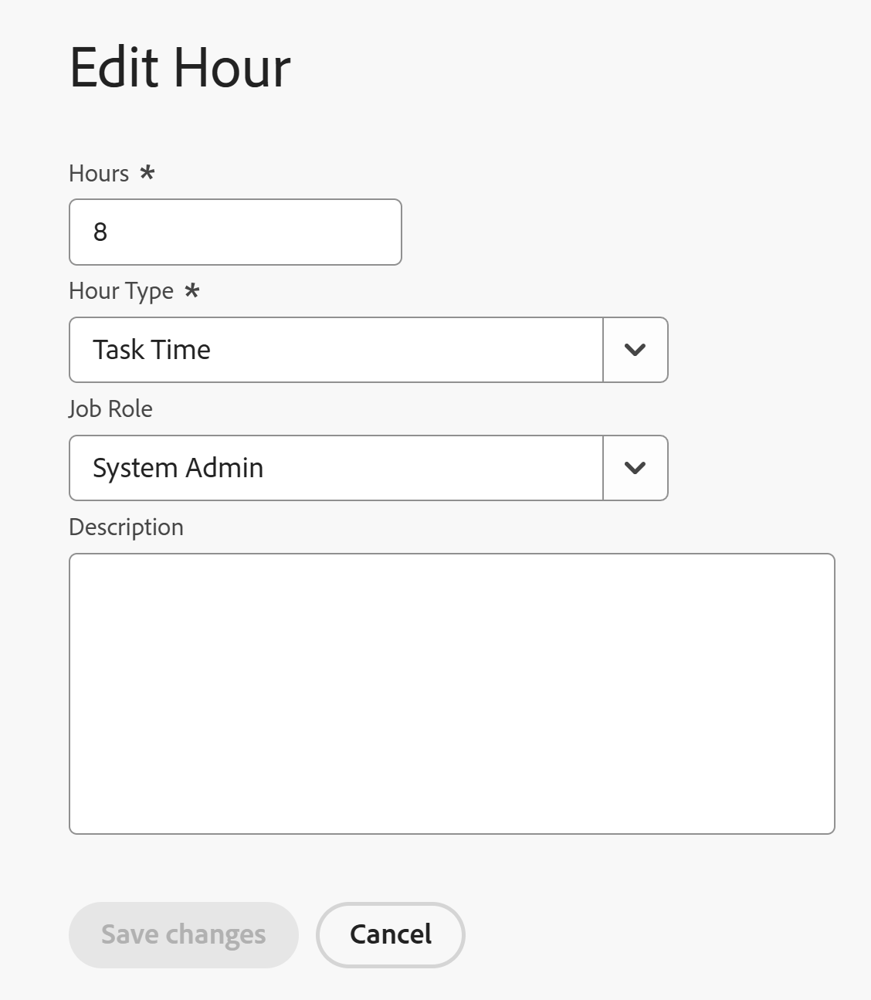

# 로그 시간

<!--Audited: 12/2023-->

<!--remove all preview and production references if any-->
<!--update screen shots for the general hour entries and the mixed selection of hours at production, if they fixed the bugs -->

Adobe Workfront에서 작업 항목에 대한 시간을 기록하여 작업에 소비한 시간을 나타낼 수 있습니다. 휴가, 병가, 회의 등 업무와 관련 없는 시간도 기록할 수 있다. 기록한 시간이 타임시트에 표시됩니다.

Workfront에 로그인할 수 있는 시간 유형에 대한 자세한 내용은 [시간 유형 관리](../../administration-and-setup/set-up-workfront/configure-timesheets-schedules/hour-types.md)를 참조하십시오.

## 액세스 요구 사항

+++ 을 확장하여 이 문서의 기능에 대한 액세스 요구 사항을 봅니다.

이 문서의 단계를 수행하고 프로젝트별 시간을 기록하려면 다음 액세스 권한이 있어야 합니다.

<table style="table-layout:auto"> 
 <col> 
 <col> 
 <tbody> 
  <tr> 
   <td role="rowheader">Adobe Workfront 플랜</td> 
   <td> 
임의
 </td> 
  </tr> 
  <tr> 
   <td role="rowheader">Adobe Workfront 라이센스*</td> 
   <td> 
신규:

   <ul><li>
 가볍게 또는 그 이상: 작업, 문제 또는 타임시트의 일반 시간에 기록

   <li>
프로젝트에 시간을 기록하는 표준
</li></ul>
   

   
현재: 
   <ul><li>타임시트에 일반 시간을 기록하려면 이상을 검토하십시오.</li>
   <li>프로젝트, 작업 또는 문제에 시간을 기록하려면 이상 작업</li></ul> </td> 
  </tr> 
  <tr> 
   <td role="rowheader">액세스 수준 구성</td> 
   <td> 
시간을 기록한 작업 항목 유형에 대한 액세스 편집 
 
예를 들어 문제에 대한 시간을 기록하려면 문제에 대한 편집 액세스 권한이 필요합니다
 </td> 
  </tr> 
  <tr> 
   <td role="rowheader">개체 권한</td> 
   <td> 
시간을 기록하는 작업 항목에 대한 기여 또는 더 높은 권한과 함께 시간 기록 권한 포함
 </td> 
  </tr> 
 </tbody> 
</table>

*자세한 내용은 [Workfront 설명서의 액세스 요구 사항](/help/quicksilver/administration-and-setup/add-users/access-levels-and-object-permissions/access-level-requirements-in-documentation.md)을 참조하십시오.

+++

## Workfront에서 시간 로깅 시 고려 사항

* 프로젝트, 작업 또는 문제에 시간을 기록하거나 타임시트에 직접 시간을 기록할 수 있습니다.

  타임시트를 만드는 방법에 대한 자세한 내용은 [일회용 타임시트 만들기](../../timesheets/create-and-manage-timesheets/create-tmshts.md)를 참조하십시오.

* 타임시트 이외의 도구를 통해 기록된 모든 시간이 해당 기간의 타임시트에 표시됩니다.
* 현재 상태가 아닌 프로젝트의 작업 및 문제는 타임시트에 미리 채워지지 않습니다.
* 타임시트에 기록된 시간은 작업, 문제 또는 프로젝트에 즉시 적용됩니다.
* 타임시트에는 기록된 모든 날짜에 대한 총 시간이 포함됩니다. [시스템 차원의 프로젝트 환경 설정 구성](../../administration-and-setup/set-up-workfront/configure-system-defaults/set-project-preferences.md)에 설명된 대로 주말을 제외하도록 타임라인 계산이 구성된 경우에도 주말은 항상 포함됩니다.
* 타임시트에 표시되는 최대 항목 수는 45개입니다. 일자가 타임시트 시간대와 일치하는 항목이 45개를 초과하는 경우 가장 최근에 업데이트된 항목만 표시됩니다.
* 청구된 청구 기록에 포함된 시간 항목은 흐리게 표시되어 타임시트에서 편집할 수 없습니다. 자세한 내용은 [청구 기록 만들기](../../manage-work/projects/project-finances/create-billing-records.md)를 참조하십시오.
* 개인 작업은 기본적으로 타임시트에 표시되지 않습니다. 개인 작업은 시간이 기록된 경우에만 타임시트에 표시됩니다. 개인 작업에 시간을 기록한 후 작업을 타임시트에 고정할 수 있으며 고정된 상태로 유지되면 타임시트에 유지됩니다. 자세한 내용은 [홈 영역에서 작업 항목 및 프로젝트 만들기](../../workfront-basics/using-home/using-the-home-area/create-work-items-in-home.md)를 참조하십시오.

## 로그 시간 {#log-time-section}

Workfront의 다음 영역에서 시간을 기록할 수 있습니다.

* [타임시트](#timesheet)
* [홈](#home)
* [프로젝트, 작업 또는 문제](#project-task-or-issue)
* [요약 패널](#summary-panel)
* [보드](#boards)
* [모바일 앱](#mobile-app)

### 타임시트 {#timesheet}

#### 타임시트에 시간 기록 {#log-time-on-a-timesheet}

타임시트의 다음 항목에 시간을 기록할 수 있습니다.

* Workfront 관리자가 타임시트 환경 설정을 지정하는 방법에 따라 자동으로 표시되는 미리 채워진 작업, 문제 및 프로젝트입니다. 타임시트를 미리 채우는 방법에 대한 자세한 내용은 [타임시트 및 시간 환경 설정 구성](../../administration-and-setup/set-up-workfront/configure-timesheets-schedules/timesheet-and-hour-preferences.md)을 참조하십시오.

  나에게 할당된 작업 및 문제만 타임시트에 미리 채워집니다. 팀 또는 작업 역할에 할당된 작업 및 문제가 타임시트를 자동으로 채우지 않습니다.

  팀에 할당된 항목에 대한 처리 작업을 클릭하면 항목이 사용자에게 할당되고 해당 항목이 타임시트에 표시됩니다.

* 수동으로 추가하는 작업, 문제 또는 프로젝트.
* Workfront의 다른 곳에서 이미 시간을 기록한 작업, 문제 또는 프로젝트입니다.
* 일반 시간(휴가, 교육, 오버헤드 시간).

>[!NOTE]
>
>타임시트 프로필에 할당된 검토 사용자에게 타임시트 영역이 표시되고 일반 시간이 기록됩니다. 하지만 타임시트에 표시되는 할당된 작업 또는 문제에 대해서는 시간을 기록할 수 없습니다.

타임시트에 시간을 기록하려면 다음을 수행하십시오.

{{step1-click-main-menu}}

1. [!UICONTROL **타임시트**]를 클릭합니다. 현재 타임시트가 기본적으로 표시됩니다.
   

1. (선택 사항) **전체 화면** 아이콘 을(를) 클릭하여 타임시트를 전체 화면 모드로 표시한 다음 **전체 화면 종료**  아이콘을 클릭하여 타임시트로 돌아갑니다.

   <!-- drafted for the resize columns in timesheet story: 1. (optional) Click on the separator lines between weeks or between the time frame area and the work item area to resize the columns of the timesheet.-->

1. (선택 사항) 타임시트에 프로젝트, 작업 또는 문제를 추가하려면 타임시트의 왼쪽 상단에 있는 **항목 추가** 드롭다운 메뉴를 클릭한 다음 **프로젝트 추가**, **작업 추가** 또는 **문제 추가**&#x200B;를 클릭합니다.

   프로젝트, 작업 또는 문제 목록이 표시됩니다.

   <!--drafted for full screen mode for add projects story - align it with the rest of the steps when you enable this:: 1. (Optional) Click the **full-screen** icon  to display the list of objects in full-screen mode.-->

1. (선택 사항) 검색 아이콘 을 클릭하여 타임시트에 추가할 키워드를 사용하여 특정 항목을 검색합니다.

1. (선택 사항) 필터, 보기 또는 그룹화 드롭다운 메뉴를 확장하여 드롭다운 메뉴를 적용하거나 사용자 지정하고 원하는 항목 정보를 봅니다.

1. 목록에서 하나 이상의 항목을 선택한 다음 **추가**&#x200B;를 클릭합니다.

   한 번에 50개 미만의 항목을 추가한 경우 항목이 타임시트에 추가됩니다. 작업 및 문제는 프로젝트 이름 아래에 나열됩니다.

   >[!NOTE]
   >
   >타임시트에 작업 또는 문제를 추가하면 프로젝트도 추가됩니다.

1. (조건부) 한 번에 50개 이상의 항목을 추가하는 경우 타임시트에 추가된 항목 수를 표시하는 확인 메시지가 표시됩니다.

   모든 항목을 추가하려면 **모두 추가**&#x200B;를 클릭하십시오.
또는
선택한 항목의 추가를 중지하려면 **취소**&#x200B;를 클릭하고 항목 목록을 닫으려면 **취소**&#x200B;를 클릭하십시오.

   작업 및 문제는 프로젝트 이름 아래에 나열됩니다.

   >[!NOTE]
   >
   >타임시트에 수동으로 추가하는 항목은 고정되며 수동으로 고정 해제하여 제거할 때까지 현재 및 향후 타임시트에 유지됩니다. 항목을 고정 해제하여 타임시트에서 제거하는 방법에 대한 자세한 내용은 10단계를 계속하십시오.

   <!--(ensure this stays accurate)-->

1. (선택 사항) 프로젝트 이름 옆에 있는 **축소**  또는 **확장**  아이콘을 클릭하여 프로젝트의 작업 및 문제 목록을 표시하거나 숨깁니다.

   >[!TIP]
   >
   >   표준 QWERTY 키보드를 사용할 때 타임시트에서 프로젝트 이름을 클릭한 후 다음 키 세트를 눌러 프로젝트를 축소하거나 확장합니다.
   >   * 프로젝트를 확장하고 작업 항목을 표시하려면 다음을 수행합니다.
   >     * Windows 컴퓨터의 경우 Shift + Alt + 위쪽 화살표
   >     * Mac 컴퓨터의 Shift + Option + 위쪽 화살표
   >   * 프로젝트를 축소하고 작업 항목을 숨기려면 다음을 수행합니다.
   >     * Windows 컴퓨터의 경우 Shift + Alt + 아래쪽 화살표
   >     * Mac 컴퓨터의 Shift + Option + 아래쪽 화살표

1. (선택 사항) 타임시트에 표시되는 항목을 수동으로 고정하려면 항목 이름 위로 마우스를 가져간 다음 **고정** 아이콘 을 클릭합니다.

   >[!TIP]
   >
   >   타임시트에서 항목을 클릭한 후 표준 QWERTY 키보드를 사용할 때 다음 키 세트를 눌러 항목을 고정합니다.
   >   * Windows 및 Mac 컴퓨터 모두에 대해 Option + P입니다.

1. (선택 사항) 검색 아이콘 을(를) 클릭하고 키워드 입력을 시작하여 타임시트에서 프로젝트, 작업 또는 문제를 찾습니다.

1. (조건부) Workfront 또는 그룹 관리자가 **시간 항목에 수동으로 작업 역할 할당** 설정을 활성화한 경우 드롭다운 메뉴에서 작업 역할을 선택합니다. 작업 항목에 할당할 때 지정된 역할이 기본적으로 표시됩니다. 오브젝트에 역할이 할당되지 않은 경우 기본 역할이 기본값으로 표시됩니다. 이 설정에 대한 자세한 내용은 문서 [타임시트 및 시간 환경 설정 구성](../../administration-and-setup/set-up-workfront/configure-timesheets-schedules/timesheet-and-hour-preferences.md)을 참조하십시오.

   

1. (선택 사항) **+** 아이콘을 클릭하여 다른 행을 추가한 다음 [!UICONTROL 시간 유형] 열의 드롭다운 메뉴에서 새 시간 유형을 선택하여 다른 시간 유형에 대한 시간을 기록합니다.

   

   >[!TIP]
   >
   >   운영 체제나 브라우저에 따라 표준 QWERTY 키보드를 사용할 때는 다음 키 세트를 눌러 다른 행을 추가합니다.
   >   * Windows 컴퓨터의 경우 Ctrl + Option + +
   >   * Mac 컴퓨터의 Cmd + Option + +

   [시간 유형 및 가용성 정의](define-hour-types-and-availability.md)에 설명된 대로 시스템, 프로젝트 및 사용자 수준에서 정의된 내용에 따라 시간 유형을 사용할 수 있습니다.

   타임시트가 종료된 후에는 시간 유형을 변경할 수 없습니다.

   >[!TIP]
   >
   >이전에 시간을 기록했으며 선택한 시간 유형이 현재 비활성화된 경우 기록된 시간에 대한 전체 행이 흐리게 표시됩니다. 다른 시간 유형을 선택하고 페이지를 새로 고치면 드롭다운 목록에서 비활성화된 시간 유형 옵션이 제거되므로 해당 시간 유형에 시간을 추가할 수 없습니다.
   >
   >에 대해 추가 시간을 기록할 작업 항목에 대해 새 라인을 추가하고, 비활성화된 시간 유형을 이전 기록된 시간과 연관시켜 유지하려면 새 시간 유형을 선택하는 것이 좋습니다.

1. 작업 역할 옆의 **삭제** 아이콘 을(를) 클릭하여 제거합니다. 역할에 대해 기록된 시간도 모두 제거됩니다.

   >[!TIP]
   >
   >   운영 체제나 브라우저에 따라 표준 QWERTY 키보드를 사용할 때는 다음 키 세트를 눌러 행을 삭제합니다.
   >   * Windows 컴퓨터의 경우 Ctrl + Option + -
   >   * Cmd + Option + - Mac 컴퓨터

1. 타임시트의 타임라인 섹션에서 특정 날짜에 로그인할 시간을 지정한 다음 시간 상자 외부를 클릭하여 시간 항목을 저장합니다. 시간이 자동으로 저장됩니다. 시간을 기록하는 행은 연한 파란색으로 강조 표시되고 시간 항목 상자는 진한 파란색으로 윤곽이 표시됩니다.

   

   시간을 시간 또는 일 단위로 기록합니다. [시간이 시간 단위로 기록되는지 또는 일 단위로 기록되는지 구성](../../timesheets/config-timesheet-prefs/config-time-logged-hrs-days.md)에 설명된 대로 이 설정은 플랜 라이선스가 있는 사용자 또는 시스템 관리자가 구성합니다.

   >[!IMPORTANT]
   >
   >다음 시나리오 중 하나가 발생하는 경우 타임시트를 수동으로 저장해야 합니다.
   >
   >* 이전에 기록한 시간과 관련된 작업 역할이 변경되었으며 **시간 항목에 수동으로 작업 역할 할당** 설정이 비활성화되었습니다. 새 날짜에 대한 로깅 시간은 다른 작업 역할과 연결됩니다.
   >   
   >   역할이 변경되고 **시간 항목에 수동으로 작업 역할 할당** 설정이 사용되는 경우 시간을 기록하거나 역할을 업데이트할 수 있으며 변경 사항은 자동으로 저장됩니다.
   >
   >* 작업 또는 문제에 할당된 작업 역할이 타임시트 소유자가 <!--or assigned to them_ this last  piece came from a Support note but but sure what role it's referring to. Leaving it out for now.-->(으)로 시간을 기록하는 작업 역할과 다릅니다.
   >
   >두 역할 간에 충돌하는 항목이 더 이상 없을 때 타임시트가 다시 시간을 자동으로 절약합니다.
   >

1. (선택 사항) 타임시트 헤더의 초과 근무 필드에 초과 근무 금액을 지정합니다.

   >[!TIP]
   >
   >타임시트에 현재 총 시간보다 많은 수의 초과 근무 시간을 기록할 수 없습니다. 예를 들어 지금까지 타임시트에 7시간을 기록한 경우 8시간의 초과 근무를 기록할 수 없습니다.

1. (선택 사항) 시간 항목에 대한 댓글을 추가하려면 **댓글**&#x200B;을 클릭하세요.

   

   >[!TIP]
   >
   >   시간 입력 상자를 클릭한 후 표준 QWERTY 키보드를 사용할 때 다음 키 세트를 눌러 주석 상자를 엽니다.
   >   * Windows 및 Mac 컴퓨터 모두에 대해 Shift + F2를 누릅니다.

1. 댓글을 저장하려면 **완료**&#x200B;를 클릭하세요.

   >[!TIP]
   >
   >   표준 QWERTY 키보드를 사용할 때 주석 상자 내에서 다음 키 세트를 눌러 주석을 저장합니다.
   >   * Windows 컴퓨터의 경우 Ctrl + Enter를 누릅니다.
   >   * Cmd + Mac 컴퓨터용 Return

1. (선택 사항) 도구 모음에서 **댓글 표시**&#x200B;를 클릭하여 작업 항목 아래에 시간 입력 댓글을 표시합니다.

   

   >[!TIP]
   >
   >   타임시트에 대한 모든 변경 내용은 자동으로 저장됩니다.

1. (선택 사항) 작업 또는 문제의 행을 클릭한 다음 타임시트의 오른쪽 상단에 있는 **요약 열기**&#x200B;를 클릭하여 업데이트를 추가하거나 작업 또는 문제에 대한 정보를 업데이트합니다. 오른쪽에 요약 패널이 열립니다.

   

   기록된 시간과 연관된 작업 항목의 업데이트 영역에 업데이트가 표시됩니다.

   >[!TIP]
   >
   >프로젝트 또는 일반 시간 항목에 대해 댓글을 달 수 없습니다.

1. 요약 패널을 닫고 타임시트로 돌아가려면 [!UICONTROL **요약 닫기**]&#x200B;를 클릭하십시오.

1. (선택 사항) 왼쪽 패널에서 [!UICONTROL **업데이트**]&#x200B;를 클릭한 다음 타임시트에 업데이트를 추가합니다. Workfront 업데이트에 대한 자세한 내용은 [작업 업데이트](../../workfront-basics/updating-work-items-and-viewing-updates/update-work.md)를 참조하세요.

   

1. (선택 사항) 타임시트를 닫거나 제출하려면 **타임시트** 영역으로 돌아갑니다.

   * **닫기**: 업데이트를 마치면 타임시트를 닫습니다. 이 옵션은 타임시트가 승인자와 연결되어 있지 않은 경우에만 사용할 수 있습니다.

   * **승인을 위한 제출:** 이 옵션은 타임시트에 승인자가 있는 경우에만 사용할 수 있습니다. 변경 사항을 저장하고 승인을 위해 제출합니다. 아직 승인이 부여되지 않은 경우 **회수**&#x200B;를 클릭하여 타임시트를 닫은 후 열 수 있습니다. 자세한 내용은 [승인을 위한 타임시트 제출](../../timesheets/create-and-manage-timesheets/submit-timesheet-for-approval.md)을 참조하세요.

   * **거부**: 이 옵션은 타임시트 승인자이고 승인을 위해 타임시트가 제출되었을 때 표시됩니다. 타임시트의 상태가 거부됨으로 변경되고 타임시트는 열린 상태로 유지됩니다.

   * **승인**: 이 옵션은 타임시트 승인자이고 승인을 위해 타임시트가 제출되었을 때 표시됩니다. 타임시트의 상태를 승인됨으로 변경하고 타임시트를 닫습니다.

   >[!TIP]
   >
   >시스템 관리자이고 타임시트가 승인자와 연결된 경우 거부 및 승인 옵션도 타임시트에 표시됩니다.

1. (조건부) 승인을 위해 타임시트를 닫거나 제출한 경우 다음 옵션 중 하나를 클릭합니다.

   * **다시 열기**: 이 옵션은 이미 닫았으며 승인자가 없는 타임시트 또는 이미 승인된 타임시트에 사용할 수 있습니다. 시간 항목을 수정하려면 타임시트를 다시 엽니다.
   * **회수**: 이 옵션은 승인을 위해 제출되었지만 아직 승인 또는 거부되지 않은 타임시트에 사용할 수 있습니다. 타임시트를 다시 열고 시간 항목을 수정하려면 **회수**&#x200B;를 클릭하십시오.

#### 타임시트에서 항목 제거

타임시트에서 시간 항목 또는 항목(프로젝트, 작업 또는 문제)을 제거할 수 있습니다.

타임시트에서 시간 항목을 제거하려면 다음 작업을 수행하십시오.

1. 타임시트로 이동하여 제거할 시간 항목을 찾습니다.
1. 입력한 시간을 0으로 바꾸기
또는
시간을 제거하고 0으로 교체한 다음 Enter 키를 누릅니다.

   시간이 제거되고 타임시트가 자동으로 저장됩니다.

아직 시간 기록이 없고 항목을 수동으로 추가한 경우(이 문서의 [타임시트에 시간 기록](#log-time-on-a-timesheet) 섹션에 있는 4-8단계에 설명된 대로), 타임시트의 항목(프로젝트, 작업 또는 문제)을 고정 해제하여 제거할 수 있습니다. <!--ensure this stays accurate-->

타임시트를 미리 채우도록 구성된 Workfront 시스템 또는 그룹의 타임시트 환경 설정에 따라 타임시트에 포함된 항목을 자동으로 제거할 수 없습니다([타임시트 및 시간 환경 설정 구성](../../administration-and-setup/set-up-workfront/configure-timesheets-schedules/timesheet-and-hour-preferences.md)에 설명). 항목의 날짜가 타임시트의 시간 범위를 벗어나는 경우 항목 미리 채우기가 중지됩니다.

수동으로 추가된 타임시트에서 항목을 제거하려면 다음 작업을 수행하십시오.

1. 항목에 대해 기록된 시간이 없는지 확인합니다.
1. 타임시트에서 항목을 고정 해제하려면 항목 옆에 있는 **고정 해제** 아이콘 을 클릭합니다.

   >[!TIP]
   >
   >   타임시트에서 항목을 클릭한 후 표준 QWERTY 키보드를 사용할 때 다음 키 세트를 눌러 항목을 고정 해제합니다.
   > * Windows 및 Mac 컴퓨터 모두에 대해 Option + P입니다.

   이 항목은 페이지를 새로 고친 후 타임시트에서 제거됩니다.

### 홈 {#home}

홈에서 프로젝트별 시간을 기록할 수 있습니다.

홈 영역 사용에 대한 일반적인 정보는 [홈 영역 사용](../../workfront-basics/using-home/using-the-home-area/use-the-home-area.md)을 참조하십시오.

<!--#### Log time on a work item from the new Home area-->

홈 영역의 요약 패널을 사용하여 모든 위젯의 작업 및 문제에 시간을 기록할 수 있습니다. 자세한 내용은 이 문서의 [요약 패널](#summary-panel) 섹션을 참조하십시오.

또한 내 작업 위젯의 항목에 대한 시간을 기록하려면 다음을 수행합니다.

1. **Home** 영역으로 이동합니다.
1. **내 작업** 위젯을 홈에 추가합니다.
1. (선택 사항) 목록에서 작업, 문제 또는 요청을 선택한 다음 **처리**&#x200B;를 클릭합니다.
1. 시간을 기록할 작업 또는 문제를 마우스로 가리킨 다음 작업 정보 오른쪽에 있는 **시간 기록** 아이콘 을(를) 클릭합니다.

   

1. **로그 시간**&#x200B;을 클릭합니다.

   기록된 시간이 오브젝트의 시간 섹션과 타임시트에 표시됩니다.

<!--#### Log time on a work item from the legacy Home area

1. In the **Work List** area, select the item where you want to log time.
1. In the right panel, click **Log Time**.  
  
     

1. In the **Enter Hours** drop-down menu, select the appropriate hour type.  
   Hour types are available depending on what has been defined at the system, project, and user levels, as described in [Define hour types and availability](../../timesheets/create-and-manage-timesheets/define-hour-types-and-availability.md).
1. (Conditional) If your Workfront or group administrator has enabled the **Assign job roles to hour entries manually** setting, select a job role from the drop-down menu. The role specified when you are assigned to the work item displays by default. If you are not assigned a role on the object, your Primary Role displays as the default. For more information on this setting, see the article [Configure timesheet and hour preferences](../../administration-and-setup/set-up-workfront/configure-timesheets-schedules/timesheet-and-hour-preferences.md).
1. Specify the time you want to log, then click **Log Time**.

   The logged time displays in the object's Hours section, nad in your timesheet. -->

### 프로젝트, 작업 또는 문제 {#project-task-or-issue}

다음 섹션에서 프로젝트, 작업 또는 문제에 대한 프로젝트별 시간을 기록할 수 있습니다.

* [업데이트 섹션](#updates-section)
* [시간 섹션](#hours-section)

#### 업데이트 섹션{#updates-section}

프로젝트, 작업 또는 문제의 업데이트 섹션에 시간을 기록하려면 다음 항목이 있어야 합니다.

* 이 문서의 [액세스 요구 사항](#access-requirements) 섹션에 설명된 대로 올바른 액세스 및 사용 권한입니다.

* 프로젝트에 직접 시간을 기록하려면 Workfront 관리자가 시스템 영역의 [!UICONTROL **타임시트 및 시간**]> [!UICONTROL **환경 설정**]&#x200B;에서 [프로젝트에 직접 시간 기록] 설정을 활성화해야 합니다.

  사용자가 시간을 프로젝트에 직접 기록할 수 있도록 허용하는 방법에 대한 자세한 내용은 [타임시트 및 시간 환경 설정 구성](../../administration-and-setup/set-up-workfront/configure-timesheets-schedules/timesheet-and-hour-preferences.md)을 참조하십시오.

프로젝트, 작업 또는 문제의 업데이트 섹션에 시간을 기록하려면 다음 작업을 수행하십시오.

1. 프로젝트, 작업 또는 문제로 이동합니다.
1. 왼쪽 패널에서 **업데이트**&#x200B;를 선택합니다.
1. **로그 시간**&#x200B;을 클릭합니다. <!-- did Anna B change the casing for this button? If yes and if she changed it for the other areas, update screen shot too-->

   로그 시간 대화 상자가 표시됩니다.

   >[!TIP]
   >
   >   프로필의 기본 설정을 일 단위로 기록하도록 설정하면 일 입력 상자가 표시됩니다.
   >   
   >   일 입력 상자의 오른쪽 상단 모서리에는 하루에 몇 시간이 포함되는지 표시됩니다.

   

1. 다음 정보를 지정합니다.

   * **시간 유형**: 기본적으로 표시되는 시간 유형과 다른 경우 드롭다운 메뉴에서 시간 유형을 선택합니다.

     시스템에 구성된 시간 유형에 따라 여기 옵션이 다를 수 있습니다. 시간 유형 구성에 대한 자세한 내용은 [시간 유형 및 가용성 정의](../../timesheets/create-and-manage-timesheets/define-hour-types-and-availability.md)를 참조하십시오.

   * **작업 역할**: (조건부) Workfront 또는 그룹 관리자가 **시간 항목에 수동으로 작업 역할 할당** 설정을 활성화한 경우 드롭다운 메뉴에서 **작업 역할**&#x200B;을(를) 선택하십시오. 객체에 지정될 때 지정된 역할이 기본적으로 표시됩니다. 오브젝트에 역할이 할당되지 않은 경우 기본 역할이 기본값으로 표시됩니다. 이 설정에 대한 자세한 내용은 문서 [타임시트 및 시간 환경 설정 구성](../../administration-and-setup/set-up-workfront/configure-timesheets-schedules/timesheet-and-hour-preferences.md)을 참조하십시오.

   * **시간**: 프로젝트, 작업 또는 문제의 시간 수를 입력합니다.

1. **로그 시간**&#x200B;을 클릭합니다.

   기록된 시간이 오브젝트의 시간 섹션 및 타임시트에 표시됩니다.

#### 시간 섹션{#hours-section}

시간 섹션에 프로젝트, 작업 및 문제에 대한 시간을 기록하려면 Workfront 관리자여야 합니다.

또는

다음 항목이 모두 있어야 합니다.

* 타임시트 및 시간에 대한 관리 액세스 권한이 있는 플랜 라이선스. 타임시트 및 시간에 대한 관리 액세스 권한을 부여하는 방법에 대한 자세한 내용은 [특정 영역에 대한 관리 액세스 권한 부여](../../administration-and-setup/add-users/configure-and-grant-access/grant-users-admin-access-certain-areas.md)를 참조하십시오.
* 로그 시간에 액세스할 수 있는 프로젝트에 대한 또는 더 높은 권한을 제공하십시오. 프로젝트에 대한 권한 부여에 대한 자세한 내용은 [Adobe Workfront에서 프로젝트 공유](../../workfront-basics/grant-and-request-access-to-objects/share-a-project.md)를 참조하십시오.
* 프로젝트에 직접 시간을 기록하려면 Workfront 관리자가 설정 영역의 **타임시트 및 시간 > 환경 설정** 섹션에서 프로젝트에 직접 시간 기록 설정을 활성화해야 합니다. 사용자가 시간을 프로젝트에 직접 기록할 수 있도록 허용하는 방법에 대한 자세한 내용은 [타임시트 및 시간 환경 설정 구성](../../administration-and-setup/set-up-workfront/configure-timesheets-schedules/timesheet-and-hour-preferences.md)을 참조하십시오.

프로젝트, 작업 또는 문제의 시간 섹션에 시간을 기록하려면 다음을 수행하십시오.

1. 프로젝트, 작업 또는 문제로 이동합니다.
1. 왼쪽 패널에서 **시간**&#x200B;을 클릭합니다.
1. **로그 시간**&#x200B;을 클릭합니다.

   로그 시간 대화 상자가 표시됩니다.

1. 다음 정보를 지정합니다.

   * **소유자:** 기본적으로 사용자의 이름이 이 필드에 표시됩니다.\
     다른 사용자의 시간을 기록하는 경우 해당 이름을 지정합니다.

   * **시간 유형**: 기본적으로 표시되는 시간 유형과 다른 경우 드롭다운 메뉴에서 시간 유형을 선택합니다.

     시스템에 구성된 시간 유형에 따라 여기 옵션이 다를 수 있습니다. 시간 유형 구성에 대한 자세한 내용은 [시간 유형 및 가용성 정의](../../timesheets/create-and-manage-timesheets/define-hour-types-and-availability.md)를 참조하십시오.

   * **작업 역할**: (조건부) Workfront 또는 그룹 관리자가 **시간 항목에 수동으로 작업 역할 할당** 설정을 활성화한 경우 드롭다운 메뉴에서 **작업 역할**&#x200B;을(를) 선택하십시오. 객체에 지정될 때 지정된 역할이 기본적으로 표시됩니다. 오브젝트에 역할이 할당되지 않은 경우 기본 역할이 기본값으로 표시됩니다. 이 설정에 대한 자세한 내용은 문서 [타임시트 및 시간 환경 설정 구성](../../administration-and-setup/set-up-workfront/configure-timesheets-schedules/timesheet-and-hour-preferences.md)을 참조하십시오.

     
   * **시간**: 프로젝트, 작업 또는 문제의 시간 수를 입력합니다.

1. **로그 시간**&#x200B;을 클릭합니다.

### 요약 패널

요약 패널에서 작업 및 문제에 대한 시간을 기록할 수 있습니다.
자세한 내용은 [요약 개요](../../workfront-basics/the-new-workfront-experience/summary-overview.md)를 참조하세요.

### 보드 {#boards}

Workfront 보드의 연결된 카드에 시간을 기록할 수 있습니다. 이 프로세스는 작업 또는 문제에 시간을 기록하는 프로세스와 동일하며, 카드에 기록된 시간은 연결된 작업 또는 문제에 저장됩니다.
자세한 내용은 [보드에 연결된 카드 사용](/help/quicksilver/agile/get-started-with-boards/connected-cards.md)을 참조하세요.

### 모바일 앱 {#mobile-app}

Workfront 모바일 앱에서 시간을 기록할 수 있습니다.
자세한 내용은 [Android용 Adobe Workfront](/help/quicksilver/workfront-basics/mobile-apps/using-the-workfront-mobile-app/workfront-for-android.md) 또는 [iOS용 Adobe Workfront](/help/quicksilver/workfront-basics/mobile-apps/using-the-workfront-mobile-app/workfront-for-ios.md)을 참조하십시오.

## 목록 및 보고서에서 기록된 시간 편집

>[!CAUTION]
>
>* 종료된 타임시트에 속하는 시간 항목은 수정할 수 없습니다. 먼저 타임시트를 다시 연 다음 시간 입력 정보를 변경해야 합니다.
>* 수익으로 계산되지 않는 유형에서 수익으로 계산되는 다른 유형으로 시간 유형을 변경하면 프로젝트의 재무 상태도 변경됩니다. 수익으로 계산되는 유형에서 수익으로 계산되지 않는 유형으로 시간 유형을 변경하면 프로젝트의 재정도 업데이트됩니다.
>
>자세한 내용은 [시간 유형 관리](/help/quicksilver/administration-and-setup/set-up-workfront/configure-timesheets-schedules/hour-types.md)를 참조하십시오.
>

다음 영역에서 기록된 시간을 편집할 수 있습니다.

* 미종료 타임시트를 포함하여 시간을 추가한 모든 영역
* 시간 목록 및 보고서.

목록 또는 보고서에서 시간 항목을 편집할 때 시간 항목의 다음 요소를 편집할 수 있습니다.

* 시간 수
* 시간 유형
* 시간 항목과 연결된 작업 역할
* 시간 항목에 대한 설명

편집하는 시간 항목 유형에 따라 시간 목록 또는 보고서에서 다음 필드를 편집할 수 있습니다.

* 프로젝트별 시간을 편집할 때:

   * 시간 수
   * 시간 유형. 시간 유형 을 프로젝트별 유형으로만 변경할 수 있습니다.
   * 작업 역할 할당. [설정]에서 작업 역할 지정을 활성화한 경우에만 변경할 수 있습니다. 자세한 내용은 [타임시트 및 시간 환경 설정 구성](/help/quicksilver/administration-and-setup/set-up-workfront/configure-timesheets-schedules/timesheet-and-hour-preferences.md)을 참조하세요.
   * 시간 항목에 대한 설명.

  

* 일반 시간을 편집할 때:

   * 시간 수.
   * 시간 유형. 시간 유형은 일반 유형으로만 변경할 수 있습니다.
   * 시간 항목에 대한 설명.

>[!TIP]
>
> 일반 시간은 역할과 연결할 수 없으므로 시간 작업 역할 할당을 변경할 수 없습니다.

<!--update the screen shot at production - we should not see the job role field for general hours-->

* 일반 시간과 프로젝트별 시간의 혼합을 일괄 편집할 때:

   * 시간 수.
   * 시간 항목에 대한 설명.

>[!TIP]
>
>* 일반 시간 유형은 프로젝트별 유형으로 변경할 수 없으며 프로젝트별 시간 유형은 일반 유형으로 변경할 수 없으므로 시간 유형을 변경할 수 없습니다.
>* 일반 시간은 역할과 연결할 수 없으므로 작업 역할 할당을 변경할 수 없습니다.

<!--update the screen shot at production - we should not see the job role and the hour type fields for mixed hour types-->

시간 보고서 또는 목록에서 시간 유형을 편집하려면 다음을 수행합니다.

1. 시간 목록 또는 보고서로 이동합니다.
1. 하나 이상의 시간 항목 왼쪽에 있는 상자를 클릭하여 선택합니다.
1. 목록 맨 위에 있는 **편집 아이콘** 을 클릭합니다.

   **시간 편집** 또는 **시간 편집** 상자가 열립니다.
1. 사용 가능한 다음 필드 중 하나를 업데이트합니다.

   * 시간. 필수 필드입니다.
   * 시간 유형. 필수 필드입니다.
   * 작업 역할
   * 설명

   >[!TIP]
   >
   >   선택한 시간 항목과 연결된 시간 유형에 따라 일부 필드는 사용할 수 없습니다.

1. **변경 내용 저장**&#x200B;을 클릭합니다.

   시간 항목 정보가 업데이트됩니다.
두 개 이상의 시간 항목을 선택하고 시간 필드를 수정한 경우 선택한 모든 시간 항목에 동일한 시간이 할당됩니다. 원래 시간은 선택한 모든 시간 항목에 대한 새 값으로 대체됩니다.

