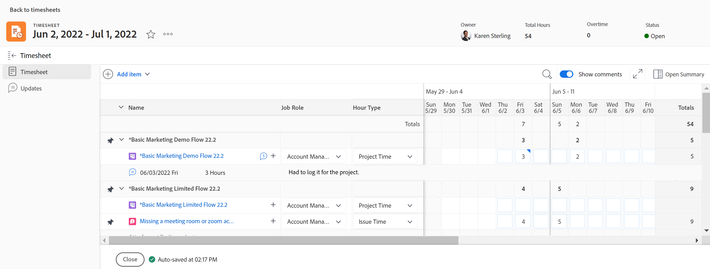
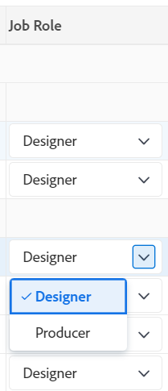
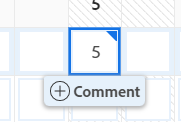

# 타임시트 레이아웃 개요

{{preview-and-fast-release}}

<!-- Audited: 12/2023 -->

이 문서에서는 Adobe Workfront의 타임시트 레이아웃에 대해 설명하므로 타임시트를 사용자 정의하고 활용하여 시간을 기록하는 방법을 더 잘 이해할 수 있습니다.

타임시트 및 시간 환경 설정은 타임시트에 표시되는 내용을 제어합니다. 이 문서에서는 사용 가능한 모든 옵션에 대한 개요를 제공합니다. 옵션 선택에 대한 자세한 내용은 [타임시트 및 시간 환경 설정 구성](../../administration-and-setup/set-up-workfront/configure-timesheets-schedules/timesheet-and-hour-preferences.md).

타임시트에 시간을 기록하는 방법에 대한 자세한 내용은 다음을 참조하십시오. [로그 시간](../../timesheets/create-and-manage-timesheets/log-time.md).

다음은 타임시트의 영역입니다.

* [타임시트 헤더](#timesheet-header)
* [왼쪽 패널](#the-left-panel)
* [작업 항목](#work-items)
* [도구 모음](#toolbar)
* [타임시트 바닥글](#timesheet-footer)
* [작업 역할](#job-role)
* [시간 유형](#hour-type)
* [왼쪽 패널의 업데이트 영역](#updates-area-in-the-left-panel)
* [요약 패널](#summary-panel)
* [시간대 및 시간 입력 영역](#time-frame-and-hour-entry-area)
* [시간 입력 주석](#hour-entry-comments)
* [시간](#hours)
* [합계](#totals)

## 타임시트 헤더

타임시트 헤더에는 다음 정보가 포함됩니다.

* 타임시트의 시간.
* 다음을 포함하는 작업 영역:
   * 별 아이콘을 사용하여 즐겨찾기 목록에 타임시트를 추가합니다.
   * 자세히 아이콘 및 삭제 옵션이 있으며 타임시트를 삭제할 수 있습니다.
* 타임시트 소유자의 이름입니다.
* 타임시트에 표시되는 항목에 대해 기록된 총 시간 수입니다.
* 초과 작업 시간 수. 수동 입력이며 **초과 작업 시간** 설정이 타임시트에 활성화되어 있습니다. 자세한 내용은 [타임시트 정보 편집](../create-and-manage-timesheets/edit-timesheets.md).

>[!TIP]
>
>타임시트에 현재 총 시간보다 많은 수의 초과 근무 시간을 기록할 수 없습니다. 예를 들어 지금까지 타임시트에 7시간을 기록한 경우 8시간의 초과 근무를 기록할 수 없습니다.

* 타임시트 상태.

## 왼쪽 패널

왼쪽 패널에서 다음 섹션에 액세스할 수 있습니다.

* **타임시트**: 실제 타임시트를 표시합니다.
* **업데이트**: 타임시트에 대한 댓글 및 시스템 업데이트를 표시합니다. 자세한 내용은 [왼쪽 패널의 업데이트 영역](#updates-area-in-the-left-panel) 이 문서의 섹션.

## 작업 항목

작업 항목은 시간을 기록할 프로젝트, 작업 및 문제입니다. 헤더 행에서 아래쪽을 가리키는 화살표를 클릭하면 아래에 나열된 프로젝트, 작업 및 문제가 축소됩니다. 프로젝트 이름 옆에 있는 아래쪽 화살표를 클릭하면 해당 프로젝트에 대한 작업 항목이 축소됩니다.

타임시트 외부에서 시간이 기록된 작업, 문제 및 프로젝트나 타임시트의 타임프레임 중에 계획된 항목이 여기에 자동으로 표시됩니다.

## 도구 모음

도구 모음에는 다음 옵션이 포함되어 있습니다.

* 다음 **항목 추가** 프로젝트, 작업 또는 문제를 추가할 수 있는 단추입니다.
* 타임시트에서 작업 또는 문제를 검색하는 빠른 필터 아이콘.
* 다음 **댓글 표시** 프로젝트, 작업 또는 문제 시간 항목에 대해 기록된 시간 설명을 보거나 숨길 수 있는 설정입니다.
* 타임시트를 전체 화면 모드로 표시하는 전체 화면 아이콘.
* 다음 **요약 열기** (또는 **요약 닫기**) 작업 또는 문제에 대한 추가 정보를 보려면 요약 패널을 열거나 닫는 단추입니다. 이 단추는 프로젝트에 사용할 수 없습니다.

자세한 내용은 [로그 시간](../create-and-manage-timesheets/log-time.md).

## 타임시트 바닥글

다음을 클릭할 수 있습니다 **승인을 위해 제출**, **닫기**, **승인**, 및 **거부** 이 영역에 있는 단추를 클릭하여 타임시트 승인을 닫거나 거부합니다.

이 영역에는 타임시트가 마지막으로 저장된 시기에 대한 정보도 포함됩니다. 타임시트의 정보에 대한 모든 변경 사항이 자동으로 저장됩니다.

## 작업 역할

시간 항목과 연결할 다른 작업 역할을 선택할 수 있습니다. Workfront 관리자는 **시간 항목에 작업 역할 할당** 수동으로 설정합니다. 작업에 할당되거나 문제가 기본적으로 표시되는 경우 지정된 작업 역할입니다. 작업 또는 문제에 대한 작업 역할이 할당되지 않은 경우 기본 역할이 기본값으로 표시됩니다. 자세한 내용은 [타임시트 및 시간 환경 설정 구성](../../administration-and-setup/set-up-workfront/configure-timesheets-schedules/timesheet-and-hour-preferences.md).

서로 다른 역할에 대해 동일한 작업 항목에 대해 여러 시간 항목을 기록할 수 있습니다. 자세한 내용은 [로그 시간](../create-and-manage-timesheets/log-time.md).

## 시간 유형

각 항목에 대한 시간 항목과 연결할 다양한 시간 유형을 선택할 수 있습니다. 이 필드는 Workfront 관리자가 사용자 환경에 대해 이 필드를 활성화할 때만 표시됩니다. 자세한 내용은 [타임시트 및 시간 환경 설정 구성](../../administration-and-setup/set-up-workfront/configure-timesheets-schedules/timesheet-and-hour-preferences.md).

서로 다른 시간 유형에 대해 동일한 작업 항목에 대해 여러 시간 항목을 기록할 수 있습니다. 자세한 내용은 [로그 시간](../create-and-manage-timesheets/log-time.md).

## 왼쪽 패널의 업데이트 영역

타임시트의 왼쪽 패널에 있는 업데이트 섹션에서 타임시트 승인자 또는 다른 사용자와 소통하기 위해 타임시트에 댓글을 달 수 있습니다.

타임시트에 있는 모든 댓글이 이 영역에 표시됩니다.

## 요약 패널

타임시트에 표시되는 작업 또는 문제에 대한 요약 패널에 액세스할 수 있습니다. 여기에서 작업 및 문제에 대해 댓글을 달거나 정보를 업데이트할 수 있습니다. 자세한 내용은 [요약 개요](../../workfront-basics/the-new-workfront-experience/summary-overview.md).

타임시트 요약 패널에서 작업 항목에 대해 입력한 주석이 작업 또는 문제의 업데이트 영역에 표시됩니다. 요약 패널은 프로젝트에 사용할 수 없습니다.

## 시간대 및 시간 입력 영역

타임시트의 시간대가 작업 항목 오른쪽에 표시됩니다.

1주, 2주 또는 4주 동안 타임시트를 만들 수 있습니다.

시간대는 전주 단위로 표시됩니다. 지정된 타임시트 시간대 이후의 일수는 흐리게 표시됩니다. 타임시트의 시간대를 벗어난 일수에 대해서는 시간을 기록할 수 없습니다.

자세한 내용은 [일회용 타임시트 만들기](../create-and-manage-timesheets/create-tmshts.md) 또는 [타임시트 프로필 만들기, 편집 및 할당](../create-and-manage-timesheets/create-timesheet-profiles.md).

<!--drafted for the resize columns in timesheets story - make this blurb a TIP when the story is released: 
You can resize the columns that display different weeks, the time frame, or the work item areas by dragging and dropping the vertical lines that separate them.-->

## 시간 입력 주석

타임시트에 추가하는 모든 시간 항목에 주석을 추가할 수 있습니다.

시간 항목 설명 상자에 입력한 설명은 타임시트에, 시간을 기록한 각 작업 항목 아래에 표시됩니다. **댓글 표시** 설정은 도구 모음에서 활성화됩니다.

## 시간

타임시트는 각 작업 항목과 타임시트 범위의 일에 대한 입력 필드를 제공하여 항목에서 작업하는 데 걸린 시간을 기록합니다. 시간을 기록할 때 시간을 기록하는 항목은 연한 파란색으로 강조 표시되고 시간 상자는 진한 파란색으로 표시됩니다.

## 합계

타임시트에 입력한 모든 시간의 합계를 일별(타임시트의 헤더)과 객체별(마지막 열)로 요약합니다.
