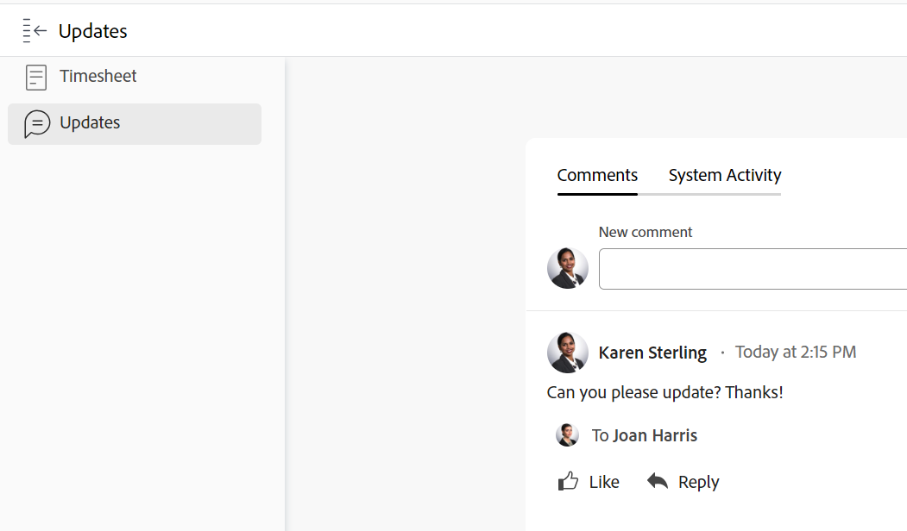

# 작업표 레이아웃 이해

이 문서에서는 Adobe Workfront의 작업표 레이아웃을 설명하므로 작업표를 사용자 지정하고 사용하여 시간을 기록하는 방법을 더 잘 이해할 수 있습니다.

작업표 및 시간 환경 설정은 작업표에 표시되는 내용을 제어합니다. 이 문서에서는 사용 가능한 모든 옵션에 대한 개요를 제공합니다. 자세한 내용은 [작업표 및 시간 환경 설정 구성](../../administration-and-setup/set-up-workfront/configure-timesheets-schedules/timesheet-and-hour-preferences.md).

시트에서 시간을 기록하는 방법에 대한 자세한 내용은 [로그 시간](../../timesheets/create-and-manage-timesheets/log-time.md).

작업표의 영역은 다음과 같습니다.

* [작업표 머리글](#timesheet-header)
* [왼쪽 패널](#the-left-panel)
* [작업 항목](#work-items)
* [도구 모음](#toolbar)
* [작업표 바닥글](#timesheet-footer)
* [작업 역할](#job-role)
* [시간 유형](#hour-type)
* [왼쪽 패널의 영역 업데이트](#updates-area-in-the-left-panel)
* [요약 패널](#summary-panel)
* [시간대 및 시간 시작 영역](#time-frame-and-hour-entry-area)
* [시간 입력 주석](#hour-entry-comments)
* [시간](#hours)
* [합계](#totals)

## 작업표 머리글

작업표 헤더에는 다음 정보가 포함됩니다.

* 작업표의 기간
* 작업 영역은 다음을 포함합니다.
   * 즐겨찾기 목록에 작업표를 추가하는 별 아이콘
   * 작업표를 삭제할 수 있는 [삭제] 옵션이 있는 [자세히] 아이콘
* 작업표 소유자의 이름입니다.
* 작업표에 표시된 항목에 대해 기록된 시간의 총 시간 수입니다.
* 초과 근무 시간 수입니다. 이 항목은 수동 항목이며 **초과 근무** 작업표에서 설정을 사용할 수 있습니다. 자세한 내용은 [작업표 정보 편집](../create-and-manage-timesheets/edit-timesheets.md).

>[!TIP]
>
>작업표의 현재 총 시간보다 더 많은 초과 근무 시간을 기록할 수 없습니다. 예를 들어 작업표에 7시간을 기록하면 8시간의 초과 근무를 기록할 수 없습니다.

* 작업표 상태입니다.

## 왼쪽 패널

왼쪽 패널에서 다음 섹션에 액세스할 수 있습니다.

* **작업표**: 실제 작업표를 표시합니다.
* **업데이트**: 작업표에 대한 설명 및 시스템 업데이트를 표시합니다. 자세한 내용은 [왼쪽 패널의 영역 업데이트](#updates-area-in-the-left-panel) 섹션에 자세히 설명되어 있습니다.

## 작업 항목

작업 항목은 시간을 기록하려는 프로젝트, 작업 및 문제입니다. 헤더 행에서 아래쪽 방향 화살표를 클릭하면 프로젝트와 아래에 나열된 작업 및 문제가 축소됩니다. 프로젝트 이름 옆에 있는 아래쪽 방향 화살표를 클릭하면 해당 프로젝트에 대한 작업 항목이 축소됩니다.

작업표의 시간 동안 작업표 또는 계획된 항목 외부에서 시간이 기록되는 작업, 문제 및 프로젝트는 여기에 자동으로 표시됩니다.

## 도구 모음

도구 모음에는 다음 옵션이 있습니다.

* 프로젝트, 작업 또는 문제를 추가할 수 있는 의 항목 추가 단추.
* 작업표에서 작업이나 문제를 검색할 빠른 필터 아이콘입니다.
* 다음 **댓글 표시** 프로젝트, 작업 또는 문제 시간 항목에 대해 기록된 시간 설명을 보거나 숨길 수 있는 설정.
* 작업표를 전체 화면 모드로 표시할 수 있는 전체 화면 아이콘
* **요약 열기** 또는 **요약 닫기**)을 클릭하여 [요약] 패널을 열거나 닫고 작업 또는 문제에 대한 추가 정보를 볼 수 있습니다. 프로젝트에서는 사용할 수 없습니다.

자세한 내용은 [로그 시간](../create-and-manage-timesheets/log-time.md).

## 작업표 바닥글

작업표 승인을 닫거나 거부하려면 이 영역의 승인 제출, 닫기, 승인 및 거부 단추를 클릭하면 됩니다.

이 영역에는 작업표를 마지막으로 저장한 시기에 대한 정보도 포함되어 있습니다. 작업표의 정보에 대한 모든 변경 내용은 자동으로 저장됩니다.

## 작업 역할

시간 항목과 연결할 다른 작업 역할을 선택할 수 있습니다. Workfront 관리자는 시간 항목에 작업 역할 할당 설정을 수동으로 활성화해야 합니다. 작업에 할당되거나 기본적으로 문제가 표시될 때 지정된 작업 역할입니다. 작업 또는 문제에 대한 작업 역할이 할당되지 않은 경우 기본 역할이 기본값으로 표시됩니다. 자세한 내용은 문서를 참조하십시오 [작업표 및 시간 환경 설정 구성](../../administration-and-setup/set-up-workfront/configure-timesheets-schedules/timesheet-and-hour-preferences.md).

여러 역할에 대해 동일한 작업 항목에 대해 여러 시간 항목을 기록할 수 있습니다. 자세한 내용은 [로그 시간](../create-and-manage-timesheets/log-time.md).

## 시간 유형

각 항목의 시간 항목과 연결할 다양한 시간 유형을 선택할 수 있습니다. 이 필드는 Workfront 관리자가 사용자 환경에 대해 이 필드를 활성화할 때만 표시됩니다. 자세한 내용은 문서를 참조하십시오 [작업표 및 시간 환경 설정 구성](../../administration-and-setup/set-up-workfront/configure-timesheets-schedules/timesheet-and-hour-preferences.md).

동일한 작업 항목에 대해 다른 시간 유형에 대해 여러 시간 항목을 기록할 수 있습니다. 자세한 내용은 [로그 시간](../create-and-manage-timesheets/log-time.md).

## 왼쪽 패널의 영역 업데이트

작업표에 대한 메모를 만들어 왼쪽 패널의 업데이트 섹션에서 작업표 승인자나 다른 사용자와 통신할 수 있습니다.

작업표에 수행된 모든 주석이 작업표 하단에 표시됩니다. 작업표 및 작업표 바닥글 위에 이 영역이 표시됩니다. 자세한 내용은 [작업표에서 주석 보기 및 관리](../create-and-manage-timesheets/view-and-manage-comments-timesheets.md).

## 요약 패널

작업표에 표시되는 작업 또는 문제에 대한 요약 패널에 액세스할 수 있는 주석을 달 수 있습니다. 여기에서 작업 및 문제에 대해 주석을 달거나 정보를 업데이트할 수 있습니다. 자세한 내용은 [요약 개요](../../workfront-basics/the-new-workfront-experience/summary-overview.md).

작업표 요약 패널의 작업 항목에 대해 입력한 주석이 작업 또는 문제의 업데이트 영역에 표시됩니다. 프로젝트에서 [요약] 패널을 사용할 수 없습니다.

## 시간대 및 시간 시작 영역

작업표의 시간대가 작업 항목의 오른쪽에 표시됩니다.

1주, 2주 또는 4주에 대한 작업표를 만들 수 있습니다.

기간은 전체 주 단위로 표시됩니다. 지정한 작업표 시간 기간(일)의 날짜가 흐리게 표시됩니다. 작업표의 시간 기간을 벗어나는 일 시간은 기록할 수 없습니다.

자세한 내용은 [단일 사용 작업표 만들기](../create-and-manage-timesheets/create-tmshts.md) 또는 [작업표 프로필 만들기, 편집 및 할당](../create-and-manage-timesheets/create-timesheet-profiles.md).

<!--drafted for the resize columns in timesheets story - make this blurb a TIP when the story is released: 
You can resize the columns that display different weeks, the time frame, or the work item areas by dragging and dropping the vertical lines that separate them.-->

## 시간 입력 주석

작업표에 추가하는 매시간 항목에 대한 설명을 추가할 수 있습니다.

시간 항목 설명 상자에 입력한 주석이 작업표에 표시됩니다. 이때 작업표에 기록되는 각 작업 항목 아래에 **댓글 표시** 이 설정은 도구 모음에서 활성화됩니다.

## 시간

작업표는 각 작업 항목 및 작업표 범위의 일에 대한 입력 필드를 제공하여 해당 항목에서 작업한 시간을 기록합니다. 로깅 시간이 되면 밝은 파란색으로 밝은 영역에 대해 시간을 기록하는 항목이 어두운 파란색으로 표시됩니다.

## 합계

작업표에 입력한 모든 시간의 합계를 일(작업표 헤더에 있음)과 개체(마지막 열에 있음)별로 요약합니다.
