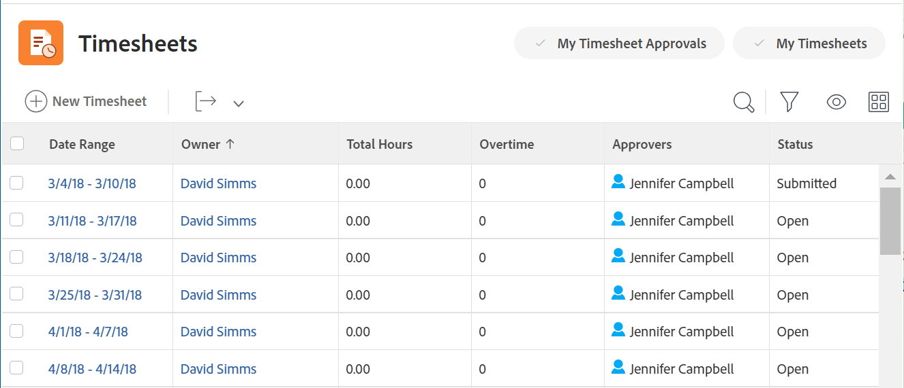

# 타임시트 개요

<!-- Audited: 12/2023 -->

타임시트를 사용하여 Adobe Workfront 내부 및 외부에서 작업에 소비하는 시간을 추적할 수 있습니다.

프로젝트, 작업 및 문제와 같은 작업 항목에 프로젝트 시간을 기록할 수 있습니다. 로그온한 작업, 문제 및 프로젝트가 타임시트에 자동으로 표시됩니다.

회의, 교육 또는 부재 시간과 같은 업무와 관련 없는 항목에 대한 프로젝트 외 시간을 일반 시간 아래의 타임시트에 직접 기록할 수도 있습니다.

Workfront에서 시간을 기록하는 방법에 대한 자세한 내용은 [시간 기록](../../timesheets/create-and-manage-timesheets/log-time.md)을 참조하세요.

>[!TIP]
>
>Workfront 또는 그룹 관리자인 경우 타임시트를 만들고 사용자와 연결할 수 있습니다. 타임시트를 만드는 방법에 대한 자세한 내용은 [타임시트 만들기 및 관리: 문서 인덱스](../create-and-manage-timesheets/create-and-manage-timesheets.md)를 참조하십시오.

## 프로젝트 시간과 비프로젝트 시간 이해

타임시트는 사용자가 프로젝트와 비프로젝트 작업 모두에 대한 시간을 추적할 수 있는 간단한 방법을 제공합니다.

* **프로젝트 시간:** 시간을 추적할 작업 또는 프로젝트에서 직접 가져옵니다.

  타임시트를 통해 작업, 문제 및 프로젝트에 기록된 시간은 프로젝트 및 작업에 소요된 노력을 정확하게 나타내기 위해 각 작업 항목과 연결됩니다. 정확한 시간 입력이 없으면 청구 목적으로 데이터가 정확하지 않을 수 있습니다.

  또한 리소스가 작업에 시간을 직접 기록할 때 사용자가 타임시트에 액세스할 때 문제 및 프로젝트가 자동으로 표시됩니다. 타임시트 날짜 범위가 시간이 기록된 날짜에 걸쳐 있다고 가정합니다.

* **프로젝트가 아닌 시간:** 사용자 타임시트에서 직접. Workfront에서 시간을 추적하는 방법에 대한 자세한 내용은 다음을 참조하십시오.   [로그 시간](../../timesheets/create-and-manage-timesheets/log-time.md).

  타임시트에는 휴가 시간, 병가 시간, 수송 시간, 장비 수리나 유지 관리에 소요된 시간 또는 만들려는 일반 오버헤드 시간 유형을 기록할 수 있습니다.

## 타임시트 영역의 타임시트에 액세스

타임시트 영역은 기본적으로 모든 사용자가 사용할 수 있습니다. Workfront 관리자는 필요에 따라 레이아웃 템플릿에서 이를 변경할 수 있습니다. 자세한 내용은 [레이아웃 템플릿을 사용하여 기본 메뉴 사용자 지정](/help/quicksilver/administration-and-setup/customize-workfront/use-layout-templates/customize-main-menu.md)을 참조하십시오.

타임시트에 액세스하려면:

{{step1-to-timesheets}}

기본적으로 표시할 액세스 권한이 있는 타임시트와 모든 타임시트입니다. Adobe Workfront의 타임시트 레이아웃에 대한 자세한 내용은 [타임시트 레이아웃 개요](../../timesheets/timesheets/timesheet-layout.md)를 참조하십시오.

1. 오른쪽 상단에서 다음 옵션 중 하나를 클릭하여 타임시트를 표시합니다.

   * 내 타임시트만 표시하려면 **내 타임시트**&#x200B;를 클릭하세요.

   

   * **내 타임시트 승인**&#x200B;에서 승인한 타임시트만 표시합니다.

     

1. (선택 사항) 타임시트 목록 맨 위에서 보기, 필터 및 그룹화를 업데이트합니다. 자세한 내용은 [보고 요소: 필터, 보기 및 그룹화](../../reports-and-dashboards/reports/reporting-elements/reporting-elements-overview.md)을 참조하세요.

1. 타임시트의 **날짜 범위**&#x200B;를 클릭하여 엽니다.

   각 타임시트에는 시간을 기록한 모든 작업, 문제 및 프로젝트가 표시됩니다. 또한 타임시트에는 타임시트의 시간대 내에 날짜가 있는 사용자에게 할당되었지만 아직 시간이 기록되지 않은 최대 45개의 작업 및 문제가 표시됩니다. 타임시트에 표시할 45개의 최근 업데이트 항목을 선택합니다.

   자세한 내용은 [타임시트 및 시간 환경 설정 구성](../../administration-and-setup/set-up-workfront/configure-timesheets-schedules/timesheet-and-hour-preferences.md)을 참조하십시오.
