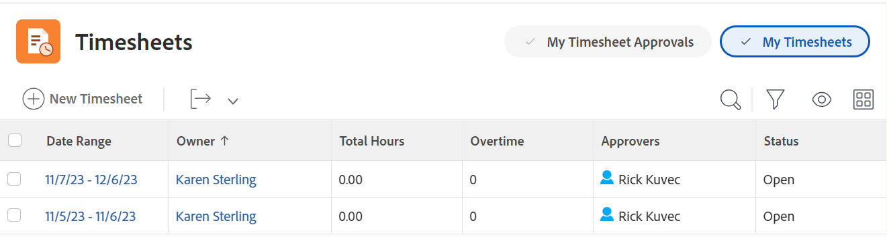

# 작업표 개요

작업표를 사용하여 작업 시간을 추적할 수 있습니다. Adobe Workfront의 작업표 레이아웃에 대한 자세한 내용은 [작업표 레이아웃 이해](../../timesheets/timesheets/timesheet-layout.md).

일반적으로 작업이 수행되는 프로젝트, 작업 또는 문제 수준에서 다양한 방법으로 Workfront에 로그인할 수 있습니다. 작업, 문제 및 프로젝트에 대해 기록된 시간도 작업표에 표시됩니다.

일반 시간 아래에서 비프로젝트 작업에 대한 시간을 기록할 수도 있습니다. 일반 시간 시간은 작업표에만 기록할 수 있습니다.

Workfront에서 로깅 시간에 대한 자세한 내용은 [로그 시간](../../timesheets/create-and-manage-timesheets/log-time.md).

>[!NOTE]
>
>또한 Workfront 모바일 앱을 사용하면 업데이트를 게시하고, 로그된 시간을 변경하고, 주석을 입력하고, 작업표를 닫을 수 있습니다.

## 프로젝트 시간과 비프로젝트 시간 이해

작업표를 사용하면 프로젝트 및 비프로젝트 작업 시간을 간단하게 추적할 수 있습니다.

* **프로젝트 시간:** 시간을 추적하려는 작업이나 프로젝트에서 바로 이동할 수 있습니다.

   작업표를 통해 작업, 문제 및 프로젝트에 대해 기록된 시간은 해당 작업 항목과 연결되어 프로젝트 및 작업에 사용한 작업을 정확하게 표현합니다. 정확한 시간 입력이 없으면, 청구 목적으로 데이터를 정확하게 입력할 수 없습니다.

   또한 리소스가 작업표에 직접 시간 기록 시 작업표에 액세스하면 문제 및 프로젝트가 자동으로 나타납니다. 작업표 날짜 범위가 시간이 기록된 날짜까지 적용되는 것으로 가정합니다.

* **비프로젝트 시간:** 사용자 작업표에 직접 표시됩니다. Workfront에서 시간을 추적하는 방법에 대한 자세한 내용은  [로그 시간](../../timesheets/create-and-manage-timesheets/log-time.md).

   작업표에서 리소스는 휴가 시간, 병가 시간, 수송 체류 시간, 장비 수리 또는 유지 보수 시간 또는 작성하고자 하는 일반적인 오버헤드 시간 유형을 기록할 수 있습니다.

## 로그 시간을 기록할 수 있는 위치 이해

작업표 영역에서는 세 개의 다른 작업표 관리 영역에 액세스할 수 있습니다. 각 작업표는 사용자가 로그한 모든 작업, 문제 및 프로젝트를 표시합니다. 작업표는 작업표의 기간 내에 날짜가 지정되었지만 아직 기록되지 않은 작업표에 최대 45개의 작업, 문제 또는 프로젝트를 표시합니다.

작업표 영역의 작업표에 액세스하여 Workfront에서 시간을 추적할 수 있습니다. 작업표 영역에서 뷰, 필터 및 그룹화를 업데이트할 수 있습니다. 다음은 원하는 작업표 유형에 따라 선택할 수 있는 내장 필터의 예입니다. 사용자 지정 필터를 빌드할 수도 있습니다.

* 모든 필터. 기본적으로 선택됩니다.

   

* 사용자의 작업표를 표시하는 내 작업표 필터입니다.

   

* 승인자로 설정된 작업표를 표시하는 내 작업표 승인 필터입니다.

   
