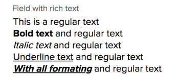

# Adobe Workfront API의 리치 텍스트 필드

Adobe Workfront의 일부 개체를 사용하면 서식 있는 텍스트 서식을 가진 텍스트를 저장할 수 있습니다. Workfront API에서 리치 텍스트는 오픈 소스 프레임워크 Draft.js를 사용하여 JSON으로 저장됩니다.

## 개요 예

서식 있는 텍스트 서식이 있는 사용자 지정 필드를 라고 합니다 **텍스트가 풍부한 필드** 와(과) 연결된 값은 다음과 같습니다.

**예:** 사용자 지정 양식 필드의 값을 검색하기 위한 기본 GET 요청 **텍스트가 풍부한 필드**:

<!-- [Copy](javascript:void(0);) -->
<pre><OBJ Code><OBJ ID><OBJ Code><OBJ ID></pre>

**예:** 이 요청은 다음 값 반환 **텍스트가 풍부한 필드** 에 저장된 JSON에서 **parameterValue** **DE:리치 텍스트가 있는 필드**

<!-- [Copy](javascript:void(0);) -->
<pre></pre>

**예:** 위 그림에서 바로 나오는 형식의 응답 버전입니다

<!-- [Copy](javascript:void(0);) -->
<pre></pre>

## 블록

리치 텍스트 컨텐츠를 저장하는 JSON 개체는 두 가지 주요 부분으로 구성됩니다. **블록** 및 **entityMap**.

블록은 한 줄의 서식이 지정된 텍스트를 나타내는 JSON 개체입니다. 단일 사용자 지정 필드에는 두 개 이상의 텍스트 행이 포함될 수 있으므로 각 텍스트 줄에는 자체 블록이 있으며 각 블록은 **블록**.

**예:** 여기에서 사용자 지정 필드의 각 텍스트 행은 배열 블록의 블록 요소에 매핑됩니다

각 블록 요소도 JSON 개체이므로 각 블록은 요소로 구성됩니다. **key**, **텍스트**, **유형**, **깊이**, **inlineStyleRanges**, **entityRanges**, 및 **데이터**. 이러한 각 요소는 다음과 같이 작동합니다.

* **키** 는 해당 블록의 고유 식별자입니다. 키는 entityMap을 통해 텍스트 라인을 매핑하는 데 사용됩니다. entityMap에 대한 세부 정보는 이 문서의 entityMap 섹션에서 찾을 수 있습니다.
* **텍스트** 는 사용자 지정 필드에서 저장되고 있는 텍스트 컨텐츠 행입니다.
* **유형** 표현되는 텍스트 유형을 설명합니다. 예를 들어 블록에 저장되는 텍스트 선은 목록의 일부일 수 있습니다. 해당 텍스트 행이 순서가 없는 목록의 일부인 경우 해당 유형이 다음과 같이 정의됩니다. unordered-list-item.
* 목록은 현재 지원되지 않지만, 곧 사용할 수 있습니다.
* **깊이** 이 매개변수는 정렬되거나 순서가 지정되지 않은 목록의 중첩된 부분인 경우 선의 깊이를 정의합니다.
* **inlineStyleRanges** 현재 블록으로 표시된 텍스트 행에 적용된 서식 유형을 설명하는 배열입니다.

**예:** 다음은 문자 수준의 각 스타일을 설명하는 inlineStyleRanges 배열입니다. 이 경우: 9자(길이: 9) 인덱스 0부터 시작(오프셋: 0) 스타일 **굵게** 적용됨:

한 행에 여러 유형의 서식이 적용된 경우 스타일이 ** inlineStyleRanges** 배열의 추가 요소에 매핑됩니다.

**예:** 다음은 혼합 서식이 포함된 텍스트 행을 저장할 때 블록의 모습입니다. **굵은 텍스트 및 기울임체**

<!-- [Copy](javascript:void(0);) -->
<pre></pre>

>[!NOTE]
>
>20.3 릴리스 이후의 모든 버전은 굵게, 기울임체 및 밑줄 서식 옵션을 지원합니다.

## entityMap 및 entityRanges

데이터 블록은 하이퍼링크나 사용자 지정 텍스트 필드 외부에 있는 데이터 소스에 연결된 다른 유형의 스타일 지정 서식과 같은 엔터티를 포함할 수 있습니다.

## 예

### JSON에서 일반 텍스트 검색

서식 있는 텍스트 서식이 있는 사용자 지정 필드를 제출하면 모든 텍스트가 배열에 저장됩니다 **블록**. 그러나 전체 텍스트의 각 행은 **텍스트 매개 변수** 상위 배열을 구성하는 각 개별 블록 요소 내에서 **블록**. 따라서 전체 텍스트를 검색하려면 각 개별 텍스트 줄을 추출하여 다시 함께 파싱해야 합니다. 블록의 모든 요소에 대해 반복하고 각 텍스트 매개 변수를 줄 구분 기호(\n)와 함께 연결하여 이를 수행할 수 있습니다.

**예:** 다음은 JS의 모습입니다.

<!-- [Copy](javascript:void(0);) -->
<pre></pre>

### Workfront API를 사용하여 리치 텍스트 필드 값 저장

Workfront API를 사용하여 리치 텍스트 필드의 다음 값을 저장하려면 다음을 수행하십시오.
<pre>
		Hello <strong>World</strong>!!!
		이번이 처음이에요 <strong>리치 텍스트</strong></pre>

1. 각 텍스트 행을 배열 블록 요소로 구성하여 캡처하려는 리치 텍스트 필드의 값을 나타내는 JSON을 구성합니다 **블록**

   <!-- [Copy](javascript:void(0);) -->
   <pre></pre>

1. 을 사용하여 서식 있는 텍스트 서식을 캡처합니다. **inlineStyleRanges** 매개 변수

   <!-- [Copy](javascript:void(0);) -->
   <pre></pre>

1. 두 번째 줄을 캡처하려면 &quot;리치 텍스트&quot; 텍스트 서식을 굵게 및 기울임체로 지정해야 합니다.

   <!-- [Copy](javascript:void(0);) -->
   <pre></pre>

   >[!NOTE]
   >
   >초기 릴리스 동안 entityMap 기능은 지원되지 않지만, 요청에 이 JSON을 전달하는 것은 여전히 필수 필드입니다

1. 를 사용하십시오 **stringify** 위에 요약된 JSON의 메서드로, **PUT** 업데이트 요청 및 보내기

   <!-- [Copy](javascript:void(0);) -->
   <pre><OBJ Code><OBJ ID></pre>
