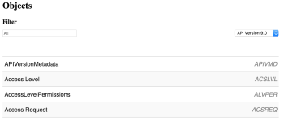

# API 탐색기 사용

Adobe Workfront 코어 API를 사용할 때 API 탐색기는 지원되는 리소스, 매개 변수 및 변수 간의 관계를 카탈로그화하는 기존 참조 도구입니다.

## API 탐색기에 액세스:

1. 웹 브라우저를 사용하여 [API 탐색기](https://one.workfront.com/s/api-explorer)\
   

1. API 탐색기의 오른쪽 위에서 원하는 Workfront를 선택합니다 **API 버전**&#x200B;기본적으로 가장 최신 버전이 자동으로 선택됩니다
1. 다음 **필터** 필드 를 사용하여 이름별로 나열된 개체를 필터링하고 그에 따라 표시되는 개체 목록을 자를 수 있습니다.

   

   * **필드**: 지정한 개체 내에서 사용 가능한 필드입니다.
   * **참조**: 지정된 개체에 사용 가능한 참조 변수입니다. 참조는 변수의 별칭입니다. 초기화한 후에는 변수 이름과 상호 교환하여 참조를 사용할 수 있습니다. 참조에서는 초기화된 메모리를 사용합니다.
   * **컬렉션**: 객체에 사용할 수 있는 컬렉션입니다. 컬렉션은 개체와 리소스 간의 일대다 관계를 나타내는 변수입니다.
   * **검색**: 객체에 사용할 수 있는 검색 리소스입니다. 검색 결과는 API 요청의 검색 리소스에서 지정한 쿼리 매개 변수를 기반으로 합니다.
   * **작업**: 개체에 대해 지원되는 작업입니다. 작업은 리소스 또는 리소스 세트에 대해 실행되는 간단하거나 복잡한 절차일 수 있습니다. 지정된 작업은 관련 리소스에 영향을 줄 수도 있습니다.

1. 탭을 열고 개체 ID를 클릭하여 적용 가능한 변수를 봅니다.\
   \
   선택한 객체에 따라 다음 변수가 적용될 수 있습니다.

   | 변수 | 정의 |
   |---|---|
   | 필드 이름 | Workfront API 내의 작업에 사용되는 필드의 이름입니다. |
   | 필드 유형 | 데이터 테이블의 특정 필드에 입력할 수 있는 값의 종류입니다. 가능한 필드 유형 값에는 문자열, double, int, dateTime이 포함됩니다. |
   | 열거형 유형 | 데이터 유형을 식별하는 데 사용할 수 있는 값의 종류입니다. |
   | 가능한 값 | 객체에 사용할 수 있는 값입니다. |
   | 속성 유형 ObjCode | 객체 클래스를 수정하는 데 사용할 수 있는 속성입니다. |
   | URL | 앱이 Workfront API와 통신할 수 있도록 하는 시작 경로입니다. |
   | 인수 | 애플리케이션과 Workfront 간에 전달할 수 있는 개체의 변수입니다. |
   | 결과 유형 | 메서드에서 반환할 수 있는 허용 데이터 형식입니다. |
