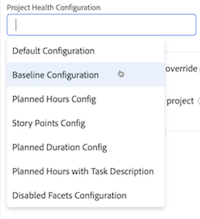

# 프로젝트 상태 개요

>[!IMPORTANT]
>
>프로젝트 상태 기능은 현재 Beta 단계에 참여하는 사용자만 사용할 수 있습니다.

Adobe Workfront의 프로젝트 상태 기능은 AI Assistant의 기능을 통해 프로젝트의 수행 방식, 관심을 기울여야 할 영역, 시간과 비용이 드는 문제를 방지하는 방법에 대한 평가를 즉시 제공합니다.

AI Assistant는 다음 객체에 대한 프로젝트 상태 평가를 생성할 수 있습니다.

* 단일 프로젝트
* 단일 프로그램
* 여러 프로젝트

AI Assistant에 대한 자세한 내용은 [AI Assistant 개요](/help/quicksilver/workfront-basics/ai-assistant/ai-assistant-overview.md)를 참조하십시오.

+++ 를 확장하여 액세스 요구 사항을 확인합니다. 
<table style="table-layout:auto"> 
<col> 
</col> 
<col> 
</col> 
<tbody> 
<tr> 
   <td role="rowheader">
Adobe Workfront 플랜
</td> 
   <td> 

Select, Prime 또는 Ultimate 
 
   </td> 
<tr> 
 <tr> 
   <td role="rowheader">
Adobe Workfront 라이선스
</td> 
   <td> 

표준
 
   </td> 
   </tr> 
  </tr> 
  <tr> 
   <td role="rowheader">
액세스 수준 구성
</td> 
   <td>
프로젝트 상태 구성을 관리할 관리자 

   
프로젝트 상태 구성을 적용하려면 편집 

     
프로젝트 상태 구성을 보려면 보기 

  </td> 
  </tr>  
    </tr>  
</tbody> 
</table>

이 표의 정보에 대한 자세한 내용은 [Workfront 설명서의 액세스 요구 사항](/help/quicksilver/administration-and-setup/add-users/access-levels-and-object-permissions/access-level-requirements-in-documentation.md)을 참조하십시오.
+++

## 프로젝트 상태 베타에 등록

Project Health를 활용하려면 조직에서 AI Assistant를 활성화해야 합니다.

조직에 대해 AI Assistant 및 프로젝트 상태를 활성화하려면 다음 사항을 모두 적용해야 합니다.

* 조직이 Adobe IMS(Identity Management System)로 마이그레이션되었어야 합니다.
* 조직에 Select, Prime 또는 Ultimate Workfront 플랜이 있어야 합니다.
* Adobe 통합 경험을 활성화해야 합니다.
* Adobe은 파일에 서명된 Adobe Gen AI 계약이 있어야 합니다.
* Workfront 관리자는 조직의 사용자를 위해 AI Assistant를 활성화해야 합니다. AI Assistant는 액세스 수준을 통해 활성화됩니다.
* 설정 > 시스템 > 환경 설정의 AI 환경 설정 섹션에서 AI 및 프로젝트 상태 활성화 옵션을 모두 선택해야 합니다.

  

자세한 내용은 [AI Assistant 개요](/help/quicksilver/workfront-basics/ai-assistant/ai-assistant-overview.md) 및 [시스템 환경 설정 구성](/help/quicksilver/administration-and-setup/manage-workfront/security/configure-security-preferences.md)을 참조하십시오.

## AI Assistant 프롬프트 목록

다음은 프로젝트, 프로그램 또는 계정의 모든 프로젝트에 대한 프로젝트 상태 평가를 생성하도록 AI 평가에 요청할 때 사용할 수 있는 프롬프트 목록입니다.

<table>
    <tr>
        <td><b>위치</b></td>
        <td><b>프롬프트</b></td>
    </tr>
    <tr>
        <td>특정 프로젝트 세부 정보 페이지</td>
        <td><em>이 프로젝트의 상태는 어떻습니까?</em></td>
    </tr>
    <tr>
        <td>Workfront의 모든 페이지 </td>
        <td><em>프로젝트 [PROJECT NAME]의 상태는 무엇입니까?</em></td>
    </tr>
    <tr>
        <td>Workfront의 모든 페이지 </td>
        <td><em>내 프로젝트의 상태는 어떻습니까?</em></td>
    </tr>
       <tr>
        <td>특정 프로그램 세부 정보 페이지</td>
        <td><em>이 프로그램의 상태는 어떻습니까?</em></td>
    </tr>
       <tr>
        <td>Workfront의 모든 페이지 </td>
        <td><em>[PROGRAM NAME] 프로그램의 상태는 어떻습니까?</em></td>
    </tr>
   </table>

## 프로젝트 및 프로그램 상태 목록

다음은 프로젝트 상태 평가를 생성할 때 AI Assistant가 프로젝트 또는 프로그램을 할당할 수 있는 조건입니다.

<table>
    <tr>
        <td><b>프로젝트 상태</b></td>
        <td><b>프로젝트 진행 상태</b></td>
        <td><b>프로젝트 상태 요소</b></td>
    </tr>
    <tr>
        <td>대상</td>
        <td>이 분석은 다음 요인에 대한 평균 위험 수준이 정상 임계값 내에 있을 때 부여된다.
        </td>
        <td> 
        <ul><li>범위 확장</li>
        <li>필드 누락</li>
        <li>일정 변경</li>
        <li>과소 평가된 작업</li>
        <li>프로젝트 진행</li>
        <li>기한이 지난 작업</li>
        <li>예산</li>
        </ul></td>
    </tr>
    <tr>
        <td>위험 상태</td>
        <td>이 분석은 다음 요인에 대한 평균 위험 수준이 정상 임계값 바로 아래로 떨어질 때 할당됩니다.</td>
        <td>
        <ul><li>범위 확장</li>
        <li>필드 누락</li>
        <li>일정 변경</li>
        <li>과소 평가된 작업</li>
        <li>프로젝트 진행</li>
        <li>기한이 지난 작업</li>
        <li>예산</li>
        </ul></td>
    </tr>
    <tr>
        <td>문제 발생</td>
        <td>이 분석은 다음 요인에 대한 평균 위험 수준이 건강 역치 이하로 떨어질 때 부여된다.</td>
        <td>
        <ul><li>범위 확장</li>
        <li>필드 누락</li>
        <li>일정 변경</li>
        <li>과소 평가된 작업</li>
        <li>프로젝트 진행</li>
        <li>기한이 지난 작업</li>
        <li>예산</li>
        </ul></td>
    </tr>
    </tr>
   </table>

## 프로젝트 상태 구성 관리

프로젝트 상태 구성에는 프로젝트 상태를 계산하는 방법을 결정하는 특정 기준이 포함되어 있습니다. 구성이 만들어지면 프로젝트에 적용할 수 있습니다.

>[!NOTE]
>
>프로젝트 상태 구성을 관리하려면 시스템 관리자여야 합니다.

{{step-1-to-setup}}

1. 왼쪽 패널에서 **프로젝트 환경 설정**&#x200B;을 클릭한 다음 표시되는 드롭다운에서 **프로젝트 상태**&#x200B;를 선택합니다.

1. 페이지의 오른쪽 상단 모서리에서 **새 구성**&#x200B;을 선택합니다.

1. (선택 사항) 구성 세부 정보 페이지에서 *제목 없는 구성*&#x200B;을(를) 새 구성 **이름**(으)로 바꿉니다.

1. **프로젝트 상태에 포함할 요소** 섹션에서 프로젝트 상태 조건을 결정할 때 포함하지 않을 요소를 선택 취소하십시오.
   * **범위 크립**: 시작된 이후 프로젝트 범위가 얼마나 확장되었는지 표시합니다.

   * **필수 필드**: 필수 필드가 누락된 경우(예: 프로젝트 설명). 이 필수 필드는 프로젝트 완결성을 결정하며 **완결성을 확인할 필드를 지정합니다.아래의** 구성 섹션입니다.

   * **일정 변경**: 프로젝트가 시작된 후 일정 변경이 몇 번 발생했는지 확인합니다.

   * **작업 예상**: 작업 작업의 예상 정확도(예: 현재 프로젝트에 지연된 작업이 없음).

   * **작업 번다운**: 프로젝트 타임라인과 비교하여 프로젝트 작업이 진행되는 방식.

   * **기한이 지난 작업**: 기한이 지난 작업의 수.

   * **비용**: 프로젝트가 현재 예산을 초과하는 경우.

1. **에 프로젝트가 공식적으로 언제 시작됩니까?** 섹션에서 드롭다운에서 프로젝트 시작을 알리는 이벤트를 선택합니다.

1. **에서 프로젝트의 작업 범위를 어떻게 추정합니까?** 섹션에서 프로젝트 범위가 증가하면 증가할 프로젝트 요소를 선택하십시오.

1. **에서 완성도를 확인할 필드를 선택하십시오.** 섹션에서 프로젝트 완성도를 확인하기 위해 확인할 필드를 하나 이상 선택하십시오.

   

1. 오른쪽 상단의 **저장**&#x200B;을 클릭합니다.

## 프로젝트 상태 구성 적용

관리자가 프로젝트 상태 구성을 만들면 편집 액세스 권한이 있는 사용자가 해당 구성을 프로젝트에 적용할 수 있습니다.

{{step1-to-projects}}

1. **프로젝트** 페이지에서 프로젝트를 선택하십시오.

1. 프로젝트 이름의 오른쪽에 있는 **자세히** 아이콘 을 클릭한 다음 **편집**&#x200B;을 선택합니다. **프로젝트 편집** 사이드 패널이 열립니다.

1. 왼쪽 패널에서 **프로젝트 설정**&#x200B;을 선택합니다.

1. **프로젝트 상태 구성** 필드에서 이 프로젝트에 적용할 구성을 선택합니다.

   

1. 패널의 왼쪽 아래에서 **저장**&#x200B;을 클릭합니다.

## 프로젝트 또는 프로그램에 대한 프로젝트 상태 평가 생성

프로젝트 또는 프로그램에 대한 보기 액세스 권한이 있는 경우 AI 비서를 사용하여 프로젝트 상태 평가를 생성할 수 있습니다.

프로젝트에 대한 평가를 생성하는 경우 프로젝트 페이지에서 수행하거나 프로젝트의 수행 방법을 도우미에게 요청할 때 프로젝트 이름을 참조하여 수행할 수 있습니다.

프로그램에 대한 평가를 생성하는 경우 프로그램 세부 정보 페이지에서 생성할 수 있습니다.

>[!NOTE]
>
>프로젝트가 시작될 때까지 프로젝트에 대한 프로젝트 상태 평가를 생성할 수 없습니다. 프로젝트 설정에서 시작할 프로젝트를 트리거하는 이벤트를 구성할 수 있습니다.

자세한 내용은 이 문서에서 다음 섹션을 참조하십시오. [프로젝트 상태 구성 관리](#manage-project-health-configurations).

1. 프로젝트 상태 평가를 생성할 프로젝트 또는 프로그램으로 이동합니다.

1. 프로젝트/프로그램 세부 정보 페이지에서 화면 오른쪽 상단의 **AI Assistant** 아이콘 을 클릭합니다. AI Assistant가 열립니다.

1. **Workfront에 대해 묻기** 필드에 다음을 입력하십시오. *이 프로젝트의 상태는 어떻습니까?*

   또는

   **Workfront에 대해 묻기** 필드에 다음을 입력하십시오. *이 프로그램의 상태는 어떻습니까?*

   >[!NOTE]
   >
   >Workfront의 다른 페이지에서 AI Assistant에 액세스하는 경우 *프로젝트 상태 [프로젝트 이름]을(를) 입력할 수 있습니다.* 또는 *프로그램 [프로그램 이름]의 상태는 어떻습니까?*  
   >입력할 수 있는 현재 프롬프트의 전체 목록을 보려면 이 문서의 다음 섹션을 참조하십시오. [AI Assistant 프롬프트 목록](#ai-assistant-prompts-list).

1. **보내기** 아이콘 을 누르십시오. 프로젝트 상태 평가 가 생성되어 패널에 표시됩니다. 각 프로젝트 상태 평가의 맨 위에 프로젝트의 현재 상태를 반영하는 배지가 나타납니다.

   

   포트폴리오에 대한 평가를 생성하는 경우 프로그램의 각 프로젝트 상태를 보여 주는 여러 배지가 나열됩니다. 배지 레이블에 대한 자세한 내용은 이 문서의 다음 섹션을 참조하십시오. [프로젝트 및 프로그램 조건 목록](#project-and-program-conditions-list).

1. (선택 사항) 평가 지점 중 하나를 눌러 세부 정보를 확장합니다.

1. (선택 사항) 확장된 세부 정보 모드에서 작업 링크를 눌러 작업 세부 정보를 엽니다.

   

1. 프로젝트 상태 세부 정보를 검토한 후 AI Assistant의 오른쪽 위 모서리에 있는 **닫기** 아이콘 을 클릭합니다.

## 여러 프로젝트에 대한 프로젝트 상태 평가 생성

현재 보기 액세스 권한(또는 이상)이 있는 모든 프로젝트에 대해 결합된 프로젝트 상태 평가를 생성할 수 있습니다.

프로젝트가 시작된 경우에만 프로젝트가 결합된 프로젝트 상태 평가에 포함됩니다. 프로젝트 설정에서 시작할 프로젝트를 트리거하는 이벤트를 구성할 수 있습니다. 자세한 내용은 이 문서에서 다음 섹션을 참조하십시오. [프로젝트 상태 구성 관리](#manage-project-health-configurations).

1. 화면 오른쪽 상단의 **AI Assistant** 아이콘 을 클릭합니다. AI Assistant가 열립니다.

1. **Workfront에 대해 묻기**&#x200B;에 다음을 입력하십시오. *내 프로젝트의 상태는 어떻습니까?*

   입력할 수 있는 현재 프롬프트의 전체 목록을 보려면 이 문서의 다음 섹션을 참조하십시오. [AI Assistant 프롬프트 목록](#ai-assistant-prompts-list).

1. **보내기** 아이콘 을 누르십시오. 프로젝트 상태 평가 가 생성되어 패널에 표시됩니다.

   

   여러 프로젝트에 대한 평가를 생성할 때 AI Assistant는 현재 프로젝트가 수행되는 방식을 기준으로 결과를 그룹화합니다.

1. (선택 사항) 프로젝트 상태 배지 중 하나를 클릭하여 프로젝트 목록을 확장한 다음, 특정 프로젝트에 대한 링크를 선택하여 해당 프로젝트의 세부 정보 페이지로 이동합니다.

1. 프로젝트의 상태 세부 정보를 검토한 후 AI Assistant의 오른쪽 위 모서리에 있는 **닫기** 아이콘 을 클릭하여 닫습니다.

<!--

## Build a Project Health table report in a Canvas Dashboard

>[!IMPORTANT]
>
>The Canvas Dashboards feature is currently only available for users participating in the beta stage. For more information, see [Canvas Dashboards beta information](/help/quicksilver/product-announcements/betas/canvas-dashboards-beta/canvas-dashboards-beta-information.md). 

You can add a table report to a Canvas Dashboard in order to easily visualize your Project Health data in a table format.  

### Prerequisites 

You must create a dashboard before you can build a table report. 

For more, see [Create a Canvas Dashboard](/help/quicksilver/reports-and-dashboards/canvas-dashboards/create-dashboards/create-dashboards.md).

### Build a Project Health table report 

There are many configuration options available for building a Project Health table report. In this section, we'll walk you through the process of creating one that displays the following columns: 

* **Name**: Contains the project name. 
* **Project Health Analysis**: Contains a summary of the Project Health assessment. 
* **Project Health Created At**: Contains the date/time when the Project Health assessment was last generated. 
* **Project Health Label**: Contains the project's label (e.g. On Target, At Risk, or In Trouble).

{{step1-to-dashboards}}

1. In the left panel, click **Canvas Dashboards**. 
1. In the upper-right corner, click **New Dashboard**. 
1. In the **Create dashboard** box, enter the dashboard's **Name** and **Description**. 
1. Click **Create**. 
1. In the **Add report** box, select **Create report**. 
1. On the left side, select **Table**. 
1. In the upper-right corner, click **Create report**. 
1. (Optional) Follow the steps below to configure the **Details**  section: 
    1. Enter a report **Name**. 
    1. Enter a report **Description**. 
1. Follow the steps below to configure the **Build table**  section: 
    1. In the left panel, click the **Table columns** icon. 
    1. Click **Add column**, then select **Project** > **Name**. 
    1. Click **Add column**, then select **Project** > **Project Health** > **Health Analysis**. 
    1. Click **Add column**, then select **Project** > **Project Health** > **Created At**. 
    1. Click **Add column**, then select **Project** > **Project Health** > **Health Label**. 

1. Follow the steps below to configure the **Filter**  section: 
    1. In the left panel, click the **Filter** icon. 
    1. Select **Edit filter**. 
    1. Click **Add condition** and then specify the field you want to filter by and the modifier that defines what kind of condition the field must meet. The column appears in the preview section on the right.
    1. (Optional) Click **Add filter group** to add another set of filtering criteria. The default operator between the sets is AND. Click the operator to change it to OR. 

1. Follow the steps below to configure the **Drilldown Group Settings**  section: 
    1. In the left panel, click the **Group Settings** icon. 
    1. Click the **Add grouping** button and then select the field you want to create as a grouping. The grouping column appears in the preview section on the right. 

1. Click **Save** to create the report.

-->
