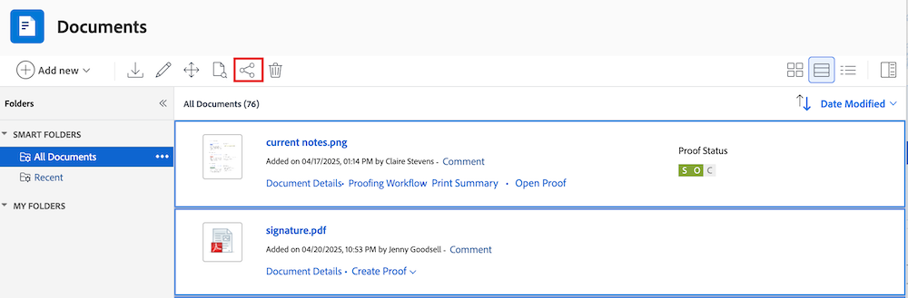

# 문서 공유

Workfront 관리자는 설정의 액세스 수준 영역에서 문서를 보거나 편집할 수 있는 사용자를 제어합니다. 자세한 내용은 [문서에 대한 액세스 권한 부여](../../administration-and-setup/add-users/configure-and-grant-access/grant-access-documents.md)를 참조하십시오.

사용자는 업로드했거나 액세스할 수 있는 문서를 공유하여 다른 사용자에게 보거나 관리할 수 있는 권한을 부여할 수도 있습니다.

* 권한은 개별 항목에 적용되며, 사용자가 수행할 수 있는 작업을 정의합니다.
* 문서를 업로드하는 사람은 자동으로 모든 권한을 갖습니다(권한 관리).
* 전체 폴더를 공유하려면 [문서 폴더 공유](../../workfront-basics/grant-and-request-access-to-objects/share-a-document-folder.md)를 참조하세요.

>[!NOTE]
>
>Workfront 인스턴스가 Adobe 엔터프라이즈 스토리지를 사용하는 경우 개별 문서를 공유할 수 없습니다. 대신 프로젝트 수준에서 액세스 권한이 부여됩니다. 프로젝트를 공유하면 선택한 권한 수준에 따라 재무와 같은 중요한 프로젝트 정보에 대한 액세스 권한을 부여할 수 있습니다.

## 액세스 요구 사항

+++ 을 확장하여 이 문서의 기능에 대한 액세스 요구 사항을 봅니다. 

객체를 공유하려면 다음 항목이 있어야 합니다.

<table style="table-layout:auto"> 
 <col> 
 <col> 
 <tbody> 
  <tr> 
   <td role="rowheader">Adobe Workfront 플랜</td> 
   <td> 
임의 
 </td> 
  </tr> 
  <tr> 
   <td role="rowheader">Adobe Workfront 라이선스</td> 
   <td> 
새로운 기능: 표준
 
   또는
   
현재: 작업 시간 이상

   </td> 
  </tr> 
  <tr> 
   <td role="rowheader">액세스 수준 구성</td> 
   <td> 
공유할 개체에 대한 액세스 이상의 보기
 </td> 
  </tr> 
  <tr> 
   <td role="rowheader">개체 권한</td> 
   <td> 
공유할 개체에 대한 권한 이상 보기
</td> 
  </tr> 
 </tbody> 
</table>

자세한 내용은 [Workfront 설명서의 액세스 요구 사항](/help/quicksilver/administration-and-setup/add-users/access-levels-and-object-permissions/access-level-requirements-in-documentation.md)을 참조하십시오.

+++

## 문서 공유

Workfront에 문서를 업로드하는 사용자에게는 기본적으로 관리 권한이 있습니다.

{{step1-to-documents}}

1. **문서** 페이지에서 공유할 문서를 마우스로 가리킨 다음 표시되는 **문서 세부 정보** 링크를 클릭합니다. **문서 세부 정보** 페이지가 열립니다.

   

1. 문서 이름 오른쪽에 있는 **자세히** 아이콘 을 클릭한 다음 **공유**&#x200B;를 클릭합니다. **[문서 이름 공유]** 대화 상자가 열립니다.

   

1. **문서 액세스 권한 부여** 필드에서 문서를 공유할 사용자, 팀, 역할, 그룹 또는 회사의 이름을 입력한 다음 드롭다운 목록에 표시될 때 해당 이름을 클릭합니다.

   >[!TIP]
   >
   >활성 사용자, 팀, 역할 또는 회사와만 문서를 공유할 수 있습니다.

1. (선택 사항) **액세스 권한이 있는 사용자** 드롭다운을 선택하고 문서의 액세스 수준을 선택합니다.

   * **초대된 사용자만 액세스할 수 있습니다.** 문서에 초대된 사용자만 액세스할 수 있습니다(기본값).
   * **시스템의 모든 사용자가 볼 수 있습니다**: 시스템의 모든 사용자는 초대장 없이 문서를 볼 수 있습니다.

1. (선택 사항) 문서를 공개하려면 톱니바퀴 아이콘 을 클릭한 다음 **외부 사용자에게 공개하기**&#x200B;를 클릭하여 줄을 긋습니다. 대화 상자 아래쪽에 **공개 링크 복사** 단추가 나타납니다.

1. 사용자 이름 오른쪽에 있는 드롭다운을 클릭하고 이 문서에 대한 권한 수준을 선택합니다.

   * **보기**: 사용자가 문서를 검토하고 공유할 수 있습니다.
   * **관리**: 사용자가 액세스 수준에서 부여된 관리 권한 없이 문서에 대한 전체 액세스 권한을 가지고 있습니다(모든 보기 권한도 포함).

1. (선택 사항) 문서에 대한 특정 권한을 구성하기 위해 부여한 권한 수준 옆에 있는 고급 옵션 아이콘을 클릭합니다.

   

1. (선택 사항) 문서의 자식 개체에 대해 상속된 사용 권한을 해제하려면 **상속된 사용 권한**&#x200B;과(와) 함께 **해제** 인라인을 클릭합니다.

1. (조건부) 외부 사용자와 문서를 공유할 수 있는 공개 링크를 복사하려면 **공개 링크 복사**&#x200B;를 클릭합니다.

   >[!CAUTION]
   >
   >외부 사용자와 기밀 정보가 포함된 문서를 공유할 때는 주의하는 것이 좋습니다. 이를 통해 Workfront 사용자 또는 조직의 일부가 아니더라도 정보를 볼 수 있습니다.

1. **저장**&#x200B;을 클릭합니다.

## 문서 일괄 공유

{{step1-to-documents}}

1. **문서** 페이지의 **모든 문서** 탭에서 키보드에서 **명령**(Mac) 또는 **Ctrl**(Windows)을 누른 채 공유할 각 문서를 클릭합니다.

1. 페이지 맨 위에서 **공유** 아이콘 을 클릭합니다. 공유 모달이 열립니다.

   

1. **문서 액세스 권한 부여** 필드에서 문서를 공유할 사용자, 팀, 역할, 그룹 또는 회사의 이름을 입력한 다음 드롭다운 목록에 표시될 때 해당 이름을 클릭합니다.

   >[!TIP]
   >
   >활성 사용자, 팀, 역할 또는 회사와만 문서를 공유할 수 있습니다.

1. (선택 사항) **액세스 권한이 있는 사용자** 드롭다운을 선택하고 문서의 액세스 수준을 선택합니다.

   * **초대된 사용자만 액세스할 수 있습니다.** 문서에 초대된 사용자만 액세스할 수 있습니다(기본값).
   * **시스템의 모든 사용자가 볼 수 있습니다**: 시스템의 모든 사용자는 초대장 없이 문서를 볼 수 있습니다.

1. 사용자 이름 오른쪽에 있는 드롭다운을 클릭하고 문서에 대한 권한 수준을 선택합니다.

   * **보기**: 사용자가 문서를 검토하고 공유할 수 있습니다.
   * **관리**: 사용자가 액세스 수준에서 부여된 관리 권한이 없는 문서에 대한 전체 액세스 권한을 가지고 있습니다(모든 보기 권한도 포함).

1. (선택 사항) 문서에 대한 특정 권한을 구성하기 위해 부여한 권한 수준 옆에 있는 고급 옵션 아이콘을 클릭합니다.

   

1. **저장**&#x200B;을 클릭합니다.

## Adobe 엔터프라이즈 스토리지와의 문서 공유

Workfront은 Adobe Creative Cloud 제품과의 접속성을 향상시키기 위해 Adobe 엔터프라이즈 스토리지 솔루션으로 전환하고 있습니다. 기존 고객은 단계적으로 새 모델로 이동합니다. Adobe 엔터프라이즈 스토리지의 장점에 대한 자세한 내용은 [Adobe 엔터프라이즈 스토리지 개요](/help/quicksilver/review-and-approve-work/esm-overview.md)를 참조하십시오.

Workfront 인스턴스가 Adobe 엔터프라이즈 스토리지를 사용하는 경우 개별 문서를 직접 공유할 수 없습니다. 대신 프로젝트 수준에서 액세스 권한을 부여해야 합니다.

>[!IMPORTANT]
>
>프로젝트를 공유하면 사용자가 선택한 권한 수준에 따라 재무 정보와 같은 중요한 프로젝트 정보에 액세스할 수 있습니다.
>
>공유하기 전에 권한 설정을 주의 깊게 검토해야 합니다.

## 문서 권한

권한은 Workfront의 한 항목에 한정되며, 해당 항목에 대해 수행할 수 있는 작업을 정의합니다. 개체 사용 권한에 대한 자세한 내용은 [개체에 대한 공유 사용 권한 개요](../../workfront-basics/grant-and-request-access-to-objects/sharing-permissions-on-objects-overview.md)를 참조하십시오.

다음 표에는 사용자가 문서를 보거나 관리할 수 있도록 허용할 때 부여할 수 있는 권한이 표시됩니다.

<table border="2" cellspacing="15" cellpadding="1"> 
 <col> 
 <col> 
 <col> 
 <thead> 
  <tr> 
   <th> 
<strong>작업</strong> 
 </th> 
   <th> 
<strong>관리</strong> 
 </th> 
   <th> 
<strong>보기</strong> 
 </th> 
  </tr> 
 </thead> 
 <tbody> 
  <tr> 
   <td scope="row">만들기</td> 
   <td>✓</td> 
   <td> </td> 
  </tr> 
  <tr> 
   <td scope="row">문서 세부 정보 편집</td> 
   <td>✓</td> 
   <td> </td> 
  </tr> 
  <tr> 
   <td scope="row">삭제*</td> 
   <td>✓</td> 
   <td> </td> 
  </tr> 
  <tr> 
   <td scope="row">다운로드</td> 
   <td>✓</td> 
   <td>✓</td> 
  </tr> 
  <tr> 
   <td scope="row">체크아웃</td> 
   <td>✓</td> 
   <td> </td> 
  </tr> 
  <tr> 
   <td scope="row">승인자 추가</td> 
   <td>✓</td> 
   <td> </td> 
  </tr> 
  <tr> 
   <td scope="row">문서 승인</td> 
   <td>✓</td> 
   <td>✓</td> 
  </tr> 
  <tr> 
   <td scope="row">사용자 정의 양식 첨부</td> 
   <td>✓</td> 
   <td> </td> 
  </tr> 
  <tr> 
   <td scope="row">사용자 정의 필드 편집</td> 
   <td>✓</td> 
   <td> </td> 
  </tr> 
  <tr> 
   <td scope="row">(오브젝트)로 이동</td> 
   <td>✓</td> 
   <td> </td> 
  </tr> 
  <tr> 
   <td scope="row">전송 대상(통합)</td> 
   <td>✓</td> 
   <td> </td> 
  </tr> 
  <tr> 
   <td scope="row">업데이트/주석</td> 
   <td>✓</td> 
   <td>✓</td> 
  </tr> 
  <tr> 
   <td scope="row">새 버전 업로드</td> 
   <td>✓</td> 
   <td> </td> 
  </tr> 
  <tr> 
   <td scope="row">버전 삭제</td> 
   <td>✓</td> 
   <td> </td> 
  </tr> 
  <tr> 
   <td scope="row">문서 보기</td> 
   <td>✓</td> 
   <td>✓</td> 
  </tr> 
  <tr> 
   <td scope="row">미리보기</td> 
   <td>✓</td> 
   <td>✓</td> 
  </tr> 
  <tr> 
   <td scope="row">증명**</td> 
   <td>✓</td> 
   <td>✓</td> 
  </tr> 
  <tr> 
   <td scope="row">증명 생성**</td> 
   <td>✓</td> 
   <td> </td> 
  </tr> 
  <tr> 
   <td scope="row">증명 제거**</td> 
   <td>✓</td> 
   <td> </td> 
  </tr> 
  <tr> 
   <td scope="row">공유*</td> 
   <td>✓</td> 
   <td>✓</td> 
  </tr> 
  <tr> 
   <td scope="row">시스템 전체 공유*</td> 
   <td>✓</td> 
   <td> </td> 
  </tr> 
  <tr> 
   <td scope="row">공개적으로 문서 공유*</td> 
   <td>✓</td> 
   <td> </td> 
  </tr> 
  <tr> 
   <td scope="row">외부 이메일 주소와 공유</td> 
   <td> </td> 
   <td>✓</td> 
  </tr> 
  <tr> 
   <td scope="row">추가/제거</td> 
   <td>✓</td> 
   <td>✓</td> 
  </tr> 
  <tr> 
   <td scope="row">이름 바꾸기</td> 
   <td>✓</td> 
   <td> </td> 
  </tr> 
  <tr> 
   <td scope="row">링크(통합 사용)</td> 
   <td>✓</td> 
   <td>✓</td> 
  </tr> 
  <tr> 
   <td scope="row">연결 해제(통합 사용)</td> 
   <td>✓</td> 
   <td> </td> 
  </tr> 
 </tbody> 
</table>

&#42; 작업이 문서 폴더와 문서 폴더 모두에서 공유됩니다.

&#42;&#42; 문서를 증명하려면 Workfront 계정과 연결된 별도의 증명 라이선스가 있어야 합니다. 증명 라이선스 취득에 대해서는 계정 관리자에게 문의하십시오. Workfront의 증명에 대한 자세한 내용은 [증명](../../review-and-approve-work/proofing/proofing.md)을 참조하세요.

## 문서 공유에 대한 고려 사항

아래 고려 사항 외에 [개체에 대한 공유 권한 개요](../../workfront-basics/grant-and-request-access-to-objects/sharing-permissions-on-objects-overview.md)를 참조하십시오.

>[!NOTE]
>
>Workfront 관리자는 해당 항목의 소유자가 아닌 모든 사용자에 대해 시스템의 모든 항목에 대한 권한을 추가하거나 제거할 수 있습니다.

* 문서를 공유하는 것은 Workfront의 다른 개체를 공유하는 것과 비슷합니다. Workfront에서 문서를 공유하는 방법에 대한 자세한 내용은 [개체 공유](../../workfront-basics/grant-and-request-access-to-objects/share-an-object.md)를 참조하십시오.
* 문서에 다음 권한을 부여할 수 있습니다.

   * 보기
   * 관리

* 문서를 공개적으로 공유하거나 시스템 전체에서 공유할 수도 있습니다.

  >[!CAUTION]
  >
  >외부 사용자와 기밀 정보가 포함된 오브젝트를 공유할 때는 주의하는 것이 좋습니다. 이를 통해 Workfront 사용자 또는 조직의 일부가 아니더라도 정보를 볼 수 있습니다.

* Workfront 계정이 없는 사람과 문서 액세스 권한 부여 대상 필드에 전자 메일 주소를 추가하여 문서를 공유할 수 있습니다.
* 문서를 공유할 때 사용자는 모든 문서 버전과 모든 문서 증명에 대해 동일한 액세스 권한을 갖습니다.\
  Workfront의 증명에 대한 자세한 내용은 [증명](../../review-and-approve-work/proofing/proofing.md) 섹션을 참조하십시오.

* 문서와 연관된 개체에서 문서에 대한 권한을 상속할 수 있습니다. Workfront 관리자는 액세스 수준의 문서에 대한 권한 상속을 제한할 수 있습니다.

  문서에 대해 상속된 사용 권한을 제한하는 방법에 대한 자세한 내용은 [사용자 지정 액세스 수준 만들기 또는 수정](../../administration-and-setup/add-users/configure-and-grant-access/create-modify-access-levels.md)을 참조하십시오.

  문서에 대해 상속된 권한을 수동으로 제거할 수 있습니다. 자세한 내용은 [개체에서 권한 제거](../../workfront-basics/grant-and-request-access-to-objects/remove-permissions-from-objects.md)를 참조하십시오.

* 첨부된 문서는 첨부된 객체에서만 권한을 상속합니다. 개체에서 폴더를 만들고 문서를 폴더로 이동하면 해당 폴더의 권한이 상속됩니다. 그러나 상위 또는 최상위 개체에 폴더를 만들어 해당 폴더로 문서를 이동하면 해당 폴더의 권한이 상속되지 않습니다.