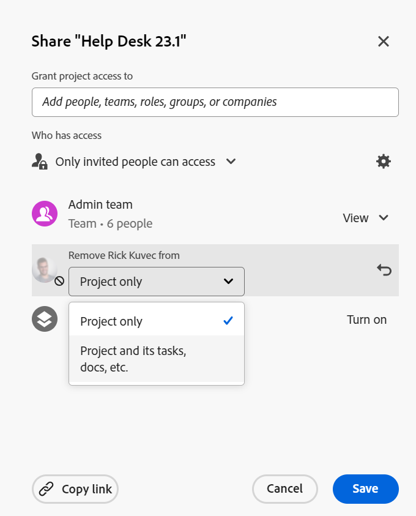
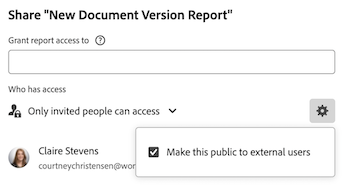

# 오브젝트에서 권한 제거

<!--Audited: 01/2024-->

공유에 액세스할 수 있는 개체에 대한 다른 사용자의 권한을 제거할 수 있습니다. 객체에서 권한을 제거하는 것은 공유할 수 있는 모든 객체에 대해 동일합니다.

객체 공유에 대한 고려 사항과 유사한 사항은 객체에서 권한을 제거하는 데 적용됩니다. 자세한 내용은 [개체에 대한 공유 권한 개요](../../workfront-basics/grant-and-request-access-to-objects/sharing-permissions-on-objects-overview.md) 문서의 [개체 공유에 대한 고려 사항](../../workfront-basics/grant-and-request-access-to-objects/sharing-permissions-on-objects-overview.md#consider) 섹션을 참조하십시오.

## 액세스 요구 사항

+++ 을 확장하여 이 문서의 기능에 대한 액세스 요구 사항을 봅니다.

객체를 공유하려면 다음 항목이 있어야 합니다.

<table style="table-layout:auto"> 
 <col> 
 <col> 
 <tbody> 
  <tr> 
   <td role="rowheader">Adobe Workfront 플랜</td> 
   <td> 
임의 
 </td> 
  </tr> 
  <tr> 
   <td role="rowheader">Workfront 라이센스*</td> 
   <td> 
새 라이선스: 기여자 이상

   또는  
   
현재 라이선스: 요청 이상

   
<b>메모</b>

일부 오브젝트는 요청보다 높은 액세스 권한이 필요합니다. 

예를 들어 새 라이선스의 경우 기여자 는 문제를 공유할 수 있지만 표준 라이선스 사용자만 프로젝트를 공유할 수 있습니다.

현재 라이선스의 경우 요청자는 문제를 공유할 수 있지만 작업자 또는 플래너만 프로젝트를 공유할 수 있습니다.
 
   </td> 
  </tr> 
  <tr> 
   <td role="rowheader">액세스 수준 구성</td> 
   <td> 
공유할 개체에 대한 액세스 이상의 보기
 </td> 
  </tr> 
  <tr> 
   <td role="rowheader">개체 권한</td> 
   <td> 
공유할 개체에 대한 권한 이상 보기
 
개체에 대해 상속된 권한을 제거하는 권한 관리
  </td> 
  </tr> 
 </tbody> 
</table>

*보유 중인 플랜, 라이선스 유형 또는 액세스 권한을 확인하려면 Workfront 관리자에게 문의하십시오. 자세한 내용은 [Workfront 설명서에 대한 액세스 요구 사항](/help/quicksilver/administration-and-setup/add-users/access-levels-and-object-permissions/access-level-requirements-in-documentation.md)을 참조하십시오.

+++

## 오브젝트의 공유 목록에서 엔티티 제거 {#remove-entities-from-the-sharing-list-of-an-object}

객체의 공유 목록에서 엔티티(사용자, 작업 역할, 팀, 그룹, 회사)를 제거할 수 있습니다. 이렇게 하면 개체에 대한 권한이 제거됩니다.

1. 권한을 제거할 개체로 이동합니다.

   공유할 수 있는 개체에 대한 자세한 내용은 [개체에 대한 공유 권한 개요](../../workfront-basics/grant-and-request-access-to-objects/sharing-permissions-on-objects-overview.md)를 참조하십시오.

1. (조건부) 프로그램, 포트폴리오 및 문서의 경우 다음을 수행합니다.

   1. 개체 이름 옆에 있는 **자세히** 아이콘 을 클릭한 다음 **공유** 또는 **공유를 클릭합니다.**

      

   1. 사용자, 팀, 그룹, 회사, 작업 역할 옆의 **x**&#x200B;을(를) 클릭하여 개체 액세스 상자에서 제거합니다.

      

   1. 이&#x200B;**드롭다운 메뉴에서**[&#x200B;사용자 이름]의 Workfront 액세스가 제거됩니다. 선택한 개체에서만 액세스 권한을 제거할지 또는 해당 개체와 연결된 모든 자식 개체에서 액세스 권한을 제거할지를 선택하십시오.

1. (조건부) 프로젝트, 작업 및 문제의 경우 다음을 수행합니다.

   1. 개체 이름 오른쪽에 있는 **공유**&#x200B;를 클릭합니다.

      
   1. 객체에서 제거할 사용자, 역할, 팀, 그룹 또는 회사를 찾습니다.
   1. **제거**를 클릭합니다.
**제거 &lt; 사용자 이름 > from** 드롭다운 메뉴에서 선택한 개체에서만 액세스 권한을 제거할지 또는 해당 개체와 연결된 모든 자식 개체에서 액세스 권한을 제거할지를 선택합니다.

      

   다음과 같은 시나리오가 있습니다.

   * 개체에서만 개체를 제거하면 해당 개체에 대한 사용 권한과 자식 개체에 대한 상속된 사용 권한이 손실됩니다. 이전에 하위 항목에 대해 개별적으로 권한이 부여된 경우 이 옵션을 선택하면 연관된 모든 하위 개체에 대해 동일한 권한이 유지됩니다.
   * 개체와 모든 자식 개체에서 엔티티를 제거하면 이전에 각 자식 개체에 대한 개별 권한이 주어졌더라도 해당 엔티티는 개체와 모든 자식 개체에 대한 사용 권한을 잃게 됩니다.

1. **저장**&#x200B;을 클릭합니다.

<!--
## Remove permissions from several objects in bulk

You can remove entities (users, job roles, teams, groups, companies) from several objects at a time when you bulk select them in a list.

>[!NOTE]
>
>You cannot view what access entities have for all the objects selected when you select them in bulk. You must know which entity you want to remove from the sharing of the objects selected before removing their permissions.

1. Go to the list of objects that you want to share.

   For information about which objects can be shared, see [Overview of sharing permissions on objects](../../workfront-basics/grant-and-request-access-to-objects/sharing-permissions-on-objects-overview.md).

1. Select several objects in the list, then click the **Share** icon at the top of the list. 
1. Type the name of the user, role, team, group, or company for which you want to remove the access in the **Edit `<Object Name>` access to** field. 
1. From the access drop-down menu, select **No Access**.

   

1. In the `<User Name>`'s Workfront access will be removed from this drop-down menu, select whether you want their access to be removed just from the objects that you have selected, or from all other children objects associated with it.  
   The following scenarios exist:

   * If you remove the entity only from the object, that entity loses their permissions on the object, and their inherited permissions to the children objects. If they were previously granted permissions to the children items individually, they retain the same permissions on all children objects associated with it when you select this option.&nbsp;
   * If you remove the entity from the object and all the children objects, that entity loses their permissions to the object as well as all children objects, even when they were previously given individual permission on each child object.

   **Example:** Select whether to remove permissions to just the tasks you selected in a list, or to the issues and documents attached to the tasks as well.

   

1. (Optional) To change permissions in bulk for several objects, select another level of sharing for the selected entity.

   For example, if they have Manage permissions, select Contribute or View instead. 

1. Click **Save**.

-->

## 상속된 권한 제거

상속된 권한은 오브젝트에서 제거될 수 있으며, 이를 통해 소유자는 상위 오브젝트에 대한 사용자의 액세스 권한에 관계없이 하위 오브젝트에 액세스할 사용자를 구체적으로 식별할 수 있습니다.

>[!IMPORTANT]
>
>관리 권한이 있는 사용자만 상속된 권한을 제거할 수 있습니다.

상속된 권한을 제거하려면 다음을 수행합니다.

1. 관리 권한이 있는 개체로 이동합니다. 예를 들어 작업으로 이동합니다.
1. 이 문서의 [개체의 공유 목록에서 엔터티 제거](#remove-entities-from-the-sharing-list-of-an-object) 섹션에 설명된 대로 개체 액세스 상자로 이동합니다.
1. 비활성화하려면 **상속된 권한** 옆에 있는 **해제**&#x200B;를 선택하십시오.

   이렇게 하면 상위 개체(예: 프로젝트)에 대한 권한이 부여된 어느 누구도 기본적으로 이 작업에 대한 권한을 갖지 않게 됩니다. 작업에 대한 권한을 부여하려면 작업의 공유 목록에 개별 엔티티를 나열해야 합니다.

   >[!TIP]
   >
   >상속된 권한 목록에서 개별 엔티티를 제거할 수 없습니다. 나열된 모든 엔티티에 대해서만 상속된 권한을 비활성화할 수 있습니다.

1. **저장**&#x200B;을 클릭합니다. 

## 개체를 비공개로 설정

개체를 시스템 전체에서 공유했거나, 개체를 공개로 설정하여 외부 사용자와 공유한 경우, 시스템 전체 또는 공개 권한을 제거하여 개체를 다시 비공개로 만들 수 있습니다. 

개체를 시스템 전체에서 사용할 수 있게 하거나 공개적으로 사용할 수 있게 하는 방법에 대한 자세한 내용은 [개체 공유](../../workfront-basics/grant-and-request-access-to-objects/share-an-object.md)를 참조하십시오.

객체를 비공개로 설정하려면 다음을 수행합니다.

1. 비공개로 설정할 개체로 이동합니다.\
   예를 들어, 보고서로 이동합니다.
1. **보고서 동작**&#x200B;을 클릭한 다음 **공유**&#x200B;를 클릭합니다.

   

1. 톱니바퀴 아이콘을 클릭한 다음 **외부 사용자에게 공개하기**&#x200B;의 선택을 취소합니다.
1. **액세스 권한이 있는 사용자** 드롭다운 메뉴에서 **초대된 사용자만 액세스할 수 있음**&#x200B;을 클릭하여 모든 Workfront 사용자와의 공유를 중지합니다.
1. **저장**&#x200B;을 클릭합니다.
