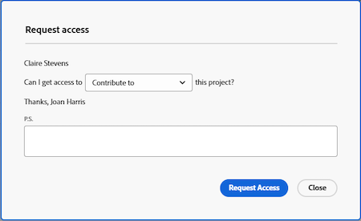

# 오브젝트에 대한 액세스 요청

<!-- Audited: 4/2025 -->

Adobe Workfront에서 개체에 대한 가시성은 해당 개체 유형에 대한 액세스 권한과 개별 개체에 대한 사용 권한에 따라 다릅니다.

>[!NOTE]
>
>이 문서에서는 다음을 제외한 모든 개체에 대한 권한을 요청하는 방법에 대해 설명합니다.
>
>* 시나리오 플래너는 Adobe Workfront 시나리오 플래너에서 계획합니다. 자세한 내용은 [시나리오 플래너의 플랜에 대한 액세스 요청](../../scenario-planner/request-access-to-plan.md)을 참조하십시오. 이를 위해서는 추가 라이센스가 필요합니다.
>
>* Workfront Planning의 보기 및 작업 공간 자세한 내용은 [Adobe Workfront Planning의 공유 권한 개요](/help/quicksilver/planning/access/sharing-permissions-overview.md)를 참조하십시오. 이를 위해서는 추가 라이센스가 필요합니다.

Workfront 관리자는 액세스 수준의 오브젝트 유형에 대한 액세스를 구성합니다. 자세한 내용은 [액세스 수준과 사용 권한이 함께 작동하는 방법](../../administration-and-setup/add-users/access-levels-and-object-permissions/how-access-levels-permissions-work-together.md)을 참조하세요.

Workfront 내의 특정 개체에 대한 권한이 필요한 경우 액세스를 요청할 수 있습니다. Workfront 관리자 또는 개체 소유자에게 이메일을 보내 요구 사항을 설명하는 대신 Workfront 내에서 추가 액세스(또는 권한)를 요청할 수 있습니다.

다른 사용자가 객체에 대한 링크를 공유하는 경우 객체에 대한 초기 액세스를 요청하거나 이미 보기 권한이 있는 객체에 대한 추가 액세스를 요청할 수 있습니다. 예를 들어, 프로젝트에 대한 보기 권한이 있을 수 있지만 작업을 추가해야 합니다. 이 경우 프로젝트에 대한 기여 권한을 요청할 수 있습니다.

## 액세스 요구 사항

+++ 을 확장하여 이 문서의 기능에 대한 액세스 요구 사항을 봅니다. 

<table style="table-layout:auto"> 
 <col> 
 <col> 
 <tbody> 
  <tr> 
   <td role="rowheader">Adobe Workfront 패키지</td> 
   <td> 
임의
 </td> 
  </tr> 
  <tr> 
   <td role="rowheader">Adobe Workfront 라이선스</td> 
   <td> 
표준
 
   
작업 이상
 
   </td> 
  </tr> 
  <tr> 
   <td role="rowheader">액세스 수준 구성</td> 
   <td> 
권한을 요청한 개체에 대한 액세스 이상 보기
 </td> 
  </tr> 
 </tbody> 
</table>

이 표의 정보에 대한 자세한 내용은 [Workfront 설명서의 액세스 요구 사항](/help/quicksilver/administration-and-setup/add-users/access-levels-and-object-permissions/access-level-requirements-in-documentation.md)을 참조하십시오.

+++

## 표준 공유 규칙 이해

다음 표준 공유 규칙은 Workfront 시스템의 기본 옵션이며 자동으로 적용됩니다.

* 작업 또는 문제에 할당된 사용자에게 기여 액세스 권한이 있습니다.
* 프로젝트, Portfolio 및 프로그램 관리자는 자신이 소유한 객체에 대한 관리 액세스 권한을 가집니다.
* 대화에 포함된 사용자는 대화가 발생하는 오브젝트에 대한 보기 액세스 권한을 갖습니다.
* 승인자로 할당된 사용자는 승인 대기 중인 오브젝트에 대한 보기 액세스 권한을 갖습니다.
* 대시보드를 공유할 때 대시보드의 모든 보고서가 동일한 사용자에 대한 동일한 액세스 권한으로 공유됩니다.
* 객체 소유자는 관리자가 정의한 해당 객체에 대한 액세스 권한 이상으로 객체에 대한 액세스를 확장할 수 없습니다.

## 액세스 권한 요청

현재 액세스할 수 없는 객체에 대한 초기 액세스를 요청하거나, 액세스가 제한된 객체에 대한 추가 액세스를 요청할 수 있습니다.

* [초기 액세스 요청](#request-initial-access)
* [추가 액세스 권한 요청](#request-additional-access)

### 초기 액세스 요청  {#request-initial-access}

객체에 대한 액세스 권한이 없는 경우 링크에서 해당 객체로 이동하면 정보를 볼 수 있는 액세스 권한이 없음을 알리는 화면이 표시됩니다.

객체에 대한 초기 액세스를 요청하려면 다음을 수행합니다.

1. **액세스 요청**&#x200B;을 클릭합니다. **액세스 요청** 대화 상자가 표시됩니다.

1. (조건부) 추가 액세스 권한을 부여할 수 있는 적절한 액세스 권한이 두 명 이상의 사용자에게 있는 경우 사용자 이름 옆에 드롭다운 화살표가 표시됩니다. 드롭다운 목록에서 액세스 요청을 받을 사용자를 선택합니다.

   10명의 사용자만 드롭다운 목록에 표시되며, 이 드롭다운 목록은 알파벳순으로 정렬됩니다. 이 드롭다운 메뉴에 나열된 사용자 순서에 대한 자세한 내용은 [액세스 권한 요청 및 액세스 권한 추가 요청 드롭다운 메뉴의 계층 구조](#hierarchy-of-the-request-access-and-request-more-access-drop-down-menus)를 참조하십시오.

1. 드롭다운 목록에서 요청하는 액세스 유형을 선택합니다.
1. (선택 사항) **P.S.** 필드에 추가 액세스가 필요한 이유에 대한 메모를 입력합니다.

   

1. **액세스 요청**&#x200B;을 클릭합니다.

<!--
If you do not have access level rights to an object and you try to access that object from a link, a screen is displayed informing you to contact the Workfront administrator.

For example, if you do not have portfolio access, but you were given a link to a portfolio, you would see the following message:  

-->

### 추가 액세스 권한 요청 {#request-additional-access}

이미 제한된 액세스 권한이 있는 객체에 대한 추가 액세스를 요청하려면 다음을 수행합니다.

1. 추가 액세스를 요청할 개체로 이동합니다.

1. 프로젝트 이름의 오른쪽에 있는 **자세히** 메뉴를 클릭한 다음 **추가 액세스 요청**&#x200B;을 클릭합니다.

   

1. (조건부) 추가 액세스 권한을 부여할 수 있는 적절한 액세스 권한이 두 명 이상의 사용자에게 있는 경우 사용자 이름 옆에 드롭다운 화살표가 표시됩니다. 드롭다운 목록에서 액세스 요청을 받을 사용자를 선택합니다.

   10명의 사용자만 드롭다운 목록에 표시되며, 이 드롭다운 목록은 알파벳순으로 정렬됩니다. 이 드롭다운 메뉴에 나열된 사용자 순서에 대한 자세한 내용은 [액세스 권한 요청 및 액세스 권한 추가 요청 드롭다운 메뉴의 계층 구조](#hierarchy-of-the-request-access-and-request-more-access-drop-down-menus)를 참조하십시오.

1. 드롭다운 목록에서 요청하는 액세스 수준을 선택합니다.
1. (선택 사항) **P.S.** 필드에 추가 액세스가 필요한 이유에 대한 메모를 입력합니다.

   

1. **액세스 요청**&#x200B;을 클릭합니다.

## 액세스 요청 및 액세스 권한 추가 요청 드롭다운 메뉴의 계층 {#hierarchy-of-the-request-access-and-request-more-access-drop-down-menus}

* [액세스 요청 및 액세스 권한 추가 요청 드롭다운 메뉴에 나열된 사용자 계층 구조 이해](#understand-the-hierarchy-of-users-listed-in-the-request-access-and-request-more-access-drop-down-menus)
* [오브젝트의 소유자 이해](#understand-the-owner-of-an-object)

### 액세스 요청 및 액세스 권한 추가 요청 드롭다운 메뉴에 나열된 사용자 계층 구조 이해 {#understand-the-hierarchy-of-users-listed-in-the-request-access-and-request-more-access-drop-down-menus}

Workfront은 객체에 대해 액세스 요청 또는 액세스 권한 추가 요청 목록을 채울 때 요청하는 사용자에게 객체 액세스 권한을 부여할 수 있는 다양한 역할을 수행하는 최대 10명의 사용자 목록을 선택합니다. 그런 다음 결과 목록이 이름별로 오름차순으로 정렬됩니다.

액세스 요청 또는 추가 액세스 요청 드롭다운의 사용자 순서는 다음 규칙에 따라 다릅니다.

* [개체 소유자 이해](#understand-the-owner-of-an-object)에 설명된 대로 목록의 첫 번째 사용자는 &quot;소유자&quot; 개체입니다.
* 그러면 목록이 객체가 개별적으로 공유되는 사용자로 채워집니다. 그들은 알파벳순으로 나열되어 있다.
* 그러면 목록이 팀, 그룹 또는 회사와의 공유를 통해 필요한 액세스 권한을 받는 사용자로 추가로 채워집니다. 그들은 알파벳순으로 나열되어 있다.
* 목록이 비어 있으면 항상 액세스 권한을 요청할 사용자가 있도록 Workfront 관리자가 추가됩니다. 그들은 알파벳순으로 나열되어 있다.
* 목록에 있는 각 사용자는 요청된 개체 액세스 권한과 개체 공유 액세스 권한이 있어야 합니다.

### 오브젝트의 소유자 이해 {#understand-the-owner-of-an-object}

객체의 소유자는 다음과 같이 정의됩니다.

<table style="table-layout:auto"> 
 <col> 
 <col> 
 <thead> 
  <tr> 
   <th><strong>개체</strong> </th> 
   <th><strong>개체 소유자의 정의</strong> </th> 
  </tr> 
 </thead> 
 <tbody> 
  <tr> 
   <td>프로젝트</td> 
   <td>소유자가 프로젝트 소유자이거나, 프로젝트 소유자가 없거나 필요한 액세스 권한이 없는 경우 상위 포트폴리오의 소유자입니다. 
프로젝트 생성자와 동일한 개인이 아닐 수 있습니다. 
</td> 
  </tr> 
  <tr> 
   <td>작업</td> 
   <td>소유자는 기본 피할당자이거나, 누락된 상태이거나 필요한 액세스 권한이 없는 경우 위에 정의된 대로 작업이 있는 프로젝트의 소유자입니다. 
작업 생성자와 동일한 개인이 아닐 수 있습니다. 
</td> 
  </tr> 
  <tr> 
   <td>문제</td> 
   <td> 
소유자는 문제의 기본 담당자이거나, 누락되었거나 필요한 액세스 권한이 없는 경우 위에 정의된 대로 문제가 있는 프로젝트의 소유자입니다. 
 
문제 생성자와 동일한 개인이 아닐 수 있습니다. 
 </td> 
  </tr> 
  <tr> 
   <td>포트폴리오</td> 
   <td>소유자는 Portfolio 소유자입니다. 
포트폴리오 생성자와 동일한 개인이 아닐 수 있습니다. 
</td> 
  </tr> 
  <tr> 
   <td>문서</td> 
   <td>소유자는 문서의 소유자(문서를 업로드한 사용자)이거나, 문서가 없거나 필요한 액세스 권한이 없는 경우 문서가 있는 객체의 소유자입니다.</td> 
  </tr> 
  <tr> 
   <td>보고서 및 대시보드</td> 
   <td>소유자는 보고서 또는 대시보드의 작성자입니다. </td> 
  </tr> 
  <tr> 
   <td>캘린더</td> 
   <td>소유자는 캘린더 작성자입니다. 모든 사용자에게는 기본적으로 캘린더가 할당되어 있습니다. 해당 캘린더의 소유자로 간주됩니다. </td> 
  </tr> 
  <tr> 
   <td>필터, 보기 및 그룹화</td> 
   <td>필터, 보기 또는 그룹화의 소유자는 작성자입니다. </td> 
  </tr> 
  <tr data-mc-conditions="QuicksilverOrClassic.Quicksilver"> 
   <td>계획 </td> 
   <td> 
소유자가 플랜의 작성자입니다. 
 
이를 위해서는 추가 라이센스가 필요합니다. 
 
Workfront 시나리오 플래너에 대한 자세한 내용은  <a href="../../scenario-planner/scenario-planner-overview.md" class="MCXref xref">시나리오 플래너 개요</a>를 참조하십시오.
 </td> 
  </tr> 
  <tr data-mc-conditions="QuicksilverOrClassic.Quicksilver"> 
   <td>목표</td> 
   <td> 
소유자는 소유자로 지정된 사용자입니다. 목표 생성자와 동일한 개인이 아닐 수 있습니다. 
 
이를 위해서는 추가 라이센스가 필요합니다. 
 
Workfront 목표에 대한 자세한 내용은 <a href="../../workfront-goals/goal-management/wf-goals-overview.md" class="MCXref xref">Adobe Workfront 목표 개요</a>를 참조하십시오. 
 </td> 
  </tr> 
 </tbody> 
</table>

