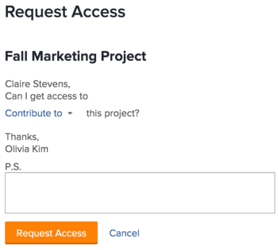

# 개체에 대한 액세스 요청

Adobe Workfront에서 객체에 대한 가시성은 해당 유형의 객체에 대한 액세스 권한과 개별 객체에 대한 권한에 따라 달라집니다.

>[!NOTE]
>
>이 문서에서는 Adobe Workfront 시나리오 플래너의 계획을 제외한 모든 객체에 대한 권한을 요청하는 방법에 대해 설명합니다. 계획에 대한 액세스 요청에 대한 자세한 내용은 [시나리오 플래너의 계획에 대한 액세스 요청](../../scenario-planner/request-access-to-plan.md). 이 경우 추가 라이센스가 필요합니다.

Workfront 관리자는 액세스 수준에서 개체 유형에 대한 액세스 권한을 구성합니다. 자세한 내용은 [액세스 수준 및 권한이 함께 작동하는 방법](../../administration-and-setup/add-users/access-levels-and-object-permissions/how-access-levels-permissions-work-together.md).

Workfront 내의 특정 개체에 대한 권한이 필요한 경우 해당 개체에 대한 액세스를 요청할 수 있습니다. Workfront 관리자나 개체 소유자에게 이메일을 보내 요구 사항을 설명하는 대신 Workfront 내에서 추가 액세스(또는 권한)를 요청할 수 있습니다.

사용자와 객체에 대한 링크를 공유하거나 적어도 볼 수 있는 객체에 대한 추가 액세스를 요청할 수 있는 경우 객체에 대한 초기 액세스를 요청할 수 있습니다.

예를 들어 프로젝트에 대한 보기 권한이 있을 수 있지만 해당 프로젝트에 작업을 추가해야 합니다. 이 경우 프로젝트에 Contribute 권한을 요청할 수 있습니다.

## 액세스 요구 사항

<!--drafted for P&P:

<table style="table-layout:auto"> 
 <col> 
 <col> 
 <tbody> 
  <tr> 
   <td role="rowheader">Adobe Workfront plan*</td> 
   <td> 
Any 
 </td> 
  </tr> 
  <tr> 
   <td role="rowheader">Adobe Workfront license*</td> 
   <td> 
Current license: Standard
 
   Or
   
Legacy license: Work or higher
 
   </td> 
  </tr> 
  <tr> 
   <td role="rowheader">Access level configurations*</td> 
   <td> 
View access or higher to the objects you request permissions to
 
<b>NOTE</b> 
   
   If you still don't have access, ask your Workfront administrator if they set additional restrictions in your access level. For information on how a Workfront administrator can modify your access level, see <a href="../../administration-and-setup/add-users/configure-and-grant-access/create-modify-access-levels.md" class="MCXref xref">Create or modify custom access levels</a>.
 </td> 
  </tr> 
 </tbody> 
</table>

-->

객체를 공유하려면 다음 항목이 있어야 합니다.

<table style="table-layout:auto"> 
 <col> 
 <col> 
 <tbody> 
  <tr> 
   <td role="rowheader">Adobe Workfront 플랜*</td> 
   <td> 
모든 
 </td> 
  </tr> 
  <tr> 
   <td role="rowheader">Adobe Workfront 라이선스*</td> 
   <td> 
작업 이상
 </td> 
  </tr> 
  <tr> 
   <td role="rowheader">액세스 수준 구성*</td> 
   <td> 
권한을 요청하는 개체에 대한 액세스 권한 이상을 봅니다
 
<b>메모</b>

여전히 액세스 권한이 없는 경우 Workfront 관리자에게 액세스 수준에서 추가 제한 사항을 설정하는지 문의하십시오. Workfront 관리자가 액세스 수준을 수정하는 방법에 대한 자세한 내용은 <a href="../../administration-and-setup/add-users/configure-and-grant-access/create-modify-access-levels.md" class="MCXref xref">사용자 정의 액세스 수준 만들기 또는 수정</a>.
 </td>
</tr> 
 </tbody> 
</table>

&#42;어떤 계획, 라이선스 유형 또는 액세스 권한을 보유하고 있는지 알아보려면 Workfront 관리자에게 문의하십시오.

## 표준 공유 규칙 이해

다음 표준 공유 규칙은 Workfront 시스템에서 기본 옵션으로 설정되므로 자동으로 적용됩니다. 

* 작업 또는 문제에 할당된 사용자는 Contribute에서 액세스할 수 있습니다. 
* 프로젝트, Portfolio 및 프로그램 관리자는 자신이 소유한 객체에 대한 액세스 권한을 관리할 수 있습니다.
* 대화에 포함된 사용자는 대화가 발생하는 개체에 대해 보기 액세스 권한이 있습니다.
* 승인자로 지정된 사용자는 승인 대기 중인 객체에 대한 보기 액세스 권한을 갖습니다.
* 대시보드를 공유할 때 대시보드의 모든 보고서와 동일한 사용자 액세스 권한도 공유됩니다. 
* 객체 소유자는 관리자가 정의한 대로 해당 객체에 대한 액세스 범위를 넘어 객체에 대한 액세스를 확장할 수 없습니다.

## 액세스 요청

현재 액세스할 수 없는 객체에 대한 초기 액세스를 요청하거나 액세스 권한만 제한한 객체에 대한 추가 액세스를 요청할 수 있습니다.

* [초기 액세스 요청](#request-initial-access)
* [추가 액세스 요청](#request-additional-access)

### 초기 액세스 요청  {#request-initial-access}

객체에 대한 액세스 권한이 없는 경우 링크에서 해당 객체를 탐색하면 정보를 볼 수 있는 액세스 권한이 없음을 알리는 화면이 표시됩니다.  

객체에 대한 초기 액세스를 요청하려면

1. 클릭 **액세스 요청**.\
   다음 **액세스 요청** 대화 상자가 표시됩니다.

1. (조건부) 두 명 이상의 사용자에게 추가 액세스 권한을 부여할 수 있는 적절한 액세스 권한이 있는 경우 사용자 이름 옆에 드롭다운 화살표가 표시됩니다. 
1. 액세스 요청을 받을 사용자를 드롭다운 목록에서 선택합니다.\
   드롭다운 목록에는 10명의 사용자만 표시됩니다. 목록은 알파벳순으로 정렬됩니다.\
   이 드롭다운 메뉴에 나열된 사용자 순서에 대한 자세한 내용은  [&quot;액세스 요청&quot; 및 &quot;추가 액세스 요청&quot; 드롭다운 메뉴의 계층](#hierarchy-of-the-request-access-and-request-more-access-drop-down-menus).

1. 드롭다운 목록에서 요청하는 액세스 유형을 선택합니다.
1. (선택 사항)에서 **P.S.** 필드에서는 추가 액세스가 필요한 이유에 대해 사용자에게 메모를 지정합니다.

   

객체에 대한 액세스 수준 권한이 없는 경우 링크에서 해당 객체에 액세스하려고 하면 Workfront 관리자에게 문의하라고 알려주는 화면이 표시됩니다. 

예를 들어 포트폴리오 액세스 권한이 없지만 포트폴리오에 대한 링크가 주어지면 다음 메시지가 표시됩니다.\

### 추가 액세스 요청 {#request-additional-access}

이미 액세스 권한이 제한된 객체에 대한 추가 액세스를 요청하려면

1. 추가 액세스를 요청할 개체로 이동합니다.

1. 을(를) 클릭합니다. **자세히** 프로젝트 이름이 있는 인라인 메뉴를 클릭한 다음 **추가 액세스 요청**.\
   

1. (조건부) 두 명 이상의 사용자에게 추가 액세스 권한을 부여할 수 있는 적절한 액세스 권한이 있는 경우 사용자 이름 옆에 드롭다운 화살표가 표시됩니다.
1. 액세스 요청을 받을 사용자를 드롭다운 목록에서 선택합니다.\
   드롭다운 목록에는 10명의 사용자만 표시됩니다. 목록은 알파벳순으로 정렬됩니다.\
   이 드롭다운 메뉴에 나열된 사용자 순서에 대한 자세한 내용은  [&quot;액세스 요청&quot; 및 &quot;추가 액세스 요청&quot; 드롭다운 메뉴의 계층](#hierarchy-of-the-request-access-and-request-more-access-drop-down-menus).

1. 드롭다운 목록에서 요청하는 액세스 수준을 선택합니다.
1. (선택 사항)에서 **P.S.** 필드에서 추가 액세스가 필요한 이유에 대한 메모를 지정합니다.
1. 클릭 **액세스 요청**.\
   

## &quot;액세스 요청&quot; 및 &quot;추가 액세스 요청&quot; 드롭다운 메뉴의 계층 {#hierarchy-of-the-request-access-and-request-more-access-drop-down-menus}

* [액세스 요청 및 추가 액세스 요청 드롭다운 메뉴에 나열된 사용자의 계층을 이해합니다](#understand-the-hierarchy-of-users-listed-in-the-request-access-and-request-more-access-drop-down-menus)
* [개체의 소유자 이해](#understand-the-owner-of-an-object)

### 액세스 요청 및 추가 액세스 요청 드롭다운 메뉴에 나열된 사용자의 계층을 이해합니다 {#understand-the-hierarchy-of-users-listed-in-the-request-access-and-request-more-access-drop-down-menus}

개체에 &quot;액세스 요청&quot; 또는 &quot;추가 액세스 요청&quot; 목록을 채울 때 Workfront에서는 아래 설명된 대로 개체 공유에서 다양한 역할을 수행하는 최대 10명의 사용자 목록을 선택합니다. 이러한 사용자는 객체에 대한 액세스 권한을 요청하는 사용자에게 부여할 수 있습니다.\
그런 다음 결과 목록이 해당 이름별로 알파벳 오름차순으로 정렬됩니다.\
Workfront은 &quot;액세스 요청&quot; 및 &quot;추가 액세스 요청&quot; 목록에 최대 10명의 사용자를 표시합니다. 

&quot;액세스 요청&quot; 또는 &quot;추가 액세스 요청&quot; 드롭다운 메뉴의 사용자 순서는 다음 규칙을 따릅니다. 

* 목록의 첫 번째 사용자는 다음에 설명된 대로 &quot;소유자&quot; 개체입니다. [개체의 소유자 이해](#understand-the-owner-of-an-object). 
* 그러면 목록이 개체를 개별적으로 공유하는 사용자로 채워집니다. 알파벳순으로 나열됩니다.
* 그런 다음 해당 팀, 그룹 또는 회사와 공유하여 필요한 액세스 권한을 받는 사용자로 목록이 추가로 채워집니다. 알파벳순으로 나열됩니다.
* 목록이 비어 있으면 Workfront 관리자가 추가되어 항상 액세스 권한을 요청할 사람이 있습니다. 알파벳순으로 나열됩니다. 
* 목록에 있는 각 사용자는 개체에 대해 요청된 액세스 권한을 가지고 있어야 개체를 공유할 수 있습니다. 

### 개체의 소유자 이해 {#understand-the-owner-of-an-object}

객체의 소유자는 다음과 같이 정의됩니다.

<table style="table-layout:auto"> 
 <col> 
 <col> 
 <thead> 
  <tr> 
   <th><strong>오브젝트</strong> </th> 
   <th><strong>개체 소유자의 정의</strong> </th> 
  </tr> 
 </thead> 
 <tbody> 
  <tr> 
   <td>프로젝트</td> 
   <td>소유자는 프로젝트 소유자입니다. 또는 프로젝트 소유자가 없거나 필요한 액세스 권한이 없는 경우 상위 포트폴리오의 소유자입니다. 
프로젝트 작성자와 같은 사람이 아닐 수 있습니다. 
</td> 
  </tr> 
  <tr> 
   <td>작업</td> 
   <td>소유자가 기본 할당자이거나, 누락된 경우 또는 필요한 액세스 권한이 없는 경우 위에 정의된 대로 작업이 상주하는 프로젝트의 소유자입니다. 
작업 작성자와 같은 사람이 아닐 수 있습니다. 
</td> 
  </tr> 
  <tr> 
   <td>문제</td> 
   <td> 
소유자는 문제의 기본 연락처이거나 문제가 있거나 필요한 액세스 권한이 없는 경우 위에 정의된 대로 문제가 있는 프로젝트의 소유자입니다. 
 
문제 작성자와 같은 사람이 아닐 수 있습니다. 
 </td> 
  </tr> 
  <tr> 
   <td>포트폴리오</td> 
   <td>소유자는 Portfolio 소유자입니다. 
포트폴리오 작성자와 같은 사람이 아닐 수도 있습니다. 
</td> 
  </tr> 
  <tr> 
   <td>문서</td> 
   <td>소유자는 문서의 소유자(문서를 업로드한 사용자)이거나 문서가 없거나 액세스 권한이 없는 경우 문서가 상주하는 객체의 소유자입니다.</td> 
  </tr> 
  <tr> 
   <td>보고서 및 대시보드</td> 
   <td>소유자는 작성자, 보고서 또는 대시보드입니다. </td> 
  </tr> 
  <tr> 
   <td>캘린더</td> 
   <td>소유자가 달력을 만든 사람입니다. 모든 사용자에게는 기본적으로 달력이 할당됩니다. 그들은 그 달력의 소유자로 간주된다. </td> 
  </tr> 
  <tr> 
   <td>필터, 보기 및 그룹화</td> 
   <td>필터, 보기 또는 그룹의 소유자가 작성자입니다. </td> 
  </tr> 
  <tr data-mc-conditions="QuicksilverOrClassic.Quicksilver"> 
   <td>플랜 </td> 
   <td> 
주인은 그 계획의 창시자이다. 
 
이 경우 추가 라이센스가 필요합니다. 
 
Workfront 시나리오 플래너에 대한 자세한 내용은 <a href="../../scenario-planner/scenario-planner-overview.md" class="MCXref xref">시나리오 계획자 개요</a>.
 </td> 
  </tr> 
  <tr data-mc-conditions="QuicksilverOrClassic.Quicksilver"> 
   <td>목표</td> 
   <td> 
소유자는 소유자로 지정된 사용자입니다. 그들은 목표 작성자와 같은 사람이 아닐 수도 있다. 
 
이 경우 추가 라이센스가 필요합니다. 
 
Workfront 목표에 대한 자세한 내용은 <a href="../../workfront-goals/goal-management/wf-goals-overview.md" class="MCXref xref">Adobe Workfront 목표 개요</a>. 
 </td> 
  </tr> 
 </tbody> 
</table>

 
