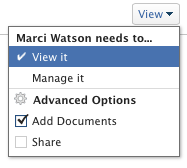

# 프로그램 공유

Adobe Workfront 관리자는 액세스 수준을 할당할 때 프로그램을 보거나 편집할 수 있는 액세스 권한을 사용자에게 부여할 수 있습니다. 프로그램을 편집하려면 계획 라이센스가 있어야 합니다. 자세한 내용은 [프로그램에 대한 액세스 권한 부여](../../administration-and-setup/add-users/configure-and-grant-access/grant-access-programs.md).

부여된 액세스 레벨과 함께 특정 프로그램을 보거나 관리할 수 있는 권한을 사용자에게 받을 수도 있습니다. 액세스 수준 및 권한에 대한 자세한 내용은 [액세스 수준 및 권한이 함께 작동하는 방법](../../administration-and-setup/add-users/access-levels-and-object-permissions/how-access-levels-permissions-work-together.md).

권한은 Workfront의 각 항목에 한정되며, 사용자가 해당 항목에 대해 수행할 수 있는 작업을 정의합니다.

## 프로그램 공유에 대한 고려 사항

아래 고려 사항 외에 다음을 참조하십시오 [개체에 대한 권한 공유 개요](../../workfront-basics/grant-and-request-access-to-objects/sharing-permissions-on-objects-overview.md).

>[!NOTE]
>
>Workfront 관리자는 해당 항목의 소유자가 아니더라도 모든 사용자에 대해 시스템의 모든 항목에 대한 권한을 추가하거나 제거할 수 있습니다.

* 프로그램 작성자는 기본적으로 프로그램에 대한 관리 권한이 있습니다.

* 프로그램을 개별적으로 공유하거나 여러 프로그램을 한 번에 공유할 수 있습니다.

   Workfront에서 항목 공유에 대한 자세한 내용은 [개체 공유](../../workfront-basics/grant-and-request-access-to-objects/share-an-object.md).

* 프로그램에 대한 보기 또는 관리 권한만 부여할 수 있습니다.

       

* 프로그램을 공유하면 사용자는 기본적으로 프로그램과 연관된 모든 하위 객체에 동일한 권한을 상속합니다.

   Workfront에서 개체의 계층 구조에 대한 자세한 내용은 [Adobe Workfront의 개체 이해](../../workfront-basics/navigate-workfront/workfront-navigation/understand-objects.md).

* 프로그램에서 상속된 권한을 제거할 수 있습니다. 개체에서 사용 권한을 제거하는 방법에 대한 자세한 내용은  [개체에서 권한 제거](../../workfront-basics/grant-and-request-access-to-objects/remove-permissions-from-objects.md).

## 프로그램 권한

다음 표에는 사용자에게 프로그램을 보거나 관리할 수 있도록 허용할 수 있는 권한이 표시됩니다.

| **액션** | **관리** | **** 보기 |
|---|---|---|
| 프로그램 세부 사항 편집 | ✓ |   |
| 프로그램 보기 | ✓ | ✓ |
| 프로그램 삭제 | ✓ |   |
| 사용자 지정 양식 첨부 | ✓ |   |
| 사용자 지정 필드 편집 | ✓ |   |
| 프로젝트 추가 또는 제거&#42; | ✓ |   |
| 프로젝트 승인 | ✓ |   |
| 문서 폴더 추가&#42; | ✓ | ✓ |
| 문서 추가 | ✓ | ✓ |
| 업데이트/댓글 추가 | ✓ | ✓ |
| 공유 | ✓ | ✓ |
| 시스템 전체 공유 |   | ✓ |

*이러한 권한은 프로젝트와 같은 다른 개체에 대한 액세스 수준 및 권한에 의해 제어됩니다. 
