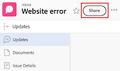

# 문제 공유

Adobe Workfront 관리자는 사용자가 액세스 수준을 할당할 때 문제를 보거나 편집할 수 있는 액세스 권한을 사용자에게 부여합니다. 문제에 대한 액세스 권한을 부여하는 방법에 대한 자세한 내용은 [문제에 대한 액세스 권한 부여](../../administration-and-setup/add-users/configure-and-grant-access/grant-access-issues.md)를 참조하십시오.

사용자에게 부여된 액세스 수준과 함께 공유할 액세스 권한이 있는 특정 문제를 보거나, 기여하거나, 관리할 수 있는 권한을 부여할 수도 있습니다. 액세스 수준 및 사용 권한에 대한 자세한 내용은 [액세스 수준 및 사용 권한이 함께 작동하는 방법](../../administration-and-setup/add-users/access-levels-and-object-permissions/how-access-levels-permissions-work-together.md)을 참조하세요.

권한은 Workfront의 한 항목에 한정되며, 해당 항목에 대해 수행할 수 있는 작업을 정의합니다.

## 액세스 요구 사항

+++ 을 확장하여 이 문서의 기능에 대한 액세스 요구 사항을 봅니다.

객체를 공유하려면 다음 항목이 있어야 합니다.

<table style="table-layout:auto"> 
 <col> 
 <col> 
 <tbody> 
  <tr> 
   <td role="rowheader">Adobe Workfront 플랜</td> 
   <td> 
임의 
 </td> 
  </tr> 
  <tr> 
   <td role="rowheader">Adobe Workfront 라이선스</td> 
   <td> 
새로운 기능: 표준
 
   또는
   
현재: 작업 시간 이상

   </td> 
  </tr> 
  <tr> 
   <td role="rowheader">액세스 수준 구성</td> 
   <td> 
공유할 개체에 대한 액세스 이상의 보기
 </td> 
  </tr> 
  <tr> 
   <td role="rowheader">개체 권한</td> 
   <td> 
공유할 개체에 대한 권한 이상 보기
</td> 
  </tr> 
 </tbody> 
</table>

자세한 내용은 [Workfront 설명서의 액세스 요구 사항](/help/quicksilver/administration-and-setup/add-users/access-levels-and-object-permissions/access-level-requirements-in-documentation.md)을 참조하십시오.

+++

## 공유 문제에 대한 고려 사항

아래 고려 사항 외에 [개체에 대한 공유 권한 개요](../../workfront-basics/grant-and-request-access-to-objects/sharing-permissions-on-objects-overview.md)를 참조하십시오.

>[!NOTE]
>
>Workfront 관리자는 해당 항목의 소유자가 아닌 모든 사용자에 대해 시스템의 모든 항목에 대한 권한을 추가하거나 제거할 수 있습니다.

* 문제 작성자는 기본적으로 해당 문제에 대한 관리 권한이 있습니다.
* 문제를 개별적으로 공유하거나 여러 문제를 한 번에 공유할 수 있습니다. 공유 문제는 Workfront에서 다른 항목을 공유하는 것과 동일합니다. Workfront에서 항목을 공유하는 방법에 대한 자세한 내용은 [개체 공유](../../workfront-basics/grant-and-request-access-to-objects/share-an-object.md)를 참조하십시오.
* 문제에 대해 다음 권한을 부여할 수 있습니다. 

   * 보기
   * 참여
   * 관리

* 문제를 공유하면 문제에 첨부된 모든 문서가 동일한 권한을 상속합니다.

  Workfront 관리자는 문서가 사용자 액세스 수준의 상위 개체에서 권한을 상속해야 하는지 여부를 지정할 수 있습니다. 문서에 대해 상속된 사용 권한을 제한하는 방법에 대한 자세한 내용은 [사용자 지정 액세스 수준 만들기 또는 수정](../../administration-and-setup/add-users/configure-and-grant-access/create-modify-access-levels.md)을 참조하십시오.

* 문제에서 상속된 권한을 제거할 수 있습니다. 자세한 내용은 [개체에서 권한 제거](../../workfront-basics/grant-and-request-access-to-objects/remove-permissions-from-objects.md)를 참조하십시오.

## 문제를 공유하는 방법

* 수동으로 : Workfront에서 다른 개체를 공유하는 것과 비슷합니다.
* 다음 중 하나를 수행하여 자동으로

   * 문제의 상위 개체(프로젝트, 프로그램 또는 포트폴리오)에 대한 권한을 지정합니다. 문제는 상위 오브젝트에서 권한을 상속합니다. 개체에 상속된 사용 권한을 보는 방법에 대한 자세한 내용은 [개체에 상속된 사용 권한 보기](../../workfront-basics/grant-and-request-access-to-objects/view-inherited-permissions-on-objects.md)를 참조하십시오.
   * 문제가 있는 프로젝트를 만드는 데 사용되는 템플릿에 대한 프로젝트 공유에 엔티티를 추가합니다. 템플릿에서 프로젝트를 공유하는 방법에 대한 자세한 내용은 [템플릿 공유](../../workfront-basics/grant-and-request-access-to-objects/share-a-template.md)를 참조하십시오.

   * 프로젝트를 편집할 때 프로젝트의 모든 문제에 대한 권한을 지정합니다. 프로젝트에 대한 사용자의 권한에 따라 프로젝트의 문제 또는 요청에 대한 액세스를 관리하는 방법에 대한 자세한 내용은 [프로젝트 편집](../../manage-work/projects/manage-projects/edit-projects.md) 문서의  섹션을 참조하십시오.

     >[!TIP]
     >
     >사용자가 프로젝트의 문제에 할당되었을 때 사용자가 가질 문제 권한을 지정하지 않으면 기본적으로 프로젝트에서 가지고 있는 것과 동일한 권한을 받게 됩니다.

   * 요청 대기열을 만들 때 요청 대기열에서 제출한 문제에 대해 사용자가 받는 권한을 지정합니다. 자세한 내용은 [요청 큐 만들기](../../manage-work/requests/create-and-manage-request-queues/create-request-queue.md)를 참조하세요.

     >[!IMPORTANT]
     >
     >프로젝트가 요청 대기열로 게시되는지 여부에 따라 권한이 다르게 부여됩니다.
     >
     >   
     >   
     >   * 사용자가 요청 대기열로 게시된 프로젝트에 요청을 제출하면 기본 담당자 및 사용자가 입력한 사용자에게 지정된 권한이 부여됩니다.
     >   * 사용자가 요청 대기열로 게시되지 않은 프로젝트에 요청을 제출하면 기본 담당자(사용자가 입력한 것과 다른 경우)에게 지정된 권한이 부여되고 사용자가 입력한 사용자에게는 문제에 대한 관리 권한이 부여됩니다.
     >   
     >

<!--

<h2>Automatically share an issue at the project level</h2>

(NOTE: this info duplicates in Edit projects - linked there instead (above).)&nbsp;

As the Project Owner, you can grant permissions automatically to users as the issues are added to a project.

<ol>
<li value="1">Go to the project whose issues you want to share automatically.</li>
<li value="2"> Click the More menu , then click <strong>Edit</strong>. </li>
<li value="3">In the <strong>Edit Project</strong> box that displays, click <strong>Access</strong>.</li>
<li value="4">In the <strong>When someone is assigned to an ISSUE</strong> field, select from the following permissions levels:
<ul>
<li><strong>View</strong></li>
<li><strong>Contribute</strong></li>
<li><strong>Manage</strong> Now, when someone is assigned to an issue on the selected project, they are granted the specified permissions to the issue.&nbsp;</li>
</ul></li>
<li value="5">(Optional) Select the <strong>Also grant ... access to the project</strong> field to also grant View, Contribute, or Manage permissions to the projects to the user assigned to the issue</li>
<li value="6">In the <strong>When someone submits a REQUEST ...</strong> field, select from the following permissions levels:
<ul>
<li><strong>View</strong></li>
<li><strong>Contribute</strong></li>
<li>
<strong>Manage</strong>
<note type="important">

Permissions are granted differently depending on whether or not the project is published as a request queue:

<ul>
<li>When a user submits a request to a project published as a request queue, the Primary Contact and Entered By users are granted the permission specified.</li>
<li>When a user submits a request to a project not published as a request queue, the Primary Contact (if different from Entered By user) is granted the permission specified, and the Entered By user is granted Manage permissions to the issue.</li>
</ul>
</note></li>
</ul></li>
<li value="7"> 
(Optional) Select the <strong>People from the same company will inherit the same permissions for all requests</strong> field.
 
People from the same company as the user submitting the request are granted the same permissions on the requests as the user.&nbsp;
 </li>
<li value="8">Click <strong>Save Changes</strong>.</li>
</ol>

-->

<!--

<h2>Automatically share an issue in request queues</h2>

(NOTE: drafted because it's duplicated from Create a Request Queue which is linked above)&nbsp;

As the Project Owner, you can grant permissions automatically to users as the issues are submitted to a request queue.

<ol>
<li value="1">Go to the project whose issues you want to share automatically.</li>
<li value="2">Click <strong>Edit Project</strong>.</li>
<li value="3">Click <strong>More</strong> then click <strong>Queue Setup</strong>. </li>
<li value="4"> 
On the <strong>Queue Details</strong> sub-tab, in the drop-down menu under <strong>When someone makes a request, automatically grant</strong>, select from the following permissions levels:

<ul>
<li><strong>View Access</strong> </li>
<li><strong>Contribute Access</strong> </li>
<li> 
<strong>Manage Access</strong> 
 </li>
</ul> 
Now, when someone submits a request to the selected project, they are granted the specified permissions to the request.
 </li>
<li value="5"> 
(Optional) Select the <strong>People from the same company will inherit the same permissions for all requests</strong>.
 
People from the same company as the user submitting the request are granted the same permissions on the requests as the user.&nbsp;
 </li>
<li value="6">Click <strong>Save</strong>.</li>
</ol>

-->

## 문제 공유

1. 공유할 문제로 이동합니다.

1. 문제 이름 오른쪽에서 **공유**&#x200B;를 클릭합니다. **[문제 이름 공유]** 대화 상자가 열립니다.

   

1. **문제 액세스 권한 부여** 필드에서 문제를 공유할 사용자, 팀, 역할, 그룹 또는 회사의 이름을 입력한 다음 드롭다운 목록에 표시될 때 이름을 클릭합니다.

   >[!TIP]
   >
   >문제를 활성 사용자, 팀, 역할 또는 회사와만 공유할 수 있습니다.

1. (선택 사항) **액세스 권한이 있는 사용자** 드롭다운을 선택하고 문제의 액세스 수준을 선택합니다.

   * **초대된 사용자만 액세스할 수 있습니다.** 문제에 초대된 사용자만 액세스할 수 있습니다(기본값).
   * **시스템의 모든 사용자가 볼 수 있습니다**: 시스템의 모든 사용자는 초대장 없이 문제를 볼 수 있습니다.

1. 사용자 이름 오른쪽에 있는 드롭다운을 클릭하고 이 문제에 대한 권한 수준을 선택합니다.

   * **보기**: 사용자가 문제를 검토하고 공유할 수 있습니다.
   * **참여**: 사용자는 업데이트를 수행하고, 정보를 기록하며, 간단한 편집을 수행하고, 문제를 공유할 수 있습니다(모든 보기 권한도 포함).
   * **관리**: 사용자는 액세스 수준에서 부여된 관리 권한 없이 문제에 대한 전체 액세스 권한을 가집니다(모든 보기 및 기여 권한도 포함).

1. (선택 사항) 문제에 대한 특정 권한을 구성하기 위해 부여한 권한 수준 옆에 있는 고급 옵션 아이콘을 클릭합니다.

   

1. (선택 사항) 링크를 사용하여 문제를 빠르게 공유하려면 **링크 복사**&#x200B;를 클릭한 다음 받는 사람에게 전달하십시오.

1. **저장**&#x200B;을 클릭합니다.

## 일괄 문제 공유

1. 공유할 문제가 포함된 프로젝트로 이동합니다.

1. 프로젝트 페이지의 **문제** 탭에서 공유할 각 문제의 왼쪽에 있는 상자를 선택한 다음 페이지 상단에 있는 **공유** 아이콘 을 클릭합니다. 공유 모달이 열립니다.

   

1. **문제 액세스 권한 부여** 필드에서 문제를 공유할 사용자, 팀, 역할, 그룹 또는 회사의 이름을 입력한 다음 드롭다운 목록에 표시될 때 이름을 클릭합니다.

   >[!TIP]
   >
   >활성 사용자, 팀, 역할 또는 회사와만 문제를 공유할 수 있습니다.

1. (선택 사항) **액세스 권한이 있는 사용자** 드롭다운을 선택하고 문제의 액세스 수준을 선택합니다.

   * **초대된 사용자만 액세스할 수 있습니다.** 문제에 초대된 사용자만 액세스할 수 있습니다(기본값).
   * **시스템의 모든 사용자가 볼 수 있습니다**: 시스템의 모든 사용자는 초대장 없이 문제를 볼 수 있습니다.

1. 사용자 이름 오른쪽에 있는 드롭다운을 클릭하고 문제에 대한 권한 수준을 선택합니다.

   * **보기**: 사용자가 문제를 검토하고 공유할 수 있습니다.
   * **참여**: 사용자는 업데이트를 수행하고, 정보를 기록하며, 간단한 편집을 수행하고, 문제를 공유할 수 있습니다(모든 보기 권한도 포함).
   * **관리**: 사용자는 액세스 수준에서 부여된 관리 권한이 없는 문제에 대한 전체 액세스 권한을 가집니다(모든 보기 및 기여 권한도 포함).

1. (선택 사항) 문제에 대한 특정 권한을 구성하기 위해 부여한 권한 수준 옆에 있는 고급 옵션 아이콘을 클릭합니다.

   

1. **저장**&#x200B;을 클릭합니다.

## 문제 권한

다음 표에는 사용자에게 문제를 보고, 기여하고, 관리할 수 있도록 허용할 때 부여할 수 있는 권한이 표시됩니다.

<table style="table-layout:auto"> 
 <col> 
 <col> 
 <col> 
 <col> 
 <tbody> 
  <tr> 
   <td><strong>작업</strong> </td> 
   <td><strong>관리</strong> </td> 
   <td><strong>참여</strong> </td> 
   <td><strong>보기</strong> </td> 
  </tr> 
  <tr> 
   <td> 
 문제 추가
 </td> 
   <td>✓</td> 
   <td> </td> 
   <td> </td> 
  </tr> 
  <tr> 
   <td>삭제 </td> 
   <td>✓</td> 
   <td> </td> 
   <td> </td> 
  </tr> 
  <tr> 
   <td>사용자 정의 양식 첨부</td> 
   <td>✓</td> 
   <td> </td> 
   <td> </td> 
  </tr> 
  <tr> 
   <td>사용자 정의 필드 편집</td> 
   <td>✓</td> 
   <td>✓</td> 
   <td> </td> 
  </tr> 
  <tr> 
   <td>문제 승인</td> 
   <td>✓</td> 
   <td>✓</td> 
   <td>✓</td> 
  </tr> 
  <tr> 
   <td>승인 프로세스 추가</td> 
   <td>✓</td> 
   <td> </td> 
   <td> </td> 
  </tr> 
  <tr> 
   <td>문서 추가</td> 
   <td>✓</td> 
   <td>✓</td> 
   <td>✓</td> 
  </tr> 
  <tr> 
   <td>문제 복사*</td> 
   <td>✓</td> 
   <td>✓</td> 
   <td>✓</td> 
  </tr> 
  <tr> 
   <td>문제 이동</td> 
   <td>✓</td> 
   <td> </td> 
   <td> </td> 
  </tr> 
  <tr> 
   <td>시간 기록</td> 
   <td>✓</td> 
   <td>✓</td> 
   <td> </td> 
  </tr> 
  <tr> 
   <td>프로젝트로 전환*</td> 
   <td>✓</td> 
   <td> </td> 
   <td> </td> 
  </tr> 
  <tr> 
   <td>할당 수락</td> 
   <td>✓</td> 
   <td>✓</td> 
   <td> </td> 
  </tr> 
  <tr> 
   <td>업데이트/주석</td> 
   <td>✓</td> 
   <td>✓</td> 
   <td>✓</td> 
  </tr> 
  <tr> 
   <td>계획된 일자 수정</td> 
   <td>✓</td> 
   <td> </td> 
   <td> </td> 
  </tr> 
  <tr> 
   <td>할당하기</td> 
   <td>✓</td> 
   <td>✓</td> 
   <td> </td> 
  </tr> 
  <tr> 
   <td>공유</td> 
   <td>✓</td> 
   <td>✓</td> 
   <td>✓</td> 
  </tr> 
  <tr> 
   <td>시스템 전체 공유</td> 
   <td> </td> 
   <td> </td> 
   <td>✓</td> 
  </tr> 
 </tbody> 
</table>

&#42;액세스 수준 및 프로젝트에 대한 사용 권한에 의해 제어됩니다.
