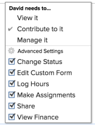

# 문제 공유

Adobe Workfront 관리자는 사용자에게 액세스 수준을 할당할 때 문제를 보거나 편집할 수 있는 액세스 권한을 부여합니다. 문제에 대한 액세스 권한 부여에 대한 자세한 내용은 [문제에 대한 액세스 권한 부여](../../administration-and-setup/add-users/configure-and-grant-access/grant-access-issues.md).

사용자에게 부여된 액세스 레벨과 함께 사용자에게 공유 액세스 권한이 있는 특정 문제를 보거나, 기여하거나 관리할 수 있는 권한을 부여할 수도 있습니다. 액세스 수준 및 권한에 대한 자세한 내용은 [액세스 수준 및 권한이 함께 작동하는 방법](../../administration-and-setup/add-users/access-levels-and-object-permissions/how-access-levels-permissions-work-together.md).

권한은 Workfront의 한 항목에 한정되며, 해당 항목에 대해 수행할 수 있는 작업을 정의합니다.

## 공유 문제에 대한 고려 사항

아래 고려 사항 외에 다음을 참조하십시오 [개체에 대한 권한 공유 개요](../../workfront-basics/grant-and-request-access-to-objects/sharing-permissions-on-objects-overview.md).

>[!NOTE]
>
>Workfront 관리자는 해당 항목의 소유자가 아니더라도 모든 사용자에 대해 시스템의 모든 항목에 대한 권한을 추가하거나 제거할 수 있습니다.

* 문제 작성자는 기본적으로 이 문제에 대한 관리 권한을 갖습니다.
* 문제를 개별적으로 공유하거나 한 번에 여러 문제를 공유할 수 있습니다. 공유 문제는 Workfront에서 다른 항목을 공유하는 것과 동일합니다. Workfront에서 항목 공유에 대한 자세한 내용은 [개체 공유](../../workfront-basics/grant-and-request-access-to-objects/share-an-object.md).
* 문제에 다음 권한을 부여할 수 있습니다. 

   * 보기

      

   * 관리

      

   * 참여\
      

* 문제를 공유하면 문제에 첨부된 모든 문서가 동일한 권한을 상속합니다.

   Workfront 관리자는 문서가 사용자의 액세스 수준에서 상위 개체에서 권한을 상속해야 하는지 여부를 지정할 수 있습니다. 문서에 대한 상속된 권한 제한에 대한 자세한 내용은 [사용자 정의 액세스 수준 만들기 또는 수정](../../administration-and-setup/add-users/configure-and-grant-access/create-modify-access-levels.md).

* 문제에 상속된 권한을 제거할 수 있습니다. 자세한 내용은 [개체에서 권한 제거](../../workfront-basics/grant-and-request-access-to-objects/remove-permissions-from-objects.md).

## 문제를 공유하는 방법

* 수동 - Workfront에서 다른 개체를 공유하는 것과 비슷합니다. Workfront에서 개체를 공유하는 방법에 대한 자세한 내용은 [개체 공유](../../workfront-basics/grant-and-request-access-to-objects/share-an-object.md).
* 다음 중 하나를 수행하여 자동으로 다음을 수행합니다.

   * 문제의 부모 개체에 대한 권한을 지정합니다. 프로젝트, 프로그램 또는 포트폴리오 문제는 상위 개체에서 권한을 상속합니다. 객체에 대한 상속된 권한 보기에 대한 자세한 내용은 [객체에 대한 상속된 권한 보기](../../workfront-basics/grant-and-request-access-to-objects/view-inherited-permissions-on-objects.md).
   * 문제가 있는 프로젝트를 만드는 데 사용되는 템플릿의 프로젝트 공유에 엔티티를 추가합니다. 템플릿에서 프로젝트 공유에 대한 자세한 내용은 [템플릿 공유](../../workfront-basics/grant-and-request-access-to-objects/share-a-template.md).

   * 프로젝트를 편집할 때 프로젝트의 모든 문제에 대한 권한을 지정합니다. 프로젝트에 대한 사용자의 권한을 기반으로 프로젝트의 문제 또는 요청에 대한 액세스 관리를 위한 자세한 내용은  문서의 섹션 [프로젝트 편집](../../manage-work/projects/manage-projects/edit-projects.md).

      >[!TIP]
      >
      >사용자가 프로젝트 문제에 할당될 때 어떤 문제 권한을 보유할지 지정하지 않으면 기본적으로 프로젝트에 대해 가지고 있는 것과 동일한 권한을 받게 됩니다.

   * 요청 큐를 만들 때 요청 큐에서 제출하는 문제에 대해 사용자가 받는 권한을 지정합니다. 자세한 내용은 [요청 큐 만들기](../../manage-work/requests/create-and-manage-request-queues/create-request-queue.md).

      >[!IMPORTANT]
      >
      >권한은 프로젝트가 요청 큐로 게시되는지 여부에 따라 다르게 부여됩니다.
      >
      >   
      >   
      >   * 사용자가 요청 대기열로 게시된 프로젝트에 요청을 제출하면 기본 연락처 및 입력 기준 사용자에게 지정된 권한이 부여됩니다.
      >   * 사용자가 요청 큐로 게시되지 않은 프로젝트에 요청을 제출하면 기본 연락처(사용자와는 다른 경우)에 지정된 권한이 부여되고 입력자 사용자에게 해당 문제에 대한 관리 권한이 부여됩니다.

<!--

<h2>Automatically share an issue at the project level</h2>

(NOTE: this info duplicates in Edit projects - linked there instead (above).)&nbsp;

As the Project Owner, you can grant permissions automatically to users as the issues are added to a project.

<ol>
<li value="1">Go to the project whose issues you want to share automatically.</li>
<li value="2"> Click the More menu , then click <strong>Edit</strong>. </li>
<li value="3">In the <strong>Edit Project</strong> box that displays, click <strong>Access</strong>.</li>
<li value="4">In the <strong>When someone is assigned to an ISSUE</strong> field, select from the following permissions levels:
<ul>
<li><strong>View</strong></li>
<li><strong>Contribute</strong></li>
<li><strong>Manage</strong> Now, when someone is assigned to an issue on the selected project, they are granted the specified permissions to the issue.&nbsp;</li>
</ul></li>
<li value="5">(Optional) Select the <strong>Also grant ... access to the project</strong> field to also grant View, Contribute, or Manage permissions to the projects to the user assigned to the issue</li>
<li value="6">In the <strong>When someone submits a REQUEST ...</strong> field, select from the following permissions levels:
<ul>
<li><strong>View</strong></li>
<li><strong>Contribute</strong></li>
<li>
<strong>Manage</strong>
<note type="important">

Permissions are granted differently depending on whether or not the project is published as a request queue:

<ul>
<li>When a user submits a request to a project published as a request queue, the Primary Contact and Entered By users are granted the permission specified.</li>
<li>When a user submits a request to a project not published as a request queue, the Primary Contact (if different from Entered By user) is granted the permission specified, and the Entered By user is granted Manage permissions to the issue.</li>
</ul>
</note></li>
</ul></li>
<li value="7"> 
(Optional) Select the <strong>People from the same company will inherit the same permissions for all requests</strong> field.
 
People from the same company as the user submitting the request are granted the same permissions on the requests as the user.&nbsp;
 </li>
<li value="8">Click <strong>Save Changes</strong>.</li>
</ol>

-->

<!--

<h2>Automatically share an issue in request queues</h2>

(NOTE: drafted because it's duplicated from Create a Request Queue which is linked above)&nbsp;

As the Project Owner, you can grant permissions automatically to users as the issues are submitted to a request queue.

<ol>
<li value="1">Go to the project whose issues you want to share automatically.</li>
<li value="2">Click <strong>Edit Project</strong>.</li>
<li value="3">Click <strong>More</strong> then click <strong>Queue Setup</strong>. </li>
<li value="4"> 
On the <strong>Queue Details</strong> sub-tab, in the drop-down menu under <strong>When someone makes a request, automatically grant</strong>, select from the following permissions levels:

<ul>
<li><strong>View Access</strong> </li>
<li><strong>Contribute Access</strong> </li>
<li> 
<strong>Manage Access</strong> 
 </li>
</ul> 
Now, when someone submits a request to the selected project, they are granted the specified permissions to the request.
 </li>
<li value="5"> 
(Optional) Select the <strong>People from the same company will inherit the same permissions for all requests</strong>.
 
People from the same company as the user submitting the request are granted the same permissions on the requests as the user.&nbsp;
 </li>
<li value="6">Click <strong>Save</strong>.</li>
</ol>

-->

## 문제 권한

다음 표에는 사용자에게 문제를 보거나, 기여하거나, 관리할 수 있도록 허용할 수 있는 권한이 표시됩니다.

<table style="table-layout:auto"> 
 <col> 
 <col> 
 <col> 
 <col> 
 <tbody> 
  <tr> 
   <td><strong>액션</strong> </td> 
   <td><strong>관리</strong> </td> 
   <td><strong>참여</strong> </td> 
   <td><strong></strong> 보기 </td> 
  </tr> 
  <tr> 
   <td> 
 문제 추가
 </td> 
   <td>✓</td> 
   <td> </td> 
   <td> </td> 
  </tr> 
  <tr> 
   <td>삭제 </td> 
   <td>✓</td> 
   <td> </td> 
   <td> </td> 
  </tr> 
  <tr> 
   <td>사용자 정의 양식 첨부</td> 
   <td>✓</td> 
   <td> </td> 
   <td> </td> 
  </tr> 
  <tr> 
   <td>사용자 지정 필드 편집</td> 
   <td>✓</td> 
   <td>✓</td> 
   <td> </td> 
  </tr> 
  <tr> 
   <td>승인 문제</td> 
   <td>✓</td> 
   <td>✓</td> 
   <td>✓</td> 
  </tr> 
  <tr> 
   <td>승인 프로세스 추가</td> 
   <td>✓</td> 
   <td> </td> 
   <td> </td> 
  </tr> 
  <tr> 
   <td>문서 추가</td> 
   <td>✓</td> 
   <td>✓</td> 
   <td>✓</td> 
  </tr> 
  <tr> 
   <td>문제 복사*</td> 
   <td>✓</td> 
   <td>✓</td> 
   <td>✓</td> 
  </tr> 
  <tr> 
   <td>문제 이동</td> 
   <td>✓</td> 
   <td> </td> 
   <td> </td> 
  </tr> 
  <tr> 
   <td>시간 기록</td> 
   <td>✓</td> 
   <td>✓</td> 
   <td> </td> 
  </tr> 
  <tr> 
   <td>프로젝트로 전환*</td> 
   <td>✓</td> 
   <td> </td> 
   <td> </td> 
  </tr> 
  <tr> 
   <td>할당 수락</td> 
   <td>✓</td> 
   <td>✓</td> 
   <td> </td> 
  </tr> 
  <tr> 
   <td>업데이트/댓글</td> 
   <td>✓</td> 
   <td>✓</td> 
   <td>✓</td> 
  </tr> 
  <tr> 
   <td>계획 일자 수정</td> 
   <td>✓</td> 
   <td> </td> 
   <td> </td> 
  </tr> 
  <tr> 
   <td>할당하기</td> 
   <td>✓</td> 
   <td>✓</td> 
   <td> </td> 
  </tr> 
  <tr> 
   <td>공유</td> 
   <td>✓</td> 
   <td>✓</td> 
   <td>✓</td> 
  </tr> 
  <tr> 
   <td>시스템 전체 공유</td> 
   <td> </td> 
   <td> </td> 
   <td>✓</td> 
  </tr> 
 </tbody> 
</table>

&#42;프로젝트에 대한 액세스 수준 및 권한에 의해 제어됩니다.
