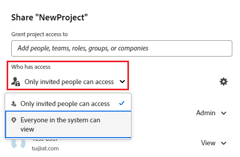

# 개체 공유

<!--Audited: 01/2024-->

Adobe Workfront 관리자는 사용자가 액세스 수준을 할당할 때 개체를 보거나 편집할 수 있는 액세스 권한을 사용자에게 부여합니다. 개체에 대한 액세스 권한을 부여하는 방법에 대한 자세한 내용은 [사용자 지정 액세스 수준 만들기 또는 수정](../../administration-and-setup/add-users/configure-and-grant-access/create-modify-access-levels.md)을 참조하십시오.

사용자에게 부여되는 액세스 수준과 함께 작성했거나 공유할 수 있는 액세스 권한이 있는 특정 개체를 보거나 편집할 수 있는 권한을 부여할 수도 있습니다. 액세스 수준 및 사용 권한에 대한 자세한 내용은 [액세스 수준 및 사용 권한이 함께 작동하는 방법](../../administration-and-setup/add-users/access-levels-and-object-permissions/how-access-levels-permissions-work-together.md)을 참조하세요.

권한은 Workfront의 한 항목에 한정되며, 해당 항목에 대해 수행할 수 있는 작업을 정의합니다.

개체에 대한 공유 권한에 대한 자세한 내용은 [개체에 대한 공유 권한 개요](../../workfront-basics/grant-and-request-access-to-objects/sharing-permissions-on-objects-overview.md)를 참조하십시오.

>[!NOTE]
>
>Workfront 관리자는 해당 항목의 소유자가 아닌 모든 사용자에 대해 시스템의 모든 항목에 대한 권한을 추가하거나 제거할 수 있습니다.

이 문서에서는 다음 오브젝트를 공유하는 방법에 대해 설명합니다.

* 프로젝트, 작업, 문제
* 포트폴리오, 프로그램
* 문서

Workfront의 다른 모든 개체를 공유하는 방법에 대한 자세한 내용은 다음 문서를 참조하십시오.

* 템플릿의 경우 [프로젝트 템플릿 공유](../../manage-work/projects/create-and-manage-templates/share-project-template.md)를 참조하십시오.
* 증명에 대해서는 [Workfront Proof에서 증명 공유](../../workfront-proof/wp-work-proofsfiles/share-proofs-and-files/share-proof.md)를 참조하십시오.
* 보고서, 대시보드 및 달력의 경우 다음 문서를 참조하십시오.

   * [Adobe Workfront에서 보고서 공유](../../reports-and-dashboards/reports/creating-and-managing-reports/share-report.md)
   * [대시보드 공유](../../reports-and-dashboards/dashboards/creating-and-managing-dashboards/share-dashboard.md)
   * [캘린더 보고서 공유](../../reports-and-dashboards/reports/calendars/share-a-calendar-report.md)

  보고서, 대시보드 및 캘린더 공유에 대한 일반적인 정보는 [보고서, 대시보드 및 캘린더 공유](../../workfront-basics/grant-and-request-access-to-objects/permissions-reports-dashboards-calendars.md)를 참조하십시오.

* 필터, 보기 및 그룹화에 대해서는 [필터, 보기 또는 그룹화 공유](../../reports-and-dashboards/reports/reporting-elements/share-filter-view-grouping.md)를 참조하십시오.
* 문서 폴더의 경우 [문서 폴더 공유](../../workfront-basics/grant-and-request-access-to-objects/share-a-document-folder.md)를 참조하십시오.
* 플랜에 대해서는 [시나리오 플래너에서 플랜 공유](../../scenario-planner/share-a-plan.md)를 참조하십시오.

  Workfront Scenario Planner에 추가 라이센스가 필요할 수 있습니다.

* 목표에 대해서는 [Workfront 목표에서 목표 공유](../../workfront-goals/workfront-goals-settings/share-a-goal.md)를 참조하십시오.

  Workfront 목표에는 추가 라이선스가 필요할 수 있습니다.

* Workfront Planning 객체의 경우 다음 문서를 참조하십시오.

   * [보기 공유](/help/quicksilver/planning/access/share-views.md)
   * [작업 공간 공유](/help/quicksilver/planning/access/share-workspaces.md)

  Workfront Planning 액세스에는 추가 라이센스가 필요합니다.

## 액세스 요구 사항

+++ 을 확장하여 이 문서의 기능에 대한 액세스 요구 사항을 봅니다.

객체를 공유하려면 다음 항목이 있어야 합니다.

<table style="table-layout:auto"> 
 <col> 
 <col> 
 <tbody> 
  <tr> 
   <td role="rowheader">Adobe Workfront 플랜</td> 
   <td> 
임의 
 </td> 
  </tr> 
  <tr> 
   <td role="rowheader">Adobe Workfront 라이센스*</td> 
   <td> 
새 라이선스: Standard
 
   또는
   
현재 라이선스: 작업 이상

   </td> 
  </tr> 
  <tr> 
   <td role="rowheader">액세스 수준 구성</td> 
   <td> 
공유할 개체에 대한 액세스 이상의 보기
 </td> 
  </tr> 
  <tr> 
   <td role="rowheader">개체 권한</td> 
   <td> 
공유할 개체에 대한 권한 이상 보기
</td> 
  </tr> 
 </tbody> 
</table>

*자세한 내용은 [Workfront 설명서의 액세스 요구 사항](/help/quicksilver/administration-and-setup/add-users/access-levels-and-object-permissions/access-level-requirements-in-documentation.md)을 참조하십시오.

+++

## 해당 페이지에서 프로젝트, 작업 또는 문제 공유

1. 공유할 프로젝트, 작업 또는 문제의 페이지로 이동합니다.

   공유할 수 있는 개체에 대한 자세한 내용은 [개체에 대한 공유 권한 개요](../../workfront-basics/grant-and-request-access-to-objects/sharing-permissions-on-objects-overview.md)를 참조하십시오.

1. 개체 이름 옆에 있는 **공유** 단추를 클릭합니다.

   

1. **액세스 권한 부여** 상자에서 개체를 공유할 사용자, 팀, 역할, 그룹 또는 회사의 이름을 입력한 다음 드롭다운 목록에 표시될 때 이름을 클릭합니다.

   {width="350"}

   >[!TIP]
   >
   >활성 사용자, 팀, 역할 또는 회사와만 객체를 공유할 수 있습니다.

   >[!TIP]
   >
   >이름이 비슷한 여러 엔티티가 있는 경우 해당 유형 아래에 모두 나열됩니다. 엔티티의 이름은 알파벳순으로 나타납니다. 그러나 엔티티 유형이 나타나는 순서는 임의입니다.
   >

1. (선택 사항) 객체에 대한 액세스 권한을 부여할 각 사용자, 팀, 역할 또는 그룹에 대해 3단계를 반복합니다.

1. 이름 오른쪽에 있는 드롭다운 메뉴를 클릭한 다음 부여할 권한 수준을 선택하여 3단계에서 추가한 각 사용자, 팀, 역할, 그룹 또는 회사에 대한 권한을 지정합니다.

   

   개체에서 권한을 제거하려면 [개체에서 권한 제거](/help/quicksilver/workfront-basics/grant-and-request-access-to-objects/remove-permissions-from-objects.md)를 참조하십시오.

   다음 옵션을 사용할 수 있습니다.

   * **보기:** 사용자는 항목을 검토하고 공유할 수 있습니다.
   * **참여**: 사용자는 업데이트, 로그 정보, 간단한 편집, 공유 및 모든 보기 권한을 수행할 수 있습니다.
   * **관리:** 사용자는 액세스 수준에서 부여된 관리 권한 없이 개체에 대한 전체 액세스 권한을 갖습니다. 또한 모든 보기 및 기여 권한도 있습니다.

     >[!NOTE]
     >
     >Workfront 관리자 또는 개체 작성자는 이러한 엔티티에서 권한을 제거할 수 있습니다.

1. (선택 사항) 객체에 대한 특정 권한을 구성하기 위해 부여한 권한 수준 옆에 있는 고급 옵션 아이콘을 클릭합니다.

   

   보기, 관리 및 기여는 선택한 객체에 따라 다른 고급 옵션이 있습니다.

   권한 수준에 대한 자세한 내용은 [개체에 대한 공유 권한 개요](../../workfront-basics/grant-and-request-access-to-objects/sharing-permissions-on-objects-overview.md)를 참조하십시오.

1. (선택 사항) 시스템의 모든 사용자가 이 개체를 사용할 수 있도록 하려면 **액세스 권한이 있는 사용자** 아래의 드롭다운 메뉴를 클릭한 다음 드롭다운 메뉴에서 **시스템의 모든 사용자가 볼 수 있음**&#x200B;을 클릭합니다.

   

   모든 사용자는 사용자가 설정한 권한에 따라 개체를 볼 수 있습니다.

1. (선택 사항 및 조건부) 프로젝트를 공유할 때 **톱니바퀴** 아이콘 을(를) 클릭한 다음 **내 프로젝트 액세스 템플릿으로 설정** 옆에 있는 상자를 선택하여 권한을 템플릿으로 설정합니다.

   한 프로젝트에 대한 권한을 정의한 후에는 다음에 프로젝트를 처음부터 만들 때 이와 동일한 권한이 자동으로 적용됩니다.

   >[!NOTE]
   >
   >프로젝트 액세스 템플릿은 액세스 수준의 Workfront 관리자가 부여한 공유 기본값을 무시합니다.\
   >액세스 수준의 프로젝트에 대한 공유 기본값을 지정하는 방법에 대한 자세한 내용은 [프로젝트에 대한 액세스 권한 부여](../../administration-and-setup/add-users/configure-and-grant-access/grant-access-projects.md)를 참조하십시오.

   <!--
   >this note also appears in Understanding Project Permissions-->

   템플릿을 공유할 때 템플릿에서 만들 프로젝트에 대한 권한을 지정할 수 있습니다. 자세한 내용은 [프로젝트 템플릿 공유](../../manage-work/projects/create-and-manage-templates/share-project-template.md)를 참조하십시오.

1. (조건부) 액세스 권한이 있는 사용자와 개체를 빠르게 공유하려면 **링크 복사**&#x200B;를 클릭하세요.

1. **저장**&#x200B;을 클릭합니다.

## 해당 페이지에서 문서, 포트폴리오 또는 프로그램 공유

1. 공유할 문서, 포트폴리오 또는 프로그램의 페이지로 이동합니다.

   공유할 수 있는 개체에 대한 자세한 내용은 [개체에 대한 공유 권한 개요](../../workfront-basics/grant-and-request-access-to-objects/sharing-permissions-on-objects-overview.md)를 참조하십시오.

1. 포트폴리오 및 프로그램의 경우:

   개체 이름 옆에 있는 **공유** 단추를 클릭합니다.

   

   또는

   문서의 경우:

   개체 이름 옆의 **자세히** 아이콘 을(를) 클릭한 다음 **공유**&#x200B;를 클릭합니다.

   

1. **[개체 이름 제공]에 액세스 권한 부여** 필드에서 개체를 공유할 사용자, 팀, 역할, 그룹 또는 회사의 이름을 입력한 다음 드롭다운 목록에 표시될 때 이름을 클릭합니다.

   >[!TIP]
   >
   >* 이름이 비슷한 여러 엔티티가 있는 경우 해당 유형 아래에 모두 나열됩니다. 엔티티의 이름은 알파벳순으로 나타납니다. 그러나 엔티티 유형이 나타나는 순서는 임의입니다.
   >
   >* 활성 사용자, 팀, 역할 또는 회사와만 객체를 공유할 수 있습니다.

1. (선택 사항) 객체에 대한 액세스 권한을 부여할 각 사용자, 팀, 역할 또는 그룹에 대해 3단계를 반복합니다.

1. 3단계에서 추가한 각 사용자, 팀, 역할, 그룹 또는 회사에 대한 권한을 지정합니다.

   개체에서 권한을 제거하려면 [개체에서 권한 제거](/help/quicksilver/workfront-basics/grant-and-request-access-to-objects/remove-permissions-from-objects.md)를 참조하십시오.

   다음 옵션을 사용할 수 있습니다.

   * **보기:** 사용자는 항목을 검토하고 공유할 수 있습니다.
   * **관리:** 사용자는 액세스 수준에서 부여된 관리 권한 없이 개체에 대한 전체 액세스 권한을 갖습니다. 또한 모든 보기 및 기여 권한도 있습니다.

     >[!NOTE]
     >
     >Workfront 관리자 또는 개체 작성자는 이러한 엔티티에서 권한을 제거할 수 있습니다.

1. (선택 사항) 객체에 대한 특정 권한을 구성하기 위해 부여한 권한 수준 옆에 있는 고급 옵션 아이콘을 클릭합니다.

   

   보기 및 관리 권한에는 선택한 객체에 따라 다른 고급 옵션이 있습니다.\
   권한 수준에 대한 자세한 내용은 [개체에 대한 공유 권한 개요](../../workfront-basics/grant-and-request-access-to-objects/sharing-permissions-on-objects-overview.md)를 참조하십시오.

1. (선택 사항) 시스템의 모든 사용자가 이 개체를 사용할 수 있도록 하려면 드롭다운 메뉴에서 **액세스 권한이 있는 사용자**&#x200B;를 클릭하고 **시스템의 모든 사용자가 볼 수 있음**&#x200B;을 선택합니다.

   모든 사용자는 사용자가 설정한 권한에 따라 개체를 볼 수 있습니다.

1. (선택 사항) 개체를 공개로 설정하려면 톱니바퀴 아이콘을 클릭한 다음 **외부 사용자에게 공개로 설정**&#x200B;을 활성화하십시오.

   >[!TIP]
   >
   >일부 객체에는 이 옵션을 사용할 수 없습니다.

   

1. (조건부) 개체를 외부 사용자에게 공개하는 경우 **링크 복사**&#x200B;를 클릭한 다음 링크를 외부 사용자에게 배포합니다.

   링크가 있는 모든 사용자는 개체를 볼 수 있습니다.

   >[!CAUTION]
   >
   >외부 사용자와 기밀 정보가 포함된 오브젝트를 공유할 때는 주의하는 것이 좋습니다. 이를 통해 Workfront 사용자 또는 조직의 일부가 아니더라도 정보를 볼 수 있습니다.

1. **저장**&#x200B;을 클릭합니다.

## 목록에서 단일 또는 벌크 오브젝트 공유

1. 공유할 개체가 포함된 목록으로 이동합니다.

   공유할 수 있는 개체에 대한 자세한 내용은 [개체에 대한 공유 권한 개요](../../workfront-basics/grant-and-request-access-to-objects/sharing-permissions-on-objects-overview.md)를 참조하십시오.

1. 공유할 개체 옆의 확인란을 클릭한 다음 페이지 상단의 **공유 아이콘** 을(를) 클릭합니다.

   **&lt; 개체 > 액세스** 상자가 열립니다.

   {width="350"}

1. **편집 &lt; 개체 이름 > 액세스 대상** 상자에서 개체를 공유할 사용자, 팀, 역할, 그룹 또는 회사의 이름을 입력한 다음 드롭다운 목록에 표시될 때 이름을 클릭합니다.

   >[!TIP]
   >
   >* 활성 사용자, 팀, 역할 또는 회사와만 객체를 공유할 수 있습니다.
   >
   >
   >* 이름이 비슷한 여러 엔티티가 있는 경우 해당 유형 아래에 모두 나열됩니다. 엔티티의 이름은 알파벳순으로 나타납니다. 그러나 엔티티 유형이 나타나는 순서는 임의입니다.
   >

1. (선택 사항) 객체에 대한 액세스 권한을 부여할 각 사용자, 팀, 역할 또는 그룹에 대해 3단계를 반복합니다.

1. 단계에서 추가한 각 사용자, 팀, 역할, 그룹 또는 회사에 대한 권한을 지정합니다.

   개체에서 권한을 제거하려면 [개체에서 권한 제거](/help/quicksilver/workfront-basics/grant-and-request-access-to-objects/remove-permissions-from-objects.md)를 참조하십시오.

   다음 옵션을 사용할 수 있습니다.

   * **보기:** 사용자는 항목을 검토하고 공유할 수 있습니다.
   * **참여**: 사용자는 업데이트, 로그 정보, 간단한 편집, 공유 및 모든 보기 권한을 수행할 수 있습니다.

     >[!TIP]
     >
     >다음 개체에만 Contribute 권한을 부여할 수 있습니다.
     >
     >* 프로젝트
     >* 작업
     >* 문제
     >

   * **관리:** 사용자는 액세스 수준에서 부여된 관리 권한 없이 개체에 대한 전체 액세스 권한을 갖습니다. 또한 모든 보기 및 기여 권한도 있습니다.

     >[!NOTE]
     >
     >Workfront 관리자 또는 개체 작성자는 이러한 엔티티에서 권한을 제거할 수 있습니다.

1. (선택 사항) 객체에 대한 특정 권한을 구성하기 위해 부여한 권한 수준 옆에 있는 고급 옵션 아이콘을 클릭합니다.

   

   보기, 관리 및 기여는 선택한 객체에 따라 다른 고급 옵션이 있습니다.\
   권한 수준에 대한 자세한 내용은 [개체에 대한 공유 권한 개요](../../workfront-basics/grant-and-request-access-to-objects/sharing-permissions-on-objects-overview.md)를 참조하십시오.

1. (선택 사항) 시스템의 모든 사용자가 이 개체를 사용할 수 있도록 하려면 **톱니바퀴** 아이콘 을(를) 클릭한 다음, 드롭다운 메뉴에서 **시스템 전체에 표시**&#x200B;를 클릭합니다.

   사용자가 설정한 권한에 따라 모든 사용자가 개체를 볼 수 있습니다.

1. (선택 사항 및 조건부) 프로젝트를 공유할 때 **톱니바퀴** 아이콘 을(를) 클릭한 다음, 드롭다운 메뉴에서 **내 프로젝트 액세스 템플릿으로 설정**&#x200B;을(를) 클릭하여 권한을 템플릿으로 설정합니다.

   한 프로젝트에 대한 권한을 정의한 후에는 다음에 프로젝트를 처음부터 만들 때 이와 동일한 권한이 자동으로 적용됩니다.

   >[!NOTE]
   >
   >프로젝트 액세스 템플릿은 액세스 수준의 Workfront 관리자가 부여한 공유 기본값을 무시합니다.\
   >액세스 수준의 프로젝트에 대한 공유 기본값을 지정하는 방법에 대한 자세한 내용은 [프로젝트에 대한 액세스 권한 부여](../../administration-and-setup/add-users/configure-and-grant-access/grant-access-projects.md)를 참조하십시오.

   <!--
   >this note also appears in Understanding Project Permissions-->

   템플릿을 공유할 때 템플릿에서 만들 프로젝트에 대한 권한을 지정할 수 있습니다. 자세한 내용은 [프로젝트 템플릿 공유](../../manage-work/projects/create-and-manage-templates/share-project-template.md)를 참조하십시오.

1. (선택 사항) 개체를 공개하려면 **외부 사용자에게 공개하기**&#x200B;를 클릭합니다.

   >[!TIP]
   >
   >일부 객체에는 이 옵션을 사용할 수 없습니다.

   {width="350"}

1. (조건부) 개체를 외부 사용자에게 공개하는 경우 **링크 복사**&#x200B;를 클릭한 다음 링크를 외부 사용자에게 배포합니다.

   링크가 있는 모든 사용자는 개체를 볼 수 있습니다.

   >[!CAUTION]
   >
   >외부 사용자와 기밀 정보가 포함된 오브젝트를 공유할 때는 주의하는 것이 좋습니다. 이를 통해 Workfront 사용자 또는 조직의 일부가 아니더라도 정보를 볼 수 있습니다.

1. **저장**&#x200B;을 클릭합니다.
