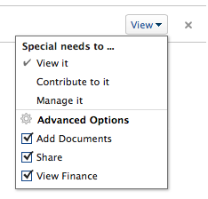

# 개체 공유

Adobe Workfront 관리자는 액세스 수준을 지정할 때 객체를 보거나 편집할 수 있는 액세스 권한을 사용자에게 부여합니다. 객체에 대한 액세스 권한 부여에 대한 자세한 내용은 [사용자 정의 액세스 수준 만들기 또는 수정](../../administration-and-setup/add-users/configure-and-grant-access/create-modify-access-levels.md).

사용자가 부여받은 액세스 레벨과 함께, 사용자가 생성한 특정 객체를 보거나 편집할 수 있는 권한을 부여할 수도 있습니다. 액세스 수준 및 권한에 대한 자세한 내용은 [액세스 수준 및 권한이 함께 작동하는 방법](../../administration-and-setup/add-users/access-levels-and-object-permissions/how-access-levels-permissions-work-together.md).

권한은 Workfront의 한 항목에 한정되며, 해당 항목에 대해 수행할 수 있는 작업을 정의합니다.

객체에 대한 권한 공유에 대한 자세한 내용은 [개체에 대한 권한 공유 개요](../../workfront-basics/grant-and-request-access-to-objects/sharing-permissions-on-objects-overview.md).

>[!NOTE]
>
>Workfront 관리자는 해당 항목의 소유자가 아니더라도 모든 사용자에 대해 시스템의 모든 항목에 대한 권한을 추가하거나 제거할 수 있습니다.

이 문서에서는 공유가 동일한 다음 개체를 공유하는 방법에 대해 설명합니다. 

* 프로젝트, 작업, 문제
* Portfolio, 프로그램
* 문서

Workfront에서 다른 모든 개체를 공유하는 방법에 대한 자세한 내용은 다음 문서를 참조하십시오.

* 템플릿의 경우 [프로젝트 템플릿 공유](../../manage-work/projects/create-and-manage-templates/share-project-template.md).
* 증명을 보려면 를 참조하십시오. [Workfront 증명의 증명 공유](../../workfront-proof/wp-work-proofsfiles/share-proofs-and-files/share-proof.md).
* 보고서, 대시보드 및 달력에 대해서는 다음 문서를 참조하십시오.

   * [Adobe Workfront에서 보고서 공유](../../reports-and-dashboards/reports/creating-and-managing-reports/share-report.md)
   * [대시보드 공유](../../reports-and-dashboards/dashboards/creating-and-managing-dashboards/share-dashboard.md)
   * [달력 보고서 공유](../../reports-and-dashboards/reports/calendars/share-a-calendar-report.md)

   또한 [보고서, 대시보드 및 달력 공유](../../workfront-basics/grant-and-request-access-to-objects/permissions-reports-dashboards-calendars.md) 보고서, 대시보드 및 달력 공유에 대한 일반적인 정보는 을 참조하십시오. 

* 필터, 보기 및 그룹화에 대해서는 [필터, 보기 또는 그룹화 공유](../../reports-and-dashboards/reports/reporting-elements/share-filter-view-grouping.md).
* 문서 폴더의 경우 [문서 폴더 공유](../../workfront-basics/grant-and-request-access-to-objects/share-a-document-folder.md).
* 계획에 대해서는 [시나리오 계획자에서 계획 공유](../../scenario-planner/share-a-plan.md).

   이 경우 추가 라이센스가 필요합니다.

* 목표에 대해서는 [Workfront 목표에서 목표 공유](../../workfront-goals/workfront-goals-settings/share-a-goal.md). 이 경우 추가 라이센스가 필요합니다.

## 액세스 요구 사항

<!--drafted for P&P:

<table style="table-layout:auto"> 
 <col> 
 <col> 
 <tbody> 
  <tr> 
   <td role="rowheader">Adobe Workfront plan*</td> 
   <td> 
Any 
 </td> 
  </tr> 
  <tr> 
   <td role="rowheader">Adobe Workfront license*</td> 
   <td> 
Current license: Standard
 
   Or
   
Legacy license: Work or higher

   </td> 
  </tr> 
  <tr> 
   <td role="rowheader">Access level configurations*</td> 
   <td> 
View access or higher to the objects you want to share
 
<b>NOTE</b>
   
   If you still don't have access, ask your Workfront administrator if they set additional restrictions in your access level. For information on how a Workfront administrator can modify your access level, see <a href="../../administration-and-setup/add-users/configure-and-grant-access/create-modify-access-levels.md" class="MCXref xref">Create or modify custom access levels</a>.
 </td> 
  </tr> 
  <tr> 
   <td role="rowheader">Object permissions</td> 
   <td> 
View permissions or higher to the objects you want to share
 
For information on requesting additional access, see <a href="../../workfront-basics/grant-and-request-access-to-objects/request-access.md" class="MCXref xref">Request access to objects </a>.
 </td> 
  </tr> 
 </tbody> 
</table>
-->

객체를 공유하려면 다음 항목이 있어야 합니다.

<table style="table-layout:auto"> 
 <col> 
 <col> 
 <tbody> 
  <tr> 
   <td role="rowheader">Adobe Workfront 플랜*</td> 
   <td> 
모든 
 </td> 
  </tr> 
  <tr> 
   <td role="rowheader">Adobe Workfront 라이선스*</td> 
   <td> 
작업 이상
 </td> 
  </tr> 
  <tr> 
   <td role="rowheader">액세스 수준 구성*</td> 
   <td> 
공유할 개체에 대한 액세스 이상의 보기
 
<b>메모</b>

여전히 액세스 권한이 없는 경우 Workfront 관리자에게 액세스 수준에서 추가 제한 사항을 설정하는지 문의하십시오. Workfront 관리자가 액세스 수준을 수정하는 방법에 대한 자세한 내용은 <a href="../../administration-and-setup/add-users/configure-and-grant-access/create-modify-access-levels.md" class="MCXref xref">사용자 정의 액세스 수준 만들기 또는 수정</a>.
 </td>
</tr> 
  <tr> 
   <td role="rowheader">개체 권한</td> 
   <td> 
공유할 개체에 대한 권한 보기 이상
 
추가 액세스 요청에 대한 자세한 내용은 <a href="../../workfront-basics/grant-and-request-access-to-objects/request-access.md" class="MCXref xref">개체에 대한 액세스 요청 </a>.
 </td> 
  </tr> 
 </tbody> 
</table>

&#42;어떤 계획, 라이선스 유형 또는 액세스 권한을 보유하고 있는지 알아보려면 Workfront 관리자에게 문의하십시오.

## 단일 개체 공유 {#share-a-single-object}

1. 공유할 개체로 이동합니다.

   공유할 수 있는 객체에 대한 자세한 내용은 [개체에 대한 권한 공유 개요](../../workfront-basics/grant-and-request-access-to-objects/sharing-permissions-on-objects-overview.md).
1. 을(를) 클릭합니다. **자세히** 아이콘 개체 이름 옆에 있는 를 클릭한 다음 **공유** 또는&#x200B;**공유.**

   

1. 에서 **제공 `<Object Name>` 액세스** 필드에서 객체를 공유할 사용자, 팀, 역할, 그룹 또는 회사의 이름을 입력하고 드롭다운 목록에 표시될 때 이름을 클릭합니다.

   예를 들어 프로젝트를 공유하는 경우 **프로젝트 액세스 권한 부여** 필드.

   >[!TIP]
   >
   >활성 사용자, 팀, 역할 또는 회사와만 개체를 공유할 수 있습니다.

   

   >[!TIP]
   >
   >이름이 유사하게 지정된 여러 엔티티가 있는 경우 해당 유형 아래에 모두 나열됩니다. 엔티티의 이름은 알파벳 순서로 표시됩니다. 그러나 엔티티 유형이 나타나는 순서는 무작위입니다.
   >
   >
   >   >

1. (선택 사항) 객체에 대한 액세스 권한을 부여할 각 사용자, 팀, 역할 또는 그룹에 대해 3단계를 반복합니다.

   <!--
   <MadCap:conditionalText data-mc-conditions="QuicksilverOrClassic.Draft mode">
   (NOTE: esnure this stays accurate; in the editor it looks like step 4 but one step is conditioned entirely for one version or another)
   </MadCap:conditionalText>
   -->

1. 드롭다운 메뉴를 클릭한 다음 부여할 권한 수준을 선택하여 3단계에서 추가한 각 사용자, 팀, 역할, 그룹 또는 회사에 대한 권한을 지정합니다.

   다음 옵션을 사용할 수 있습니다.

   * **보기:** 사용자는 항목을 검토하고 공유할 수 있습니다. 
   * **Contribute****:** 사용자는 업데이트, 로그 정보, 작은 편집, 공유 및 모든 보기 권한을 수행할 수 있습니다.

      >[!TIP]
      >
      >다음 개체에만 Contribute 권한을 부여할 수 있습니다. 
      * 프로젝트
      * 작업
      * 문제

   * **관리:**사용자는 액세스 수준에서 부여된 관리 권한이 없는 객체에 대한 전체 액세스 권한과 모든 보기 및 Contribute 권한을 갖습니다.

      >[!NOTE]
       Workfront 관리자 또는 개체 작성자는 이러한 엔티티에서 권한을 제거할 수 있습니다.

       

      

1. (선택 사항) **고급 옵션** 개체에 대한 특정 권한을 구성하려면 다음을 수행하십시오.

   보기, 관리 및 Contribute에는 선택한 객체에 따라 다른 고급 옵션이 있습니다.\
   권한 수준에 대한 자세한 내용은 [개체에 대한 권한 공유 개요](../../workfront-basics/grant-and-request-access-to-objects/sharing-permissions-on-objects-overview.md).

   

1. (선택 사항) 이 개체를 시스템의 모든 사용자가 사용할 수 있도록 하려면 **기어** 아이콘  를 클릭한 다음, 드롭다운 메뉴에서 **시스템 전체에 표시**.

   모든 사용자는 설정한 권한에 따라 개체를 볼 수 있습니다.

1. (선택 사항 및 조건부) 프로젝트를 공유할 때 **기어** 아이콘 를 클릭한 다음, 드롭다운 메뉴에서 **내 프로젝트 액세스 템플릿으로 설정** 사용 권한을 템플릿으로 설정하려면 다음을 수행하십시오.\
   한 프로젝트에 대한 권한을 정의하면 다음에 프로젝트를 처음부터 만들 때 이와 동일한 권한이 자동으로 적용됩니다.

   >[!NOTE]
   프로젝트 액세스 템플릿은 액세스 수준에서 Workfront 관리자가 부여한 공유 기본값을 무시합니다.\
   액세스 수준에서 프로젝트에 대한 공유 기본값을 지정하는 방법에 대한 자세한 내용은 [프로젝트에 대한 액세스 권한 부여](../../administration-and-setup/add-users/configure-and-grant-access/grant-access-projects.md) . >
   <!--   >
   ><MadCap:conditionalText data-mc-conditions="QuicksilverOrClassic.Draft mode">   >
   >(NOTE: (this note also appears in Understanding Project Permissions.))   >
   ></MadCap:conditionalText>   >
   >-->   >

   템플릿을 공유할 때 템플릿에서 만들 프로젝트에 대한 권한을 지정할 수 있습니다. 자세한 내용은 [프로젝트 템플릿 공유](../../manage-work/projects/create-and-manage-templates/share-project-template.md).

1. (선택 사항) 개체를 공개하려면 **외부 사용자에게 공개하기**.

   >[!TIP]
   이 옵션은 모든 개체에 사용할 수 없습니다.

   

1. (조건부) 외부 사용자에게 개체를 공개하려면 **링크 복사,** 그런 다음 링크를 외부 사용자에게 배포합니다.\
   링크를 가진 모든 사용자는 개체를 볼 수 있습니다.

   >[!CAUTION]
   외부 사용자와 기밀 정보가 포함된 개체를 공유할 때는 주의해야 합니다. 이를 통해 Workfront 사용자 또는 조직의 구성원이 아니더라도 정보를 볼 수 있습니다.

1. **저장**&#x200B;을 클릭합니다.

## 일괄 공유

객체 목록에서 다른 사용자, 팀, 그룹, 작업 역할 또는 회사와 동시에 여러 객체를 공유할 수 있습니다.

>[!IMPORTANT]
개체를 대량으로 공유하면 개별 개체에 대한 권한이 있는 개체의 이름이 표시되지 않습니다. 객체를 일괄 공유할 때 공유 목록에 추가한 엔티티가 선택한 객체에 추가됩니다. 개별 객체와 연관된 엔터티는 재정의하지 않습니다. 

객체를 일괄 공유하려면

1. 개체 목록으로 이동합니다.
1. 목록에서 개체를 두 개 이상 선택합니다.
1. 을(를) 클릭합니다. **공유** 아이콘 .\
   객체에 이미 액세스할 수 있는 사용자는 벌크 공유 시 사용할 수 있는 것으로 표시되지 않습니다.

   >[!NOTE]
   선택한 개체를 공유할 권한이 없는 경우 **공유** 단추가 표시되지 않습니다.

1. 에서 **편집 `<Object Name>` 액세스** 필드에서 권한을 부여할 사용자, 팀, 그룹, 작업 역할 또는 회사의 이름을 입력합니다.

   예를 들어 프로젝트를 공유하는 경우 **에 대한 프로젝트 액세스 권한 부여** 필드.

   

1. 섹션의 단계 4-9에서 설명한 대로 선택한 객체 공유를 계속합니다 [단일 개체 공유](#share-a-single-object) 참조하십시오.

   <!--
   <MadCap:conditionalText data-mc-conditions="QuicksilverOrClassic.Draft mode">
   (NOTE: ensure these steps stay accurate; always look at them in the viewer; because of condiitoning, the steps numbers in the editor are different!!!!!!*****)
   </MadCap:conditionalText>
   -->

1. **저장**&#x200B;을 클릭합니다.
