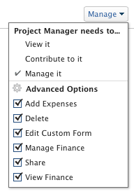

# 개체에 대한 재무 권한 공유

Adobe Workfront 관리자는 액세스 수준을 할당할 때 재무 데이터를 보거나 편집할 수 있는 액세스 권한을 사용자에게 부여할 수 있습니다. 자세한 내용은 [재무 데이터에 대한 액세스 권한 부여](../../administration-and-setup/add-users/configure-and-grant-access/grant-access-financial.md).

사용자가 부여된 액세스 레벨과 함께, 공유 액세스 권한이 있는 특정 프로젝트, 작업 또는 문제에 대한 재무 보기 또는 관리 권한을 사용자에게 부여할 수도 있습니다.

각 액세스 수준의 사용자가 재무 데이터로 수행할 수 있는 작업에 대한 자세한 내용은 섹션을 참조하십시오 [재무 데이터](../../administration-and-setup/add-users/access-levels-and-object-permissions/functionality-available-for-each-object-type.md#financia) 기사 [각 객체 유형에 사용할 수 있는 기능](../../administration-and-setup/add-users/access-levels-and-object-permissions/functionality-available-for-each-object-type.md).

## 액세스 요구 사항

<!--drafted for P&P:

<table style="table-layout:auto"> 
 <col> 
 <col> 
 <tbody> 
  <tr> 
   <td role="rowheader">Adobe Workfront plan*</td> 
   <td> 
Any 
 </td> 
  </tr> 
  <tr> 
   <td role="rowheader">Adobe Workfront license*</td> 
   <td> 
Current license: Standard 
 
   Or
   
Legacy license: Plan 
</td> 
  </tr> 
  <tr> 
   <td role="rowheader">Access level configurations*</td> 
   <td> 
View or higher access to Projects, Tasks, Issues, and Financial&nbsp;Data
 
<b>NOTE</b>
   
   If you still don't have access, ask your Workfront administrator if they set additional restrictions in your access level. For information on how a Workfront administrator can modify your access level, see <a href="../../administration-and-setup/add-users/configure-and-grant-access/create-modify-access-levels.md" class="MCXref xref">Create or modify custom access levels</a>.
 </td> 
  </tr> 
  <tr> 
   <td role="rowheader">Object permissions</td> 
   <td> 
View permissions or higher to projects, tasks, and issues that include at least View Finance permissions
 
For information on requesting additional access, see <a href="../../workfront-basics/grant-and-request-access-to-objects/request-access.md" class="MCXref xref">Request access to objects </a>.
 </td> 
  </tr> 
 </tbody> 
</table>
-->
객체에 대한 재무 데이터 정보를 공유하려면 다음 사항이 있어야 합니다.

<table style="table-layout:auto"> 
 <col> 
 <col> 
 <tbody> 
  <tr> 
   <td role="rowheader">Adobe Workfront 플랜*</td> 
   <td> 
모든 
 </td> 
  </tr> 
  <tr> 
   <td role="rowheader">Adobe Workfront 라이선스*</td> 
   <td> 
플랜 
 </td> 
  </tr> 
  <tr> 
   <td role="rowheader">액세스 수준 구성*</td> 
   <td> 
프로젝트, 작업, 문제 및 재무 데이터에 대한 보기 이상의 액세스
 
참고: 여전히 액세스 권한이 없는 경우 Workfront 관리자에게 액세스 수준에서 추가 제한 사항을 설정하는지 문의하십시오. Workfront 관리자가 액세스 수준을 수정하는 방법에 대한 자세한 내용은 <a href="../../administration-and-setup/add-users/configure-and-grant-access/create-modify-access-levels.md" class="MCXref xref">사용자 정의 액세스 수준 만들기 또는 수정</a>.
 </td> 
  </tr> 
  <tr> 
   <td role="rowheader">개체 권한</td> 
   <td> 
최소 재무 권한이 포함된 프로젝트, 작업 및 문제에 대한 권한 이상을 봅니다.
 
추가 액세스 요청에 대한 자세한 내용은 <a href="../../workfront-basics/grant-and-request-access-to-objects/request-access.md" class="MCXref xref">개체에 대한 액세스 요청 </a>.
 </td> 
  </tr> 
 </tbody> 
</table>

&#42;어떤 계획, 라이선스 유형 또는 액세스 권한을 보유하고 있는지 알아보려면 Workfront 관리자에게 문의하십시오.

## 개체 공유 및 재무 권한 부여

객체에 재무 권한을 부여할 때 다음 사항을 고려하십시오.

* 프로젝트, 작업 및 문제에 재무 권한을 부여할 수 있습니다.
* 권한은 상속될 수 있습니다. 프로젝트에 대한 재무 보기 권한이 있는 경우 프로젝트의 작업 및 문제에 대해 재무 보기 권한을 자동으로 상속합니다.

객체에 재무 권한을 부여하려면

1. 다른 사람과 공유할 작업, 프로젝트 또는 문제로 이동합니다.
1. 개체 이름 근처에 있는 자세히 메뉴를 클릭합니다 를 클릭한 다음 **공유**.

1. 에서 **제공 `<Object name>` 액세스** 필드에서는 객체를 공유할 사용자, 팀, 역할, 그룹 또는 회사의 이름을 입력하기 시작합니다.

   >[!TIP]
   >
   >활성 사용자, 팀, 역할 또는 회사와만 개체를 공유할 수 있습니다.

1. 선택한 이름의 오른쪽에 드롭다운 메뉴가 나타나면 사용할 수 있는 다음 옵션 중 하나를 클릭합니다.

   * **보기**
   * **참여하기**
   * **관리함**

             

1. 동일한 드롭다운 메뉴에서 **고급 설정**&#x200B;를 입력한 후 다음 중 하나를 수행합니다.

   * 이전 단계에서 세 옵션 중 하나를 선택한 경우 다음을 확인하십시오 **재무 보기** 이 선택되어 있습니다.
   * 선택한 경우 **재무 관리** 이전 단계에서 다음을 확인합니다 **재무 관리** 이 선택되어 있습니다.

1. **저장**&#x200B;을 클릭합니다.

## 모든 공유 수준에 대한 재무 권한

다음 표에는 객체에 대한 보기, Contribute 또는 관리 권한을 부여할 때 사용자가 얻는 재무 권한이 표시됩니다. 

<table style="table-layout:auto"> 
 <col> 
 <col> 
 <col> 
 <col> 
 <thead> 
  <tr> 
   <th><strong>액션</strong> </th> 
   <th><strong>관리</strong> </th> 
   <th><strong>참여</strong> </th> 
   <th><strong></strong> 보기 </th> 
  </tr> 
 </thead> 
 <tbody> 
  <tr> 
   <td>청구 레코드 관리</td> 
   <td>✓</td> 
   <td> 
 
 </td> 
   <td> </td> 
  </tr> 
  <tr> 
   <td>역할 청구 및 비용 비율 관리/보기</td> 
   <td>✓</td> 
   <td> </td> 
   <td> </td> 
  </tr> 
  <tr> 
   <td>사용자 청구 및 비용 비율 관리/보기</td> 
   <td>✓</td> 
   <td> </td> 
   <td> </td> 
  </tr> 
  <tr> 
   <td>재무 보기</td> 
   <td>✓</td> 
   <td>✓</td> 
   <td> ✓</td> 
  </tr> 
  <tr> 
   <td>리소스 계획 도구에서 비용별 정보 보기</td> 
   <td>✓</td> 
   <td>✓</td> 
   <td>✓</td> 
  </tr> 
  <tr> 
   <td>자원 계획 도구의 예산 자원*</td> 
   <td>✓</td> 
   <td> </td> 
   <td> </td> 
  </tr> 
  <tr> 
   <td>리소스 계획 도구에서 리소스 보기*</td> 
   <td>✓</td> 
   <td>✓</td> 
   <td> 
✓
 </td> 
  </tr> 
 </tbody> 
</table>

&#42;추가 리소스 관리 액세스 권한이 필요합니다.

리소스 관리 액세스에 대한 자세한 내용은 [리소스 관리에 대한 액세스 권한 부여](../../administration-and-setup/add-users/configure-and-grant-access/grant-access-resource-management.md).
