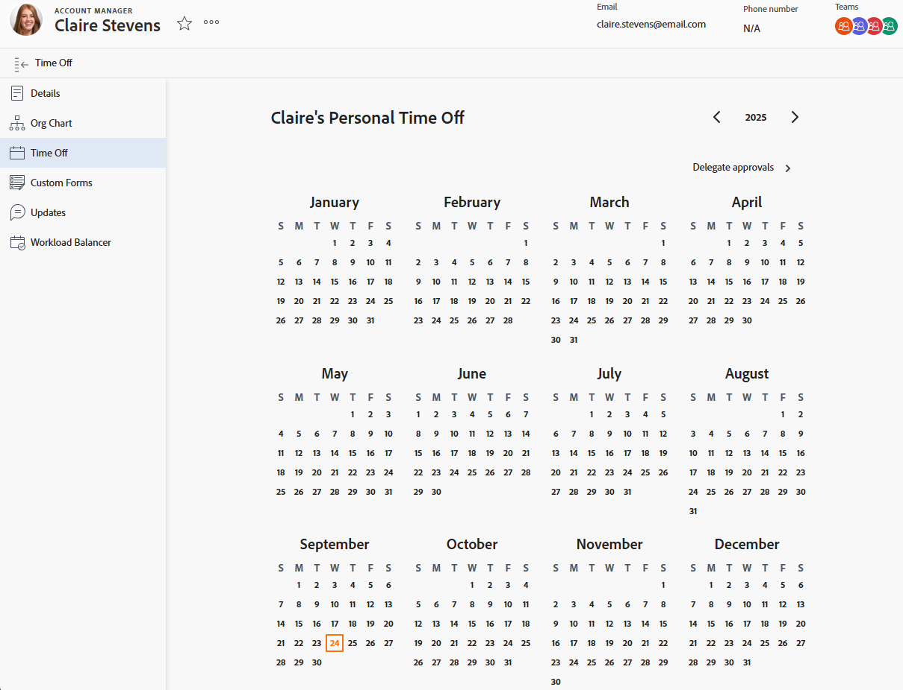

# 개인 휴무 구성

<!-- Audited: 12/2025 -->

<!--The highlighted information on this page refers to functionality not yet generally available. It is available only in the Preview Sandbox environment, and is being released in a phased rollout to Production.-->

[!DNL Adobe Workfront]은(는) 개인 휴무를 관리, 계산 및 추적하기 위해 기존 시스템을 복제하거나 대체하도록 설계되지 않았습니다.

그러나 승인된 휴무가 발생하는 시기를 표시하는 것이 중요합니다. 이는 사용자의 일정과 할당된 작업의 [!UICONTROL 계획된 완료 일자]에 모두 영향을 미치기 때문입니다.

예를 들어, 2주가 걸릴 예정인 작업에 할당되어 있고 해당 시간 동안 3일을 쉴 계획이라면, [!DNL Workfront]은(는) 휴무를 고려하여 작업 타임라인에 3일을 추가합니다.

또한 자원 관리 도구는 개인 휴무를 사용하여 작업 일정을 잡을 수 있는 시기를 나타냅니다.

>[!NOTE]
>
>휴무를 예약하는 날짜와 불일치가 발생하지 않도록 사용자 프로필의 시간대가 예약의 시간대와 일치하는 것이 좋습니다. 자세한 내용은 다음 문서를 참조하십시오.
>
>* [일정 만들기](../../../administration-and-setup/set-up-workfront/configure-timesheets-schedules/create-schedules.md)
>* [사용자 프로필 편집](../../../administration-and-setup/add-users/create-and-manage-users/edit-a-users-profile.md)
>

## 액세스 요구 사항

+++ 이 문서의 기능에 대한 액세스 요구 사항을 보려면 확장하십시오.

<table style="table-layout:auto"> 
 <col> 
 </col>
 <tbody> 
  <tr> 
   <td> Adobe Workfront 패키지</td> 
   <td>
임의
</td> 
  </tr> 
  <tr> 
   <td>Adobe Workfront 라이선스</td> 
   <td> 
개인 휴무를 구성하려면 다음을 수행해야 합니다.

        
표준(개인 휴무 구성)

        
회사 또는 그 이상(개인 휴무 구성)
 </td>
  </tr> 
  <tr> 
   <td>액세스 수준 구성</td> 
   <td>
다른 사용자의 휴무 달력을 변경하려면 해당 사용자의 관리자여야 하며 사용자 편집 액세스 권한이 있어야 합니다.

   
<strong>참고:</strong> 관리자가 다른 사용자의 개인 휴무 일정을 편집하면 모든 항목이 관리자의 표준 시간대가 아니라 사용자의 표준 시간대로 표시됩니다.
</td> 
  </tr> 
 </tbody> 
</table>

자세한 내용은 [Workfront 설명서의 액세스 요구 사항](/help/quicksilver/administration-and-setup/add-users/access-levels-and-object-permissions/access-level-requirements-in-documentation.md)을 참조하십시오.

+++

## [!DNL Workfront]에서 개인 휴무 구성

{{step1-click-profile-pic}}

>[!NOTE]
>
>조직이 Adobe 통합 환경에 속해 있는 경우 상단 탐색 영역의 오른쪽 상단에 있는 **Adobe** 계정 메뉴(프로필 사진)를 클릭한 다음 **Workfront 프로필**&#x200B;을 클릭합니다.
>
>

1. 왼쪽 패널에서 **[!UICONTROL 휴무]**&#x200B;를 클릭합니다.
1. 개인 휴무에 대해 원하는 날짜를 선택합니다.

   

   <!--Sample image in the Production environment:
   -->

1. 하루 종일 쉬려면 **[!UICONTROL 하루 종일]**&#x200B;을 선택하세요.

   하루 미만의 휴무를 수행하는 경우 확인란을 선택 취소한 상태로 두고 휴무 시작 및 종료 시간을 나타냅니다.

1. **[!UICONTROL 저장]**&#x200B;을 클릭합니다.

   이제 리소스 플래너 및 업무 균형자 같은 리소스 관리 도구의 [!DNL Workfront] 시스템에서 휴무를 볼 수 있습니다. 이 시간 동안 작업에 할당되면 도구 팁은 사용자에게 휴무가 예약되었음을 알려줍니다.
