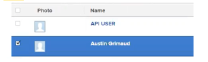

# 향상된 인증을 통해 사용자 암호 재설정

<!--This article has been hidden by request-->

[!DNL Workfront] 환경에 대해 향상된 인증(eAuth)을 사용하도록 설정한 경우 [!DNL Workfront] 관리자가 다른 사용자의 로그인 자격 증명을 재설정할 수 없습니다. 이는 eAuth가 없는 [!DNL Workfront] 환경이나 SSO(Single Sign-On)가 활성화된 환경과는 다릅니다.

## 액세스 요구 사항

이 문서의 단계를 수행하려면 다음 액세스 권한이 있어야 합니다.

<table style="table-layout:auto"> 
 <col> 
 <col> 
 <tbody> 
  <tr> 
   <td role="rowheader"><strong>[!DNL Adobe Workfront] 플랜*</strong></td> 
   <td> 
 임의
 </td> 
  </tr> 
  <tr> 
   <td role="rowheader"><strong>[!DNL Adobe Workfront] 라이센스*</strong></td> 
   <td> 
[!UICONTROL 계획]
 </td> 
  </tr> 
  <tr> 
   <td role="rowheader"><strong>액세스 수준 구성*</strong></td> 
   <td> 
시스템 관리자 
 </td> 
  </tr> 
 </tbody> 
</table>

보유 중인 플랜, 라이선스 유형 또는 액세스 권한을 확인하려면 [!DNL Workfront] 관리자에게 문의하세요.

## eAuth 사용 환경에서 사용자 암호 재설정

{{step-1-to-users}}

1. 암호를 다시 설정해야 하는 **[!UICONTROL 사용자]**을(를) 선택하십시오.
   

1. 원하는 **[!UICONTROL 사용자]를 선택한 후 표시되는**&#x200B;자세히&#x200B;**[!UICONTROL 단추]**&#x200B;를 클릭하고 드롭다운 메뉴에서 **[!UICONTROL 암호 찾기 이메일 보내기]** 옵션을 선택합니다.

   

**[!UICONTROL 암호 찾기 이메일 보내기]** 옵션을 선택하면 선택한 사용자에게 암호를 변경하는 지침이 포함된 이메일이 전송됩니다.

